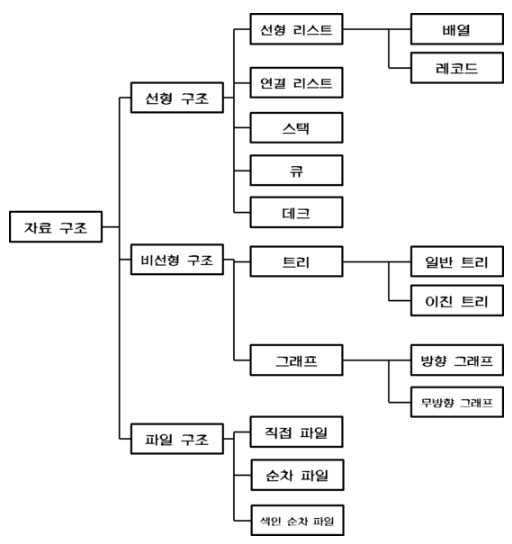
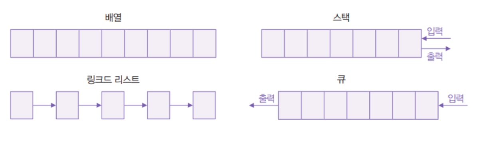

# Definition

## 자료구조(Data Structure)란?

- 자료구조 : 데이터를 어떤 구조로 **저장하고, 탐색하고, 삭제해야** 가장 효율적인지를 생각해야 한다.
ex) 어떻게 메모리를 가장 효율적으로 사용할 수 있을까? -> 실행속도에 많은 영향을 끼치므로
    
    ex) 스케줄링 : 정해진 시간이 되면 어떻게 사용하는지 등을 관리할 때, 보통 스택을 사용한다.(선입선출)
    
- 자료구조란 컴퓨터가 데이터를 효율적으로 관리(데이터 입력, 수정, 삭제 등)할 수 있도록 관련 있는 다수의 데이터를 구조화하는 것이다.
- 컴퓨터 과학에서 데이터를 구조적으로 표현하는 방식과 이를 구현하는 데 필요한 알고리즘에 대해 논하는 이론이다.
- 어떤 자료구조를 선택하느냐에 따라 데이터를 다루는데 소요되는 시간과 성능, 데이터가 차지하는 메모리 용량 등에서 차이가 날 수 있고 이는 당연히 다루는 데이터의 양이 늘어날수록 그 차이는 더 커진다. 자료구조 지식이 있는 프로그래머들은 그 이유들을 이해하고 라이브러리 문서를 통해 적절한 자료구조를 선택해야 한다.
- 효율적인 자료구조란 프로그램의 실행시간 효율과 저장공간 효율을 의미한다. (효과적으로 설계된 자료구조는 실행시간 혹은 메모리 용량과 같은 자원을 최소한으로 사용하면서 연산을 수행하도록 해준다.)

## 자료구조(Data Structure)

- 자료구조는 크게 선형 자료구조와 비선형 자료구조 2가지로 나뉘어진다.

## 선형 자료구조(Linear Structure)

- **데이터가 연속적으로 연결되어 있는 모양으로 구성하는 방법,** 자료를 구성하는 원소들을 순차적으로 나열 시킨 형태이다.
- 선형 자료구조는 한개의 데이터 뒤에 한개의 데이터가 따라오는 선형구조를 가지고 있다.
그래서 내부의 각 데이터들은 1:1의 구조를 가지게 된다.(배열의 경우 한 인덱스(하나의 주소공간)에 한 자료가 들어간다. )
- 선형 자료구조의 대표적인 예는 스택, 큐, 덱, 배열, 리스트 등의 자료구조가 해당된다.

