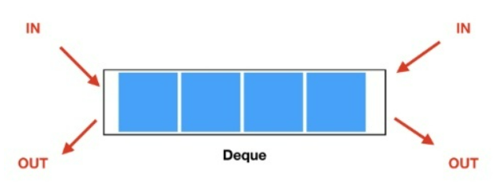

# Deque

# 덱(Deque)



### 특징

- 큐의 변형된 형태로, **양쪽 끝에서 삽입과 삭제**가 모두 가능한 선형 자료구조이다.
- 덱은 큐와 스택의 특성을 모두 가지고 있으며, 큐의 선입선출(FIFO)과 스택의 후입선출(LIFO)을 모두 지원한다.

### 정의

- 데이터를 양쪽 끝에서 삽입하거나 삭제할 수 있기 때문에, 양쪽에서 동시에 접근해야 하는 경우에 유용하다. 예를 들어, 양방향으로 탐색해야 하는 그래프 알고리즘에서 덱을 사용하면 효율적인 탐색이 가능하다.
- 덱은 큐와 달리 크기가 동적으로 조정될 수 있다.
- 큐와 마찬가지로 배열이나 연결 리스트로 구현할 수 있다. 큐와 덱은 각각의 특성에 따라 사용 상황에 맞게 선택하여 사용하면 된다.

### Deque Method

- **addFirst & removeFirst()** : 앞에서 요소를 추가/삭제
- **addLast() & removeLast()** : 뒤에서 요소를 추가/삭제
- **isEmpty()** : 메서드, 덱이 비어있는지 확인
- **printDeque()** : 메서드, 그리고 덱을 출력

### 구현

- 박경연

```java
public class DequeExample {
    public static void main(String[] args) {
        Deque deque = new Deque();
        
        // 앞에 요소 추가
        deque.addFirst(10);
        deque.addFirst(20);
        
        // 뒤에 요소 추가
        deque.addLast(30);
        deque.addLast(40);
        
        // 덱 출력
        deque.printDeque(); // 20 10 30 40
        
        // 앞에서 요소 삭제
        System.out.println(deque.removeFirst()); // 20
        System.out.println(deque.removeFirst()); // 10
        
        // 뒤에서 요소 삭제
        System.out.println(deque.removeLast()); // 40
        
        // 덱이 비어있는지 확인
        System.out.println(deque.isEmpty()); // false
    }
}

class Deque {
    private Node head;
    private Node tail;
    
    public Deque() {
        this.head = null;
        this.tail = null;
    }
    
    // 앞에 요소 추가
    public void addFirst(int data) {
        Node newNode = new Node(data);
        
        if (head == null) {
            head = newNode;
            tail = newNode;
        } else {
            newNode.next = head;
            head.previous = newNode;
            head = newNode;
        }
    }
    
    // 뒤에 요소 추가
    public void addLast(int data) {
        Node newNode = new Node(data);
        
        if (tail == null) {
            head = newNode;
            tail = newNode;
        } else {
            newNode.previous = tail;
            tail.next = newNode;
            tail = newNode;
        }
    }
    
    // 앞에서 요소 삭제
    public int removeFirst() {
        if (isEmpty()) {
            throw new IllegalStateException("Deque is empty.");
        }
        
        int removedData = head.data;
        
        if (head == tail) {
            head = null;
            tail = null;
        } else {
            head = head.next;
            head.previous = null;
        }
        
        return removedData;
    }
    
    // 뒤에서 요소 삭제
    public int removeLast() {
        if (isEmpty()) {
            throw new IllegalStateException("Deque is empty.");
        }
        
        int removedData = tail.data;
        
        if (head == tail) {
            head = null;
            tail = null;
        } else {
            tail = tail.previous;
            tail.next = null;
        }
        
        return removedData;
    }
    
    // 덱이 비어있는지 확인
    public boolean isEmpty() {
        return (head == null && tail == null);
    }
    
    // 덱 출력
    public void printDeque() {
        Node current = head;
        while (current != null) {
            System.out.print(current.data + " ");
            current = current.next;
        }
        System.out.println();
    }
}

class Node {
    int data;
    Node previous;
    Node next;
    
    public Node(int data) {
        this.data = data;
        this.previous = null;
        this.next = null;
    }
}
```