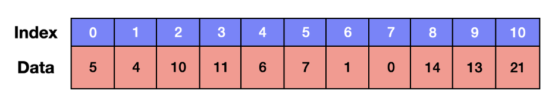

# Linear List

## 배열(Array)



### 정의

- 가장 간단한 자료구조이다.
- 논리적 저장 순서와 물리적 저장 순서가 일치하는 자료구조이다.
- 데이터들을 순차적으로 저장하다 보면 번호를 지정할 수 있는데, 그것을 인덱스(index)라고 한다.
- 따라서 인덱스로 해당 원소에 접근할 수 있다.

### **특징**

- 주로 고정된 크기를 가진 배열을 통해 구현한다.
- 각 원소의 순서가 정해져 있으며, 각 원소의 인덱스를 사용할 수 있다.
- 데이터의 수가 확실하게 정해진 경우에 사용하기 좋다.
- 인덱스로 인해 접근 속도가 굉장히 빠르다.
- 이로 인해 데이터 검색에 효율적이지만, 삽입과 삭제 시 크기를 더 할당하거나, 모든 데이터를 이동해줘야 하기 때문에 비효율적이다.
- 기억장소를 연속으로 배정받기 때문에 기억장소 이용 효율은 밀도가 1로서 가장 좋다.
- 자료의 개수가 n개 일 때, 삽입시 평균 이동 횟수 : n+1/2, 삭제시 평균 이동 횟수 : n-1/2
- 배열은 새로 선언할 때마다 주소(위치) 값이 달라진다.
    - ex) 해쉬 코드(Hash Code) - 기존의 리스트에서 칸만 늘리는 것. 주소값도 같다.
- 삽입, 삭제 시 자료의 이동이 필요하기 때문에 작업이 번거롭다.

### **구현**

- 박경연

```java
public class ArrayExample {
    public static void main(String[] args) {
        int[] array = new int[5]; // 크기가 5인 정적 배열 생성
        
        // 배열에 값 할당
        array[0] = 10;
        array[1] = 20;
        array[2] = 30;
        array[3] = 40;
        array[4] = 50;
        
        // 배열 요소 출력
        for (int i = 0; i < array.length; i++) {
            System.out.println(array[i]);
        }
    }
}
```