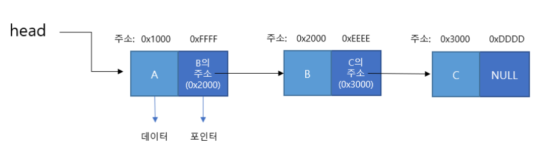
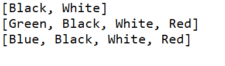

# Linked List

## 연결 리스트(Linked List)



### 정의

- 여러 개의 노드들이 **순차적으로** 연결된 형태를 갖는다.
- 자료들을 반드시 연속적으로 배열시키지는 않고 임의의 기억 공간에 기억시키되, 자료 항목의 순서에 따라 노드의 포인터 부분을 이용하여 서로 연결 시킨 자료구조이다.
- 첫 번째 노드를 **head**, 마지막 노드를 **tail**이라고 한다.
- 각 요소가 데이터와 다음 요소를 가리키는 포인터로 구성되는 **선형 자료구조**이다. 각 요소는 메모리에서 임의의 위치에 할당되며, 요소들은 포인터를 통해 연결된다.

<aside>
💡 **포인터(Pointer)** : C의 자료형 중 하나로서, 다른 변수 또는 함수의 **주소**를 값으로 갖는 변수이다.

</aside>

<aside>
💡 **노드(Node)** : 1트리(tree) 구조에서 데이터의 상하위 계층을 나타내는 위치의 항목. 각 노드를 연결해 주는 것이 분기(分岐)이며, **루트(root)와 서브트리(subtree)**로 구성된다.

</aside>

### 특징

- 배열과는 다르게 메모리를 연속적으로 사용하지 않고, 순차적으로 접근해야 하는 면에서 불리할 수 있으나 노드가 연결된 구조이기 때문에 삽입과 삭제에 용이하다. (필요 시 크기를 늘리거나 줄일 수 있기 때문이다.) 그러나 요소에 접근하기 위해선 전체 리스트를 순회해야 하므로 탐색 속도가 느릴 수 있다.
- 기억공간이 연속적으로 놓여있지 않아도 저장이 가능하다.
- 선형 리스트와 달리 고정이 아닌, 가변적인 크기의 리스트를 가진다.
- 따라서 데이터를 삽입, 제거 시 크기 할당이나, 데이터를 이동할 필요 없이 다음 노드를 추가하거나, 제거할 수 있다.
- 주로 데이터 삽입, 제거가 많이 발생하는 프로그램이라면 연결 리스트가 유리하고, 탐색이 주가 되는 프로그램이라면 선형 리스트를 사용하는 것이 유리하다.
- 중간 노드의 연결이 끊어지면 그 다음 노드를 찾기 힘들다.
- 접근 속도가 느리다. (포인터를 찾아가는 시간이 필요하기 때문에 배열에 비해 접근속도 느림)
- 예시
    - 디스크 조각 모음 : 디스크에 주소값을 없애면 그만큼 메모리의 공간이 낭비되고 있는 것이다.. 디스크 조각 모음을 수행하면 빈 주소로 메모리를 정리한다.
    - 램(RAM) : 주소값 배열의 모음이다.. 클수록 효율이 높다.
    - SSD : 디스크 조각 모음을 하지 않아도 된다. 알아서 최적화를 해 주기 때문이다. 부팅 속도 빠르다. 다만, 검색에 대해서는 선형리스트(Linear List 예-배열[Array])와 다르게 원하는 데이터를 한번에 찾아낼 수 없고, 리스트를 전부 탐색해야 한다.

### 구현

- 김현희

```java
public static void main(String[] args) {

	LinkedList<String> colors = new LinkedList<>();

	/* element 추가 */
    colors.add("Black");
    colors.add("White");
    System.out.println(colors);

    colors.add(0, "Green");
    colors.add("Red");
    System.out.println(colors);

    colors.set(0, "Blue");

    System.out.println(colors);

    System.out.println();

}

```



- 박경연

```java
public class LinkedListExample {
    public static void main(String[] args) {
        LinkedList linkedList = new LinkedList();
        
        // 노드 추가
        linkedList.add(10);
        linkedList.add(20);
        linkedList.add(30);
        
        // 노드 출력
        linkedList.printList();
    }
}

class Node {
    int data;
    Node next;
    
    public Node(int data) {
        this.data = data;
        this.next = null;
    }
}

class LinkedList {
    Node head;
    
    public LinkedList() {
        this.head = null;
    }
    
    // 노드 추가
    public void add(int data) {
        Node newNode = new Node(data);
        
        if (head == null) {
            head = newNode;
        } else {
            Node current = head;
            while (current.next != null) {
                current = current.next;
            }
            current.next = newNode;
        }
    }
    
    // 연결 리스트 출력
    public void printList() {
        Node current = head;
        while (current != null) {
            System.out.println(current.data);
            current = current.next;
        }
    }
}
```