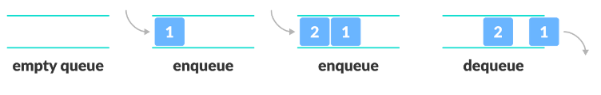
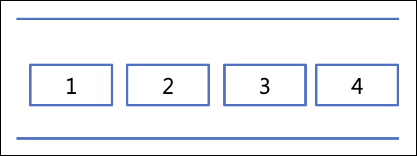
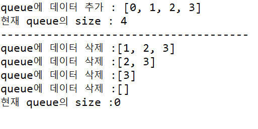

# Queue

## 큐(Queue)





### 정의

- 한 쪽에서는 삽입 작업이, 한 쪽에서는 삭제 작업이 이루어진다.
- 이때, 삭제연산만 수행되는 곳을 프론트**(Front)**, 삽입연산만 이루어지는 곳을 **리어(Rear)**라고 한다.
- 큐의 Rear(끝)에서 이루어지는 삽입연산을 **인큐(EnQueue)**, Front(앞)에서 이루어지는 삭제연산을 **디큐(DeQueue)**라고 한다.
- 큐 한쪽 끝은 **Front(앞)**로 정하여 삭제 연산만 수행한다.
- 큐 다른 한 쪽 끝은 **Rear(뒤)**로 정하여 삽입 연산만 수행한다.
- 큐의 종류에 따라 차이점이 있지만, 기본적인 큐는 한쪽으로 데이터를 넣고, 다른 한쪽으로 데이터를 뺄 수 있다. 따라서 가장 먼저 들어온 데이터가 가장 먼저 나오는  **선입선출(FIFO : First In First Out)** 구조로 저장하는 형식이다.

### 특징

- 일반적으로 연결리스트를 통해 구현하며, 선입선출을 필요로 하는 대기열, 프로세스 관리, 너비 우선 탐색에 사용된다.
- 대기 행렬 처리에 적합하다. (ex. 은행에서 먼저 온 사람의 업무를 창구에서 처리)
- 컴퓨터 버퍼에서 주로 사용한다. 마구잡이로 입력이 되었으나 처리를 하지 못할 때 버퍼를 만들어 대기시킨다.

### Queue Method

- **add(item):** item을 리스트의 끝부분에 추가한다.
- **remove()**: 리스트의 첫 번째 항목을 제거한다.
- **peek()**: 큐에서 가장 위에 있는 항목을 반환한다.
- **isEmpty()**: 큐가 비어 있을 때에 true를 반환한다.

### 구현

- 김현희

```java
public static void main(String[] args) {
	//stack은 별도의 클래스가 구현되어 있지만, queue는 인터페이스만 있고 별도의 클래스는 존재하지 않는다.
	Queue<Integer> queue = new LinkedList<>();

	for(int i=0; i<=3; i++) {

		queue.add(i);

	}

	System.out.println("queue에 데이터 추가 : " + queue);
	System.out.println("현재 queue의 size : " + queue.size());
	System.out.println("--------------------------------------");

	while(!queue.isEmpty()) {

		queue.poll(); //데이터 꺼낼 때 : stack -> pop() / queue -> poll()
									//poll 함수는 큐가 비어있으면 null을 반환한다.
		System.out.println("queue에 데이터 삭제 :" + queue);
	}

	System.out.println("현재 queue의 size :" + queue.size());
}

```



- 박경연

```java
import java.util.LinkedList;

public class QueueExample {
    public static void main(String[] args) {
        Queue queue = new Queue();
        
        // 요소 삽입
        queue.enqueue(10);
        queue.enqueue(20);
        queue.enqueue(30);
        
        // 요소 삭제
        System.out.println(queue.dequeue()); // 10
        System.out.println(queue.dequeue()); // 20
        
        // 큐가 비어있는지 확인
        System.out.println(queue.isEmpty()); // false
    }
}

class Queue {
    private LinkedList<Integer> queueList;
    
    public Queue() {
        this.queueList = new LinkedList<>();
    }
    
    // 요소 삽입
    public void enqueue(int value) {
        queueList.add(value);
    }
    
    // 요소 삭제
    public int dequeue() {
        if (isEmpty()) {
            throw new IllegalStateException("Queue is empty.");
        }
        return queueList.removeFirst();
    }
    
    // 큐가 비어있는지 확인
    public boolean isEmpty() {
        return queueList.isEmpty();
    }
}
```