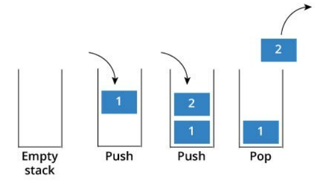
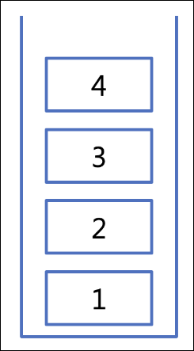
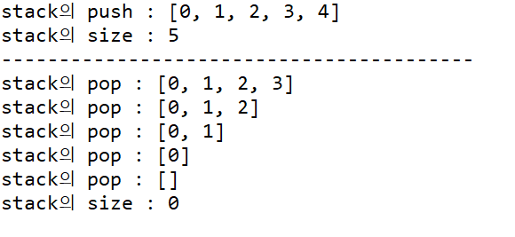

# Stack

## 스택(Stack)





### 정의

- 물건을 쌓는 것처럼 차곡차곡 쌓아 올린 형태의 자료구조를 의미한다.
- 같은 구조와 크기의 자료를 **정해진 방향으로만** 쌓을 수 있다.
- top에는 가장 **최근**에 들어온 자료이다.
- 스택은 한쪽으로만 데이터를 넣고 뺄 수 있는 구조의 자료구조이다. 그렇기 때문에 마지막에 넣은 데이터가 가장 먼저 삭제되는 **후입선출(LIFO : Last In First Out)** 구조를 가진다.

<aside>
💡 비어있는 스택에서 원소를 추출하려고 할 때 **Stack Underflow**, 스택이 넘치는 경우 **Stack Overflow**라고 한다

</aside>

### 특징

- 요소의 삽입과 삭제는 스택의 상단에서만 이루어지며, 최근에 삽입된 요소가 가장 먼저 삭제된다. 스택은 주로 함수 호출이나 임시 데이터 저장 등 다양한 상황에서 사용된다.
- 주로 배열 또는 연결리스트를 통해 구현하고, 웹브라우저의 페이지 뒤로가기, undo, 문자열 뒤집기와 같은 프로그램에 사용된다.
- Ctrl + Z 시 가장 최근에 수정한 내역이 되돌려진다.
- 동작(웹페이지 동작, ctrl+c/v) → 스택에 저장 Undo → ctrl+z  → request 전부 스택에 저장 → 마지막 명령 취소하고 그 전의 명령을 다시 실행한다.
- T(TOP Pointer) - 스택 포인터(SP)라고도 한다. Stack으로 할당된 기억공간에 가장 마지막으로 삽입된 자료가 기억된 공간을 가리키는 요소이다.

### Stack Method

- **pop()**: 스택에서 가장 위에 있는 항목을 제거한다.
- **push(item)**: item 하나를 스택의 가장 윗 부분에 추가한다.
- **peek()**: 스택의 가장 위에 있는 항목을 반환한다.
- **isEmpty():** 스택이 비어 있을 때에 true를 반환한다.
- **top()**: 최상단 요소 확인

### 구현

- 김현희

```java
public static void main(String[] args) {

	Stack<Integer> stack = new Stack<>();

		for(int i=0; i<5; i++) {

			stack.push(i);

		}

		System.out.println("stack의 push : " + stack);
		System.out.println("stack의 size : " + stack.size());
		System.out.println("-----------------------------------------");

		while(!stack.isEmpty()) {

			stack.pop();

			System.out.println("stack의 pop : " + stack);
		}
		System.out.println("stack의 size : " + stack.size());

}

```



- 박경연

```java
import java.util.EmptyStackException;

public class StackExample {
    public static void main(String[] args) {
        Stack stack = new Stack();
        
        // 요소 삽입
        stack.push(10);
        stack.push(20);
        stack.push(30);
        
        // 요소 삭제
        System.out.println(stack.pop()); // 30
        System.out.println(stack.pop()); // 20
        
        // 스택이 비어있는지 확인
        System.out.println(stack.isEmpty()); // false
    }
}

class Stack {
    private int maxSize;
    private int[] stackArray;
    private int top;
    
    public Stack() {
        this.maxSize = 100; // 스택의 최대 크기 설정
        this.stackArray = new int[maxSize];
        this.top = -1; // 스택이 비어있는 상태를 나타내는 값
    }
    
    // 요소 삽입
    public void push(int value) {
        if (top == maxSize - 1) {
            System.out.println("Stack is full. Cannot push element.");
        } else {
            stackArray[++top] = value;
        }
    }
    
    // 요소 삭제
    public int pop() {
        if (top == -1) {
            throw new EmptyStackException();
        }
        return stackArray[top--];
    }
    
    // 스택이 비어있는지 확인
    public boolean isEmpty() {
        return (top == -1);
    }
}
```