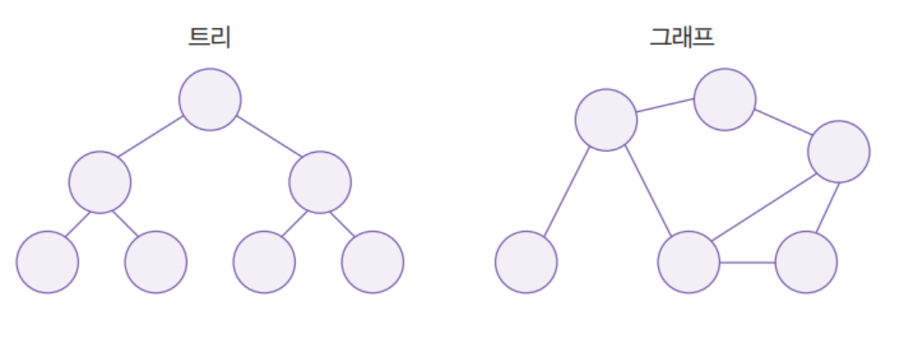

# Definition

## 비선형 자료구조 **(Non-Linear Data Structure)**

### 정의

- 선형 구조는 자료를 꺼내고 저장하는 것에 초점이 맞춰져 있다면, 비선형 구조는 데이터 자료를 어떻게 표현하느냐에 대한 구조를 설명한다.
- 비선형 자료구조는 한 개의 데이터 뒤에 여러 개의 데이터가 따라오는 것을 말하며 각 데이터가 1:n 또는 n:n의 관계를 가지게 된다.
- 자료들 간의 앞 뒤 관계가 1:n 이거나 n:n 이다.
- 비선형 자료구조의 예로는 트리, 그래프가 있다