# Graph

## 그래프(Graph)

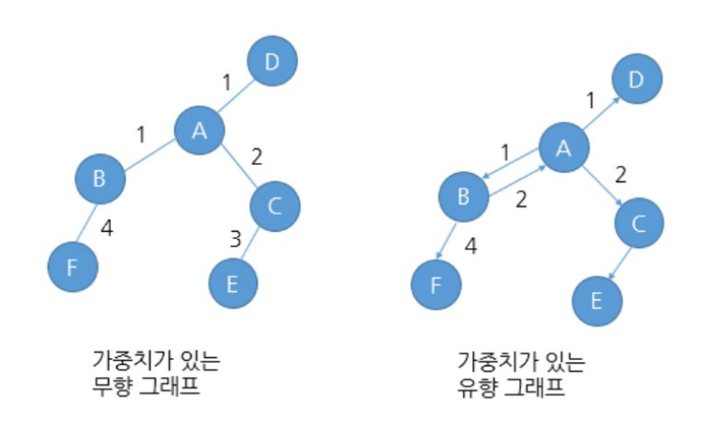

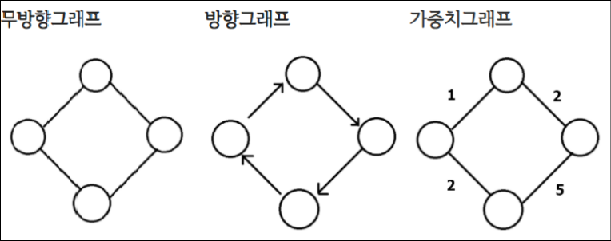

### 정의

- **노드와 노드를 연결하는 간선을 하나로 모아 놓은 자료구조이다.**
- 정점과 간선의 집합으로 표현할 수 있다.
- 그래프는 현상이나 사물을 정점과 간선으로 표현한 형태로, 정점(Vertex)은 대상이나 개체를 나타내고 간선(Edge)은 이들 간의 관계를 나타낸다.

### 특징

- 그래프의 종류에는 방향 그래프와 무방향 그래프가 있으며, 간선에 방향의 유무에 따른 차이가 존재한다.
- 추상적인 개념의 연결 관계를 표현하기 위해서 많이 사용한다.
- **사이클이 없는 Graph**는 **Tree**와 같다.
- 사이클(순환경로를 말하며 경로의 시작 정점과 종료 정점이 동일한 경우)이 발생할 수 있다.
- 2개 이상의 경로가 가능하다.
- 부모 - 자식 관계라는 개념이 없다. (루트 로드라는 개념이 없음)
- 정점은 여러 개의 간선을 가질 수 있다.
- 간선은 가중치를 가질 수 있다.
    
    → 가중치 : cost(비용). ex) 깊이우선탐색(DFS) 그래프에 많이 사용
    
- 도시를 연결하는 도로망이나 웹 사이트간에 링크 관계에 사용하고 있다.

### 용어

- **정점(Vertex, Node)** : 노드이며, 데이터가 저장된다.
- **간선(Edge)** : 정점들을 연결하는 선이며, 정점과 정점 사이의 관계를 표현한다.
- **인접 정점(Adjacent Vertex)** : 간선에 의해 연결된 정점이다.
- **사이클(Cycle)** : 한 노드에서 시작해서 간선을 따라 다시 시작한 정점으로 돌아오는 경로를 의미한다.
- **경로(Path)** : 하나의 정점에서 다른 하나의 정점까지 가는 길을 의미한다.
- **경로 길이(Path Length)** : 경로를 구성하는 간선의 수를 의미한다.
- **단순 경로** : 한 정점에서 다른 정점에 이르거나 경로를 탐색할 때 하나의 노드를 두 번 거치지 않는 경로를 의미한다. 즉 하나의 노드에 한번만 방문해야 한다는 의미이다.
- **차수(Degree)** : 하나의 노드에 연결되어 있는 간선의 수.
- **진입 차수(In-Degree)** : 방향 그래프에서 각 정점으로 들어오는 간선의 개수 (정점을 머리로 함.)
- **진출 차수(Out-Degree)** : 방향 그래프에서 각 정점으로부터 나가는 간선의 개수(정점을 꼬리로 함.)

### 종류

1. **방향 그래프**

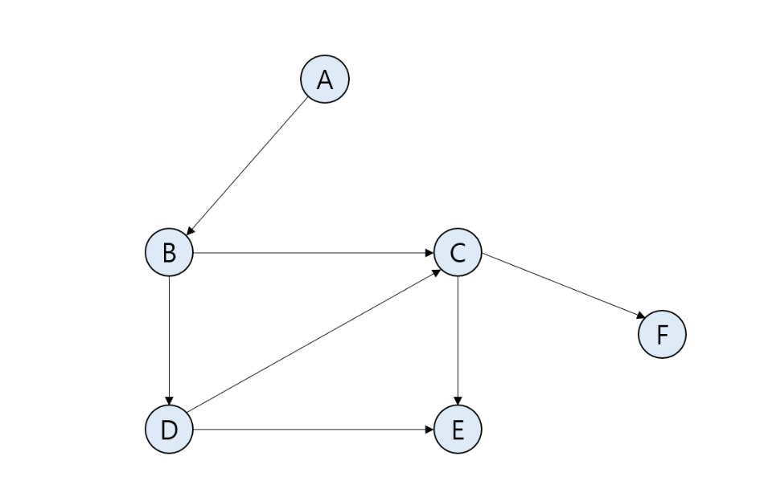

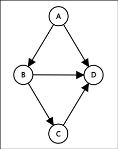

- 간선에 방향이 있는 그래프를 의미한다.
- A와 B 정점을 잇는 간선을 보면 화살표가 존재하는 것을 알 수 있다.
- 방향이 있기 때문에 한 정점에서 다른 정점으로 이동할 때 그 방향에 따라서만 이동이 가능하다.
- 예시로, A에서 D로 갈 방법은 A→B→D로 가는 방법밖에 존재하지 않는다.

<aside>
💡 **방향 그래프의 최대 간선 개수 :** 정점의 개수 * (정점의 개수 - 1 )

</aside>

1. **무방향 그래프(무향 그래프)**

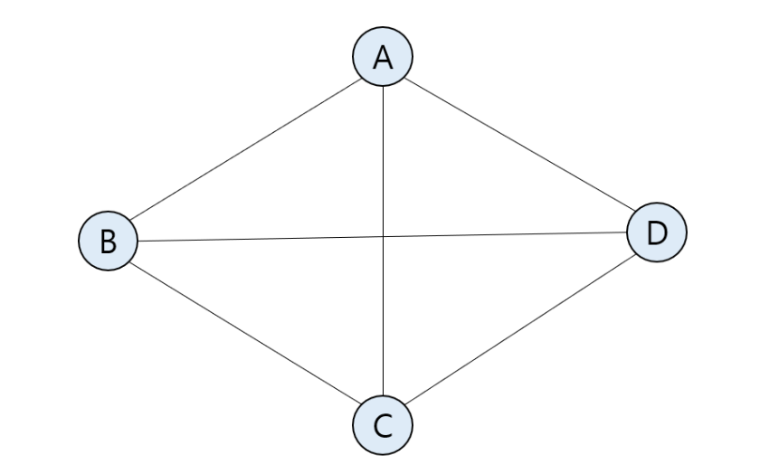

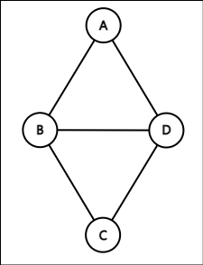

- 간선에 방향이 없는 그래프이다.
- 간선을 보았을 때, 방향 그래프와는 달리 A에서 B로 이어진 간선과 B에서 A로 이어진 간선은 서로 같은 간선이다.

<aside>
💡 **무방향 그래프의 최대 간선 개수 :** 정점의 개수 * (정점의 개수 - 1) /2

</aside>

3. **가중치 그래프**

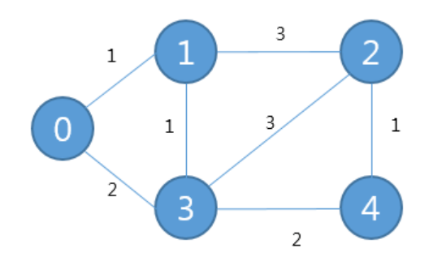

- 간선들이 가중치를 가진 그래프이다.
- 가중치는 다양한 기준을 활용하여 설정 가능하며, 원하는 경로로 순회 가능하다.

1. **완전 그래프**  

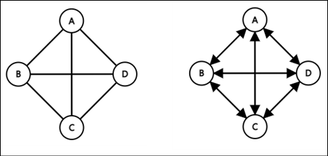

- 한 정점에서 다른 모든 정점과 연결되어 최대 간선 수를 갖는 그래프이다.

1. **부분 그래프** 

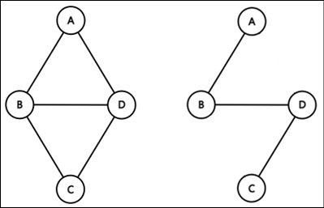

- 기존의 그래프에서 일부 정점이나 간선을 제외하여 만든 그래프이다.

1. **가중 그래프** 

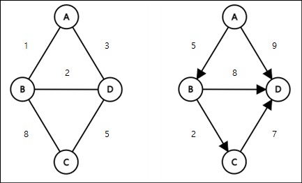

- 정점을 연결하는 간선에 가중치를 할당한 그래프이다.

1. **유향 비순환 그래프** 

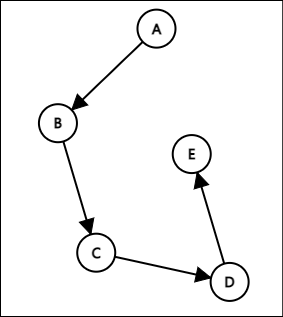

- 방향 그래프에서 사이클이 없는 그래프이다.

1. **연결 그래프** 

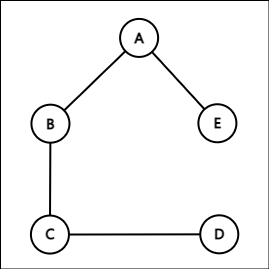

- 떨어져 있는 정점이 없는 그래프이다.

1. **단절 그래프** 

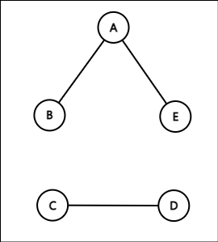

- 연결되지 않은 정점이 있는 그래프이다.

### 표현법

- 그래프의 표현법에는 **행렬**을 이용하는 방법과 **리스트**를 이용하는 방법이 있다.

### 1. **인접 행렬(Adjacent Matrix)**

그래프를 구성하는 정점과 두 정점을 연결한 간선의 유무를 저장하기 위해서 2차원의 행렬을 사용한다.

N개의 정점을 가진 그래프는 각 정점에 대한 행과 열을 나타내야 하므로 N*N 행렬을 사용하고 두 정점이 인접하면 1, 인접하지 않으면 0으로 표현한다.

- **무방향 그래프**

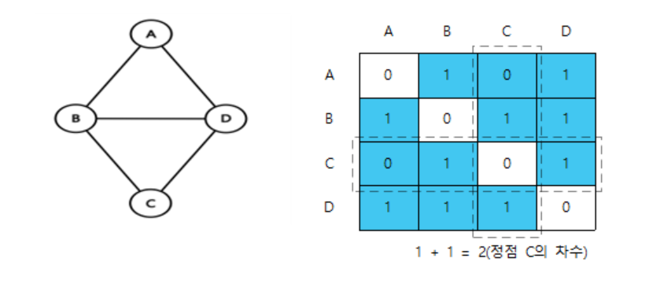

한 정점에서 자신을 가리키는 간선은 존재하지 않기 때문에 항상 0이다. (대각선)

간선 (Vi, Vj)는 간선(Vj, Vi)와 같은 의미이기 때문에 대각선을 기준으로 대칭을 이룬다.

- **방향 그래프**

한 정점에서 자신을 가리키는 간선은 존재하지 않기 때문에 항상 0이다. (대각선)

간선에 방향이 있으므로 인접 행렬은 무방향 그래프와 달리 대각선을 기준으로 대칭 구조가 아니다.

### 2. **인접 리스트(Adjacent List)**

그래프를 연결리스트(Linked List)로 표현하는 방법이다.

각 정점마다 인접한 정점들을 하나의 연결 리스트에 매다는 것이다. 존재하지 않는 간선은 리스트에 나타나지 않는다. 

그래프는 각 인접리스트에 대한 헤드포인터를 배열로 갖는다.

- **가중치가 없는 무방향 그래프**

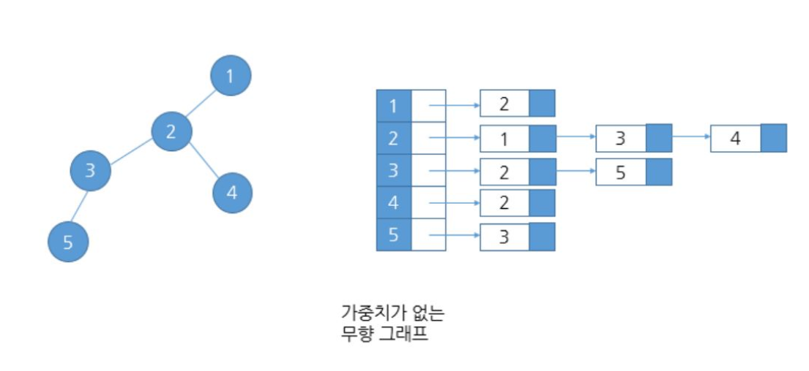

가중치 표현 없이 인접한 노드 정보가 저장된다.

- **가중치가 있는 방향 그래프**

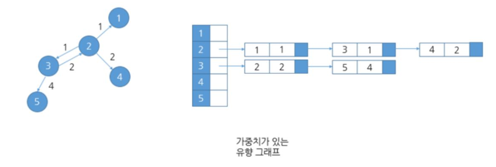

헤드포인터  → [노드 번호 | 가중치 번호] 가 저장된다.

<aside>
💡 **헤드포인터(Head Pointer)** : 연결 리스트의 맨 처음 노드를 가리키는 포인터

</aside>