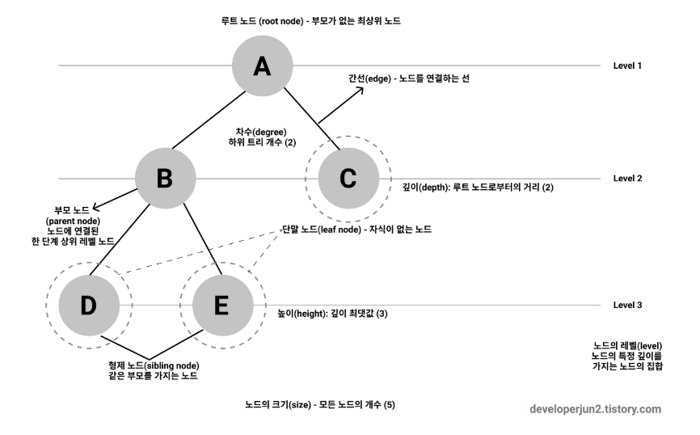
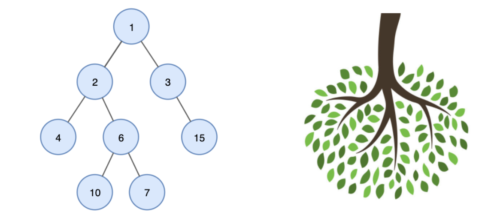
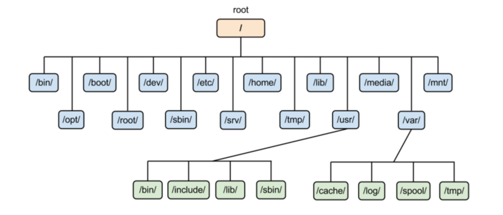
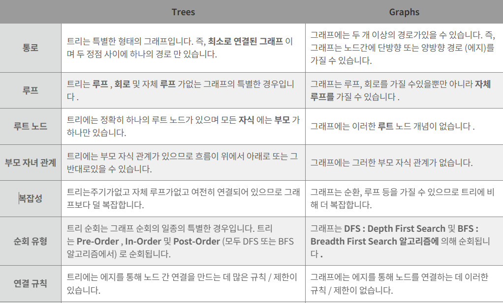

# Tree

## 트리(Tree)

### 정의

- 루트 노드(Root Node)라고 불리는 최상위 노드를 시작으로 여러 개의 자식 노드들이  나무 가지처럼 연결된 구조이다.
- 트리는 그래프의 한 종류로 최소 연결 트리라고도 불린다.
- 방향성이 있는 비순환 그래프의 한 종류이다.

### 특징

- 단순한 나열이 아닌 **부모-자식 형태의 구조**이며, 모든 자식 노드는 하나의 부모 만을 갖는다.
- 트리는 트리 내에 다른 하위 트리가 있고, 그 하위 트리 안에는 또 다른 하위 트리가 있는 재귀적 자료구조이기도 하다.
- 노드가 N개인 트리는 항상 N-1개의 간선(edge)을 가진다. 즉, 간선은 항상 (정점의 개수 - 1) 만큼을 가진다.
- 각 노드는 어떤 자료형으로도 표현이 가능하다.
- 데이터를 순차적으로 저장하지 않는다. → 비선형 자료구조이다.
- 사이클이 존재하지 않는다. (임의의 두 노드간 경로가 유일하며, 하나의 연결 그래프, 방향, 화살표가 없음.)
- 컴퓨터의 directory 구조가 트리 구조의 대표적 예이다.
    
    
    

### 용어

- 루트 노드(root node): 부모가 없는 노드, 트리는 하나의 루트 노드만을 가진다.
- 단말 노드(leaf node): 자식이 없는 노드, ‘말단 노드’ 또는 ‘잎 노드’라고도 부른다.
- 내부(internal) 노드: 단말 노드가 아닌 노드
- 간선(edge): 노드를 연결하는 선 (link, branch 라고도 부름)
- 형제(sibling): 같은 부모를 가지는 노드
- 노드의 크기(size): 자신을 포함한 모든 자손 노드의 개수
- 노드의 깊이(depth): 루트에서 어떤 노드에 도달하기 위해 거쳐야 하는 간선의 수
- 노드의 레벨(level): 트리의 특정 깊이를 가지는 노드의 집합
- 노드의 차수(degree): 하위 트리 개수 / 간선 수 (degree) = 각 노드가 지닌 가지의 수
- 트리의 차수(degree of tree): 트리의 최대 차수
- 트리의 높이(height): 루트 노드에서 가장 깊숙히 있는 노드의 깊이

### **종류**

- **1. Binary Tree(이진 트리)**
    
    
    
    노드가 하나 이상의 자식을 갖게 되면 트리라고 부르는데 자식 노드가 최대 2개까지만 허용하는 트리를 이진트리라고 부른다.
    
- **2. Ternary Tree**
    
    
    
    노드가 2개 이상 붙는 트리도 당연히 존재하게 되는데 3개가 붙으면 ternary tree라고 부른다.
    
- **3. Binary Search Tree(이진 탐색 트리)**
    
    
    
    다른 특별한 조건 없이 노드의 자식이 최대 2개씩만 붙으면 이진 트리라고 부르게 되는데, 이진 탐색 트리는 왼쪽 노드와 그 이하의 자식 노드들은 현재의 노드보다 작아야 하며 오른쪽 노드와 그 이하의 자식들은 현재의 노드 보다 큰 조건을 만족하게 된다. 그러므로 모든 값들이 노드들을 기준으로 두 가지 방향으로만 찾으면 되기 때문에 값을 찾는데 편리한 조건을 지니고 있다.
    
- **4. Complete Binary Tree(완전 이진 트리)**
    
    
    
    모든 노드들이 레벨 별로 왼쪽부터 채워져 있을 경우 완전 이진 트리라고 한다. 즉, 마지막 레벨을 제외한 서브 트리의 레벨이 같아야 하며 마지막 레벨이 왼쪽부터 채워져 있으면 완전 이진 트리라고 한다.
    
- **5. Full Binary Tree**
    
    
    
    하나의 자식 노드를 가진 트리가 하나도 존재하지 않을 경우에 Full Binary Tree라고 한다. 노드들의 자식이 하나도 없거나 두 개의 자식으로만 구성될 경우이다.
    
- **6. Perfect Binary Tree**
    
    
    
    양 쪽으로 빈 공간 없이 모든 노드가 두 개의 자식을 가지며 레벨도 같을 경우를 말한다. 레벨의 개수를 n이라고 가정할 때 2^n - 1의 노드 개수를 가지게 된다.
    

### **Tree와 Graph의 차이**

- 가장 명확한 차이는 ‘사이클의 유무’ 이다.

