# 행위 패턴(Behavioral pattern)

---

# 정의

- 소프트웨어 디자인에서 객체 간의 상호 작용과 역할 분배에 중점을 둔 디자인 패턴이다.
- 객체 간의 알고리즘 및 책임의 분배에 관련되어 있다.
- 한 객체가 혼자 수행할 수 없는 작업을 여러 개의 객체로 어떻게 분배하는지,  분배 시 객체 사이의 결합도를 최소화하는 것에 중점을 둔다.
- 소프트웨어 유연성을 향상시키고 확장성을 강화하는 데 도움이 된다.

# 종류

## 책임 연쇄(Chain of Responsibility)


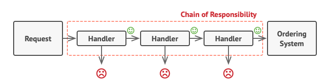

- 핸들러 체인을 따라 요청을 전달할 수 있는 동작 디자인 패턴이다.
- 요청이 여러 객체를 순차적으로 통과하면서 처리 될 수 있도록 하는 패턴이다.
    - 처리 객체가 동적으로 결정될 수 있다.
- 여러 개의 객체 중에서 어떤 것이 요구를 처리할 수 있는 지를 사전에 알 수 없을 때 사용된다.
- 요청을 받으면 각 핸들러는 요청을 처리할 지 아니면 체인의 다음 핸들러로 전달할 지 결정한다.
    - 책임들이 연결되어 있기 때문에 본인이 책임을 지지 못할 경우 다음 책임자에게 자동으로 넘어가는 구조이다.
    
    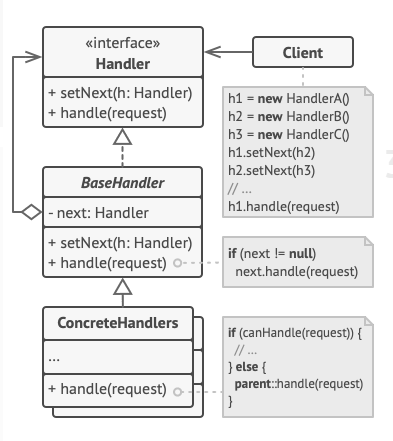
    

- Handler : 요청을 처리하기 위한 수신자들이 가져야 할 인터페이스 정의
- ContreteHandler : Handler 인터페이스 구현, 각자가 요청 종류에 따라 자신이 처리할 수 있는 부분 구현. 만약 자신이 처리할 수 없는 요청이 들어오면 이를 다음 처리자(Handler)에게 전달
- Client : 요청을 만들고 이를 처리할 처리자 객체를 생성하는 역할을 수행하는 클래스

- sudoCode
    
    *휴지통 비우기 예제
    
    ```java
    // Handler 인터페이스: 요청을 처리하는 인터페이스
    interface Handler {
        void handleRequest(String request);  // 요청 처리 메서드
    }
    
    // ConcreteHandler 클래스: 실제로 요청을 처리하는 클래스
    class TrashBinHandler implements Handler {
        // 요청 처리 메서드
        override void handleRequest(String request) {
            if (request.equals("EmptyTrashBin")) {
                print("휴지통이 비워졌습니다.");
            } else {
                print("휴지통 비우기 요청을 처리할 수 없습니다.");
            }
        }
    }
    
    // 클라이언트 코드
    function client() {
        // 핸들러 생성
        Handler trashBinHandler = new TrashBinHandler();
    
        // 요청 처리
        trashBinHandler.handleRequest("EmptyTrashBin");  // 휴지통이 비워졌습니다.
        trashBinHandler.handleRequest("OtherRequest");   // 휴지통 비우기 요청을 처리할 수 없습니다.
    }
    
    // 클라이언트 실행
    client();
    ```
    

## 명령(**Command)**

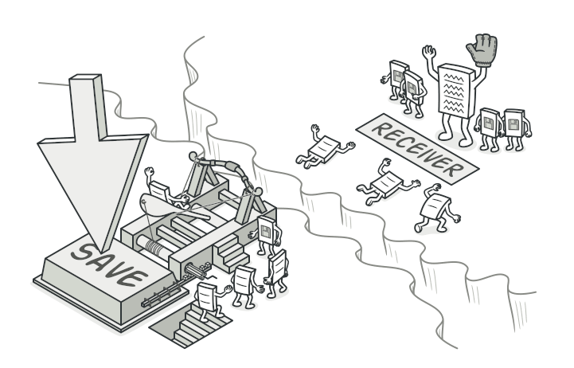

- 요청을 객체의 형태로 캡슐화하여 매개변수를 캡슐화하고, 요청을 수행하는 객체를 변경할 수 있도록 요청에 필요한 정보를 저장하거나 로그에 남기도록 한다.
- 주어진 여러 기능을 실행할 수 있는 재사용성이 높은 클래스를 설계하는 패턴으로, 하나의 추상 클래스에 메서드를 만들어 각 명령이 들어오면 그에 맞는 서브 클래스가 선택되어 실행된다.


- Command : 명령을 나타내는 인터페으스 또는 추상클래스이다. execute() 라는 메서드를 정의하여 명령을 수행한다.
- ConcreteCommand : Command 인터페이스를 구현한 실제 명령 클래스이다. 특정 객체의 메서드 호출을 캡슐화하고, execute() 메서드에서 해당 메서드를 호출한다.
- Invoker(호출자) : 명령을 실행하는 역할을 하는 클래스이다. 클라이언트가 명령을 호출하는 대신 호출자를 통해 명령을 실행한다.
- Receiver(수신자) : 실제로 명령을 수행하는 객체이다. ConcreteCommand에서 명령을 수행할 때 사용되는 객체이다.
- Clinet(클라이언트) : ConcreteCommand를 생성하고 Invoker에게 명령을 전달하는 객체이다.

- 커맨드 패턴의 핵심은 명령을 캡슐화하여 객체로 만들고, 이를 Invoker에 전달하여 실행하는 것이다. 이로써 클라이언트는 명령을 생성하고 Invoker에게 전달함으로써 여러 명령을 처리할 수 있다.

- SudoCode
    
    *전등을 켜고 끄는 동작을 Command 패턴으로 구현
    
    ```java
    // Command 인터페이스: 실행 메서드를 정의하는 인터페이스
    interface Command {
        void execute();
    }
    
    // ConcreteCommand 클래스: 실제로 실행할 동작을 구현하는 클래스
    class TurnOnCommand implements Command {
        private Light light;
    
        // 전등 객체를 받아와서 저장
        TurnOnCommand(Light light) {
            this.light = light;
        }
    
        // 실행 메서드에서 전등을 켬
        @Override
        public void execute() {
            light.turnOn();
        }
    }
    
    // ConcreteCommand 클래스: 실제로 실행할 동작을 구현하는 클래스
    class TurnOffCommand implements Command {
        private Light light;
    
        // 전등 객체를 받아와서 저장
        TurnOffCommand(Light light) {
            this.light = light;
        }
    
        // 실행 메서드에서 전등을 끔
        @Override
        public void execute() {
            light.turnOff();
        }
    }
    
    // Receiver 클래스: 실제 동작을 수행하는 클래스
    class Light {
        void turnOn() {
            System.out.println("전등이 켜졌습니다.");
        }
    
        void turnOff() {
            System.out.println("전등이 꺼졌습니다.");
        }
    }
    
    // Invoker 클래스: 명령을 실행하는 클래스
    class RemoteControl {
        private Command command;
    
        // 명령을 받아와서 저장
        void setCommand(Command command) {
            this.command = command;
        }
    
        // 저장된 명령을 실행
        void pressButton() {
            command.execute();
        }
    }
    
    // 클라이언트 코드
    public class Client {
        public static void main(String[] args) {
            // Receiver 객체 생성
            Light light = new Light();
    
            // ConcreteCommand 객체 생성
            Command turnOnCommand = new TurnOnCommand(light);
            Command turnOffCommand = new TurnOffCommand(light);
    
            // Invoker 객체 생성
            RemoteControl remoteControl = new RemoteControl();
    
            // 버튼에 켜기 명령 설정 후 실행
            remoteControl.setCommand(turnOnCommand);
            remoteControl.pressButton();
    
            // 버튼에 끄기 명령 설정 후 실행
            remoteControl.setCommand(turnOffCommand);
            remoteControl.pressButton();
        }
    }
    ```
    

## 인터프리터(Interpreter)

- 언어의 문법 규칙을 표현하고 이를 해석하는 인터프리터를 정의하는 패턴이다.
- 언어가 주어지면, 해당 표현을 사용하여 언어로 문장을 해석하는 인터프리터를 사용하여 문법 표현을 정의하는 방법이다.
    - 반복되는 문제 패턴을 언어 또는 문법으로 정의하고 확장할 수 있다.
        - 예시로, 정규표현식에 해당한다.
        
        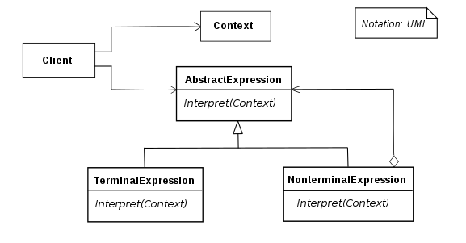
        
        인터프리터의 구조
        

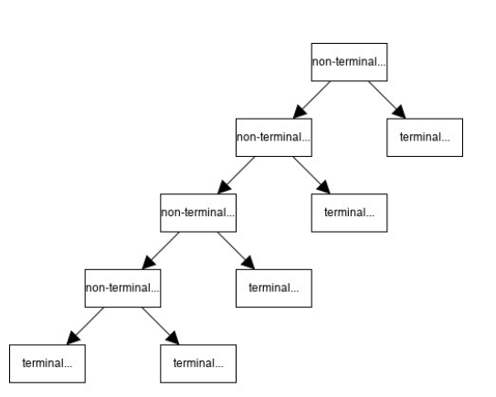

트리 형태

- Context : Expression에서 사용하는 모든 데이터들이 저장되어 있는 공간
- Expression : 일련의 규칙을 계산하여 결과값 반환
- TerminalExpression :  Expression을 포함하지 않고, 계산된 결과를 반환한다.
    - 종료를 포함하고, 더 이상 다른 문자로 치환될 수 없는 종점문자이다.
- NonTerminalExpression : Expression을 참조하여, 종료를 하지 않고 다음 규칙으로 값을 넘기는 역할을 한다.

→ 인터프리터 패턴은, NonTerminalExpression을 통해 해석한 문자를 다음 해석이 가능한 Expression으로 넘기면서, TerminalExpression만 남으면 해석된 마지막 문자를 반환하여 인터프리터로써의 기능을 수행하는 구조를 가진다.

- SudoCode
    
    ```java
    // Expression 인터페이스: 표현식을 나타내는 인터페이스
    interface Expression {
        int interpret(); // 해석 메서드
    }
    
    // Number 클래스 (터미널 표현식): 정수를 나타내는 터미널 표현식 클래스
    class Number implements Expression {
        private int value;
    
        // 생성자로 숫자를 받아 객체를 초기화
        public Number(int value) {
            this.value = value;
        }
    
        // 숫자를 반환하는 메서드
        @Override
        public int interpret() {
            return value;
        }
    }
    
    // Addition 클래스 (비터미널 표현식): 두 표현식을 더하는 비터미널 표현식 클래스
    class Addition implements Expression {
        private Expression left;  // 덧셈의 왼쪽 표현식
        private Expression right; // 덧셈의 오른쪽 표현식
    
        // 생성자로 두 표현식을 받아 객체를 초기화
        public Addition(Expression left, Expression right) {
            this.left = left;
            this.right = right;
        }
    
        // 두 표현식을 더한 결과를 반환하는 메서드
        @Override
        public int interpret() {
            return left.interpret() + right.interpret();
        }
    }
    
    // Subtraction 클래스 (비터미널 표현식): 두 표현식을 빼는 비터미널 표현식 클래스
    class Subtraction implements Expression {
        private Expression left;  // 뺄셈의 왼쪽 표현식
        private Expression right; // 뺄셈의 오른쪽 표현식
    
        // 생성자로 두 표현식을 받아 객체를 초기화
        public Subtraction(Expression left, Expression right) {
            this.left = left;
            this.right = right;
        }
    
        // 두 표현식을 뺀 결과를 반환하는 메서드
        @Override
        public int interpret() {
            return left.interpret() - right.interpret();
        }
    }
    
    // 클라이언트 코드
    public class Client {
        public static void main(String[] args) {
            // 문법 트리 구성: 10 - (5 + 3)
            Expression expression = new Subtraction(new Number(10), new Addition(new Number(5), new Number(3)));
    ```
    

## 반복자(**Iterator)**

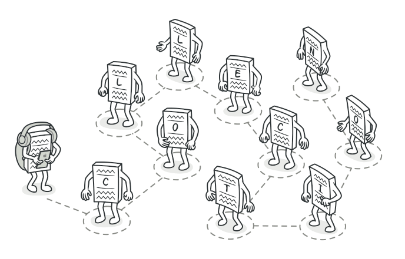

- 반복이 필요한(접근이 잦은) 자료구조를 모두 동일한 인터페이스를 통해 접근할 수 있도록 메서드를 이용해 자료구조를 활용할 수 있도록 해준다.
- 컬렉션 구현 방법을 노출시키지 않으면서도 그 집합체 안에 들어 있는 모든 항목에 접근할 수 있또록 한다.
- Iterator 패턴을 사용하면 집합체 내에서 어떤 식으로 일이 처리되는지는 알 수 없으나, 그 안에 들어있는 항목들에 대해 반복 작업을 수행할 수 있다.

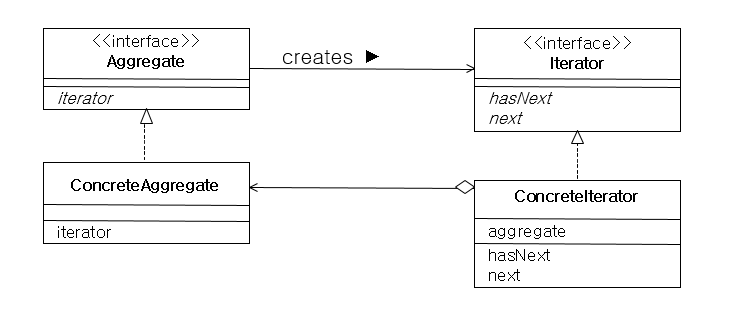

Iterator 구조

- Iterator : 집합체의 요소들을 순서대로 검색하기 위한 인터페이스 정의
- ConcreteIterator : Iterator 인터페이스 구현
- Aggregate : 여러 요소들로 이루어져 있는 집합체
- ConcreateAggregate : Aggreagate 인터페이스를 구현하는 클래스

- SudoCode
    
    *숫자 리스트를 순회하는 예제
    
    ```java
    // Iterator 인터페이스: 순회를 위한 인터페이스
    interface Iterator {
        bool hasNext();     // 다음 요소가 있는지 확인
        Object next();      // 다음 요소 반환
    }
    
    // ConcreteIterator 클래스: 실제로 순회를 수행하는 Iterator 클래스
    class ConcreteIterator implements Iterator {
        private List<Object> elements;
        private int currentIndex;
    
        // 생성자에서 순회할 리스트 초기화
        ConcreteIterator(List<Object> elements) {
            this.elements = elements;
            this.currentIndex = 0;
        }
    
        // 다음 요소가 있는지 확인
        override bool hasNext() {
            return currentIndex < elements.length;
        }
    
        // 다음 요소 반환
        override Object next() {
            if (hasNext()) {
                Object nextElement = elements[currentIndex];
                currentIndex++;
                return nextElement;
            }
            return null;
        }
    }
    
    // 클라이언트 코드
    function client() {
        List<Object> data = [1, 2, 3, 4, 5];
        Iterator iterator = new ConcreteIterator(data);
    
        // 순회하면서 출력
        while (iterator.hasNext()) {
            Object element = iterator.next();
            print(element);
        }
    }
    
    // 클라이언트 실행
    client();
    ```
    

## 중재자(Mediator)

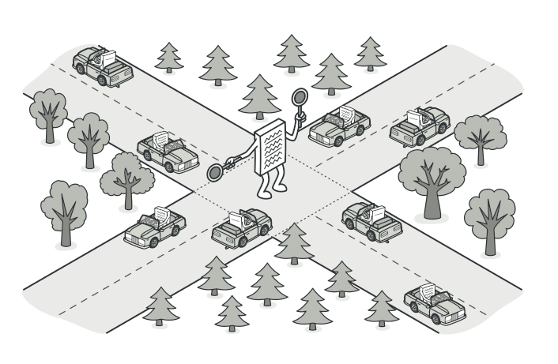

- 클래스 간의 복잡한 관계들을 캡슐화하여 하나의 클래스에서 관리하도록 처리하는 패턴이다.
- M:N 관계를 해당 패턴 사용시 M:1 관계로 만들어 복잡도를 내리므로 유지 보수 및 확장성에 유리하다.
    - 분산된 다수의 객체 역할을 조정 시 사용한다.
- 객체 사이의 의존성을 줄여 결합도를 감소시킬 수 있다.
- 중재자는 객체 간의 통제와 지시의 역할을 수행한다.
    - 각 객체 간의 직접적인 통신을 피하도록 한다.
- 복잡한 통신과 제어를 한 곳에 집중하여 처리하는 효과가 있다.
    - 실제 상황 적용 시, 항공기 조종사들은 다음에 누가 비행기를 착륙시킬지를 결정할 때 서로 직접 대화하지 않고 비행기 관제탑을 통해 이루어진다.
    - 만약 교통 관제사가 없다면 조종사들은 공항 근처의 모든 비행기의 존재를 확인하고, 다른 조종사들과 착륙 우선 순위를 논의해야 한다.
    
    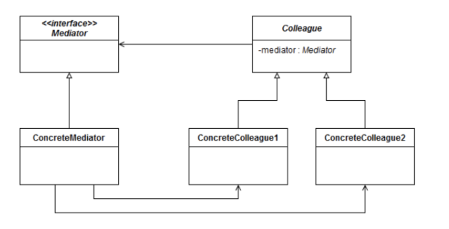
    
- Mediator : 동료 간 통신을 위한 인터페이스
- Colleague : 동료 간에 전달되는 이벤트를 정의하는 추상 클래스
- ConcreteMedeator : 객체를 조정하여 협동 조작을 구현하고 객체를 유지 관리
- ConcreteColleague : 다른 Colleague가 생성한 Mediator를 통해 받은 알림 작업을 구현

- sudoCode
    
    *채팅 구현
    
    ```java
    import java.util.ArrayList;
    import java.util.List;
    
    // Mediator 인터페이스
    interface ChatMediator {
        // 메시지를 전송하는 메서드
        void sendMessage(String message, User user);
    }
    
    // 동료 (Colleague) 클래스
    class User {
        private String name;
        private ChatMediator mediator;
    
        // 사용자 객체 생성 시 중재자를 받아 초기화
        public User(String name, ChatMediator mediator) {
            this.name = name;
            this.mediator = mediator;
        }
    
        // 메시지 전송 메서드
        public void sendMessage(String message) {
            System.out.println(name + " sends: " + message);
            mediator.sendMessage(message, this);
        }
    
        // 메시지 수신 메서드
        public void receiveMessage(String message) {
            System.out.println(name + " receives: " + message);
        }
    }
    
    // 실제 중재자 클래스
    class ChatMediatorImpl implements ChatMediator {
        private List<User> users;
    
        // 중재자 생성 시 사용자 리스트 초기화
        public ChatMediatorImpl() {
            this.users = new ArrayList<>();
        }
    
        // 사용자를 중재자에 등록하는 메서드
        public void addUser(User user) {
            users.add(user);
        }
    
        // 메시지를 모든 사용자에게 전송하는 메서드
        @Override
        public void sendMessage(String message, User user) {
            for (User u : users) {
                // 자신을 제외한 다른 사용자들에게 메시지 전송
                if (u != user) {
                    u.receiveMessage(message);
                }
            }
        }
    }
    
    // 클라이언트 코드
    public class MediatorExample {
        public static void main(String[] args) {
            // 중재자 생성
            ChatMediator mediator = new ChatMediatorImpl();
    
            // 사용자 객체 생성
            User user1 = new User("User 1", mediator);
            User user2 = new User("User 2", mediator);
    
            // 사용자를 중재자에 등록
            mediator.addUser(user1);
            mediator.addUser(user2);
    
            // 사용자 간 메시지 전송
            user1.sendMessage("Hello, User 2!");
            // 출력:
            // User 1 sends: Hello, User 2!
            // User 2 receives: Hello, User 2!
    
            user2.sendMessage("Hi, User 1!");
            // 출력:
            // User 2 sends: Hi, User 1!
            // User 1 receives: Hi, User 1!
        }
    }
    ```
    

## 메멘토(Memento)

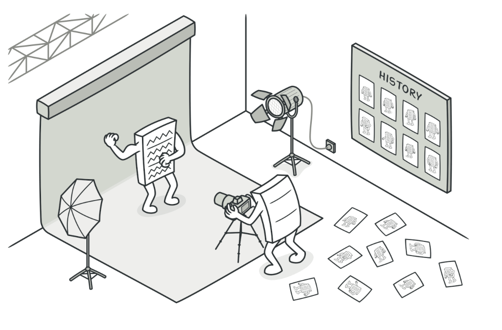

- 객체의 상태 정보를 저장하고 사용자의 필요에 의하여 원하는 시점의 데이터를 복원할 수 있는 패턴을 의미한다.
- 이 패턴은 주로 ‘스냅샷’ 이라고 부른다.
- 메멘토 패턴의 주요 목적은 객체의 상태를 저장하고 복원함으로써 객체의 내부 상태를 객체의 외부로 노출시키지 않고(캡슐화하고), 객체의 유연성을 높인다.
- 이 패턴은 특히 상태를 여러 단계에서 저장하고 복원해야 하는 경우나 트랜잭션 롤백 등의 기능을 구현할 때 유용하다.

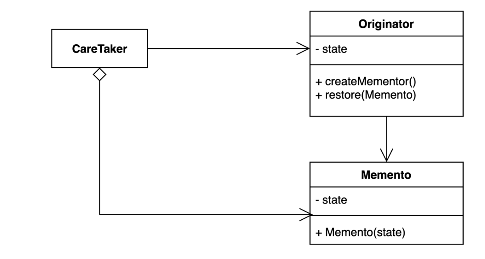

- Originator : 상태를 저장하고 복원할 객체이다. 원조자는 현재 상태를 저장한 메멘토를 생성하거나, 메멘토를 통해 상태를 복원한다.
- Memento : 상태를 저장하는 객체로, Originator의 내부 상태를 캡슐화한다. 메멘토는 보통 불변한 객체로 구현(상태를 수정할 수 없게 구현)되며, Originator에 의해서만 상태가 복원될 수 있다.
- Caretaker : 메멘토를 관리하는 객체로, 메멘토를 저장하고 필요한 시점에서 메멘토를 다시 Originator에게 전달하여 상태를 복원한다. 주로 현재 상태를 저장하고 나중에 상태를 복원할 때 사용된다. (오로지 저장하거나 복원하는 역할만을 담당)

- SudoCode
    
    ```java
    // Memento 클래스: 상태를 저장하는 클래스
    class TextEditorMemento {
        private int characterCount;
    
        // 생성자: 글자 수를 받아서 초기화
        public TextEditorMemento(int characterCount) {
            this.characterCount = characterCount;
        }
    
        // 글자 수 반환
        public int getCharacterCount() {
            return characterCount;
       }
    }
    
    // Originator 클래스: 상태를 저장하고 복원하는 객체
    class TextEditor {
        private StringBuilder content = new StringBuilder();
    
        // 텍스트 추가 메서드
        public void addText(String text) {
            content.append(text);
        }
    
        // 현재 상태를 저장하고 Memento 객체를 반환
        public TextEditorMemento save() {
            return new TextEditorMemento(content.length());
        }
    
        // Memento 객체를 받아서 상태를 복원
        public void restore(TextEditorMemento memento) {
            // 복원 시, 글자 수를 조절
            content.setLength(memento.getCharacterCount());
        }
    
        // 현재 상태 출력
        public void display() {
            System.out.println("Content: " + content.toString());
            System.out.println("Character Count: " + content.length());
        }
    }
    
    // Caretaker 클래스: 메멘토를 관리하는 객체
    class TextEditorCaretaker {
        private TextEditorMemento memento;
    
        // Memento를 설정
        public void setMemento(TextEditorMemento memento) {
            this.memento = memento;
        }
    
        // 현재 Memento를 반환
        public TextEditorMemento getMemento() {
            return memento;
        }
    }
    
    // 예제 사용
    public class MementoPatternExample {
        public static void main(String[] args) {
            // 텍스트 편집기 생성
            TextEditor textEditor = new TextEditor();
    
            // 텍스트 추가
            textEditor.addText("Hello, ");
            textEditor.addText("World!");
    
            // 현재 상태 저장
            TextEditorCaretaker caretaker = new TextEditorCaretaker();
            caretaker.setMemento(textEditor.save());
            textEditor.display();
            // 출력:
            // Content: Hello, World!
            // Character Count: 13
    
            // 추가 텍스트
            textEditor.addText(" This is a memento pattern example.");
    
            // 변경된 상태 출력
            textEditor.display();
            // 출력:
            // Content: Hello, World! This is a memento pattern example.
            // Character Count: 49
    
            // 이전 상태로 복원
            textEditor.restore(caretaker.getMemento());
            textEditor.display();
            // 출력:
            // Content: Hello, World!
            // Character Count: 13
        }
    }
    ```
    

## 옵저버(Observer)

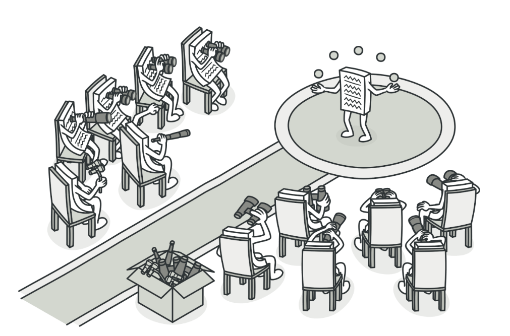

- 객체 간에 1:N 의존성을 정의하며, 어떤 객체의 상태가 변할 때 그 객체에 의존하는 다른 객체들이 자동으로 알림을 받아 업데이트되도록 하는 디자인 패턴이다.
- 객체의 상태 변화를 관찰하는 관찰자들, 즉, 옵저버들의 목록을 객체에 등록하여 상태 변화가 있을 때마다 메서드를 통하여 관찰 대상자가 직접 옵저버들에게 통지하여 상태를 동기화 할 수 이도록 한다. → 대상의 상태가 변할 때 관찰자에게 통지된다는 의미이다.
- 이 패턴은 상태 변화에 따른 처리를 기술할 때 유용하다.
- 주로 분산 이벤트 핸들링 시스템(여러 컴퓨터 또는 시스템 간에 이벤트(사건)가 발생하거나 전달되는 시스템을 의미)이나 MVC 아키텍쳐에서 사용된다.

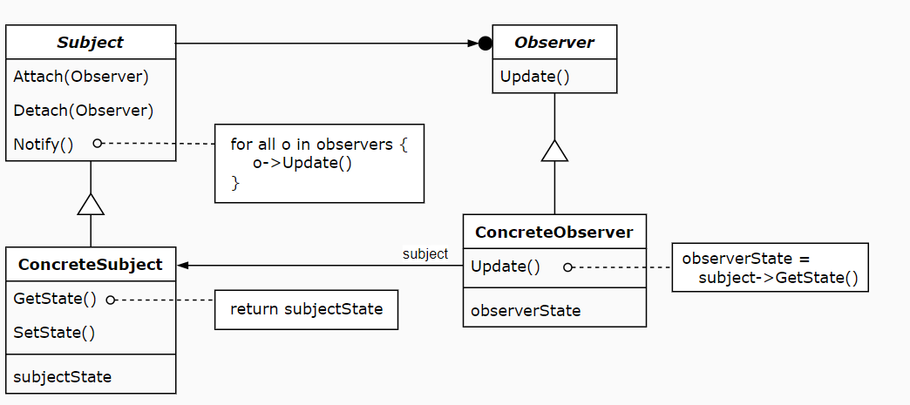

- Subject
    - 상태가 변경되는 주체 객체이다.
    - 옵저버 객체들을 등록하고, 등록된 옵저버들에게 알림을 보낸다.
    - 상태가 변경될 마다 등록된 모든 옵저버들에게 상태 변화를 알리고자 하는 메서드를 호출한다.
- Observer
    - Subject의 상태 변화를 감시하고 이에 대한 업데이트를 수행하는 객체이다.
    - 주체에 등록되어 상태 변화를 감시한다.
    - 주체의 상태가 변경될때마다 업데이트 메서드를 호출받아 적절한 동작을 수행한다.
- ConcreteSubject(구체적 주제)
    - Subject 역할을 구현한 구체적 객체이다.
    - 상태를 유지하고, 상태가 변경될 때마다 옵저버들에게 알린다.
- ConcreteObserver(구체적 옵저버)
    - Observer 역할을 구현한 구체적 객체이다.
    - 주체의 상태 변화에 따라 어떤 행동을 수행한다.

- SudoCode
    
    ```java
    import java.util.ArrayList;
    import java.util.List;
    
    // 주제(Subject) 역할을 하는 클래스
    class Subject {
        private List<Observer> observers = new ArrayList<>();
        private int state;
    
        // 옵저버 등록
        public void addObserver(Observer observer) {
            observers.add(observer);
        }
    
        // 상태 변경 및 옵저버들에게 알림
        public void setState(int state) {
            this.state = state;
            notifyObservers();
        }
    
        // 등록된 모든 옵저버에게 알림
        private void notifyObservers() {
            for (Observer observer : observers) {
                observer.update(state);
            }
        }
    }
    
    // 옵저버(Observer) 역할을 하는 인터페이스
    interface Observer {
        void update(int state);
    }
    
    // 구체적인 옵저버(Concrete Observer) 클래스
    class ConcreteObserver implements Observer {
        private String name;
    
        public ConcreteObserver(String name) {
            this.name = name;
        }
    
        // 상태 변경을 받아 처리
        @Override
        public void update(int state) {
            System.out.println("Observer " + name + " received update. New State: " + state);
        }
    }
    
    // 예제 사용
    public class VerySimpleObserverPatternExample {
        public static void main(String[] args) {
            // 주제 객체 생성
            Subject subject = new Subject();
    
            // 옵저버 객체 생성 및 등록
            Observer observer1 = new ConcreteObserver("Observer1");
            Observer observer2 = new ConcreteObserver("Observer2");
            subject.addObserver(observer1);
            subject.addObserver(observer2);
    
            // 상태 변경 및 옵저버들에게 알림
            subject.setState(42);
            // 출력:
            // Observer Observer1 received update. New State: 42
            // Observer Observer2 received update. New State: 42
        }
    }
    ```
    

## 상태(State)

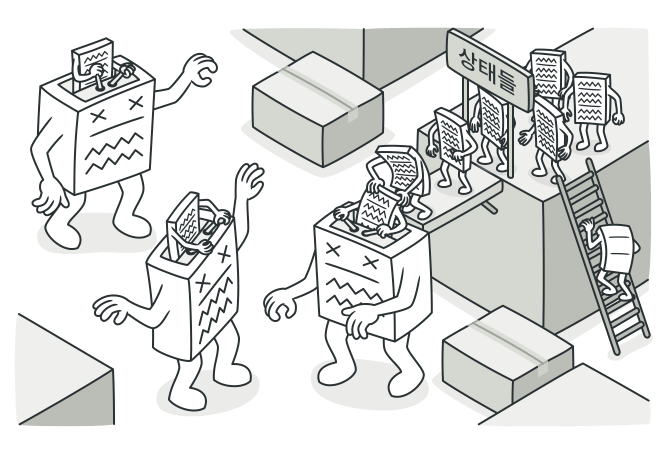

- 객체가 특정 상태에 따라 행위를 달리 하는 상황에서, 자신이 직접 상태를 체크하여 상태에 따라 행위를 호출하지 않고 상태를 객체화 하여 상태가 행동을 할 수 있도록 위임하는 패턴이다.
- 객체가 자신의 상태에 따라 행동을 변경할 수 있도록 하며, 이를 통해 객체의 클래스를 수정하지 않고도 새로운 상태와 행동을 추가하거나 변경할 수 있다.
    - 객체의 행동이 상태에 따라 다르게 구현되어야 하는 경우
        - 객체가 여러 상태에서 다양한 행동을 수행해야 하는 경우, 상태 패턴은 각 상태에 대한 클래스를 정의하고 해당 클래스에서 특정 행동을 구현함으로써 코드를 구조화할 수 있다.
    - 조건문이 많이 사용되어야 하는 경우의 간소화
        - 상태 패턴은 상태를 클래스로 캡슐화하므로, 많은 조건문이 필요한 상황에서 코드의 가독성을 향상시킬 수 있다.

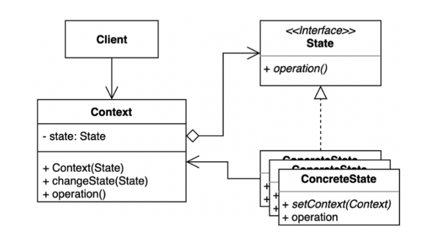

- State interface : 상태를 추상화한 고수준 모듈
- ConcreteState : 구체적인 각각의 상태를 클래스로 표현한다. State 역할로 결정되는 인터페이스를 구체적으로 구현한다. 다음 상태가 결정되면 Context에 상태 변경을 요청하는 역할도 한다.
- Context : State를 이용하는 시스템. 시스템 상태를 나타내는 State 객체를 Composition하여 가지고 있다. 클라이언트로부터 요청받으면 State 객체에 행위 실행을 위임한다.

- SudoCode
    
    ```java
    // 상태 인터페이스
    interface DeliveryState {
        // 배송 상태 업데이트 메서드
        void updateStatus(DeliveryContext context);
    }
    
    // 배송 상태: 주문 접수됨
    class OrderReceivedState implements DeliveryState {
        @Override
        public void updateStatus(DeliveryContext context) {
            System.out.println("주문이 접수되었습니다. 배송 중 상태로 변경합니다.");
            // 배송 중 상태로 변경
            context.setDeliveryState(new InTransitState());
        }
    }
    
    // 배송 상태: 배송 중
    class InTransitState implements DeliveryState {
        @Override
        public void updateStatus(DeliveryContext context) {
            System.out.println("상품이 배송 중입니다. 배송 완료 상태로 변경합니다.");
            // 배송 완료 상태로 변경
            context.setDeliveryState(new DeliveredState());
        }
    }
    
    // 배송 상태: 배송 완료
    class DeliveredState implements DeliveryState {
        @Override
        public void updateStatus(DeliveryContext context) {
            System.out.println("상품이 배송 완료되었습니다. 더 이상 업데이트할 수 없습니다.");
        }
    }
    
    // 배송 컨텍스트
    class DeliveryContext {
        private DeliveryState deliveryState;
    
        public DeliveryContext() {
            // 초기 상태: 주문 접수됨
            this.deliveryState = new OrderReceivedState();
        }
    
        // 현재 상태 설정 메서드
        public void setDeliveryState(DeliveryState deliveryState) {
            this.deliveryState = deliveryState;
        }
    
        // 배송 상태 업데이트 메서드
        public void updateStatus() {
            // 현재 상태에 따라 특정 상태의 행동을 수행
            deliveryState.updateStatus(this);
        }
    }
    
    // 예제 사용
    public class StatePatternExample {
        public static void main(String[] args) {
            // 배송 컨텍스트 생성
            DeliveryContext deliveryContext = new DeliveryContext();
    
            // 주문 접수됨 상태
            deliveryContext.updateStatus();
    
            // 배송 중 상태
            deliveryContext.updateStatus();
    
            // 배송 완료 상태
            deliveryContext.updateStatus();
        }
    }
    ```
    

## 전략(Strategy)


- 객체가 할 수 있는 행위를 정의하고, 각 행위를 캡슐화하며, 이를 상호교환이 가능하게 만드는 디자인 패턴 중 하나이다.
- 알고리즘군을 정의하고, 각 알고리즘을 캡슐화하며, 이를 동적으로 교체할 수 있도록 한다.
    - 직접 행위를 수정하지 않고 전략을 바꿔주기만 함으로써 행위를 유연하게 확장하는 방법을 말한다.
    - 여기서 전략이란, 어떠한 목적을 달성하기 위하여 일을 수행하는 방식을 의미한다.
- 전략 패턴은 특히 어떤 행위가 여러 가지로 구현되어야 하는 경우에 유용하다.
- SOLID 원칙의 OCP(개방-폐쇄) 원칙을 만족한다.

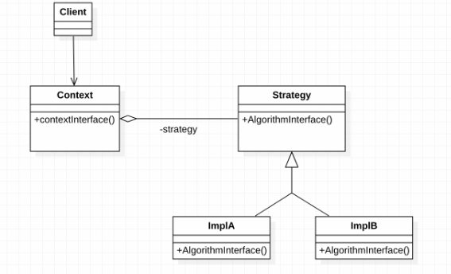

- Strategy(Compositor) : 제공하는 모든 알고리즘에 대한 공통의 연산들을 인터페이스화, Context는 인터페이스화된 Strategy를 통해서 구체화된 실제 알고리즘을 사용한다.
- ImplA,ImplB : Strategy 인터페이스의 공통으로 묶어놓은 알고리즘을 실제로 구현한다.
- Context : Strategy에 있는 참조자(ImplA,ImplB)를 관리한다. 즉, Strategy의 서브클래스 인스턴스를 가지고 있음으로써 구체화한다.

- SudoCode
    - 물건의 결제 방법을 선택하는 예제
    
    ```java
    // 전략 인터페이스
    interface PaymentStrategy {
        void pay(int amount);
    }
    
    // 구체적인 전략 클래스: 신용 카드 결제
    class CreditCardPayment implements PaymentStrategy {
        private String cardNumber;
        private String name;
    
        // 생성자를 통해 카드 번호와 소유자 이름을 받음
        public CreditCardPayment(String cardNumber, String name) {
            this.cardNumber = cardNumber;
            this.name = name;
        }
    
        @Override
        public void pay(int amount) {
            // 신용 카드로 결제하는 특정 행동 구현
            System.out.println("신용 카드로 " + amount + "원을 결제합니다. 카드 번호: " + cardNumber + ", 소유자: " + name);
        }
    }
    
    // 구체적인 전략 클래스: 페이팔 결제
    class PayPalPayment implements PaymentStrategy {
        private String email;
    
        // 생성자를 통해 이메일을 받음
        public PayPalPayment(String email) {
            this.email = email;
        }
    
        @Override
        public void pay(int amount) {
            // 페이팔로 결제하는 특정 행동 구현
            System.out.println("페이팔로 " + amount + "원을 결제합니다. 이메일: " + email);
        }
    }
    
    // 컨텍스트
    class ShoppingCart {
        private PaymentStrategy paymentStrategy;
    
        // 결제 전략을 동적으로 설정
        public void setPaymentStrategy(PaymentStrategy paymentStrategy) {
            this.paymentStrategy = paymentStrategy;
        }
    
        // 결제 수행
        public void checkout(int amount) {
            // 결제 전략에 따라 동적으로 결제
            paymentStrategy.pay(amount);
        }
    }
    
    // 예제 사용
    public class StrategyPatternExample {
        public static void main(String[] args) {
            ShoppingCart shoppingCart = new ShoppingCart();
    
            // 신용 카드로 결제
            shoppingCart.setPaymentStrategy(new CreditCardPayment("1234-5678-9012-3456", "John Doe"));
            shoppingCart.checkout(100);
    
            // 페이팔로 결제
            shoppingCart.setPaymentStrategy(new PayPalPayment("john@example.com"));
            shoppingCart.checkout(50);
        }
    }
    ```
    

## 템플릿 메서드(Template Method)

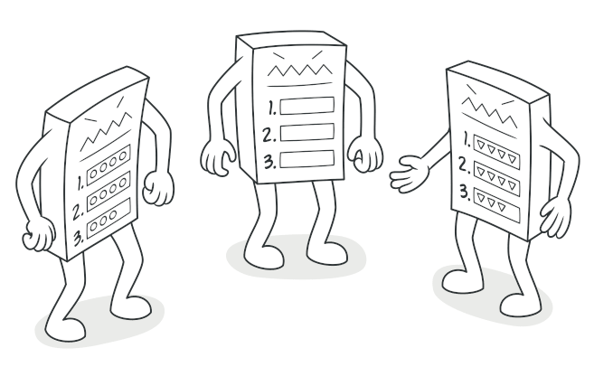

- 특정 알고리즘의 구조를 정의하고, 알고리즘의 일부 단계를 하위 클래스에게 위임하여 구현하는 디자인 패턴이다.
- 즉, 객체의 연산에는 알고리즘의 뼈대만을 정의하고, 각 단계에서 수행할 구체적 처리는 서브클래스 쪽으로 미룬다.
    - 알고리즘의 구조 자체는 그대로 놔둔 채, 알고리즘 각 단계 처리를 서브클래스에서 재정의할수 있게 한다.
- 어떤 한 알고리즘을 이루는 부분 중 변하지 않는 부분을 한 번 정의해 놓고 다양해질 수 있는 부분은 서브클래스에서 정의할 수 있도록 남겨두고자 할 때 사용한다.

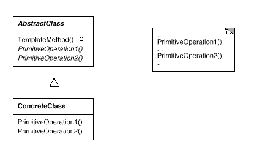

- 예시) 템플릿 메서드 패턴은 마치 레시피를 만드는 것과 비슷하다.
    - 레시피(AbstractClass) : 레시피에는 일반적인 요리 과정이 나와 있다.
    - 예를 들어 “요리를 시작하기 전에 재료를 준비하고, 냄비에 물을 끓이고, 재료를 넣어 음식을 만든다.” 와 같은 단계들이 포함돼 있다. **이것이 바로 템플릿 메서드에 해당한다.**
    - 요리사(ConcreteClass) : 이 레시피를 사용하는 실제 요리사들은 레시피의 단계를 구현한다.
    - 예를 들어, 파스타 요리사는 물 대신에 스파게티를 넣을 수도 있고, 스프 요리사는 물 대신에 육수를 사용할수도 있다.
    - 이렇게 구체적인 재료나 방법은 각각의 구현된 클래스에 해당된다.
    
- SudoCode
    - 요리하는 과정을 템플릿 메서드로 구현한 예
    
    ```java
    // 레시피 (AbstractClass)
    public abstract class Recipe {
        public final void cook() {
            prepareIngredients();
            heatPan();
            cookFood();
            serve();
        }
    
        protected abstract void prepareIngredients();
        protected abstract void heatPan();
        protected abstract void cookFood();
    
        // 선택적으로 오버라이드할 수 있는 메서드
        protected void serve() {
            System.out.println("음식을 서빙합니다.");
        }
    }
    
    // 실제 요리사 (ConcreteClass)
    public class PastaChef extends Recipe {
        @Override
        protected void prepareIngredients() {
            System.out.println("파스타용 재료를 준비합니다.");
        }
    
        @Override
        protected void heatPan() {
            System.out.println("물을 끓입니다.");
        }
    
        @Override
        protected void cookFood() {
            System.out.println("파스타를 삶습니다.");
        }
    
        // serve 메서드는 선택적으로 오버라이드하지 않음
    }
    
    // 다른 실제 요리사 (ConcreteClass)
    public class SoupChef extends Recipe {
        @Override
        protected void prepareIngredients() {
            System.out.println("스프용 재료를 준비합니다.");
        }
    
        @Override
        protected void heatPan() {
            System.out.println("육수를 끓입니다.");
        }
    
        @Override
        protected void cookFood() {
            System.out.println("재료를 넣어 스프를 만듭니다.");
        }
    
        @Override
        protected void serve() {
            System.out.println("스프를 그릇에 담아 제공합니다.");
        }
    }
    ```
    

## 비지터(Visitor)

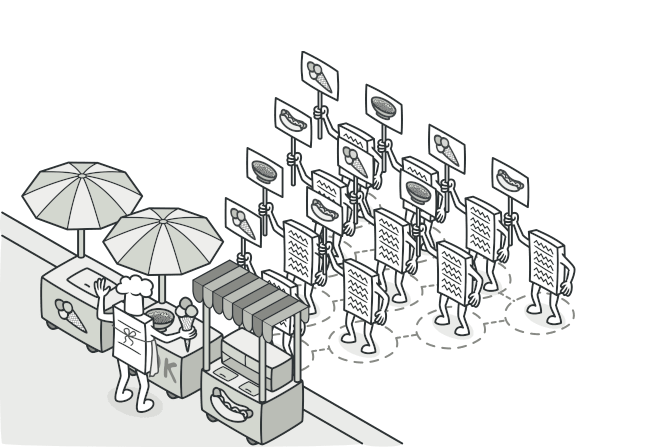

- 각 클래스 데이터 구조로부터 처리 기능을 분리하여 별도의 클래스를 만들어 놓고 해당 클래스의 메서드가 각 클래스를 돌아다니며 특정 작업을 수행하도록 만드는 패턴이다.
- 객체의 구조는 변경하지 않으면서 기능만 따로 추가하거나 확장할 때 사용하는 패턴이다.
- 구조와 기능을 분리하여 기존의 클래스 계층 구조를 건드리지 않으면서  새로운 기능을 추가하는 데 용이한 방법을 제공한다.
- 방문자 패턴은 주로 객체 구조의 각 요소에 대해 다양한 동작이 필요한 경우나 새로운 동작을 유연하게 추가하고자 할 때 사용된다.
- 이렇게 분리를 하면 구조를 수정하지 않고도 실질적으로 새로운 동작을 기존의 객체 구조에 추가할 수 있게 되기 때문에 개방-폐쇄 원칙을 적용하는 방법의 하나이다.
- *왜 이 패턴은 기존의 클래스 계층 구조를 건드리지 않으면서 새로운 기능을 추가하거나 확장할 때 유용하게 사용될까?*
    
    개방-폐쇄 원칙(Open-Closed Principle)은 소프트웨어 개발에서 중요한 디자인 원칙 중 하나입니다. 이 원칙은 다음과 같이 정의됩니다: "소프트웨어 엔티티(클래스, 모듈, 함수 등)는 확장에 대해서는 열려 있어야 하지만, 수정에 대해서는 닫혀 있어야 한다." 즉, 새로운 기능이 추가될 때는 기존의 코드를 수정하지 않고도 가능하도록 하는 것이 원칙입니다.
    
    방문자 패턴은 개방-폐쇄 원칙을 따르는 디자인 패턴 중 하나로, 객체 구조(여기서는 동물원)를 수정하지 않고도 새로운 동작(방문자의 메서드)을 추가할 수 있도록 해줍니다. 이를 좀 더 자세히 살펴보겠습니다.
    
    1. **분리 (Separation):**
        - **`Zoo`** 클래스는 동물들을 담는 역할만을 수행하고 있습니다. 여기에는 어떤 동물이 들어있는지에 대한 구체적인 동작이나 특별한 동작이 정의되어 있지 않습니다. 이는 "분리"를 나타냅니다. 구체적인 동물의 동작은 **`Animal`**과 **`AnimalVisitor`** 인터페이스에 위임되었습니다.
    2. **확장 (Extension):**
        - 새로운 동물이 추가되거나 기존 동물의 동작이 변경되더라도 **`Zoo`** 클래스를 수정할 필요가 없습니다. 새로운 동물이 추가되면 해당 동물은 **`Animal`** 인터페이스를 구현하면 되고, 새로운 동작이 필요하면 새로운 **`AnimalVisitor`**를 구현하면 됩니다.
    3. **폐쇄 (Closed for Modification):**
        - **`Zoo`** 클래스의 구조를 수정하지 않고도 동물들의 동작을 확장할 수 있습니다. 기존의 코드를 변경하지 않고도 새로운 동작을 추가할 수 있기 때문에 "폐쇄"되어 있다고 말할 수 있습니다.
    
    예를 들어, 만약 새로운 동물이 도입되면 그 동물에 대한 특별한 동작을 추가하기 위해선 새로운 구체적인 동물 클래스를 만들고, 그에 따른 새로운 **`visit`** 메서드를 가진 **`AnimalVisitor`**를 구현하면 됩니다. 기존의 **`Zoo`** 클래스를 수정하지 않고도 새로운 동물과 동작을 손쉽게 추가할 수 있습니다.
    
- 예시 ) 방문자 패턴은 마치 여러 종류의 물건(요소) 이 있는 상자(객체 구조) 에서, 그 상자를 열어서 각 물건에 특별한 일을 하는 사람(방문자)을 넣는 것과 비슷하다.
    - 물건(Element) : 여러 종류의 물건이 있다. 예를 들어 사과, 바나나, 오렌지가 여러 개들어있는 상자가 있다.
    - 상자(객체 구조) : 이 물건들을 담고 있는 상자가 객체 구조에 해당한다.
        - 방문자 패턴에서 객체 구조는 일반적으로 여러 개의 객체를 모아놓은 컨테이너 역할을 한다.
    - 사람(Visitor) : 각 물건에 특별한 일을 하는 사람이 있다. 예를 들어, 과일을 세는 사람, 과일을 담는 사람, 과일들의 무게를 측정하는 사람 등.
    - 물건 열기(accept) : 각 물건에는 “열어서 일을 맡기다.” 라는 동작이 있다. 이 동작이 ‘accept”에 해당한다.
    - 특별한 일(Visit) : 각 사람(Visitor)은 자신이 할 일을 각 물건(Element)에 대해 정의한다. 예를 들어 “사과에 대해 할 일은 사과 수를 세기” 라고 정의한 사람이 있고, “바나나에 대해 할 일은 바나나 무게 측정하기” 라고 정의한 사람이 존재한다.
    - 일어나는 일(실행) : 상자(객체 구조)를 열어서 각 물건(Element)에게 “너 일해봐.” 라고 하면 각 물건은 자신에게 정의된 특별한 일(visit 메서드)을 수행한다.
    

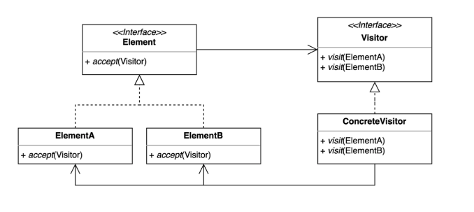

- Element : 방문자 패턴에서 방문자의 방문을 허용할 객체의 인터페이스 또는 추상클래스를 나타낸다. 주로 ‘accpet’ 메서드를 포함하며, 이 메서드는 방문자를 받아들인다.
- ConcreteElement :  실제로 방문자의 방문을 받아들이는 구현을 제공하며, Element 인터페이스를 구현하고 accept 메서드 내에서 자신을 방문자에게 전달한다.
- Visitor : Visitor는 Element를 방문하면서 수행할 작업을 정의하는 인터페이스 또는 추상클래스이다. Element의 각 구현에 대한 visit 메서드를 선언한다.
- ConcreteVisitor : Visitor를 구현하여 실제 작업을 수행한다. Visitor 인터페이스에서 정의된 각 visit 메서드를 구현한다.
- Client : Element와 Visitor를 생성하고 관리한다. Element에 대한 작업을 수행하려면 Visitor를 통해 호출해야 한다.

- SudoCode
    - 방문자 패턴을 사용하여 동물원의 동물들을 관리하는 예제
    
    ```java
    import java.util.ArrayList;
    import java.util.List;
    
    // 동물을 나타내는 Element 인터페이스
    interface Animal {
        void accept(AnimalVisitor visitor);
    }
    
    // 구체적 동물 클래스들
    class Lion implements Animal {
        @Override
        public void accept(AnimalVisitor visitor) {
            visitor.visitLion(this);
        }
    }
    
    class Elephant implements Animal {
        @Override
        public void accept(AnimalVisitor visitor) {
            visitor.visitElephant(this);
        }
    }
    
    // 동물에 대한 행위를 나타내는 Visitor 인터페이스
    interface AnimalVisitor {
        void visitLion(Lion lion);
        void visitElephant(Elephant elephant);
    }
    
    // 구체적인 행위를 수행하는 구체적인 Visitor 클래스
    class SoundVisitor implements AnimalVisitor {
        @Override
        public void visitLion(Lion lion) {
            System.out.println("The lion roars.");
        }
    
        @Override
        public void visitElephant(Elephant elephant) {
            System.out.println("The elephant trumpets.");
        }
    }
    
    // 동물들을 가지고 있는 객체 구조를 나타내는 클래스
    class Zoo {
        private List<Animal> animals = new ArrayList<>(); //동물들을 담기 위한 리스트
    
        public void addAnimal(Animal animal) {// 동물을 리스트에 추가한다. Animal을 받아서 리스트에 추가한다.
            animals.add(animal);
        }
       
    //주어진 AnimalVisitor를 통해 동물들을 방문하는 메서드
        public void accept(AnimalVisitor visitor) {
            for (Animal animal : animals) {
                animal.accept(visitor);
            }
        }
    }
    
    // 클라이언트 코드
    public class Main {
        public static void main(String[] args) {
            //동물원 생
            Zoo zoo = new Zoo();
    
            // 동물 추가
            zoo.addAnimal(new Lion());
            zoo.addAnimal(new Elephant());
    
            // 방문자 생성
            AnimalVisitor soundVisitor = new SoundVisitor();
    
            // 동물원을 방문자에게 열어주기
            zoo.accept(soundVisitor);
        }
    }
    
    ```