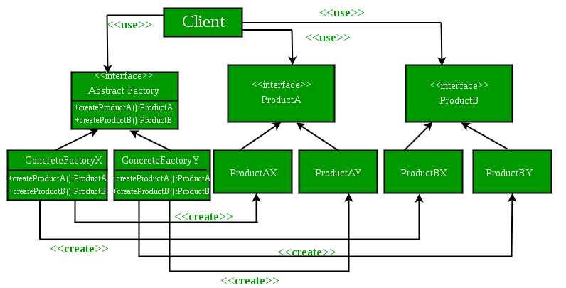

# Abstract Factory



# 정의

- Factory Pattern과 거의 유사하며 Factory Pattern에 대한 또 다른 추상화 계층으로 간주된다.
- Abstract Factory Pattern은 다른 Factory를 생성하는 슈퍼 Factory를 중심으로 작동한다.
- Abstract Factory Pattern 구현은 일반적인 패턴을 따르는 객체를 생성할 수 있는 프레임워크를 제공한다. 따라서 런타임 시 Abstract Factory는 원하는 유형의 객체를 생성할 수 있는 원하는 구체적인 Factory와 결합된다.
- Abstract Factory는 구체적인 클래스를 지정하지 않고 관련 객체 또는 종속 객체의 패밀리를 생성하기 위한 인터페이스를 제공한다.
- 서로 연관된, 또는 의존적인 객체들로 이루어진 제품군을 생성하기 위한 인터페이스를 제공한다.
- 이 때 구상 클래스는 서브 클래스에 의해 만들어진다.
- 객체 구성을 활용한다. 객체 생성이 Factory 인터페이스에서 선언한 method들에서 구현된다.

# 장점

- 클라이언트가 어떤 유형을 생성할지 정확히 알지 못할 때 특히 유용하다
    - 구체적인 클래스의 격리
        - Abstract Factory Pattern은 애플리케이션이 생성하는 객체의 클래스를 제어하는 데 도움이 된다.
        - Factory는 제품 객체를 생성하는 책임과 프로세스를 캡슐화 하기 때문에 클라이언트를 구현 클래스로부터 격리한다.
        - 클라이언트는 추상 인터페이스를 통해 인스턴스를 조작한다
        - 제품 클래스 이름은 구체적인 팩토리 구현에서 격리된다.
        - 클라이언트 코드에는 나타나지 않는다
    - 제품군을 쉽게 교환
        - 콘크리트 팩토리의 클래스는 인스턴스화되는 애플리케이션에서 한 번만 나타난다.
        - 이를 통해 애플리케이션이 사용하는 구체적인 팩토리를 쉽게 변경할 수 있다.
        - 콘크리트 공장을 변경하는 것만으로 다양한 제품 구성을 사용할 수 있다
        - 추상적인 공장은 완전한 제품군을 생성하기 때문에 전체 제품군이 한꺼번에 변경된다.
    - 제품 간의 일관성 증진
        - 제품군의 제품 개체가 함께 작동하도록 디자인 된 경우 응용 프로그램은 한 번에 한 제품군의 개체만 사용하는 것이 중요하다
        - AbstractFactory를 사용하여 이를 쉽게 적용할 수 있다.

# 단점

- 새로운 종류의 제품을 지원하기 어렵다
    - 새로운 종류의 제품을 생산하기 위해 Abstract Factory를 확장하는 것은 쉽지 않다.
    - Abstract Factory 인터페이스가 생성될 수 있는 제품 세트를 수정하기 때문이다
    - 새로운 종류의 제품을 지원하려면 Abstract Factory 클래스와 모든 하위 클래스를 변경 하는 팩토리 인터페이스 확장이 필요하다.

# Factory Method와 차이

- Factory Method는 단일 method이며, Abstract Factory는 객체이다.
- Factory Method는 서브 class에서 재정의 될 수 있는 method인 반면, Abstract Factory는 여러 Factory method가 있는 객체이다.
- Factory Method Pattern은 상속을 사용하고 서브 클래스를 사용하여 원하는 객체 인스턴스화를 처리한다.

# 구현

```java
// Java Program to demonstrate the 
// working of Abstract Factory Pattern
 
enum CarType
{
    MICRO, MINI, LUXURY
}
 
abstract class Car
{
    Car(CarType model, Location location)
    {
        this.model = model;
        this.location = location;
    }
  
    abstract void construct();
  
    CarType model = null;
    Location location = null;
  
    CarType getModel()
    {
        return model;
    }
  
    void setModel(CarType model)
    {
        this.model = model;
    }
  
    Location getLocation()
    {
        return location;
    }
  
    void setLocation(Location location)
    {
        this.location = location;
    }
  
    @Override
    public String toString()
    {
        return "CarModel - "+model + " located in "+location;
    }
}
 
class LuxuryCar extends Car
{
    LuxuryCar(Location location)
    {
        super(CarType.LUXURY, location);
        construct();
    }
    @Override
    protected void construct()
    {
        System.out.println("Connecting to luxury car");
    }
}
 
class MicroCar extends Car
{
    MicroCar(Location location)
    {
        super(CarType.MICRO, location);
        construct();
    }
    @Override
    protected void construct()
    {
        System.out.println("Connecting to Micro Car ");
    }
}
 
class MiniCar extends Car
{
    MiniCar(Location location)
    {
        super(CarType.MINI,location );
        construct();
    }
     
    @Override
    void construct()
    {
        System.out.println("Connecting to Mini car");
    }
}
 
enum Location
{
  DEFAULT, USA, INDIA
}
 
class INDIACarFactory
{
    static Car buildCar(CarType model)
    {
        Car car = null;
        switch (model)
        {
            case MICRO:
                car = new MicroCar(Location.INDIA);
                break;
             
            case MINI:
                car = new MiniCar(Location.INDIA);
                break;
                 
            case LUXURY:
                car = new LuxuryCar(Location.INDIA);
                break;
                 
                default:
                break;
             
        }
        return car;
    }
}
 
class DefaultCarFactory
{
    public static Car buildCar(CarType model)
    {
        Car car = null;
        switch (model)
        {
            case MICRO:
                car = new MicroCar(Location.DEFAULT);
                break;
             
            case MINI:
                car = new MiniCar(Location.DEFAULT);
                break;
                 
            case LUXURY:
                car = new LuxuryCar(Location.DEFAULT);
                break;
                 
                default:
                break;
             
        }
        return car;
    }
}
 
 
class USACarFactory
{
    public static Car buildCar(CarType model)
    {
        Car car = null;
        switch (model)
        {
            case MICRO:
                car = new MicroCar(Location.USA);
                break;
             
            case MINI:
                car = new MiniCar(Location.USA);
                break;
                 
            case LUXURY:
                car = new LuxuryCar(Location.USA);
                break;
                 
                default:
                break;
             
        }
        return car;
    }
}
 
 
 
class CarFactory
{
    private CarFactory() 
    {
         
    }
    public static Car buildCar(CarType type)
    {
        Car car = null;
        // We can add any GPS Function here which
        // read location property somewhere from configuration
        // and use location specific car factory
        // Currently I'm just using INDIA as Location
        Location location = Location.INDIA; 
         
        switch(location)
        {
            case USA:
                car = USACarFactory.buildCar(type);
                break;
                 
            case INDIA:
                car = INDIACarFactory.buildCar(type);
                break;
                     
            default:
                car = DefaultCarFactory.buildCar(type);
 
        }
         
        return car;
 
    }
}
 
class AbstractDesign 
{
    public static void main(String[] args)
    {
        System.out.println(CarFactory.buildCar(CarType.MICRO));
        System.out.println(CarFactory.buildCar(CarType.MINI));
        System.out.println(CarFactory.buildCar(CarType.LUXURY));
    }
}
```