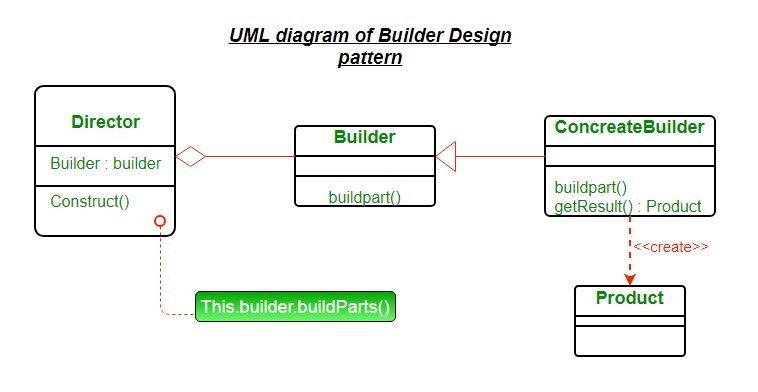

# Builder



# 정의

- 복잡한 객체를 생성하는 방법을 정의하는 클래스와 표현하는 방법을 정의하는 클래스를 별도로 분리하여, 서로 다른 표현이라도 이를 생성할 수 있는 동일한 절차를 제공하는 패턴.
    - 동일한 프로세스를 거쳐 다양한 구성의 인스턴스를 만든다.
- Builder Pattern은 생성해야 하는 객체가 Optional한 속성을 많이 가질 때 특히 유용하다.
- Builder Pattern은 객체를 생성할 때 Constructer만 사용할 때 발생할 수 있는 문제를 개선하기 위해 고안됐다.
    - 클라이언트 프로그램으로부터 Factory class로 많은 파라미터를 넘겨줄 때 타입, 순서 등에 대한 관리가 어려워져 에러가 발생할 확률이 높아진다
    - 경우에 따라 필요 없는 파라미터들에 대해서 Factory Class에 일일이 null값을 넘겨줘야 한다.
    - 생성해야 하는 sub class가 무거워지고 복잡해짐에 따라 Factory class 또한 복잡해진다.
- Builder Pattern은 이러한 문제를 해결하기 위해 별도의 Builder class를 만들어 필수 값에 대해서는 Constructer를 통해, 선택적인 값들에 대해서는 method를 통해 step-by-step으로 값을 입력 받은 후에 builder() 메소드를 통해 최종적으로 하나의 인스턴스를 return하는 방식이다.

# 장점과 단점

- 장점
    - 복합 객체가 생성되는 과정을 캡슐화한다.
    - 제품의 내부 구조를 클라이언트로부터 보호할 수 있다.
    - Constructer에 대한 매개변수가 줄어들고 읽기 쉬운 method 호출로 제공된다.
    - Builder Design pattern은 Constructer의 매개변수 수를 최소화하는 데도 도움이 되므로 선택적 매개변수에 대해 Constructer에 null을 전달할 필요가 없다
    - 객체는 항상 완전한 상태로 인스턴스화 된다.
    - 불변 객체는 객체 구축 과정에서 복잡한 로직 없이 구축될 수 있다
- 단점
    - Builder 패턴에서는 코드 줄 수가 늘어난다. 단, 그 노력은 디자인 유연성화 가독성 측면에서 보상을 받는다
    - 각기 다른 제품 유형에 대해 별도의 ConcreteBuilder를 생성해야 한다.

# 구현

```java
interface HousePlan 
{ 
    public void setBasement(String basement); 
  
    public void setStructure(String structure); 
  
    public void setRoof(String roof); 
  
    public void setInterior(String interior); 
} 
  
class House implements HousePlan 
{ 
  
    private String basement; 
    private String structure; 
    private String roof; 
    private String interior; 
  
    public void setBasement(String basement)  
    { 
        this.basement = basement; 
    } 
  
    public void setStructure(String structure)  
    { 
        this.structure = structure; 
    } 
  
    public void setRoof(String roof)  
    { 
        this.roof = roof; 
    } 
  
    public void setInterior(String interior)  
    { 
        this.interior = interior; 
    } 
  
} 
  
  
interface HouseBuilder 
{ 
  
    public void buildBasement(); 
  
    public void buildStructure(); 
  
    public void buildRoof(); 
  
    public void buildInterior(); 
  
    public House getHouse(); 
} 
  
class IglooHouseBuilder implements HouseBuilder 
{ 
    private House house; 
  
    public IglooHouseBuilder()  
    { 
        this.house = new House(); 
    } 
  
    public void buildBasement()  
    { 
        house.setBasement("Ice Bars"); 
    } 
  
    public void buildStructure()  
    { 
        house.setStructure("Ice Blocks"); 
    } 
  
    public void buildInterior()  
    { 
        house.setInterior("Ice Carvings"); 
    } 
  
    public void buildRoof()  
    { 
        house.setRoof("Ice Dome"); 
    } 
  
    public House getHouse()  
    { 
        return this.house; 
    } 
} 
  
class TipiHouseBuilder implements HouseBuilder 
{ 
    private House house; 
  
    public TipiHouseBuilder()  
    { 
        this.house = new House(); 
    } 
  
    public void buildBasement()  
    { 
        house.setBasement("Wooden Poles"); 
    } 
  
    public void buildStructure()  
    { 
        house.setStructure("Wood and Ice"); 
    } 
  
    public void buildInterior()  
    { 
        house.setInterior("Fire Wood"); 
    } 
  
    public void buildRoof()  
    { 
        house.setRoof("Wood, caribou and seal skins"); 
    } 
  
    public House getHouse()  
    { 
        return this.house; 
    } 
  
} 
  
class CivilEngineer  
{ 
  
    private HouseBuilder houseBuilder; 
  
    public CivilEngineer(HouseBuilder houseBuilder) 
    { 
        this.houseBuilder = houseBuilder; 
    } 
  
    public House getHouse() 
    { 
        return this.houseBuilder.getHouse(); 
    } 
  
    public void constructHouse() 
    { 
        this.houseBuilder.buildBasement(); 
        this.houseBuilder.buildStructure(); 
        this.houseBuilder.buildRoof(); 
        this.houseBuilder.buildInterior(); 
    } 
} 
  
class Builder 
{ 
    public static void main(String[] args) 
    { 
        HouseBuilder iglooBuilder = new IglooHouseBuilder(); 
        CivilEngineer engineer = new CivilEngineer(iglooBuilder); 
  
        engineer.constructHouse(); 
  
        House house = engineer.getHouse(); 
  
        System.out.println("Builder constructed: "+ house); 
    } 
}
```