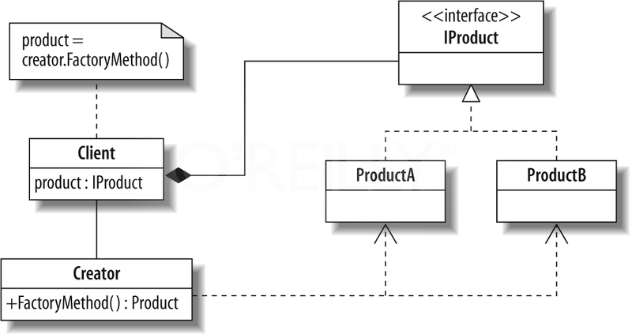
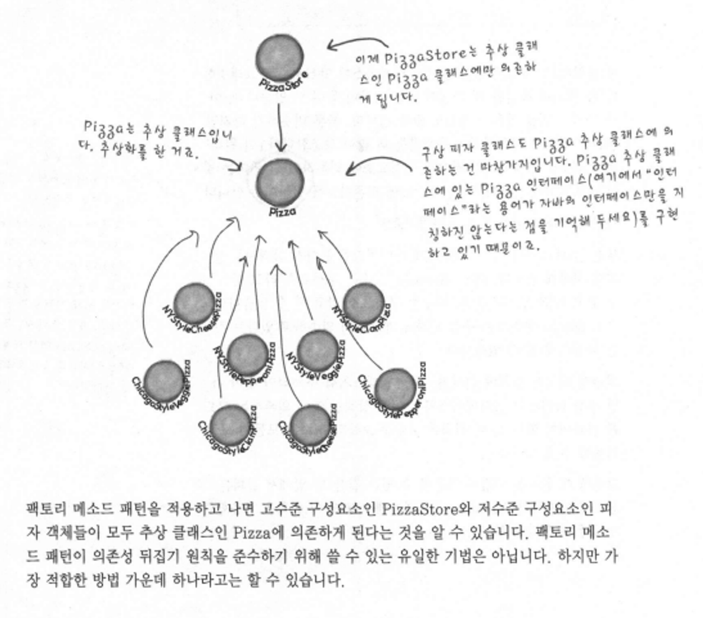

# Factory Method

<aside>
💡 GoF : 객체를 생성하기 위해 인터페이스를 정의하지만, 어떤 클래스의 인스턴스를 생성할지에 대한 결정은 서브클래스가 내리도록 한다.

</aside>

# 정의



- Factory Method 패턴에서는 객체를 생성하기 위한 인터페이스를 정의한다.
    - 단, 어떤 클래스의 인스턴스를 만들지는 서브 클래스에서 결정한다.
    - → 결정이라 함은 생산자 클래스 자체가 실제 생산될 제품에 대한 사전 지식이 전혀 없이 만들어지기 때문이다. 즉, 사용하는 서브클래스에 따라 생산되는 객체 인스턴스가 결정된다.
- 객체의 인스턴스를 만드는 작업이 항상 공개되어 있어야 하는 것은 아니다.
- ‘new’는 ‘구상 객체’를 의미한다. 즉, new를 사용하는 것은 구상 클래스의 인스턴스를 만드는 것이며, 인스턴스가 아닌 특정 구현을 사용하는 것이다.
- 객체 구성을 활용하면 행동을 실행 시에 동적으로 바꿀 수 있다. 이는 구현된 객체를 변경할 수 있기 때문이다.
- Factory Method는 객체 생성을 처리하며, Factory Method를 이용하면 객체를 생성하는 작업을 Sub-class에 캡슐화시킬 수 있다. 이렇게 하면 Super-class에 있는 클라이언트 코드와 서브 클래스에 있는 객체 생성 코드를 분리시킬 수 있다.
- 모든 Factory Pattern에서는 객체 생성을 캡슐화한다. Factory Method Patterm에서는 sub-class에서 어떤 class를 만들지 결정하게 함으로써 객체 생성을 캡슐화 한다.
- Factory Method와 생산자 class를 반드시 추상으로 선언해야 하는 것은 아니다. 기본 Factory method를 정의해도 되며, 그럴 경우 Creator의 sub-class를 만들지 않아도 가능하다.

# 장점



- 객체 생성 코드를 하나의 객체 또는 method에 집어 넣으면 중복되는 내용을 제거할 수 있다.
- 위의 방법으로 인해 유지보수성이 향상된다.
- 클라이언트 입장에서는 객체 인스턴스를 만들 때 필요한 구상 클래스가 아닌 인터페이스만 필요로 하게 된다. 이럴 경우, 구현이 아닌 인터페이스를 바탕으로 프로그래밍이 가능하며 이를 통해 유연성과 확장성이 증대된다.

# 구현

```java
// Java program to demonstrate factory method design pattern
 
enum VehicleType {
    VT_TwoWheeler,
    VT_ThreeWheeler,
    VT_FourWheeler
}
 
// Library Classes
abstract class Vehicle {
    abstract public void printVehicleInfo();
}
 
class TwoWheeler extends Vehicle {
    public void printVehicleInfo()
    {
        System.out.println("I am two wheeler");
    }
}
 
class ThreeWheeler extends Vehicle {
    public void printVehicleInfo()
    {
        System.out.println("I am three wheeler");
    }
}
 
class FourWheeler extends Vehicle {
    public void printVehicleInfo()
    {
        System.out.println("I am four wheeler");
    }
}
 
// Class Vehicle Factory with a single responsibility to
// construct Vehicles according to the clients requests.
// PS: This class can be extended to TwoWheelerFactory,
// ThreeWheelerFactory and so on.
 
// Class
class VehicleFactory {
 
    Vehicle build(VehicleType vehicleType)
    {
        if (VehicleType.VT_TwoWheeler.compareTo(vehicleType)
            == 0) {
            return new TwoWheeler();
        }
        else if (VehicleType.VT_ThreeWheeler.compareTo(
                     vehicleType)
                 == 0) {
            return new ThreeWheeler();
        }
        else if (VehicleType.VT_FourWheeler.compareTo(
                     vehicleType)
                 == 0) {
            return new FourWheeler();
        }
        return null;
    }
}
 
// Client class. The client object will ask the factory to
// build vehicles.
class Client {
 
    private Vehicle pVehicle;
 
    Client() { pVehicle = null; }
 
    void BuildVehicle(VehicleType vehicleType)
    {
        VehicleFactory vf = new VehicleFactory();
        pVehicle = vf.build(vehicleType);
    }
 
    Vehicle getVehicle() { return pVehicle; }
}
 
// Driver Program
public class GFG {
 
    // Main driver method
    public static void main(String[] args)
    {
        Client client = new Client();
        client.BuildVehicle(VehicleType.VT_TwoWheeler);
        client.getVehicle().printVehicleInfo();
 
        client.BuildVehicle(VehicleType.VT_ThreeWheeler);
        client.getVehicle().printVehicleInfo();
 
        client.BuildVehicle(VehicleType.VT_FourWheeler);
        client.getVehicle().printVehicleInfo();
    }
}
```