# 구조 패턴(Structural pattern)

---

# Design Pattern

- 디자인 패턴은 기본적으로 소프트웨어 디자인 및 개발 중에 발생하는 일반적인 문제에 대한 재사용 가능한 솔루션으로 정의된다.
- 이는 개발자가 잘 구조화되고 유지 관리 가능하며 효율적인 코드를 작성하도록 안내하는 일반적인 템플릿 또는 모범 사례이다.

## 유형

- 기본적으로 소프트웨어 개발에 일반적으로 사용되는 여러 유형의 디자인 패턴이 있다. 이러한 패턴은 세 가지 주요 그룹으로 분류될 수 있다.

### 1. Creational(생성)

- Singleton Pattern
- Factory Method Pattern
- Abstract Factory Pattern(추상 팩토리 패턴)
- Builder Pattern
- Prototype Pattern

### 2. Structural(구조)

- Adapter Method Design Patterns
- Bridge Method Design Patterns
- Composite Method Design Patterns(복합 방법 설계 패턴)
- Decorator Method Design Patterns
- Facade Method Design Patterns(외관 방법 디자인 패턴)
- Flyweight Method Design Patterns
- Proxy Method Design Patterns

### 3. Behavioral(행위)

- Observer Pattern(관찰자 패턴)
- Strategy Pattern(전략 패턴)
- Command Pattern(명령 패턴)
- Chain of Responsibility Pattern(책임 사슬 패턴)
- State Pattern(상태 패턴)
- Template Method Pattern(템플릿 메소드 패턴)
- Visitor Pattern(방문자 패턴)

- **사용 사례, 응용, 피해야 하는 경우 등**
    
    ## 사용 사례
    
    디자인 패턴은 소프트웨어 개발에 있어 귀중한 도구이며 다양한 이점과 용도를 제공한다.
    
    - **유지관리성 향상**
        - 디자인 패턴은 구조적이고 일관된 방식으로 코드를 구성하는 데 도움이 된다.
        - 이렇게 하면 코드베이스를 더 쉽게 유지 관리, 업데이트 및 확장할 수 있다.
        - 패턴에 익숙한 개발자는 코드를 빠르게 이해하고 작업할 수 있다.
    - **코드 재사용성 증진**
        - 디자인 패턴은 반복되는 디자인 문제에 대한 솔루션을 캡슐화한다.
        - 이러한 패턴을 사용하면 애플리케이션의 다양한 부분에서 발생하는 특정 문제를 해결하기 위한 재사용 가능한 템플릿을 만들 수 있다.
    - **복잡한 문제 단순화**
        - 복잡한 소프트웨어 문제는 디자인 패턴을 사용하여 더 작고 관리하기 쉬운 구성 요소로 나눌 수 있다.
        - 이렇게 하면 한 번에 하나의 문제를 해결하여 개발이 단순화되고 결과적으로 코드 유지 관리가 더욱 쉬워진다.
    - **확장성 개선**
        - 디자인 패턴, 특히 구조적 패턴을 사용하면 유연하고 확장 가능한 아키텍처를 생성하여 새로운 기능이나 구성 요소를 더 쉽게 추가할 수 있다.
    - **테스트 가능성 향상**
        - 패턴을 염두에 두고 설계된 코드는 모듈화되어 테스트하기 쉬운 경우가 많다.
        - 개별 구성 요소나 클래스에 대한 단위 테스트를 작성하여 보다 안정적이고 강력한 소프트웨어를 만들 수 있다.
    - **교차 플랫폼 개발 지원**
        - 디자인 패턴은 특정 프로그래밍 언어나 플랫폼에 묶여 있지 않는다.
        - 이는 다양한 기술에 적용할 수 있는 일반적인 지침으로, 다양한 환경에 코드를 더 쉽게 적용할 수 있도록 해준다.
    - **공동작업 강화**
        - 디자인 패턴은 팀 구성원 간에 공통 언어와 공유된 이해를 제공한다.
        - 이를 통해 개발자는 잘 알려진 디자인 솔루션을 참조하여 소프트웨어 프로젝트에서 효과적으로 소통하고 협업할 수 있다.
    
    ## 응용
    
    - 기본적으로 디자인 패턴은 소프트웨어 디자인에서 반복되는 문제에 대한 명확하고 효과적인 솔루션을 제공할 때 사용해야 한다.
    - 디자인 패턴을 사용할 수 있는 몇 가지 상황은 다음과 같다.
    - **협업**
        - 디자인 패턴은 공통 언어를 제공하고 특정 디자인 문제를 해결하는 방법에 대한 이해를 공유함으로써 협업을 촉진할 수 있다.
    - **반복되는 문제**
        - 여러 프로젝트에서 서로 다른 형태로 본 디자인 문제에 직면하거나 소프트웨어 개발에서 잘 알려져 있고 문서화된 문제인 경우, 디자인 패턴이 유용할 수 있다는 좋은 지표이다.
    - **유지관리성 및 확장성**
        - 시간이 지남에 따라 유지 관리, 확장 및 수정이 쉬운 코드를 생성하려는 경우 디자인 패턴은 문제 해결을 위한 구조화된 접근 방식을 제공함으로써 도움이 될 수 있다.
    - **교차 플랫폼 개발**
        - 다양한 플랫폼이나 다양한 기술로 작동하는 코드를 작성해야 할 때 디자인 패턴은 일반적인 문제를 해결하기 위해 플랫폼에 구애받지 않는 방법을 제공한다.
    - **테스트 및 디버깅**
        - 디자인 패턴을 사용하면 코드를 더욱 모듈화하고 테스트 가능하게 만들어 테스트 및 디버깅 프로세스를 개선할 수 있다.
    - **디자인 검토 및 계획**
        - 프로젝트의 디자인 및 계획 단계에서 예상되는 디자인 과제를 해결하기 위해 디자인 패턴 사용을 적극적으로 고려할 수 있다.
    
    ## 디자인 패턴의 사용을 피해야 하는 경우
    
    - **과도한 엔지니어링**
        - 단지 사용 목적만으로 디자인 패턴을 사용하지 말아야 한다.
        - 더 간단하고 간단한 솔루션으로 문제를 효과적으로 해결할 수 있다면 디자인 패턴을 선택하면 불필요한 복잡성이 발생할 수 있다.
    - **관련성 부족**
        - 디자인 패턴이 우리가 해결하려는 문제를 직접적으로 해결하지 못한다면 이를 코드에 강제로 적용하지 않는 것이 좋다.
    - **촉박한 기한**
        - 프로젝트 기한이 촉박한 경우 디자인 패턴을 구현하는 데 추가 시간을 투자하는 것은 실용적이지 않을 수 있다.
    - **오용**
        - 디자인 패턴을 잘못 적용하면 코드를 이해하고 유지 관리하기가 더 어려워질 수 있다. 패턴을 철저하게 이해하고 올바른 맥락에 적용하는 것이 중요하다.
    - **리소스 제약**
        - 내장형 시스템이나 성능이 중요한 애플리케이션과 같이 리소스가 제한된 환경에서는 디자인 패턴으로 인해 시스템 효율성에 영향을 미치는 오버헤드가 발생할 수 있다. 이러한 경우에는 보다 가벼운 솔루션을 고려해야 한다.
    - 일반적으로 디자인 패턴을 사용하거나 피하는 결정은 특정 상황, 해결하려는 문제, 디자인 패턴에 대한 팀의 기술 수준과 친숙도를 신중하게 고려하여 이루어져야 한다.
        
        

# 1. 정의

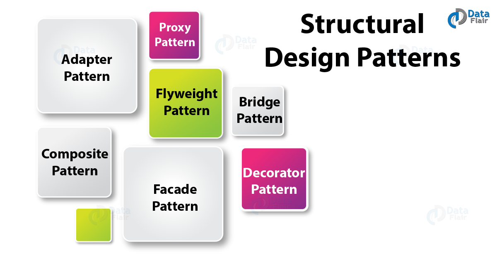

- 구조적 디자인 패턴은 클래스와 객체가 더 큰 구조를 형성하도록 구성되는 방식과 관련이 있다.
- 구조적 클래스 패턴은 상속을 사용하여 인터페이스나 구현을 구성한다.
- 예를 들어 서로 다른 인터페이스를 지닌 2개의 객체를 묶어 단일 인터페이스를 제공하거나 객체들을 서로 묶어 새로운 기능을 제공하는 패턴이다.
- 이 패턴을 사용하면 서로 독립적으로 개발한 클래스 라이브러리를 마치 하나인 것처럼 사용할 수 있다.
- 여러 인터페이스를 합성하여 서로 다른 인터페이스들의 통일된 추상을 제공한다.
- 가장 중요한 점은 인터페이스나 구현을 복합하는 것이 아니라 객체를 합성하는 방법을 제공한다는 것이다.

# 2. 유형

## 2-1. Adapter Pattern

- 정리
    
    <aside>
    💡 한 클래스의 인터페이스를 클라이언트에서 사용하고자 하는 다른 인터페이스로 변환한다.
    어댑터를 이용하면 인터페이스 호환성 문제 때문에 같이 쓸 수 없는 클래스들을 연결해서 쓸 수 있다.
    
    </aside>
    
    - 특정 유형의 객체를 기대하는 클래스(클라이언트)가 있고 동일한 기능을 제공하지만 다른 인터페이스를 노출하는 객체(Adaptee)가 있을 때 사용된다.
    - 호환되지 않는 인터페이스를 사용하는 클라이언트를 그대로 활용할 수 있다.
    - 이렇게 함으로써 클라이언트와 구현된 인터페이스를 분리시킬 수 있으며, 향후 인터페이스가 바뀌더라도 그 변경 내역은 어댑터에 캡슐화 되기 때문에 클라이언트는 바뀔 필요가 없어진다.
    - 어댑터 패턴은 클래스의 인터페이스를 클라이언트가 기대하는 다른 인터페이스로 변환한다. 어댑터를 사용하면 호환되지 않는 인터페이스로 인해 불가능했던 클래스가 함께 작동할 수 있다.
    - 인터페이스가 호환되지 않는 클래스들을 함께 이용할 수 있도록, 타 클래스의 인터페이스를 기존 인터페이스에 덧씌운다.
    
    - **어댑터**는 호환되지 않는 인터페이스를 가진 객체들이 협업할 수 있도록 하는 구조적 디자인 패턴이다.
    - 어댑터는 한 객체의 인터페이스를 다른 객체가 이해할 수 있도록 변환하는 특별한 객체이다.
    - 어댑터는 변환의 복잡성을 숨기기 위하여 객체 중 하나를 래핑(포장)한다. 래핑된 객체는 어댑터를 인식하지도 못한다.
        - 예를 들어 미터 및 킬로미터 단위로 작동하는 객체를 모든 데이터를 피트 및 마일과 같은 영국식 단위로 변환하는 어댑터로 래핑할 수 있다.
    - 어댑터는 데이터를 다양한 형식으로 변환할 수 있을 뿐만 아니라 다른 인터페이스를 가진 객체들이 협업하는 데에도 도움을 줄 수 있으며, 대략 다음과 같이 작동한다.
        1. 어댑터는 기존에 있던 객체 중 하나와 호환되는 인터페이스를 받는다.
        2. 이 인터페이스를 사용하면 기존 객체는 어댑터의 메서드들을 안전하게 호출할 수 있다.
        3. 호출을 수신하면 어댑터는 이 요청을 두 번째 객체에 해당 객체가 예상하는 형식과 순서대로 전달한다.
    
    ### 1. 구조
    
    ### 1-1. 객체 어댑터
    
    - 이 구현은 객체 합성 원칙을 사용한다. 어댑터는 한 객체의 인터페이스를 구현하고 다른 객체는 래핑한다. 위 합성은 모든 인기 있는 프로그래밍 언어로 구현할 수 있다.
    
    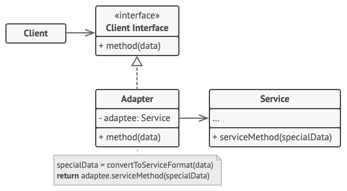
    
    - 1. **클라이언트**는 프로그램의 기존 비즈니스 로직을 포함하는 클래스이다.
    - 2. **클라이언트 인터페이스**는 다른 클래스들이 클라이언트 코드와 공동 작업할 수 있도록 따라야 하는 프로토콜을 뜻한다.
    - 3. **서비스**는 일반적으로 타사 또는 레거시의 유용한 클래스를 뜻한다. 클라이언트는 서비스 클래스를 직접 사용할 수 없다. 왜냐하면 서비스 클래스는 호환되지 않는 인터페이스를 가지고 있기 때문이다.
    - 4. **어댑터**는 클라이언트와 서비스 양쪽에서 작동할 수 있는 클래스로, 서비스 객체를 래핑하는 동안 클라이언트 인터페이스를 구현한다. 어댑터는 어댑터 인터페이스를 통해 클라이언트로부터 호출들을 수신한 후 이 호출을 래핑된 서비스 객체가 이해할 수 있는 형식의 호출들로 변환한다.
    - 5. 클라이언트 코드는 클라이언트 인터페이스를 통해 어댑터와 작동하는 한 구상 어댑터 클래스와 결합하지 않는다.
        - 덕분에 기존 클라이언트 코드를 손상하지 않고 새로운 유형의 어댑터들을 프로그램에 도입할 수 있다.
        - 이것은 서비스 클래스의 인터페이스가 변경되거나 교체될 때 유용할 수 있다: 클라이언트 코드를 변경하지 않은 채 새 어댑터 클래스를 생성할 수 있다.
    
    ### 1-2. 클래스 어댑터
    
    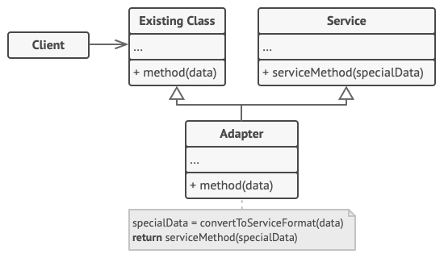
    
    - 이 구현은 상속을 사용하며, 어댑터는 동시에 두 객체의 인터페이스를 상속한다.
    - 이 방식은 C++ 와 같이 다중 상속을 지원하는 프로그래밍 언어에서만 구현할 수 있다.
    - **클래스 어댑터**는 객체를 래핑할 필요가 없다. 그 이유는 클라이언트와 서비스 양쪽에서 행동들을 상속받기 때문이다.
        - 위의 어댑테이션(적용)은 오버라이딩된 메서드 내에서 발생한다. 위 어댑터는 기존 클라이언트 클래스 대신 사용할 수 있다.
- 호환성이 없는 인터페이스 때문에 함께 동작할 수 없는 클래스들이 함께 작동하도록 해주는 패턴이 어댑터 패턴이다.
- 이를 위해 어댑터 역할을 하는 클래스를 새로 만들어야 한다.
- 기존에 있는 시스템에 새로운 써드파티 라이브러리가 추가된다든지, 레거시 인터페이스를 새로운 인터페이스로 교체하는 경우에 코드의 재사용성을 높일 수 있는 방법이 어댑터 패턴을 사용하는 것이다.

### 장점

1. 관계가 없는 인터페이스 간 같이 사용 가능
2. 프로그램 검사 용이
3. 클래스 재활용성 증가

### 구조

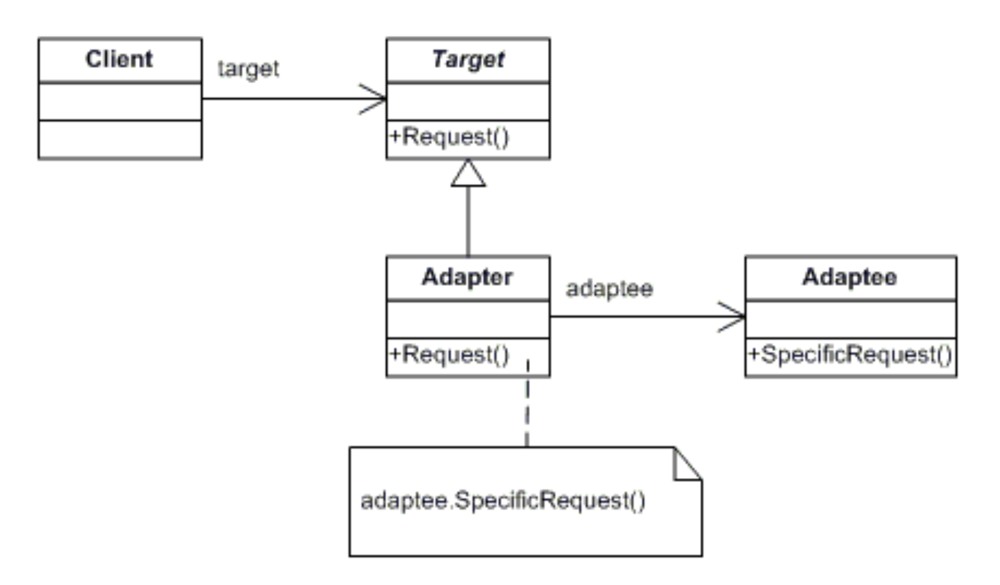

1. **Client** 
    
     써드파티 라이브러리나 외부시스템을 사용하려는 쪽이다.
    
    <aside>
    💡 **Third Party**
    
    기본적으로 '제3자'를 뜻하는 단어. 이 제3자가 어떤 분야의 제3자를 의미하는지에 따라 의미가 나뉜다. 대체로는 제조자와 사용자 이외 외부의 생산자를 가리키는 뜻으로 쓰인다.
    
    </aside>
    
2. **Adaptee** 
    
    써드파티 라이브러리나 외부시스템을 의미한다.
    
3. **Target Interface** 
    
    Adapter 가 구현(implements) 하는 인터페이스이다.
    
    클라이언트는 Target Interface 를 통해 Adaptee 인 써드파티 라이브러리를 사용하게 된다.
    
4. **Adapter**
    
    Client 와 Adaptee 중간에서 호환성이 없는 둘을 연결시켜주는 역할을 담당한다.
    
    Target Interface 를 구현하며, 클라이언트는 Target Interface 를 통해 어댑터에 요청을 보낸다.
    
    어댑터는 클라이언트의 요청을 Adaptee 가 이해할 수 있는 방법으로 전달하고 처리는 Adaptee 에서 이루어진다.
    

### 호출 과정

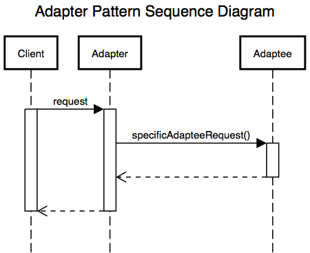

- 클라이언트에서는 Target Interface 를 호출하는 것 처럼 보인다.
- 하지만 클라이언트의 요청을 전달받은 (Target Interface 를 구현한) Adapter 는 자신이 감싸고 있는 Adaptee 에게 실질적인 처리를 위임한다.
- Adapter 가 Adaptee 를 감싸고 있는 것 때문에 Wrapper 패턴이라고도 불린다.

### 예제 코드

```java
//Duck Interface
public interface Duck {
    public void quack();
    public void fly();
}

//MallardDuck Class
public class MallardDuck implements Duck {
    @Override
    public void quack() {
        System.out.println("Quack");
    }

    @Override
    public void fly() {
        System.out.println("I'm flying");
    }
}

//Turkey Interface
public interface Turkey {
    public void gobble();
    public void fly();
}

//WildTurkey Class
public class WildTurkey implements Turkey{
    @Override
    public void gobble() {
        System.out.println("Gobble gobble");
    }

    @Override
    public void fly() {
        System.out.println("I'm flying a short distance");
    }
}
```

- Duck 객체가 모자라서 Turkey 객체를 대신 사용해야 하는 상황이라고 해보자.
- 인터페이스가 다르기 때문에 Turkey객체를 바로 사용할 수는 없다.
- 어댑터를 만들어 보자.

```java
//TurkeyAdapter : Adapter
public class TurkeyAdapter implements Duck {

    Turkey turkey;

    public TurkeyAdapter(Turkey turkey) {
        this.turkey = turkey;
    }

    @Override
    public void quack(){
        turkey.gobble();
    }

    @Override
    public void fly() {
        turkey.fly();
    }
}
```

- Main Class
    
    ```java
    public class TurkeyAdapterTest {
    
        public static void main(String[] args) {
    
            MallardDuck duck = new MallardDuck();
    
            WildTurkey turkey = new WildTurkey();
    
            Duck turkeyAdapter = new TurkeyAdapter(turkey);
    
            System.out.println("The turkey says...");
            turkey.gobble();
            turkey.fly();
    
            System.out.println("The Duck says...");
            testDuck(duck);
    
            System.out.println("The TurkeyAdapter says...");
            testDuck(turkeyAdapter);
        }
    
        public static void testDuck(Duck duck){
            duck.quack();
            duck.fly();
        }
    }
    ```
    
- 결과
    - turkeyAdapter을 통해 Duck 객체를 생성할 수 있다.
        
        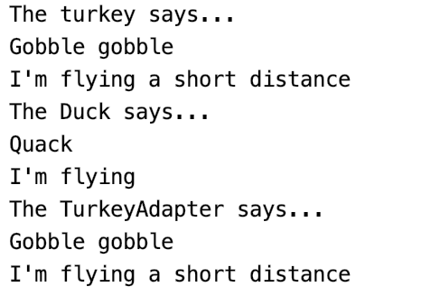
        

## 2-2. Bridge Pattern(브리지 패턴)

- 구현부에서 추상층을 분리하여 각자 독립적으로 변형할 수 있게 하는 패턴이다.
- 즉, 추상적 개념과 구체적 구현을 서로 다른 두개의 인터페이스로 구현하는 디자인 패턴이다.
- 브릿지 패턴은 캡슐화(encapsulation), 집합(aggregation)을 사용하고 또한 다른 클래스들로 책임을 분리시키기 위해 상속(inheritance)를 사용할 수 있다.

### 장점

1. 인터페이스와 구현이 분리된다.
2. 서로 독립적으로 확장할 수 있다.
3. 구현 세부사항을 클라이언트에게 은닉하여 캡슐화를 지킬 수 있다.

### 구조

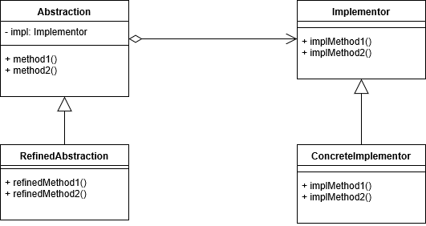

1. **Abstraction**
    
    기능 계층의 최상위 클래스이며 추상 인터페이스를 정의한다.
    
    Implementor에 대한 레퍼런스를 유지한다.
    
    구현 부분에 해당하는 클래스를 인스턴스를 가지고 해당 인스턴스를 통해 구현부분의 메서드를 호출한다.
    
2. **RefinedAbstraction**
    
    Abstraction에 의해 정의된 인터페이스를 확장한다.(extends)
    
    기능 계층에서 새로운 부분을 확장한 클래스이다.
    
3. **Implementor**
    
    구현 클래스를 위한 인터페이스를 정의한다.
    
    Abstraction의 기능을 구현하기 위한 인터페이스 정의한다.
    
4. **ConcreteImplementor**
    
    Implementor 인터페이스를 구현 즉, 실제 기능을 구현한다.
    

### 예제 코드

```java
//Color : Implementor
public interface Color {
    public void applyColor();
}

//Shape : Abstraction
public abstract class Shape {

    //Composition
    protected Color color;

    //constructor with implementor as input argument
    public Shape(Color c){
        this.color=c;
    }

    abstract public void applyColor();
}

//Triangle : RefinedAbstraction
public class Triangle extends Shape {

    public Triangle(Color c) {
        super(c);
    }

    @Override
    public void applyColor() {
        System.out.print("Triangle filled with color ");
        color.applyColor();
    }

}
//Pentagon : RefinedAbstraction
public class Pentagon extends Shape {

    public Pentagon(Color c) {
        super(c);
    }

    @Override
    public void applyColor() {
        System.out.print("Pentagon filled with color ");
        color.applyColor();
    }

}

//RedColor : ConcreteImplementor
public class RedColor implements Color{

    public void applyColor(){
        System.out.println("red.");
    }
}

//GreenColor : ConcreteImplementor
public class GreenColor implements Color{

    public void applyColor(){
        System.out.println("green.");
    }
}
```

- Main Class
    
    ```java
    public class ShapeMain {
        public static void main(String[] args) {
            Shape tri = new Triangle(new RedColor());
            tri.applyColor();
    
            Shape pent = new Pentagon(new GreenColor());
            pent.applyColor();
        }
    }
    ```
    
    - 결과
        
        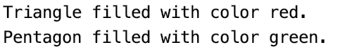
        

## 2-3. Composite Pattern(합성 패턴)

- 객체들의 관계를 트리 구조로 구성하여 전체-부분 계층을 표현하는 패턴으로 여러 개의 객체들로 구성된 복합 객체와 단일 객체를 클라이언트에서 구별 없이 다루게 한다.
- 즉, 전체-부분의 관계(Ex. Directory-File)를 갖는 객체들 사이의 관계를 정의할 때 유용하다.
- 또한 클라이언트는 전체와 부분을 구분하지 않고 동일한 인터페이스를 사용할 수 있다.

### 구조

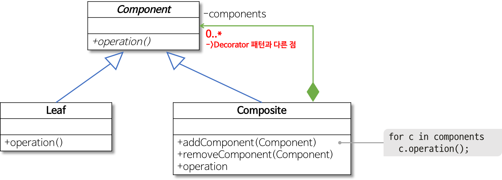

1. **Component**
    
    Leaf와 Composite를 같은 타입으로 취급하기 위한 인터페이스.
    
    Leaf 클래스와 전체에 해당하는 Composite 클래스에 공통 인터페이스를 정의한다.
    
2. **Leaf**
    
    구체적인 부분 클래스로 단일 객체를 표현한다.
    
    그룹의 구성원 역할을 하며 트리구조로 따지면 가장 밑단에 존재하는 나뭇잎 역할을 한다고 보면 된다.
    
3. **Composite**
    
    복합 객체 그룹을 표현할 클래스로 전체 클래스이다.
    
    자식으로 여러개의 Component 타입 멤버를 수용할 수 있도록 구현되어야 한다.
    

### 예제 코드

```java
//Shape Interface : Component
public interface Shape {
    public void draw(String color);
}

//Triangle / Circle / Line : Leaf
public class Triangle implements Shape {
    @Override
    public void draw(String color) {
        System.out.println("triangle color: " + color);
    }
}
public class Circle implements Shape {
    @Override
    public void draw(String color) {
        System.out.println("circle color: " + color);
    }
}
public class Line implements Shape {
    @Override
    public void draw(String color) {
        System.out.println("line color: " + color);
    }
}

//Drawing : Composite
public class Drawing implements Shape {
    private List<Shape> shapes = new ArrayList<Shape>();

    @Override
    public void draw(String color) {
        for (Shape sh : shapes) {
            sh.draw(color);
        }
    }

    // 아래서부터는 헬퍼 성격의 메소드이다. 추가/제거/전체제거
    public void add (Shape s) {
        this.shapes.add(s);
    }

    public void remove (Shape s) {
        this.shapes.remove(s);
    }

    public void clear () {
        this.shapes.clear();
    }
}
```

- Composite 클래스 역시 Component를 구현하여 interface를 leaf과 똑같이 한다는 점이다.
- Main Class
    
    ```java
    public class DrawingMain {
        public static void main(String[] args) {
            Shape t1 = new Triangle();
            Shape t2 = new Triangle();
            Shape c1 = new Circle();
            Shape l1 = new Line();
    
            Drawing drawing = new Drawing();
            drawing.add(t1);
            drawing.add(t2);
            drawing.add(c1);
            drawing.add(l1);
            drawing.draw("red");
    
            drawing.clear();
    
            drawing.add(t2);
            drawing.add(c1);
            drawing.draw("blue");
        }
    }
    ```
    
- 결과
    
    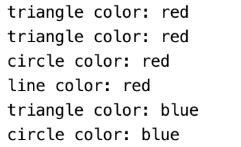
    

## 2-4. Decorator Pattern(데코레이터 패턴)

- 객체의 결합을 통해 기능을 동적으로 유연하게 확장 할 수 있게 해주는 패턴.
- 객체에 추가적인 요건을 동적으로 첨가하며 기능 확장이 필요할 때 서브클래싱 대신 쓸 수 있는 유연한 대안이 될 수 있다.
    
    <aside>
    💡 **서브클래싱, 서브타이핑**
    
    서브클래싱은 구현되어 있는 클래스를 상속하는 것
    서브타이핑은 정의되어 있는 인터페이스를 구현하는 것
    
    </aside>
    
- 즉, 기본 기능에 추가할 수 있는 기능의 종류가 많은 경우에 각 추가 기능을 Decorator 클래스로 정의 한 후 필요한 Decorator 객체를 조합함으로써 추가 기능의 조합을 설계 하는 방식이다.
    - 기존 객체의 매서드에 새로운 행동을 추가하거나 오버라이드 할 수 있다.

### 구조


1. **Component**
    
    ConcreteComponent 과 Decorator가 구현할 인터페이스다.
    
    두 객체를 동등하게 다루기 위해 존재한다.
    
2. **ConcreteComponent**
    
    Decorate를 받을 객체다.
    
    즉, 기능 추가를 받을 기본 객체이다.
    
3. **Decorator**
    
    Decorate를 할 객체의 추상 클래스다.
    
    즉, 기능 추가를 할 객체는 이 객체를 상속받는다.
    
4. **ConcreteDecorator**
    
    Decorator를 상속받아 구현할 다양한 기능 객체이다.
    
    이 기능들은 ConcreteComponent에 추가되기 위해 만들어 진다.
    

### 예제 코드

```java
//ChristmasTree : Component
public interface ChristmasTree {
    String decorate();
}
DefaultChristmasTree : ConcreteComponent

public class DefaultChristmasTree implements ChristmasTree {
    @Override
    public String decorate() {
        return "Christmas tree";
    }
}

//TreeDecorator : Decorator
abstract class TreeDecorator implements ChristmasTree {
    private ChristmasTree christmasTree;

    public TreeDecorator(ChristmasTree christmasTree) {
        this.christmasTree = christmasTree;
    }

    @Override
    public String decorate() {
        return christmasTree.decorate();
    }
}

//Lights : ConcreteDecorator
class Lights extends TreeDecorator {

    public Lights(ChristmasTree christmasTree) {
        super(christmasTree); // 여기가 포인트.
    }

    public String addLights() {
        return " with Lights";
    }

    @Override
    public String decorate() {
        return super.decorate() + addLights(); // 여기가 포인트.
    }
}

//Flowers : ConcreteDecorator
public class Flowers extends TreeDecorator {

    public Flowers(ChristmasTree christmasTree) {
        super(christmasTree);
    }

    public String addFlowers() {
        return " with Flowers";
    }

    @Override
    public String decorate() {
        return super.decorate() + addFlowers();
    }
}
```

- Main Class
    
    ```java
    public class ChristmasTreeMain {
    
        public static void main(String[] args) {
        
            // Christmas tree
            ChristmasTree tree = new DefaultChristmasTree();
            System.out.println(tree.decorate());
    
            // Christmas tree + Lights
            ChristmasTree treeWithLights = new Lights(
                    new DefaultChristmasTree()
            );
            
            System.out.println(treeWithLights.decorate());
    
            // Christmas tree + Lights + Flowers
            ChristmasTree treeWithLightsAndFlowers = new Flowers(
                    new Lights(
                            new DefaultChristmasTree()
                    )
            );
            
            System.out.println(treeWithLightsAndFlowers.decorate());
        }
    }
    ```
    
- 결과
    
    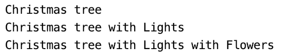
    
- 기본 객체인 new DefaultChristmasTree() 에 기능 추가를 new Lights(new DefaultChristmasTree()); 와 같이 동적인 방식으로 하고 있다.
- 이게 가능한 이유는?
    - Decorator 객체의 생성자로 Component를 받음으로써 Decorator를 이어 붙일 수가 있고 super를 통해 넘어오는 Component 의 operation(decorate()) 을 먼저 수행하기 때문이다.
    - 추가적인 장식을 만들고 싶으면 TreeDecorator 를 상속받아 위와 같은 꼴로 하나 더 구현하면 된다.
    - 즉, 새로운 기능을 유연하게 만들고 추가할 수 있다.

## 2-5. Facade Pattern(퍼사드 패턴)

- 많은 분량의 코드에 접근할 수 있는 단순한 인터페이스를 제공한다.
- Facade (외관)는 "건물의 정면"을 의미하는 단어로 어떤 소프트웨어의 다른 커다란 코드 부분에 대하여 간략화된 인터페이스를 제공해주는 디자인 패턴을 의미한다.
- 퍼사드 객체는 복잡한 소프트웨어 바깥쪽의 코드가 라이브러리의 안쪽 코드에 의존하는 일을 감소시켜 주고 복잡한 소프트웨어를 사용 할 수 있게 간단한 인터페이스를 제공해준다.

### 장점

1. 퍼사드는 소프트웨어 라이브러리를 쉽게 사용할 수 있게 해준다.
2. 퍼사드는 공통적인 작업에 대해 간편한 메소드들을 제공해준다.
3. 퍼사드는 라이브러리를 사용하는 코드들을 좀 더 읽기 쉽게 해준다.
4. 퍼사드는 라이브러리 바깥쪽의 코드가 라이브러리의 안쪽 코드에 의존하는 일을 감소시켜준다.
    
    대부분의 바깥쪽의 코드가 퍼사드를 이용하기 때문에 시스템을 개발하는 데 있어 유연성이 향상된다.
    
5. 퍼사드는 좋게 작성되지 않은 API의 집합을 하나의 좋게 작성된 API로 감싸준다.

### 구조

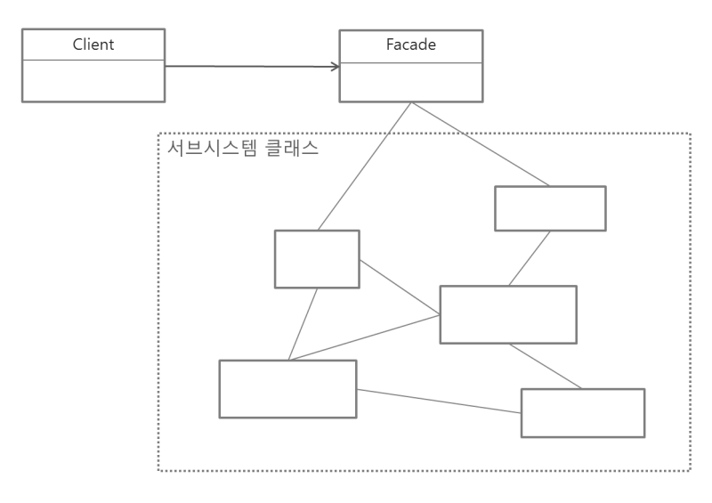

1. **Facade**
    
    퍼사드 클래스는 패키지 및 그 밖의 응용 프로그램 코드와 상호 동작한다.
    
2. **Client**
    
    패키지 내의 리소스들을 접근하기 위해 퍼사드 클래스를 쓰는 객체들이다.
    
3. **Package (SubSystem Class)**
    
    소프트웨어 라이브러리 / API 집합이다. 퍼사드 클래스를 통해 접근된다.
    

### 예제 코드

```java
//Remote_Control : SubSystem Class 중 하나
public class Remote_Control {
    public void Turn_On() {
        System.out.println("TV를 켜다");
    }

    public void Turn_Off() {
        System.out.println("TV를 끄다");
    }
}

//Movie : SubSystem Class 중 하나
public class Movie {

    private String name = "";

    public Movie(String name) {
        this.name = name;
    }

    public void Search_Movie() {
        System.out.println(name + " 영화를 찾다");
    }

    public void Charge_Movie() {
        System.out.println("영화를 결제하다");
    }

    public void play_Movie() {
        System.out.println("영화 재생");
    }
}

//Beverage : SubSystem Class 중 하나
public class Beverage {

    private String name = "";

    public Beverage(String name) {
        this.name = name;
    }

    public void Prepare() {
        System.out.println(name + " 음료 준비 완료 ");
    }

}
```

- Facade
    - 가장 중요한 클래스
    - 복잡한 서브 클래스들에 대한 인스턴스를 가지며 복잡한 호출 방식에 대하여 view_Movie() 메서드내에서 구현한다.
    
    ```java
    public class Facade {
    
        private String beverage_Name = "";
        private String Movie_Name = "";
    
        public Facade(String beverage_Name, String Movie_Name) {
            this.beverage_Name = beverage_Name;
            this.Movie_Name = Movie_Name;
        }
    
        public void view_Movie() {
            Beverage beverage = new Beverage(beverage_Name);
            Remote_Control remote = new Remote_Control();
            Movie movie = new Movie(Movie_Name);
    
            beverage.Prepare();
            remote.Turn_On();
            movie.Search_Movie();
            movie.Charge_Movie();
            movie.play_Movie();
        }
    }
    ```
    
- Main Class
    
    ```java
    public class FacadeMain {
        public static void main(String[] args) {
            Facade facade = new Facade("콜라","어벤져스");
            facade.view_Movie();
        }
    }
    ```
    
- 결과
    
    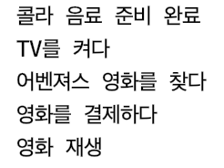
    

## 2-6. Flyweight Pattern(플라이웨이트 패턴)

- 어떤 클래스의 인스턴스 한 개만 가지고 여러 개의 "가상 인스턴스"를 제공하고 싶을 때 사용하는 패턴이다.
- 즉, 인스턴스를 가능한 대로 공유시켜 쓸데없이 new 연산자를 통한 메모리 낭비를 줄이는 방식이다.
- 주로 생성된 객체 수를 줄이고 메모리 사용 공간을 줄이며 성능을 향상시키는 데 사용되며, 이러한 유형의 디자인 패턴은 오브젝트 패턴을 감소시켜 어플리케이션에 필요한 오브젝트 구조를 향상시킨다.

### 플라이웨이트 패턴 적용이 적합한 경우

1. 어플리케이션에 의해 생성되는 객체의 수가 많아야 한다.
2. 생성된 객체가 오래도록 메모리에 상주하며 사용되는 횟수가 많다.
3. 객체의 특성을 내적 속성(Intrinsic Properties)과 외적 속성(Extrinsic Properties)으로 나눴을 때, 객체의 외적 특성이 클라이언트 프로그램으로부터 정의되어야 한다.
    
    <aside>
    💡 **내적 속성, 외적 속성**
    
    - 객체의 **내적 속성**은 객체를 유니크하게 하는 것이고,
    - **외적 속성**은 클라이언트의 코드로부터 설정되어 다른 동작을 수행하도록 사용되는 특성이다.
    - 예를 들어, Circle 이라는 객체는 color와 width라는 외적 속성을 가질 수 있다.
    </aside>
    

### 구조

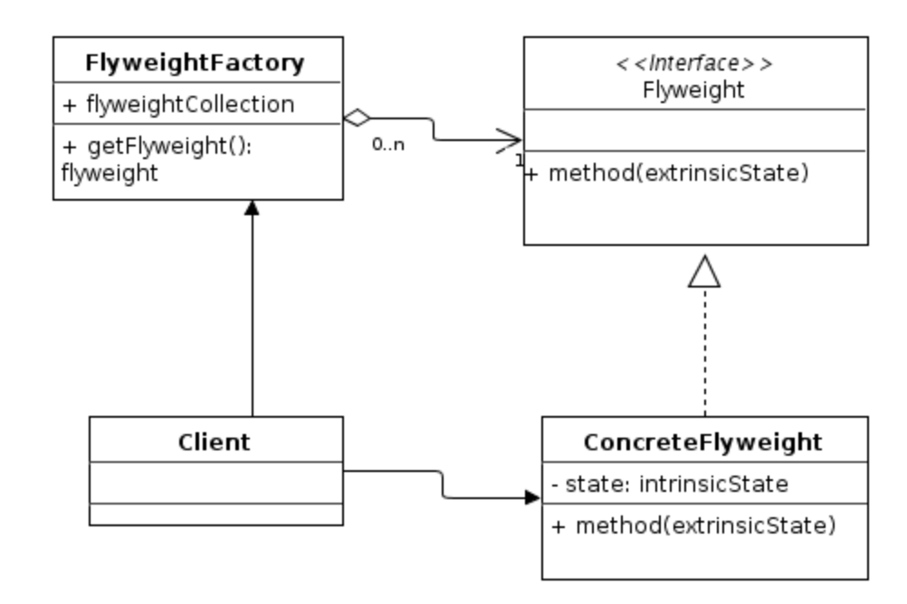

1. **Flyweight**
    
    공유에 사용할 클래스들의 인터페이스(API)를 선언한다.
    
2. **ConcreteFlyweight**
    
    Flyweight의 내용을 정의하며, 실제 공유될 객체이다.
    
3. **FlyweightFactory**
    
    Flyweight의 인스턴스를 생성 또는 공유해주는 역할이다.
    

### 예제 코드

```java
//Shape : Flyweight
public interface Shape {
    void draw();
}

//Circle : ConcreteFlyweight
public class Circle implements Shape {
    private String color;
    private int x;
    private int y;
    private int radius;

    public Circle(String color){
        this.color = color;
    }

    public void setX(int x) {
        this.x = x;
    }

    public void setY(int y) {
        this.y = y;
    }

    public void setRadius(int radius) {
        this.radius = radius;
    }

    @Override
    public void draw() {
        System.out.println("Circle: Draw() [Color : " + color + ", x : " + x + ", y :" + y + ", radius :" + radius);
    }
}

//ShapeFactory : FlyWeightFactory
public class ShapeFactory {
    private static final HashMap<String, Shape> circleMap = new HashMap();

    public static Shape getCircle(String color) {
        Circle circle = (Circle) circleMap.get(color);

        if (circle == null) {
            circle = new Circle(color);
            circleMap.put(color, circle);
            System.out.println("Creating circle of color : " + color);
        }
        return circle;
    }
}
```

- Main Class
    
    ```java
    public class CircleMain {
        private static final String colors[] = {"Red", "Green", "Blue", "White", "Black"};
    
        public static void main(String[] args) {
    
            for (int i = 0; i < 20; ++i) {
                Circle circle = (Circle) ShapeFactory.getCircle(getRandomColor());
                circle.setX(getRandomX());
                circle.setY(getRandomY());
                circle.setRadius(100);
                circle.draw();
            }
        }
    
        private static String getRandomColor() {
            return colors[(int) (Math.random() * colors.length)];
        }
    
        private static int getRandomX() {
            return (int) (Math.random() * 100);
        }
    
        private static int getRandomY() {
            return (int) (Math.random() * 100);
        }
    }
    ```
    
- 결과
    
    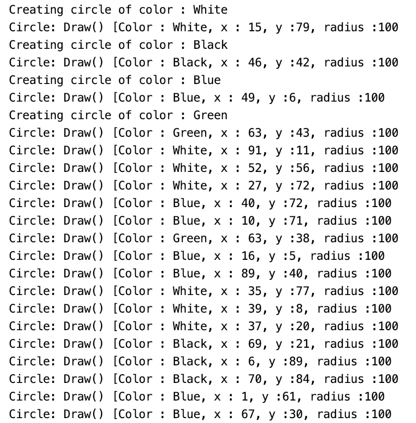
    
    - 20개의 다른 위치의 원을 그리기 위해서 20개의 객체를 생성하지 않고 플라이웨이트 패턴을 활용하여 5개의 객체만 만든다.
    - 이미 존재하는 비슷한 종류의 객체를 저장하여 재사용을 시도하고 일치하는 객체가 발견되지 않으면 새로운 객체를 만든다.
    - 5가지 색상만 사용할 수 있으므로 기존 Circle 객체를 확인하는 데 color 속성이 사용된다.

## 2-7. Proxy Pattern(프록시 패턴)

- 접근 조절, 비용 절감, 복잡도 감소를 위해 접근이 힘든 객체에 대한 대역을 제공한다.
- 실제 기능을 수행하는 객체(Real Object) 대신 가상의 객체(Proxy Object)를 사용해 로직의 흐름을 제어하는 디자인 패턴이다.
- 프록시 패턴을 사용하는 경우는 어떤 클래스의 객체 생성이 오래 걸리는 경우 그 일을 분업을 하여 proxy 클래스에서 처리 할 수 있는 부분은 처리를 하고 proxy 클래스에서 처리 할 수 없는 작업에 대해서만 실제 클래스의 객체를 생성하고 위임하는 방식을 취한다.
- RealSubject가 원격 시스템에서 돌아가거나 그 객체의 생성 비용이 많이 들어 실제 사용 시점에 객체를 생성하거나 실제 객체에 접근을 제한 및 제어를 해야 할 때 등 의 경우에 사용된다.

### 특징

1. 원래 하려던 기능을 수행하며 그 외의 부가적인 작업(로깅, 인증, 네트워크 통신 등)을 수행할 수 있다.
2. 비용이 많이 드는 연산(DB 쿼리, 대용량 텍스트 파일 등)을 실제로 필요한 시점에 수행할 수 있다.
3. 실제 객체의 리소스가 무거운 경우, 프록시 객체에서 간단한 처리를 하거나 기본 객체를 캐싱 처리함으로써 부하를 줄일 수 있다.
    
    <aside>
    💡 **캐싱**
    파일 복사본을 캐시 또는 임시 저장 위치에 저장하여 보다 빠르게 액세스할 수 있도록 하는 프로세스
    
    </aside>
    
4. 실제 객체에 대한 수정 없이 클라이언트에서의 사용과 기본 객체 사이에 일련의 로직을 프록시 객체를 통해 넣을 수 있다.
5. 프록시는 기본 객체와 요청 사이에 있기 때문에 일종의 방패(보안)의 역할도 한다.
6. 사용자 입장에서는 프록시 객체나 실제 객체나 사용법이 유사하므로 구조나 코드 구현이 간단하다.

### 종류

1. 원격 프록시 : 원격 객체에 대한 접근 제어가 가능하다.
2. 가상 프록시 (Virtual Proxy) : 객체의 생성비용이 많이 들어 미리 생성하기 힘든 객체에 대한 접근 및 생성시점 등을 제어한다.
3. 보호 프록시 (Protection Proxy) : 객체에 따른 접근 권한을 제어해야하는 객체에 대한 접근을 제어한다.
4. 방화벽 프록시 : 일련의 네트워크 자원에 대한 접근을 제어함으로써 주 객체를 '나쁜' 클라이언트들로부터 보호한다.
5. 스마트 레퍼런스 프록시 (Smart Reference Proxy) : 주 객체가 참조될 때마다 추가 행동을 제공한다.
    
    ex) 객체 참조에 대한 선 작업, 후 작업 등
    
6. 캐싱 프록시 (Caching Proxy) : 비용이 많이 드는 작업의 결과를 임시로 저장 하고, 추후 여러 클라이언트에 저장된 결과를 실제 작업처리 대신 보여주고 자원을 절약한다.
7. 동기화 프록시 (Synchronization Proxy) : 여러 스레드에서 주 객체에 접근하는 경우에 안전하게 작업을 처리한다. 주로 분산 환경에서 일련의 객체에 대한 동기화 된 접근을 제어해주는 자바 스페이스에서 사용된다.
8. 복잡도 숨김 프록시 (Complexity Hiding Proxy) : 복잡한 클래스들의 집합에 대한 접근을 제어하고, 복잡도를 숨긴다.
9. 지연 복사 프록시 (Copy-On-Write Proxy) : 클라이언트에서 필요로 할 때까지 객체가 복사되는 것을 지연시킴으로써 객체의 복사를 제어한다.
    
    '변형된 가상 프록시'라고 할 수 있으며, Java 5 의 CopyOnWriteArrayList에서 쓰인다.
    

### 구조

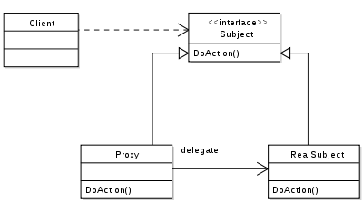

1. **Subject**
    
    Proxy 와 RealSubject가 구현해야 하는 인터페이스.
    
    두 객체를 동일하게 다루기 위해 존재한다.
    
2. **Proxy**
    
    RealSubect 와 Client 요청 사이에 존재하는 객체.
    
    Subject를 구현함으로써 클라이언트는 RealSubject 사용하는 것과 별 차이가 없어야 한다.
    
3. **RealSubject**
    
    실질적으로 요청에 대해 주된 기능을 수행하는 객체.
    
    Proxy 객체는 내부적으로 이 객체를 로직에 맞게 사용한다. (위임)
    

### 예제 코드

```java
//Subject : Subject
public interface Subject {
    void showName();

    void setName(String name);

    void complicatedWork();
}

//SubjectProxy : Proxy
public class SubjectProxy implements Subject {

    public RealSubject subject;
    public String name;

    public void setName(String name) {
        System.out.println("proxy가 대신해서 처리 할 수 있어요.");
        if (subject != null) {
            subject.setName(name);
        }
        this.name = name;
    }

    public void showName() {
        System.out.println("proxy가 대신해서 처리 할 수 있어요.");
        System.out.println("my name is " + name);
    }

    public void complicatedWork() {
        subject = new RealSubject();
        subject.complicatedWork();
    }
}

//RealSubject : RealSubject
public class RealSubject implements Subject {

    private String name;

    public void setName(String name) {
        this.name = name;
    }

    public void showName() {
        System.out.println("my name is " + name);
    }

    public void complicatedWork() {
        System.out.println("proxy가 처리 못하는 작업을 수행합니다.");
    }
}
```

- Main Class
    
    ```java
    public class SubjectMain {
        public static void main(String args[]) {
            SubjectProxy proxy1 = new SubjectProxy();
    
            proxy1.setName("김하영");
            System.out.println("================");
    
            proxy1.showName();
            System.out.println("================");
    
            proxy1.complicatedWork();
        }
    }
    ```
    
- 결과
    
    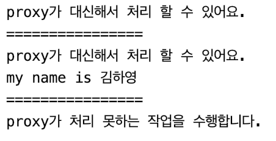
    
    - SubjectProxy에서 setName()과 showName() 메서드를 RealSubject가 처리하는게 아니라 Proxy가 처리한다.
    - complicatedWork() 메서드는 Proxy가 처리 할 수 없는 작업으로 처리 요청이 들어 올 때 비로소 RealSubject의 인스턴스가 생성된다.

**참고>** 

[Design Pattern : 구조 패턴(Structural Patterns)](https://velog.io/@ha0kim/Design-Pattern-구조-패턴Structural-Patterns)

[디자인패턴 - 구조 패턴](https://velog.io/@coconenne/디자인패턴-구조-패턴)

[Design Pattern | Adapter Pattern (아답터 패턴)](https://www.devkuma.com/docs/design-pattern/adapter/)

[어댑터 패턴](https://refactoring.guru/ko/design-patterns/adapter)