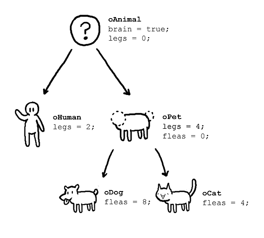
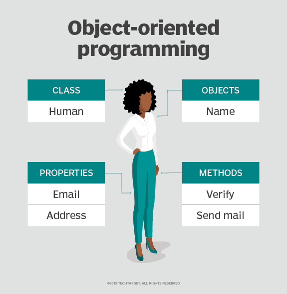
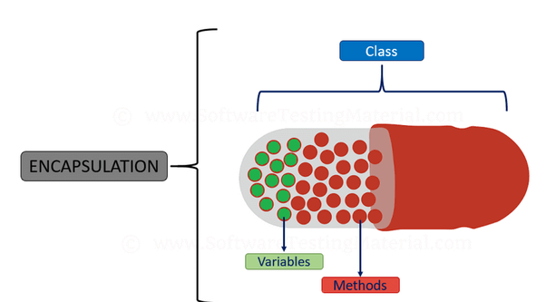
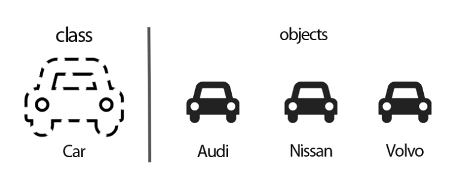

# 객체지향 프로그래밍

---

# 1. 정의

- 객체 지향 프로그래밍(OOP)은 기능과 논리보다는 데이터 또는 객체를 중심으로 소프트웨어 설계를 구성하는 컴퓨터 프로그래밍 모델이다.
    - 객체는 고유한 속성과 동작을 갖는 데이터 필드로 정의될 수 있다.
- 프로그래밍에서 필요한 데이터를 추상화 시켜 `상태와 행위를 가진 객체`로 만들고, 객체들간의 상호작용을 통해 로직을 구성하는 프로그래밍 방법이다.
- 객체는 프로그램에서 사용되는 데이터 또는 식별자에 의해 참조되는 공간을 의미하며 값을 저장 할 `변수`와 작업을 수행 할 `메소드`를 서로 연관된 것들끼리 묶어서 만든 것을 객체라고 할 수 있다.
- 객체지향 프로그래밍을 레고에 빗대 표현 할 수 있는데, `객체`가 레고의 조각이 될 것이고 레고의 조각을 조립해서 무언가를 만드는 방식이 객체지향 프로그래밍이라고 할 수 있다.
- 객체는 또한 레고 조각과도 비슷하게 여러군데에서 재사용 할 수 있는데 이는 `부품화` 와 `재사용성` 이라는 객체 지향 프로그래밍의 특징을 보여주기도 한다.
- 객체지향 프로그래밍을 지원하는 언어로는 `C++ , C# , Java , Python , JavaScript , Ruby , Swift` 등이 있다.

# 2. 구조

- **클래스**
    - 개별 객체, 속성 및 메소드에 대한 청사진 역할을 하는 사용자 정의 데이터 유형
- **객체**
    - 구체적으로 정의된 데이터로 생성된 클래스의 인스턴스이다.
    - 객체는 실제 객체 또는 추상 엔터티에 해당할 수 있다.
    - 클래스가 처음 정의되면 설명만 정의된다.
- **속성**
    - 클래스 템플릿에 정의되며 객체의 상태를 나타낸다.
    - 객체는 속성 필드에 데이터를 저장한다.
    - 클래스 속성은 클래스 자체에 속한다.
- **메소드**
    - 객체의 동작을 설명하는 클래스 내부에 정의된 함수다.
    - 클래스 정의에 포함된 각 메서드는 인스턴스 개체에 대한 참조로 시작된다.
    - 또한 객체에 포함된 서브루틴을 인스턴스 메서드라고 한다.
    - 프로그래머는 재사용성을 위해 방법을 사용하거나 한 번에 하나의 객체 내에 기능을 캡슐화한다.

# 3. 주요 원칙

## 3-1. **캡슐화**

- 데이터 구조와 데이터를 다루는 방법들을 결합 시켜 묶는 것 (변수와 함수를 하나로 묶는 것)
    - 속성과 기능을 정의하는 변수와 메소드를 클래스라는 캡슐에 넣어서 분류하는 것으로 재활용이 원활하다.
- 각 객체의 구현과 상태는 정의된 클래스 내에 개인적으로 보관된다. 다른 개체에는 이 클래스에 대한 액세스 권한이나 변경 권한이 없다. (정보은닉)
    - 모든 중요한 정보가 객체 내부에 포함되고 선택된 정보만 노출된다.
    - 공개 함수나 메서드 목록만 호출할 수 있다. 이러한 데이터 숨김 특성은 프로그램 보안을 강화하고 의도하지 않은 데이터 손상을 방지한다.

## 3-2. **추상화**

- 객체는 다른 객체의 사용과 관련된 내부 메커니즘만 공개하고 불필요한 구현 코드는 숨긴다. → 프로그램을 간단하게 만든다.
    - 객체에서 공통된 속성과 행위를 추출 하는 것
    - 공통의 속성과 행위를 찾아서 타입을 정의하는 과정
- 파생 클래스의 기능이 확장될 수 있다.
- 이 개념은 개발자가 시간이 지남에 따라 추가 변경이나 추가를 더 쉽게 수행하는 데 도움이 될 수 있다.

- 아우디, 니싼, 볼보는 모두 '자동차'에 해당된다. 자동차라는 추상화 집합을 만들어두고 자동차들이 가진 공통적인 특징들을 만들어서 활용한다.
- '현대'와 같은 다른 자동차 브랜드가 추가될 수도 있다. 이때 추상화로 '자동차'를 구현 해놓으면 다른 곳의 코드를 수정할 필요 없이 추가로 만들 부분만 새로 생성해주면 된다.

## 3-3. **상속**

- 클래스의 속성과 행위를 하위 클래스에 물려주거나 하위 클래스가 상위 클래스의 속성과 행위를 물려받는 것을 말한다.
- 개체 간의 관계와 하위 클래스를 할당할 수 있으므로 개발자는 고유한 계층 구조를 유지하면서 공통 논리를 재사용할 수 있다.
- OOP의 이러한 속성은 보다 철저한 데이터 분석을 강제하고 개발 시간을 단축하며 더 높은 수준의 정확성을 보장한다.
    
    ### 장점
    
    - 재사용으로 인한 코드가 줄어든다.
    - 범용적인 사용이 가능하다.
    - 자료와 메서드의 자유로운 사용 및 추가가 가능하다.
    
    ### 단점
    
    - 상위 클래스의 변경이 어려워진다.
    - 불필요한 클래스가 증가할 수 있다.
    - 상속이 잘못 사용될 수 있다.

## 3-4. **다형성**

- 객체는 동작을 공유하도록 설계되었으며 둘 이상의 형태를 취할 수 있다.
    - 하나의 변수명, 함수명이 상황에 따라 다른 의미로 해석 될 수 있다.
- 프로그램은 상위 클래스에서 해당 객체를 실행할 때마다 어떤 의미나 사용법이 필요한지 결정하여 코드를 복제할 필요성을 줄인다. 그런 다음 상위 클래스의 기능을 확장하는 하위 클래스가 생성된다.
- 다형성을 통해 다양한 유형의 객체가 동일한 인터페이스를 통과할 수 있다.
    
    ### **오버라이딩**
    
    - 상위 클래스가 가지고 있는 메소드를 하위 클래스가 재정의해서 사용하는 것
    
    ### **오버로딩**
    
    - 같은 이름의 메서드가 인자의 개수나 자료형에 따라 다른 기능을 하는 것

# 4. 장단점

## 4-1. 장점

- **모듈성**
    - 캡슐화를 사용하면 객체를 독립적으로 사용할 수 있으므로 문제 해결 및 공동 개발이 더 쉬워진다.
- **재사용성**
    - 코드는 상속을 통해 재사용할 수 있다.
    - 즉, 팀이 동일한 코드를 여러 번 작성할 필요가 없다.
- **생산력**
    - 프로그래머는 여러 라이브러리와 재사용 가능한 코드를 사용하여 새로운 프로그램을 더 빠르게 구성할 수 있다.
- **쉽게 업그레이드하고 확장할 수 있다**
    - 프로그래머는 시스템 기능을 독립적으로 구현할 수 있다.
- **인터페이스 설명**
    - 객체 통신에 사용되는 메시지 전달 기술로 인해 외부 시스템에 대한 설명은 간단하다.
- **보안**
    - 캡슐화 및 추상화를 사용하면 복잡한 코드가 숨겨지고 소프트웨어 유지 관리가 더 쉬워지며 인터넷 프로토콜이 보호된다.
- **유연성**
    - 다형성을 통해 단일 함수는 자신이 배치된 클래스에 적응할 수 있다.
    - 다른 객체도 동일한 인터페이스를 통과할 수 있다.

## 4-2. 단점.

- 작성하기가 더 복잡하고 컴파일하는 데 시간이 더 오래 걸릴 수 있다.
- 설계 시 많은 시간과 노력이 필요하게 될 수 있다.
- 객체의 수가 많아짐에 따라 용량이 커질 수 있다.

# 5. **SOLID (객체 지향 설계 원칙)**

- 객체 지향적으로 설계하기 위해 `SOLID` 라 불리는 다섯 가지 원칙이 있다.
- SOLID 원리는 긴밀한 결합을 줄이는 데 도움이 된다. 긴밀한 결합은 클래스 그룹이 서로 크게 의존한다는 것을 의미하므로 코드에서 피해야 한다.
- 긴밀한 결합의 반대는 느슨한 결합이며, 느슨하게 결합된 클래스가 있는 코드는 좋은 코드로 간주된다. 느슨하게 결합된 클래스는 코드 변경을 최소화하고 코드를 더 재사용 가능하고 유지 관리 가능하며 유연하고 안정적으로 만드는 데 도움이 된다.

## 5-**1. 단일 책임 원칙 (SRP, Single Responsibility Principle)**

- 하나의 클래스는 단 하나의 책임 또는 목적만 가져야 한다.
- 단일 책임 원칙을 지키지 않을 경우 한 책임의 변경에 의해 다른 책임과 관련된 코드에 영향이 갈 수 있다.

## 5-**2. 개방-폐쇄 원칙 (OCP, Open/Closed Principle)**

- 소프트웨어 요소(클래스, 모듈, 기능 등)는 확장에는 열려 있으나 변경에는 닫혀 있어야 한다.
- 기능을 변경하거나 확장할 수 있으면서 기능을 사용하는 코드는 수정하지 않는다.
- 이 원칙을 사용하면 기존 코드와 수정된 코드가 분리되므로 코드에서와 같이 안정성과 유지 관리성이 향상되고 변경이 최소화됩니다.

## 5-**3. 리스코프 치환 원칙 (LSP, Liskov Substitution Principle)**

- 파생 클래스 또는 하위 클래스는 기본 클래스 또는 상위 클래스를 대체할 수 있어야 합니다
    - 프로그램 객체는 프로그램의 정확성을 깨뜨리지 않으면서 하위 타입의 인스턴스로 바꿀 수 있어야 한다.
    - 부모 클래스의 자식 클래스가 예상치 못한 동작 없이 부모 대신 사용될 수 있도록 보장한다.
- 상위 타입의 객체를 하위 타입의 객체로 치환해도, 상위 타입을 사용하는 프로그램은 정상적으로 동작해야 한다.

## 5-**4. 인터페이스 분리 원칙 (ISP, Interface Segregation Principle)**

- 범용 인터페이스 하나보다 클라이언트를 위한 여러 개의 인터페이스로 구성하는 것이 좋다.
- 인터페이스는 인터페이스를 사용하는 클라이언트를 기준으로 분리해야 한다.
- 클라이언트가 필요로 하는 인터페이스로 분리함으로써 각 클라이언트가 사용하지 않는 인터페이스에 변경이 있어도 영향을 받지 않도록 만들어야 한다.

## 5-**5. 의존관계 역전 원칙 (DIP), Dependency Inversion Principle)**

- 상위 수준 모듈/클래스는 하위 수준 모듈/클래스의 구현에 의존해서는 안된다.
    - 하위 수준 모듈은 상위 수준 모듈에서 정의한 추상 타입에 의존해야 한다.
    - 단순히 높은 모듈이나 클래스가 낮은 수준의 모듈이나 클래스에 더 많이 의존하는 경우, 코드가 긴밀한 결합을 갖게 되며 한 클래스를 변경하려고 하면 위험한 다른 클래스가 중단될 수 있다.
- 추상화에 의존해야지 구체화에 의존하면 안된다. 구체화는 추상화에 따라 달라진다.

참고> 

[What is Object-Oriented Programming (OOP)?](https://www.techtarget.com/searchapparchitecture/definition/object-oriented-programming-OOP)

[객체지향 프로그래밍이란?](https://jongminfire.dev/객체지향-프로그래밍이란)

[SOLID Principle in Programming: Understand With Real Life Examples - GeeksforGeeks](https://www.geeksforgeeks.org/solid-principle-in-programming-understand-with-real-life-examples/)