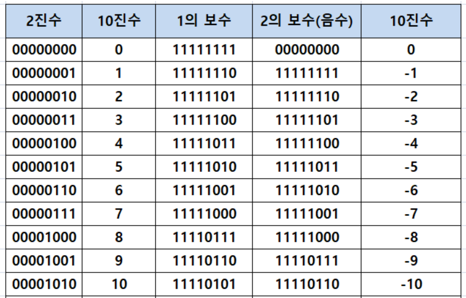
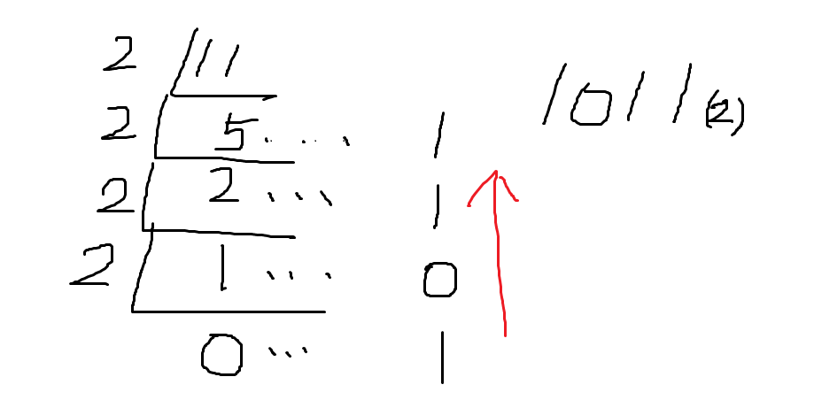
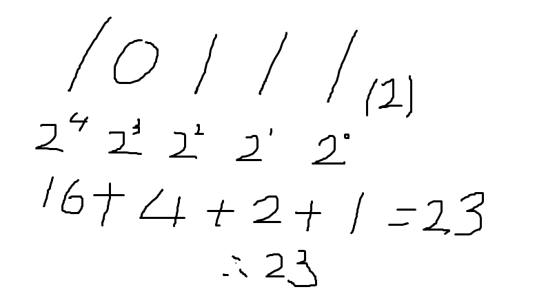
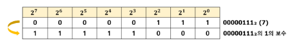
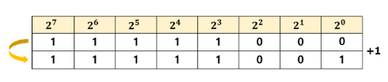
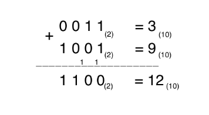

# Binary/Complement

---

# 1. 이진법(**Binary System**)

- 이진법은 컴퓨터에서 숫자를 표현하는 데 사용되는 기본적인 방법이며, 보수는 음수를 표현하거나 연산하는 데 사용된다.
- 이진법은 0과 1 두 개의 숫자만을 사용하여 숫자를 표현하는 방식이다. 컴퓨터에서는 전기 신호의 ON과 OFF 상태로 표현되는 이진 시스템을 기반으로 동작한다. 이진법의 가장 작은 단위는 비트(bit)이며, 여러 비트를 조합하여 숫자나 문자 등을 표현할 수 있다.
- 컴퓨터 상에서는 각각의 자리를 [비트](https://ko.wikipedia.org/wiki/%EB%B9%84%ED%8A%B8_(%EB%8B%A8%EC%9C%84))라고 부르며, 각각의 비트는 켜져있거나 꺼져있는 두 가지 상태로 표시된다.
- 예를 들어, 8비트 이진수 "11010101"는 10진수로 213을 나타낸다.
- [컴퓨터](https://ko.wikipedia.org/wiki/%EC%BB%B4%ED%93%A8%ED%84%B0)에서는 논리의 조립이 간단하고 내부에 사용되는 소자의 특성상 이진법이 편리하기 때문에 이진법을 사용한다. [디지털](https://ko.wikipedia.org/wiki/%EB%94%94%EC%A7%80%ED%84%B8) 신호는 기본적으로 이진법 수들의 나열이며, 컴퓨터 내부에서 처리하는 숫자는 기본적으로 이진법을 이용하기 때문에 컴퓨터가 널리 쓰이는 현대에는 그 중요성이 더 커졌다.

## 1-1. 이진법 변환 방법과 십진법 변환 방법

- 1 → 존재한다 / 0 → 존재하지 않는다.
- int의 범위 = 2의 31승 -1 이므로 2의 31승까지 쓴다.
    
    
    | 2의 0제곱 =1  |
    | --- |
    | 2의 1제곱 = 2 |
    | 2의 2제곱 = 4 |
    | 2의 3제곱 = 8 |
    | 2의 4제곱 = 16 |
    | 2의 5제곱 = 32 |
    | 2의 6제곱 = 64 |
    | 2의 7제곱 = 128 |
- **연습문제 1)**
    
    <aside>
    💡  **11을 이진법으로 표현하여라.**
    
    
    
    몫이 0이 될 때까지 2로 나눈 다음, 아래에서부터 위로 올라온다.
    
    </aside>
    

- **연습문제 2)**
    
    <aside>
    💡  **10111(2)를 십진법으로 표현하여라.**
    
    
    
    존재한다(1), 존재하지 않는다(0)를 이용하여 2의 제곱으로 나타낸 다음, 1로 표현되어 있는 부분을 더한다.
    
    </aside>
    

# 2. **보수(Complement)**

- 보충을 해주는 수를 의미한다. 현재의 숫자에서 자릿수가 1단계 올라갈 수 있는 수가 몇인지를 구하면 된다.
- 보수는 음수를 표현하거나 연산하기 위해 사용되는 방식으로, 기본적으로는 어떤 값의 보수는 그 값과 더했을 때 특정한 결과를 만들어내는 값이다.
    
    **1) 1의 보수(Ones' Complement)**
    
    - 어떤 이진수의 1의 보수는 해당 수의 모든 비트를 반전시킨 값이다. 0은 1로, 1은 0으로 바뀐다.
    - 음수의 표현에 주로 사용된다. 양수와 음수 간의 덧셈과 뺄셈에 사용될 수 있다.
    
    **2) 2의 보수(Two's Complement)**
    
    - 어떤 이진수의 2의 보수는 해당 수의 1의 보수에 1을 더한 값이다.
    - 2의 보수는 음수를 표현하는 가장 효율적인 방법으로 사용된다. 뺄셈을 덧셈으로 처리할 수 있고, 오버플로우 상황을 다루기 쉽다.
    - 컴퓨터에서 대부분의 경우 음수는 2의 보수로 표현된다.
- 예를 들어, 4비트 이진수 "0101"의 1의 보수는 "1010"이 되며, 2의 보수는 "1011"이다. 이는 -5를 나타낸다. 이진수의 보수를 사용하여 음수와 양수를 효율적으로 표현하고 연산하는 것은 컴퓨터의 연산과정에서 중요한 역할을 한다.

- **예시)**
    
    <aside>
    💡
    
    1의 보수 : 1 + 9 = 10 이므로, 1에 대한 10의 보수는 9
    
    3의 보수 : 3 + 7 = 10 이므로, 3에 대한 10의 보수는 7
    
    </aside>
    

## 1-1. 보수가 필요한 이유

- 컴퓨터는 이진수만 이해할 수 있다. (0과 1) 그렇다면 음수는 어떻게 표현할 수 있을까? 바로 보수가 사용된다는 것이다. 컴퓨터에서 보수는 양수를 음수로 표현하는 방법이 된다.
- 컴퓨터의 CPU는 뺄셈도 모두 덧셈으로 처리한다. 보수를 사용하게 되면 5-5=0의 과정을 컴퓨터는 5+(-5)=0으로 표현되게 하는 것이다.

## 1-2. 보수 계산법

<aside>
💡 **1의 보수 구하기**

- 10진수로는 7이고 이진수로는 00000111(2)의 보수를 구한다.
- 1의 보수를 구하는 법은 굉장히 간단하다. 7의 이진수(00000111(2))를 1을 0으로, 0을 1으로 뒤집으면 된다.
</aside>

<aside>
💡 **2의 보수 구하기**

앞에서 7의 이진수(11111000(2))에 1을 더해주면 된다.

- 2의 보수가 음수인 이유
    
    7의 이진수인 00000111과 2의 보수인 11111001을 더했더니 10000000(2)가 나온다. 여기서 최상위 부호(맨 왼쪽 비트)를 제외했더니 0이 된다. 00000111에서 11111001을 뺀 값이 되었다. 그러므로 00000111의 2의 보수가 00000111의 음수가 되는 것이다.
    
    **그러므로 뺄셈 연산을 하려면 2의 보수를 구하면 되는 것이다.**
    
</aside>

<aside>
💡 **c.f) 이진수의 덧셈 방법**

- 10진법에서 10이 넘어가면 1을 넘겨주는 것과 같은 방법으로, 2가 넘어가면 앞으로 1을 넘겨준다.
</aside>

<aside>
💡 부동소수점: [실수](https://ko.wikipedia.org/wiki/%EC%8B%A4%EC%88%98)를 컴퓨터상에서 근사하여 표현할 때 소수점의 위치를 고정하지 않고 그 위치를 나타내는 수를 따로 적는 것으로, [유효숫자](https://ko.wikipedia.org/wiki/%EC%9C%A0%ED%9A%A8%EC%88%AB%EC%9E%90)를 나타내는 가수(假數)와 소수점의 위치를 풀이하는 지수(指數)로 나누어 표현한다.

</aside>