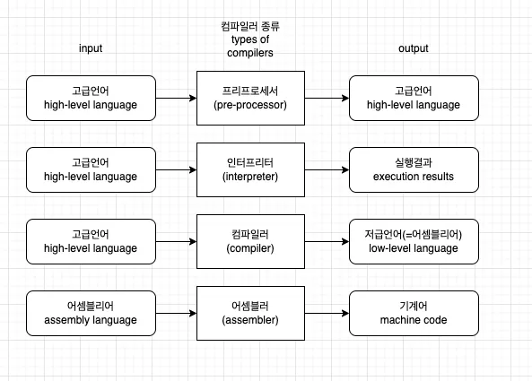
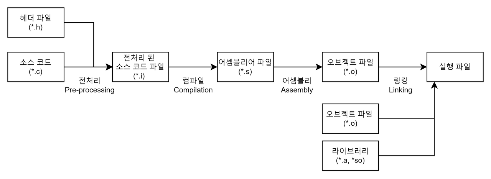
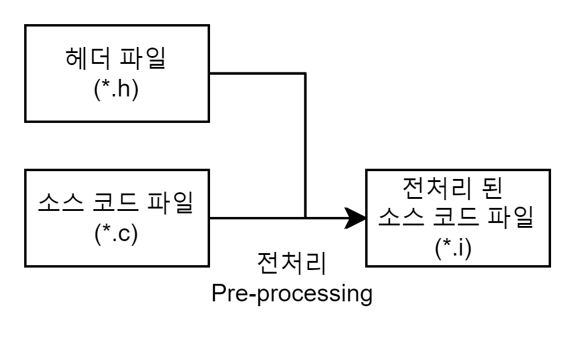

# Compiler

---

# **1. 개념**

- 컴파일은 인간이 이해할 수 있는 언어로 작성된 소스 코드(고수준 언어 : C, C++, Java 등)를 CPU가 이해할 수 있는 언어(저수준 언어 : 기계어)로 번역(변환)하는 작업을 말한다.
- 컴퓨터는 0과 1 밖에 모른다. 그런데 사람이 00110101 이렇게 코딩을 하긴 매우 어렵다. 그래서 *프로그래밍 언어*라는 것을 만들어서 사람이 이해할 수 있는 방법으로 개발을 하게 만들었다.
- 우리가 흔히 *고급언어*라고 부르는 Python, Java, JavaScript 등등은 영어와 매우 흡사해서 사람이 코딩을 할 수 있게 해준다. 그런데 컴퓨터가 이 고급언어들을 바로 이해할 수 없다. 앞서 언급했듯이 컴퓨터는 0,1 밖에 이해할 수 없다. 그렇다면 우리가 고급언어로 작성한 것을 0,1(기계어)로 변환해주어야 하는데, 이런 *번역기 역할을 하는 것*이 컴파일러다.
- 즉, 컴파일러란 고급언어를 기계어로 번역해주는 번역기다.

# **2. 컴파일러의 종류**

- 번역기에도 한국어 -> 영어 한영번역기, 영어 -> 한국어 영한번역기 이렇게 종류가 있듯이 컴파일러도 종류가 있다.
- 아래 그림은 컴파일러 종류와 입력값으론 어떤 값을 받고 출력값으로 어떤 결과를 내는지를 간단히 표현한 그림이다.



## 1) **프리프로세서(전처리기)**

- 프리프로세서(전처리기)라는 이름에서 유추해볼 수 있듯이 프리프로세서는 실제 코드를 컴파일하기 전에 사전 준비작업을 수행하는 컴파일러다.
- 예를 들어 C 언어로 코드를 작성할 경우 header file을 정의하여 함수 정의나 매크로 정의를 하여 여러 source file에서 사용할 수 있게 할 수 있는데,프리프로세서가 이 *header file 부분을 실제 source code로 대체*해주는 등의 *사전작업*을 진행하게 된다. (헤더 파일에 내가 만든 함수들을 정리해 놓음으로써 관리 및 사용하기 쉬워진다.)
- `#include <stdio.h>`는 standard input output, 즉, 표준 입출력을 의미하는데 c언어에서 제공하는 헤더파일이다. stdio.h 헤더 파일을 사용한 이유는 printf 함수를 사용하기 위함이다. 즉, stdio.h 파일 내에 printf 함수가 정의되어 있는 것이다.
- 본인이 직접 원하는 기능을 헤더 파일로 만들어서 사용할 수 있다.

## 2) **인터프리터**

- **인터프리터는 고급언어를 한줄씩 번역해서 실행결과를 바로 출력하는 컴파일러다.** 컴파일러가 번역기라면 인터프리터는 통역기인 셈.
- 예를 들어 아래와 같은 JavaScript 예시 코드가 있다고 가정하면 한줄씩 실행하고 결과를 바로 출력한다.

```
const a = 1; => 실행, 결과 : a 변수 생성 및 a 변수에 1을 할당
const b = 2; => 실행, 결과 : b 변수 생성 및 b 변수에 2를 할당
console.log(a + b); => 실행, 결과 : a + b 결과 값을 출력
```

- 인터프리터를 사용하는 언어는 Ruby, Python, JavaScript 등등이 있다.

## 3) **컴파일러**

- 컴파일러는 **고급언어를 저급언어(어셈블리어)로 번역**해준다. 여기서 *저급언어란 어셈블리어*를 뜻한다. 우리가 흔히 고급언어를 사용해서 더하기를 구현한다고 하면 1 + 2 이렇게 사용한다. 이를 어셈블리어로 표현하면 아래처럼 변환된다(예제를 위한 코드. 실제 값은 아님).

```
원래 코드(고급언어)
1 + 2

어셈블리어
MOV num1 1
MOV num2 2
ADD NUM1, NUM2
```

- 이처럼 컴파일러는 고급언어를 저급언어로 변환하는 역할을 수행한다.

**** 어셈블리어(Assembly language)**

컴퓨터 아키텍처에 따라 기계어 명령어를 사람이 이해하기 쉬운 기호로 표기한 저수준 프로그래밍 언어다. **어셈블리어**는 이런 명령어를 **사람이 이해할 수 있게 부호화**한 것으로 **CPU 명령어(기계어)와 1대1로 매칭**된다.

**** 기계어**

다른 말로 명령어(Machine Instruction)이라고 부르는데 명령어는 0101010과 같은 이진수로 이뤄진 숫자로 CPU 종류마다 고유한 내용을 가지고 있다.

## 4) **어셈블러**

- 어셈블러는 앞서 소개한 **어셈블리어를 기계어(0,1)로 변환하는** 역할을 수행한다.
- 어셈블리어에서 사용된 MOV, ADD, 변수 등을 0과 1로 변환해서 실제 컴퓨터가 이해할 수 있도록 변환하는 컴파일러다.
- 예를 들어 ADD NUM1, NUM2 를 기계어로 번역하면 000011110101001110101 이런식으로 변환되는 것(예제일 뿐. 실제 값과 다르다).

# **3.컴파일 과정**



- 컴파일 과정은 **4가지 단계(전처리 과정 - 컴파일 과정 - 어셈블리 과정 - 링킹 과정)**로 나누어 진다.
- 이 4가지 단계를 묶어서 컴파일 과정, 빌드 과정이라고 부르기도 하고 컴파일 과정과 링킹 과정을 따로 나눠서 부르기도 한다.
- 보통 빌드 과정은 컴파일 과정보다 넓은 의미(빌드=컴파일+링킹)로 사용되는데 상황에 맞게 이해하면 됨.
- 그럼 각 단계별 과정에 대해 자세히 알아보자.

## 1) **전처리(Pre-processing) 과정**



- **전처리(Pre-processing) 과정**은 전처리기(Preprocessor)를 통해 소스 코드 파일(*.c)을 전처리된 소스 코드 파일(*.i)로 변환하는 과정이다.
- 이 과정에서 대표적으로 **세 가지 작업**을 수행한다.
    - **주석 제거** : 소스 코드에서 **주석을 전부 제거**한다. 주석은 사람들이 알아볼 수 있게 남긴 내용이지 컴퓨터가 알 필요는 없기 때문이다.
    - **헤더 파일 삽입** : #include 지시문을 만나면 해당하는 헤더 파일을 찾아 **헤더 파일에 있는 모든 내용을 복사해서 소스 코드에 삽입**한다. 즉, 헤더 파일은 컴파일에 사용되지 않고 소스 코드 파일 내에 전부 복사된다. 헤더 파일에 선언된 함수 원형은 후에 링킹 과정을 통해 실제로 함수가 정의되어 있는 오브젝트 파일(컴파일된 소스 코드 파일)과 결합한다.
    - **매크로 치환 및 적용** : #define 지시문에 정의된 매크로를 저장하고 같은 문자열을 만나면 **#define 된 내용으로 치환**한다. 간단하게 말해 매크로 이름을 찾아서 정의한 값으로 전부 바꿔준다.
- C언어 전처리기에는 `#include`와 `#define`이 있다. `#include`는 `<stdio.h>` 및 `<string.h>` 등의 헤더 파일을 불러올 때 사용한다. `#define`은 상수값을 문자로 치환할 때 사용한다.
    - **#include**
        - `#include` 전처리기는 원하는 헤더 파일을 해당 파일에 포함(include)시킬 때 사용한다.
        - 예를 들어 `#include <stido.h>` 전처리기는 `printf()`, `scanf()`, `puts()`, `gets()` 등의 라이브러리 함수 파일을 포함시킨다.
    
    ```cpp
    #include <stdio.h>voidmain()
    {
    	printf("Hello World!"); //헤더파일에 <stdio.h>가 있어야 printf () 함수 사용 가능
    }
    ```
    
    - **#define 매크로 상수**
        - `#define`은 상수(숫자, 기호, 문자열 등)나 심지어 함수까지 특정 문자로 치환할 수 있는 기능이다.
    
    ```cpp
    #define 대체할문자 대체될상수
    ```
    
    - 예를 들어 `printf()` 함수를 `YA` 라는 단어로 바꾸면 앞으로는 `YA`를 사용해도 똑같은 기능이 발현된다.
    
    ```cpp
    #include <stdio.h>#define YA printf
    
    voidmain()
    {
    	YA("printf가 YA로 치환되었습니다.");
    }
    ```
    
    - 숫자를 예로 든다면, 자신이 작성하는 코드에서 숫자 `100`이 자주 사용된다면, 숫자 `100`을 특정 문자로 지정할 수 있다.
        
        ```cpp
        #include <stdio.h>#define Hundred 100
        
        intmain()
        {
        int x = 300;
        
        	printf("%d \n", x + Hundred);
        	printf("%d \n", x - Hundred);
        	printf("%d \n", x * Hundred);
        	printf("%d \n", x / Hundred);
        }
        ```
        
    

## **2) 컴파일(Compilation) 과정**


- **컴파일(Compilation) 과정**은 컴파일러(Compiler)를 통해 전처리된 소스 코드 파일(*.i)을 어셈블리어 파일(*.s)로 변환하는 과정이다.
- 이 과정에서 우리가 일반적으로 컴파일하면 생각하는 **언어의 문법 검사**가 이루어진다. 또한 **Static한 영역(Data, BSS 영역)들의 메모리 할당**을 수행한다.

## **3) 어셈블리(Assembly) 과정**


- **어셈블리(Assembly) 과정**은 어셈블러(Assembler)를 통해 어셈블리어 파일(*.s)을 오브젝트 파일(*.o)로 변환하는 과정이다.
- **오브젝트 파일(Object File) 정의**
    - 어셈블리 코드는 이제 더 이상 사람이 알아볼 수 없는 기계어로 변환되는데 이를 오브젝트 코드라 부른다.
    - 오브젝트 코드로 구성된 파일을 **오브젝트 파일(Object File)**이라 부르며 이 오브젝트 파일은 특정한 파일 포맷을 가진다.
        
        ※ 오브젝트 파일 포맷의 종류는 **Windows**의 경우 **PE(Portable Executable),** **Linux**의 경우 **ELF(Executable and Linking Format)**로 나눠진다.
        
- **오브젝트 파일 포맷(Object File Format)**
    
    오브젝트 파일 포맷은 다음과 같은 구조를 하고 있다.
    
    
    
    1) **오브젝트 파일 헤더(Object File Header)** : 오브젝트 파일의 기초 정보를 가지고 있는 헤더
    
    2) **텍스트 섹션(Text Section)** : 기계어로 변환된 코드가 들어 있는 부분
    
    3) **데이터 섹션(Data Section)** : 데이터(전역 변수, 정적 변수)가 들어 있는 부분
    
    4) **심볼 테이블 섹션(Symbol Table Section)** : 소스 코드에서 참조되는 심볼들의 이름과 주소가 정의 되어 있는 부분.
    
    5) **재배치 정보 섹션(Relocation Information Section)** : 링킹 전까지 심볼의 위치를 확정할 수 없으므로 심볼의 위치가 확정 나면 바꿔야 할 내용을 적어놓은 부분
    
    6) **디버깅 정보 섹션(Debugging Information Secion)** : 디버깅에 필요한 정보가 있는 부분
    
    - 여기서 중요한 부분은 **심볼 테이블 섹션**과 **재배치 정보 섹션**이다.
    - **심볼(Symbol)**은 **함수나 변수를 식별할 때 사용하는 이름**으로 **심볼 테이블(Symbol Table)** 안에는 **오브젝트 파일에서 참조되고 있는 심볼 정보(이름과 데이터의 주소 등)**를 가지고 있다.
    - 이때 오브젝트 파일의 심볼 테이블에는 해당 오브젝트 파일의 심볼 정보만 가지고 있어야 하기 때문에 **다른 파일에서 참조되고 있는 심볼 정보의 경우 심볼 테이블에 저장할 수 없다**.

**#include<stdio.h> 라이브러리를 이용해서 printf 함수를 사용하는 소스 코드 파일이 있다고 가정해보자.**


- 이 소스 코드 파일을 컴파일하여 오브젝트 파일을 생성할 수 있다.
- 하지만 이 오브젝트 파일은 **독립적으로 실행할 수 없다**. 이 파일 안에는 **printf 함수를 구현한 내용이 없기 때문**이다.
- 전처리 과정을 통해 #include<stdio.h>로부터 printf 함수의 원형은 복사했지만 **printf를 구현한 내용은 포함되어 있지 않다**. 오브젝트 파일 구조에서 말한 것처럼 심볼 테이블에는 해당 오브젝트 파일의 심볼 정보만 가지고 있지 **외부에서 참조하는 printf 함수에 대한 심볼 정보는 가지고 있지 않다**.
- 즉, 이 오브젝트 파일을 실행하기 위해서는 **printf 함수를 사용하는 오브젝트 파일**과 **printf 함수를 구현한 오브젝트 파일(libc.a 라이브러리)**을 **연결시키는 작업**이 필요하다.
- 이러한 연결 과정을 **링킹(Linking)**이라 부른다. 그럼 링킹에 대해 자세히 알아보자.

## **4) 링킹(Linking) 과정**


- **링킹(Linking) 과정**은 링커(Linker)를 통해 오브젝트 파일(*.o)들을 묶어 실행 파일로 만드는 과정이다.
- 이 과정에서 **오브젝트 파일들**과 프로그램에서 사용하는 **라이브러리 파일들**을 **링크**하여 **하나의 실행 파일**을 만든다.
- 이때 라이브러리를 링크하는 방법에 따라 **정적 링킹(Static Linking)**과 **동적 링킹(Dynamic Linking)**으로 나눌 수 있다.

※ 컴파일 과정 동안 연쇄적으로 사용하는 **개발 도구들(전처리기-컴파일러-어셈블리-링커)**을 묶어서 **툴체인(Toolchain)**이라고도 부른다.

- 참고
1. 전처리기 : #include 등 #이 붙은 전처리기 구문을 처리.
2. 컴파일러로 컴파일
3. 어셈블러 : 완전히 기계어로 바꾸어주는 역할
4. 링커 : 여러 개의 오브젝트 파일을 하나로 합치거나, 라이브러리를 합침.