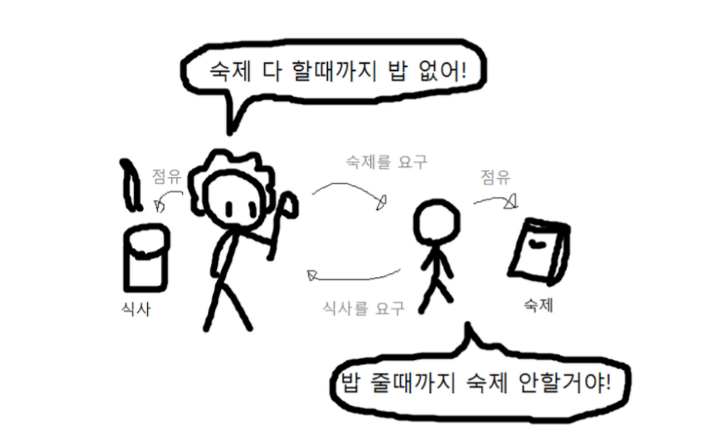
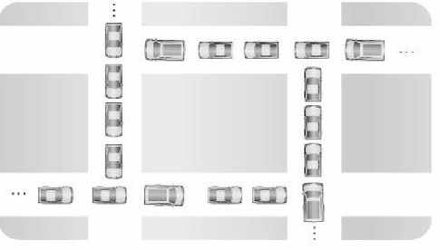

# Deadlock

---

# 1. 개념

- 교착상태(Dead Lock)는 상호 배제에 의해 나타나는 문제점으로, 둘 이상의 프로세스들이 자원을 점유한 상태에서 서로 다른 프로세스가 점유하고 있는 자원을 요구하며 무한정 기다리는 현상

# 2. **교착상태 발생의 필요 충분 조건**

[1971년](https://ko.m.wikipedia.org/wiki/1971%EB%85%84)에 [E. G. 코프만](https://ko.m.wikipedia.org/w/index.php?title=E._G._%EC%BD%94%ED%94%84%EB%A7%8C&action=edit&redlink=1) 교수는 교착상태가 일어나려면 다음과 같은 네 가지 [필요 조건](https://ko.m.wikipedia.org/wiki/%ED%95%84%EC%9A%94_%EC%A1%B0%EA%B1%B4)을 충족시켜야 함을 보였다. 이 네가지 조건중 하나라도 충족되지 않으면 교착상태가 발생하지 않는다. 

아래의 4가지 조건이 모두 만족하는 상태를 교착 상태로 정의한다.

| 상호배제(Mutual Exclusion) | 프로세스들이 필요로 하는 자원에 대해 배타적인 통제권을 요구한다. |
| --- | --- |
| 점유대기(Hold and Wait) | 프로세스가 할당된 자원을 가진 상태에서 다른 자원을 기다린다. |
| 비선점(Non-preemption) | 프로세스가 어떤 자원의 사용을 끝낼 때까지 그 자원을 뺏을 수 없다. |
| 환형 대기(Circular Wait) | 각 프로세스는 순환적으로 다음 프로세스가 요구하는 자원을 가지고 있다. |

# 3. **예방기법(Prevention)**

교착상태 예방 기법은 교착상태가 발생하지 않도록 사전에 시스템을 제어하는 방법으로 교착상태 발생의 네가지 조건 중에서 어느 하나를 제거함으로써 수행된다. 자원 낭비가 가장 심한 기법

- **1) 상호 배제(Mutual Exclusion)부정**
    
    한번에 여러개의 프로세스가 공유 자원을 사용할 수 있도록 한다.
    
- **2) 점유 및 대기(Hold and Wait) 부정**
    
    프로세스가 실행되기 전 필요한 모든 자원을 할당하여 프로세스 대기를 없애거나, 자원이 점유되지 않은 상태에서만 자원을 요구하도록 한다.
    
- **3) 비선점(Non-preemption)부정**
    
    자원을 점유하고 있는 프로세스가 다른 자원을 요구할 때 점유하고 있는 자원을 반납하고, 요구한 자원을 사용하기 위해 기다리게 한다.
    
- **4) 환형 대기(Circular Wait)부정**
    
    자원을 선형 순서로 분류하여 고유 번호를 할당하고, 각 프로세스는 현재 점유한 자원의 고유 번호보다 앞이나 뒤 어느 한쪽 방향으로만 자원을 요구하도록 한다.
    

🍏 주로 원형 대기를 배제를 한다. 제일 간편함. 하나의 프로세스 안에서 어떠한 하나의 스레드에서만 독점권을 줌. 

ex) 카카오톡 채팅 중에 사진첨부를 동시에 할 수 없다.

이 교착 상태의 해결 방법들은 자원 사용의 효율성이 떨어지고 비용이 많이 드는 문제점이 있다.

# 4. **회피 기법(Avoidance)**

- 안전한 자원을 할당할 수 있는 범위까지만 자원 요청을 허락한다. 그러나 자원을 얼마나 할당해야 교착상태가 발생하지 않는가에 대한 보장이 없기 때문에 이 역시 실효성이 적다.
- 교착상태 회피 기법은 교착상태가 발생할 가능성을 배제하지 않고 교착상태가 발생하면 적절히 피해나가는 방법으로, 주로 은행원 알고리즘(Banker's Algorithm)이 사용된다.

### 가. **은행원 알고리즘(**Banker's Algorithm) ****

**1)** 은행원 알고리즘은 다익스트라가 제안한 기법으로, 은행에서 모든 고객의 요구가 충족되도록 현금을 할당하는데서 유래한 기법이다.

**2)** 각 프로세스에게 자원을 할당하여 교착상태가 발생하지 않으며 모든 프로세스가 완료될 수 있는 상태를 안전상태, 교착상태가 발생할 수 있는 상태를 불안전 상태라고 한다.

**3)** 은행원 알고리즘을 적용하기 위해서는 자원의 양과 사용자(프로세스) 수가 일정해야 한다.

**4)** 은행원 알고리즘은 프로세스의 모든 요구를 유한한 시간안에 할당하는 것을 보장한다.

# 5. **발견기법(Detection)**

- 교착상태 발견 기법은 시스템에 교착상태가 발생했는지 점검하여 교착상태에 있는 프로세스와 자원을 발견하는 것을 의미한다.
- 교착상태 발견 알고리즘과 자원 할당 그래프 등을 사용 할 수 있다.
- 교착 상태가 발생하도록 놔두고, 발생 시 찾아서 고친다.

# 6. **회복기법(Recovery)**

- 교착상태를 일으킨 프로세스를 종료하거나 교착상태의 프로세스에 할당된 자원을 선점하여 프로세스나 자원을 회복하는 것을 의미한다.

### 가. **프로세스 종료**

- 교착상태에 있는 프로세스를 종료하는 것으로, 교착상태에 있는 모든 프로세스를 종료하는 방법과 교착상태에 있는 프로세스들을 하나씩 종료해가며 교착상태를 해결하는 방법이 있다.

<aside>
💡 **SRF 기법**

 : 수행시간을 측정하여 우선순위가 낮은 프로세스를 먼저 처리해주는 기법.

</aside>

### 나. **자원선점**

교착상태의 프로세스가 점유하고 있는 자원을 선점하여 다른 프로세스에게 할당하며, 해당 프로세스를 일시 정지시키는 방법입니다. 우선순위가 낮은 프로세스, 수행된 정도가 적은 프로세스, 사용되는 자원이 적은 프로세스 등을 위주로 해당 프로세스의 자원을 선점한다.

ex) 영화보는 도중 카톡 답장

<aside>
💡 **자원 선점시 고려사항**

**1.** 자원을 선점할 프로세스 선택 문제 : 최소의 피해를 줄 수 있는 프로세스를 선택한다.

**2.** 자원을 선점한 프로세스의 복귀 문제 : 자원이 부족한 상태이므로 대부분 일시 중지시키고 다시 시작하는 방법을 사용한다.

**3.** 기아 현상 문제 : 한 프로세스가 계속하여 자원 선점 대상이 되지 못하도록 고려해야 한다.

ex) 여러 프로세스가 하나의 프로세스에 대해서만 자원을 뺏으면 안된다.

</aside>