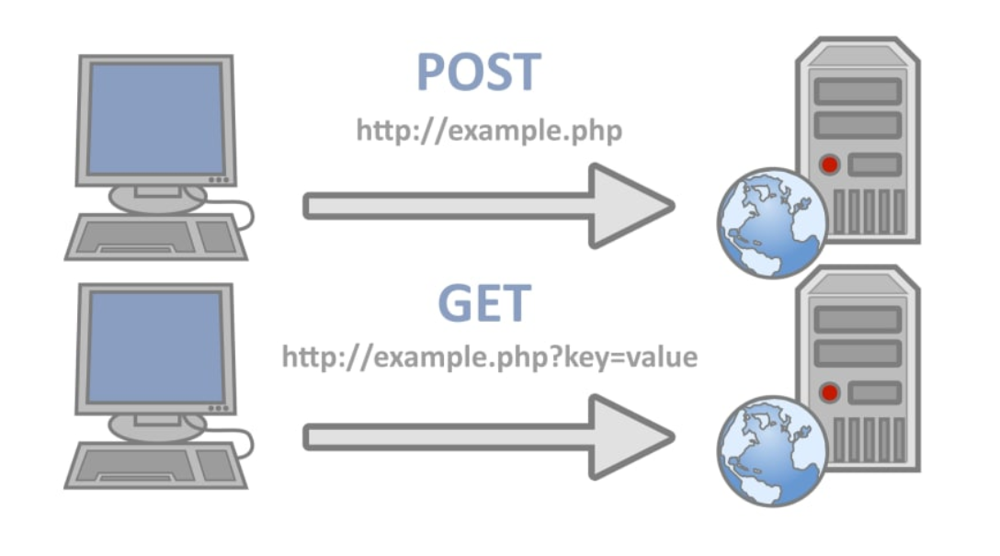

# Get/Post

---

HTTP 프로토콜은 웹 서버와 클라이언트 간에 데이터를 주고받을 수 있는 표준 방식이다. HTTP 요청 메서드 중 가장 널리 사용되는 두 가지는 GET과 POST 다. 이들은 서버에 요청을 전달하거나 데이터를 제출하는 데 사용되며, 주로 웹 애플리케이션에서 데이터를 처리하고 페이지를 표시하는 데 활용된다.

# 1. **GET**

- 데이터를 읽거나 검색 시에 사용되는 메서드이다.
- 서버로부터 정보를 조회하기 위해 설계된 메서드이다.
- URL에 파라미터를 첨부하여 데이터를 전달하며, 브라우저 주소창에서 쉽게 확인 가능하다.
- 요청한 데이터는 URL에 포함되므로, 보안 감안 시 민감한 정보를 전송하기에는 적합하지 않을 수 있다.(ex. 로그인, 회원가입)
    
    <aside>
    💡 **GET 방식 예시**
    
    www.example.com?id=mommoo&pass=1234 
    
    </aside>
    
- 요청을 전송할 때 필요한 데이터를 Body에 담지 않고 쿼리스트링을 통해 전송한다.
    
    <aside>
    💡 **쿼리스트링(QueryString)** : URL의 끝에 ?와 함께 이름과 값으로 쌍을 이루는 요청 파라미터를 쿼리스트링이라고 한다. 요청 파라미터가 여러 개이면 &로 연결한다.
    
    </aside>
    
- 캐싱을 이용하여 이전에 요청한 내용을 재사용할 수 있어 빠른 응답을 기대할 수 있다.
- GET요청 성공 시 200 HTTP 응답 코드를 XML, JSON뿐만 아니라 여러 데이터, 여러 형식의 데이터와 함께 반환한다.
- 길이에 대한 제한이 있다. (전송 데이터양 : 255자)

# 2. **POST**

- POST는 데이터를 서버로 제출하여 처리하고자 할 때 사용되며, 주로 데이터를 생성, 수정, 삭제하는 데 활용된다.
- 요청 데이터는 HTTP 요청의 본문(body)에 담겨 전송되므로, URL에 데이터가 노출되지 않는다.
- Body의 타입은 요청 헤더의 Content-Type에 요청 데이터의 타입을 무엇으로 표시하느냐에 따라 결정된다.
- 더 많은 데이터를 전송할 수 있고, 파일 업로드 등에도 용이하다.
- 보안 면에서는 GET보다 안전하며, HTTPS와 함께 사용되면 데이터 보호가 강화된다.
    - GET보다 보안적인 면에서 안전하다고 생각할 수 있으나, 크롬의 개발자 도구에서 요청 내용을 확인할 수 있기 때문에 민감한 데이터의 경우에는 반드시 암호화하여 전송해야 한다.
- 길이의 제한 없이 데이터를 전송할 수 있다.
- 캐싱을 이용하기 어려우므로, 캐싱이 필요한 경우 GET보다는 부적합할 수 있다.

이외에도 HTTP에는 다양한 다른 요청 메서드가 있다(예: PUT, DELETE, PATCH 등). 이들은 다양한 상황에 맞춰 데이터 처리와 조작을 지원한다. 선택한 메서드는 웹 애플리케이션의 목적과 보안 요구 사항을 고려하여 결정해야 한다.