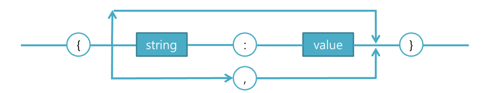
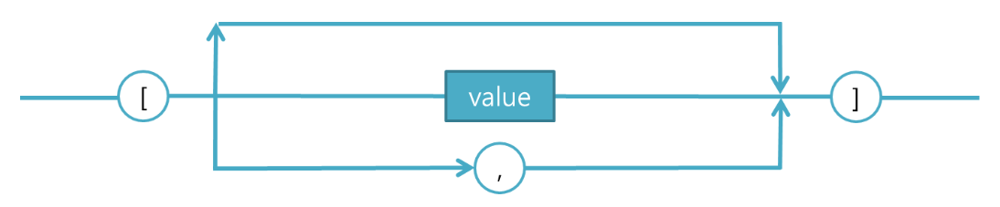
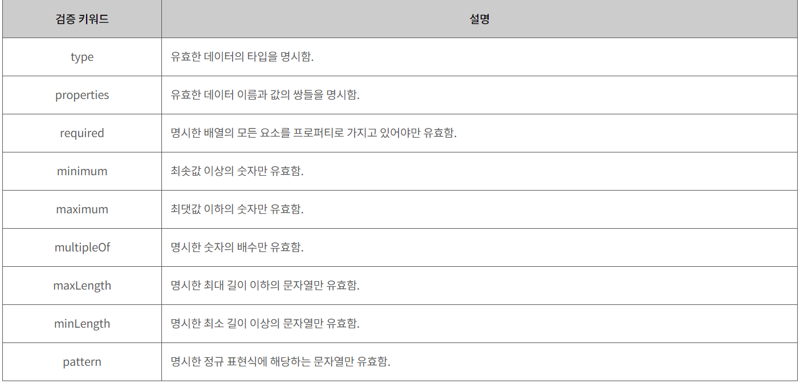
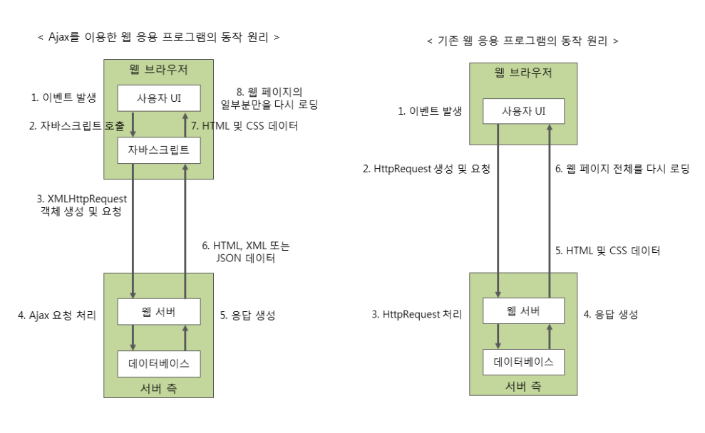
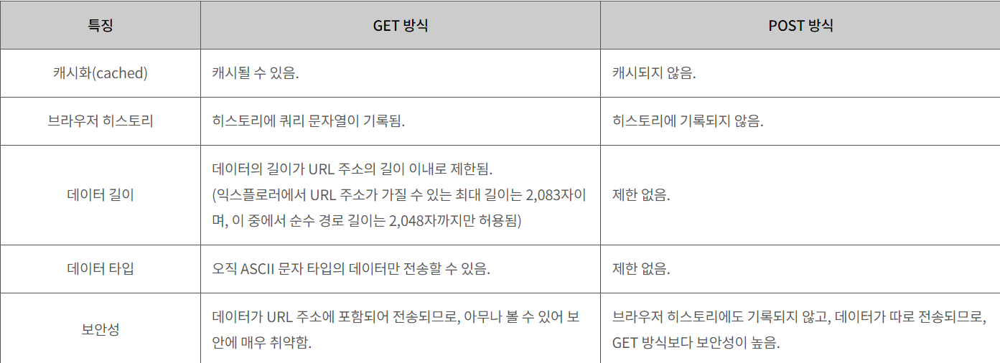
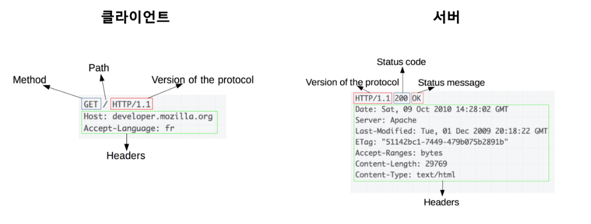

# JSON/AJAX

---

# 1. JSON(JavaScript Object Notation)

- JSON은 자바스크립트의 객체 표현식과 유사한 방식으로 데이터를 주고 받는 방법이다.
- 자바스크립트 **객체가 아니라, 객체 표현식으로 데이터를 표현**한다.
- key : value 형식의 데이터 저장 방식
- 경량의 DATA를 교환하는 방식
- 클라이언트와 서버 간 데이터 교환에 필요한 규칙, 즉 데이터 포맷으로 효과적인 데이터구조화가 가능
- 자바스크립트 객체 문법으로, 좀 더 쉽게 데이터를 교환하고 저장하기 위하여 만들어진 텍스트 기반의 데이터 교환 표준이다.
- XML의 대안으로, XML보다 좀 더 쉽게 데이터를 교환하고 저장하기 위하여 고안되었다.
- 텍스트 기반이므로, 어떠한 프로그래밍 언어에서도 JSON 데이터를 읽고 사용할 수 있다.

<aside>
💡 XML : E**X**tensible **M**arkup **L**anguage의 약자. 
          문자 기반의 마크업 언어이다.

</aside>

- XML과 JSON의 차이점
    
    ```xml
    <dog>
    	<name>식빵</name>
    	<family>웰시코기</family>
    	<age>2</age>
    <dog>
    ```
    
    ```json
    {
    	"name" : "식빵"
    	"family" : "웰시코기"
      "age" : 2
    }
    ```
    
    1. JSON은 종료 태그를 사용하지 않으며, XML보다 코드 길이가 짧다.
    2. JSON은 XML보다 더 빨리 읽고 쓸 수 있다.
    3. XML은 배열 사용 불가, JSON은 배열 사용 가능하다.
    

## 1-1. 문법

- javascript 객체 리터럴과 비슷하게 key : value의 표현식이나 key값은 반드시 큰따옴표("")로 감싸줘야 한다.
- **예제)** test라는 객체는 **key : value**형식의 표현식

```java
var test = {
        "name" : "홍길동",
        "age"    : 27,
        "address" : "서울시"
}
```

- key = "name" : value = "홍길동" 형식으로 데이터가 들어간다. 이런 JSON형식으로 데이터를 전송하면 Bean에서 key의 명칭과 같은 Bean안에 있는 변수를 자동으로 매핑한다.
    - JSON은 이름의 값과 쌍으로 이루어진다.
    - 데이터는 ,(쉼표)로 나열된다.
    - 객체는 중괄호로 싸여 표현된다.
    - 배열은 대괄호로 싸여 표현된다.
    - 자바스크립트의 객체 표기법에서 리터럴과 프로퍼티를 표현하는 방법만 가져와서 사용한다.
        
        <aside>
        💡 **리터럴** : 해석되는 값 그 자체. 
        ex) 12→숫자 리터럴 , “오잉” →문자 리터럴, true→ boolean 리터럴
        
        **프로퍼티** : 특정 객체의 데이터를 담고 있는 것. 이름(name)과 값(value)을 가지고 있다.
        
        </aside>
        

- JSON 데이터 구성 : 데이터 이름, 콜론(:), 값의 순서로 구성됨.

```json
//문법
"데이터이름" : 값

//예제
"name" : "김현희"
```

데이터의 이름도 문자열이므로, 항상 큰따옴표와 함께 입력해야 한다.

- JSON 객체 표현

```json
{
  "name" : "김현희",
	"age" : 29,
	"height" : 164
}
```



- JSON 배열 표현

```json
"animation" :[
{"이름" : "주술회전" , "장르" : "퇴마" , "작가" : "아쿠타미 게게"},
{"이름" : "진격의 거인", "장르" : "피카레스크", "작가" : "이시야마 하지메"}
]

```



## 1-2. 타입

- JSON에서 제공하는 기본 타입이다.
- 대부분의 프로그래밍 언어에서 배열은 여러 가지 타입의 데이터를 가질 수 없지만, 자바스크립트 기반의 JSON 배열은 여러 타입의 요소를 가질 수 있다.
1. 숫자(number)
2. 문자열(string)
3. 불리언(boolean)
4. 객체(object)
5. 배열(array)
6. null

---

- 객체 안의 객체
    
    ```json
    {
    	"dog" : {
    					"name" : "후추",
    					"age" : 3,
    					"weight" : 4,
    					"owner" : { 
    											"name" : "김현희", 
    											"PhoneNumber" : 000-1111-1111
    										}
    }
    ```
    
    JSON의 데이터는 숫자, 문자열 등 뿐만 아니라 또 다른 객체가 올 수 있다.
    
- 배열
    
    JSON 배열은 여러 개의 데이터가 순서를 가지고 나열된 집합이다**.** 객체에서 프로퍼티를 나열하는 것과 비슷하나, 배열은 데이터의 값만을 나열한다.
    
    **→ 객체: 프로퍼티의 집합  / 배열: 데이터값의 집합**
    
    ```json
    {
    	"fruit" :  [
    								"사과",
    								"토마토",
    								"딸기"
    						 ]
    }
    ```
    
- null
    
    아무런 값도 가지고 있지 않은 빈 값을 의미한다.
    
    항상 소문자로 표기하여 사용한다.
    
    null은 자바스크립트의 undefined 타입과 혼동하기 쉽다. 
    
    JSON에서는 undefined 타입을 제공하지 않는다.
    
    *undefined : 값이 없음. 초기화되지 않은 변수나 존재하지 않는 값에 접근할 때 반환함.
    
    *null : 값을 가지고 있지 않음. 하나의 데이터값이라고 할 수 있음.
    

- **스키마(schema)**
    - JSON데이터를 전송받는 측에서는 받은 데이터가 적합한지 확인할 방법이 필요하다.
    - 그렇기에, 올바른 JSON 데이터 형식을 기술한 문서를 JSON 스키마라고 한다.
    - 스키마 검증 사항
    
    | 1. 데이터의 타입이 정확한가? |
    | --- |
    | 2. 필수로 받아와야 하는 데이터가 포함되어 있는가? |
    | 3. 데이터가 원하는 범위 내에 있는가? |
    - 키워드
        
        
        
    
    - 예시
    
    ```json
    {
    
        "title": "강아지 스키마",
        "description": "이 스키마는 강아지에 관한 데이터를 검증하기 위해 작성된 스키마임.",
        "type": "object",
        "properties": {
            "name": {"type": "string"},
            "family": {"type": "string"},
            "age": {"type": "integer"},
            "weight": {"type": "number"},
            "owner": {
                "type": "object",
                "properties": {
                    "ownerName": {"type": "string"},
                    "phone": {"type": "string"}
                }
            }
        }
    }
    ```
    

## 1-3. **JSON 데이터 처리**

### 1. **직렬화**

- JSON 데이터는 자바스크립트를 이용하여 JSON 데이터 -> 자바스크립트 객체,  자바스크립트 객체 -> JSON 데이터로 쉽게 변환할 수 있다.
- 자바스크립트 객체에 저장된 데이터를 서버로 전송하기 위해서는 객체를 JSON 형식의 문자열로 변경 해야 한다. 이 과정을 객체의 직렬화 (serializing)라고 한다.
- 직렬화는 stringify( ) 메서드를 이용한다.
    
    ```java
    JSON.stringify({});                  // '{}'
    JSON.stringify(true);                // 'true'
    JSON.stringify('foo');               // '"foo"'
    JSON.stringify([1, 'false', false]); // '[1,"false",false]'
    JSON.stringify({ x: 5 });            // '{"x":5}'
    ```
    
- JSON.stringify() → 인수로 전달 받은 자바스크립트 객체를 문자열로 반환
    
    ```jsx
    //자바스크립트 객체
    let cat = {name : "나비", age : 1, weight: 3.4};
    
    //자바스크립트 객체를 JSON문자열로 변환
    let data = JSON.Stringify(cat); 
    
    //콘솔에 JSON문자열로 변환된 데이터 출력
    console.log(data);
    ```
    
- toJSON() → Date 객체의 데이터를 json 형식의 문자열로 변환하여 반환
    
    ```jsx
    //Date 객체 생성
    let date = new Date();
    
    //date객체를 JSON문자열 형식으로 변환
    let DateString = date.toJSON();
    
    //콘솔에 JSON으로 변환한 date 출력
    console.log(DateString);
    ```
    

### 2. **역직렬화**

- 서버로부터 JSON 데이터가 전송되면 이 데이터는 문자열이다. 이 문자열을 자바스크립트 객체로 변환해야 하는데 이를 객체의 역직렬화(deserializing)라고 한다.
- 역직렬화는 다른 말로 "문자열을 파싱한다"라고도 한다.
- 역직렬화는 JSON 내장 객체의 parse( ) 메서드를 이용하며 객체의 데이터에 접근해 페이지에서 사용할 HTML을 생성할 수 있다.
    
    ```java
    const json = '{"result":true, "count":42}';
    const obj = JSON.parse(json);
    
    console.log(obj.count); // expected output: 42
    console.log(obj.result); // expected output: true
    ```
    
- JSON.parse() → 인수로 전달 받은 문자열을 자바스크립트 객체로 반환
    
    ```jsx
    //JSON 문자열
    let CatString = {"name" : "나비", "age" : 1, "weight": 3.4};
    
    //JSON 문자열을 자바스크립트 객체로 변환
    let data = JSON.parse(CatString);
    
    //콘솔에 자바스크립트 객체로 변환된 데이터 출력
    console.log(data);
    ```
    

## 2. **정리**

<aside>
💡 JSON.stringify( ) : JavaScript Object → JSON 데이터                                                  JSON.parse( ) : JSON 데이터 → JavaScript Object

</aside>

---

# 2. AJAX(Asynchronous JavaScript and XML)

- Ajax는 웹 페이지에서 새로운 데이터를 보여주려고 할 때 웹페이지 전체를 새로고침 하지 않고,
    
    보여주고자 하는 데이터가 포함된 페이지의 일부분 만을 로드하기 위한 비동기식 통신 기법이다.
    
- XML형식으로 데이터를 주고받을 수 있어 붙여진 이름이나 json형식을 주로 이용한다.
- 즉, AJAX를 이용하면 백 그라운드에서 서버와 통신하여, 결과를 웹 페이지 일부분에 표시할 수 있다.

<aside>
💡 **동작방식**

1. 요청(request) - 브라우저가 서버에 정보를 요청한다.
2. 서버의 동작 - 서버는 JSON, XML 등의 형식으로 데이터를 전달한다.
3. 응답(response) - 브라우저에서 이벤트가 발생하여 콘텐츠를 처리한다.
</aside>

- **JSON을 사용한 AJAX 예제**

```java
var test = {
        "name" : "홍길동",
        "age"    : 27,
        "address: "서울시"
}

$.ajax ( {
    type : "POST"
    url : "test/home",
    dataType : 'json',
    contentType : 'application/json',
    data : JSON.stringify(test),
    beforeSend : function() {
        alert("ajax 호출시 실행");
    },
    success : function(res) {
    	alert("success");    
    },
    error : function(xhr) {
    	alert(xhr.responseText);
    },
    complete : function() {
        alert("ajax 호출 완료시 실행");
    });
```

1. type : 서버 전송 통신 방식 지정 ( GET, POST, PUT, DELETE )
2. url : 데이터를 전송할 URL
3. dataType : data type을 'json'형식으로 전송
    
    ```java
    dataType : "json" - JSON 형식의 데이터로 배열, 객체를 포함하는 문자열 (권장)
    dataType : "text" - 일반적인 문자열
    dataType : "html" - HTML을 포함한 문자열
    dataType : "script" - 새로운 스크립트
    dataType : "jsonp" - 다른 도메인으로부터 전송되는 JSON 데이터
    dataType : "xml" - XML 형식의 데이터
    dataType 생략 : 요청에 맞게 자동으로 형식 설정
    기본 값 : MIME 유형
    ```
    
4. contentType : 서버에 데이터를 보낼 때 JSON 데이터 형식 지정
5. data : 서버로 보낼 데이터(test라는 json객체를 JSON.stringify형식으로 전송)
    
    ```java
    // 일반
    data : { 
        type1 : type1, 
        type2 : type2 
    }
     
    // JSON 데이터로 보내기
    data : JSON.stringify ({ 
        type1 : type1, 
        type2 : type2 
    })
    ```
    
6. **Option**
    
    ```java
    beforeSend : function() {} - HTTP 요청 전에 호출되는 함수 (return false일 경우 요청 중단)
     
    success : function() {} - HTTP 요청 성공시 호출되는 함수
     
    error : function() {} - HTTP 요청 실패시 호출되는 함수
     
    complete : function() {} - HTTP 요청 완료시 호출되는 함수 (요청 성공,실패 여부와 관계없이 실행)
    ```
    

## 2-1. 동작 원리

- AJAX를 이용한 웹 응용 프로그램은 자바스크립트 코드를 통해 웹 서버와 통신한다.



1. 사용자에 의해 Request 이벤트가 발생해서 자바스크립트가 호출된다.
2. XMLHttpRequest 객체가 생성되고, XMLHttpRequest 객체가 웹 서버에 사용자 요청을 보낸다.
    
    **이 때, 웹 서버는 웹 페이지가 다시 로드될 일 없이 다른 작업이 가능하다.**
    
3. 웹 서버는 XMLHttpRequest 객체의 요청을 처리한다.
4. XMLHttpRequest 객체는 XML, JSON 등의 형식으로 웹 브라우저에게 전달한다.
    
    **이 때, 웹 페이지 전체가 로드되는 것이 아니라, 필요한 데이터만을 전달한다.**
    
5. 서버가 전달한 데이터를 가지고 자바스크립트를 호출하여 웹 페이지 일부분을 갱신한다.

## 2-2. 통신

**XMLHttpRequest 객체**

- 클라이언트가 웹 서버와 통신할 수 있는 이유는 XMLHttpRequest객체 때문이다.
- XMLHttpRequest 객체가 클라이언트(웹 브라우저) - 웹 서버 간 데이터를 교환하는 데에 사용된다.
- 익스플로러 7 이상, 크롬, 사파리, 파이어폭스가 XMLHttpRequest()를 지원한다.

```jsx
let req = new XMLHttpRequest();
```

## 2-3. 요청

```jsx
open(전달방식, URL주소, 동기여부);
```

1. open() 메서드
    1. 서버에 보낼 형식을 설정하는 메서드이다.
    2. 전달 방식 : 요청 전달 방식. GET/POST 중 하나 선택 가능하다.
    3. URL 주소 : 요청을 전달할 서버의 파일 주소를 전달한다.
    4. 요청을 동기식 / 비동기식으로 전달할지 결정한다. ( 비동기식 : true / 동기식 : false)

```jsx
send();       // GET 방식

send(문자열); // POST 방식
```

1. send() 메서드
    1. 전달 방식에 따라 매개변수가 있을 수도, 없을 수도 있다.
    
    
    

## 2-4. HTTP 요청 헤더



- 클라이언트와 서버 사이에 이루어지는 HTTP 요청과 응답은 HTTP헤더를 사용하여 수행된다.
- HTTP헤더는 클라이언트와 서버가 주고받을 데이터들을 포함할 수 있다.
- 헤더는 헤더이름, 콜론, 헤더 값의 순서로 구성된다.
- HTTP 요청 헤더는 웹 브라우저가 자동으로 설정하여 보내므로 사용자가 직접 설정할 수 없었으나, Ajax를 사용하여 직접 설정할 수도 있고, HTTP 응답 헤더의 내용을 직접 확인할 수도 있다.

## 2-5. 제이쿼리와 $.ajax() 메소드

- Ajax를 이용하여 쉽게 개발할 수 있도록 만들어 놓은 라이브러리를 Ajax 프레임워크라고 한다.
- 가장 널리 사용되고 있는 Ajax프레임워크는 제이쿼리이다.
- $.ajax()메소드는 모든 제이쿼리 Ajax 메소드의 핵심이다.

```jsx
$.ajax([])
```

```jsx
$.ajax({

    url: "/examples/media/request_ajax.php", // 클라이언트가 요청을 보낼 서버의 URL 주소

    data: { name: "김현희" },                // HTTP 요청과 함께 서버로 보낼 데이터

    type: "GET",                             // HTTP 요청 방식(GET, POST)

    dataType: "json"                         // 서버에서 보내줄 데이터의 타입

})
```

- **AJAX 실습**

```jsx
<!DOCTYPE html>
<html lang="en">
<head>
    <meta charset="UTF-8">
    <meta name="viewport" content="width=device-width, initial-scale=1.0">
    <script type="text/javascript" src="https://code.jquery.com/jquery-3.2.0.min.js" ></script>
    <title>Ajax실습</title>
</head>
<body>

    <button id="sendBtn">ajax 전송</button>

    <script>

                var data = {"friut" : "peach"};

                $("#sendBtn").click(function(){

                    $.ajax({
                        url: "http://192.168.1.9:8080/requestGet",
                        type: "GET",
                        data: data,
                        contentType: "application/json; charset=UTF-8",
                        dataType: "json",
                        success: function(data){
                            alert('전송이 완료되었습니다.');
                        },
                        error: function(){
                            alert('전송에 실패하였습니다.');
                        }
                    })
            });

    </script>    
</body>
</html>
```