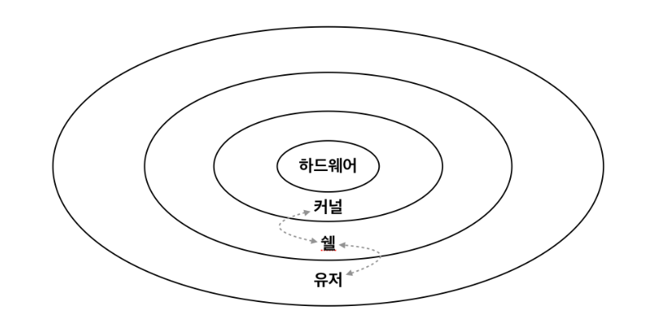
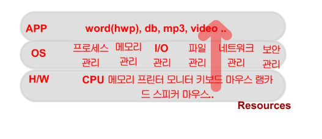
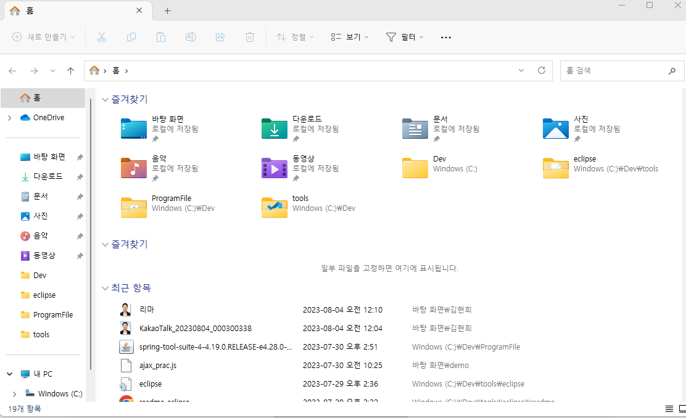
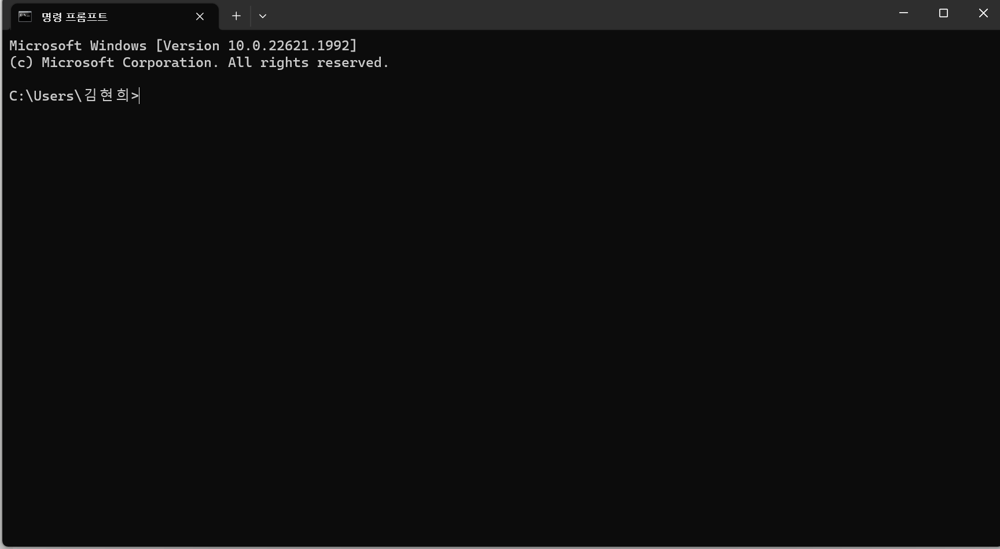
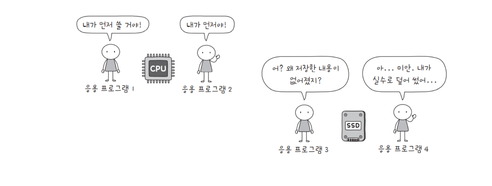
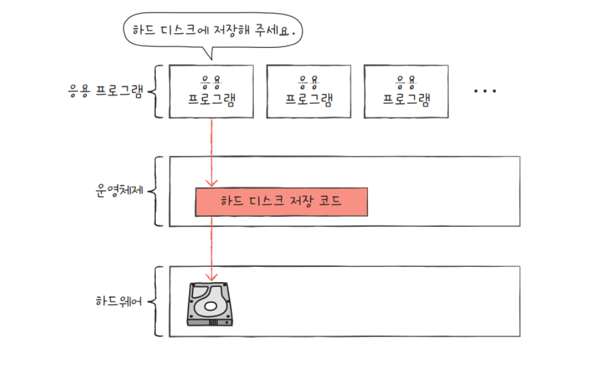
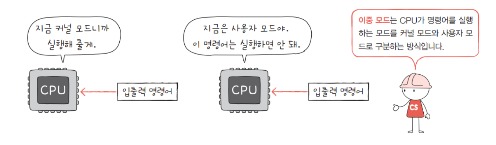
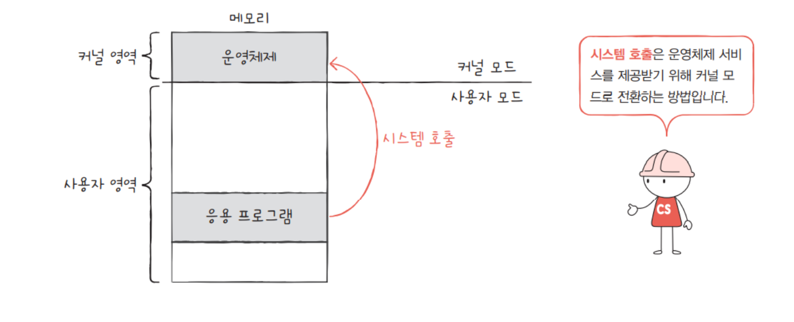
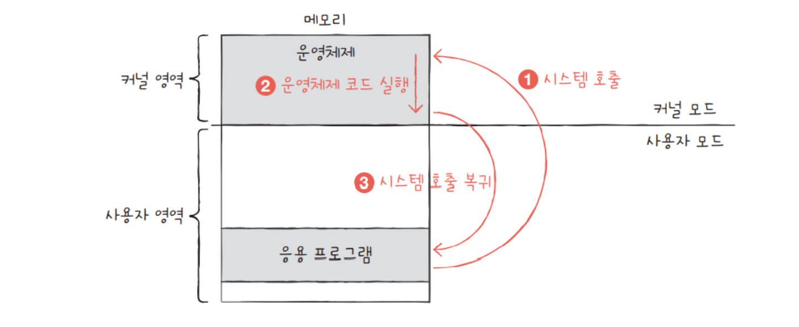
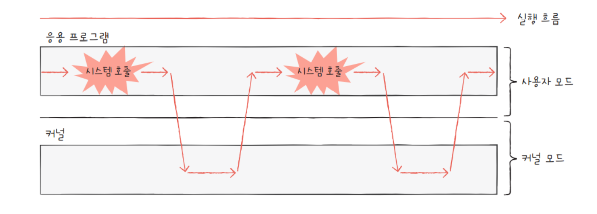

# Kernel/Shell

---

**운영체제는 커널과 쉘로 구분된다.**

사용자가 입력한 명령어는 일련의 과정을 거쳐 하드웨어를 제어하게 된다. 이 사이에는 몇 가지 과정을 거쳐서 수행하게 되는데, 우리가 명령어를 입력하면 컴퓨터 내부에서는 쉘(Shell)이 이를 받아들이고 명령어를 해석하여 커널(Kernel)을 통해 하드웨어를 조작한다.

## 커널(Kernel)

부팅 시 부트로더에 의해 메모리에 적재되어 메모리에 상주하는 **운영체제의 핵심**이다. 운영체제의 가장 중요한 요소로서 입출력을 관리하고, 소프트웨어의 요청을 받아 필요한 컴퓨터의 자원(메모리, CPU, 파일)을 할당해주는 역할을 한다.

⇒ 부트로더 : 운영 체제가 시동되기 이전에 미리 실행되면서 커널이 올바르게 시동되기 위해 필요한 모든 관련 작업을 마무리하고. 최종적으로 운영 체제를 시동시키기 위한 목적을 가진 프로그램

### 역할

- 프로세스 관리 - 여러 프로그램이 실행될 수 있도록 프로세스들을 CPU 스케줄링하여 동시에 수행되도록 함.
- 파일 관리 - 디스크와 같은 저장장치 상에 파일 시스템을 구성하여 파일을 관리한다.
- 메모리 관리 - 메인 메모리가 효과적으로 사용될 수 있도록 관리한다.
- 주변장치 관리 - 모니터, 키보드, 마우스와 같은 장치를 사용할 수 있도록 관리한다.

## 쉘(Shell)

커널의 껍데기 역할을 하여 사용자가 운영체제에 접근하기 위해서는 쉘을 거쳐야 한다. 쉘은 사용자가 터미널에서 입력한 명령을 해석하고 관리하여 **커널 사이를 연결하는 역할**을 한다.

쉘은 일반적으로 CLI(Command Line Interface) 혹은 GUI(Graphic User Interface)로 분류된다.

- GUI(Graphic User Interface)
    
    
    

사용자가 창, 아이콘, 메뉴와 같은 그래픽 요소를 사용하여 시스템과 상호작용한다.

사용자가 명령어를 기억할 필요 없이 드래그, 더블클릭 등으로 작업을 수행한다.

CLI보다 메모리 사용량이 많고 느리다.

ex) 검색창, 메뉴, 아이콘, 파일탐색기 등

- CLI(Command User Interface)

사용자가 명령어를 입력하여 작업을 수행한다.

사용자가 명령어를 입력하면 쉘이 해당 명령을 해석함으로써 작업을 수행한다.

GUI보다 메모리 사용량이 적고 빠르다.

명령어를 하나하나 알아야 한다.

ex) window의 CMD, MacOS의 Terminal

## 사용자가 하드웨어를 조작하는 과정

1. 사용자가 명령어를 입력한다.
2. 쉘이 해석하여 커널에 전달한다.
3. 커널은 명령을 수행하고 하드웨어를 조작하여 다시 그 결과를 쉘에 전송한다.
4. 쉘은 사용자가 이해할 수 있게 해석하여 사용자에게 전달한다.
5. 사용자는 그 결과를 확인한다.

## 이중 모드와 시스템 콜(System Call)

운영체제는 응용 프로그램이 하드웨어에 직접 접근하는 것을 방지하여 자원을 보호한다. 만약 응용 프로그램이 CPU, 메모리, 하드디스크 등에 직접 접근하여 조작할 수 있다면, 자원이 무질서하게 관리되고 응용 프로그램이 조금만 실수해도 컴퓨터 전체에 악영향을 끼칠 수 있다.  

그래서 운영체제는 응용 프로그램들이 자원에 접근하려고 할 때 오직 본인만 접근할 수 있도록 하여 자원을 보호한다. 일종의 문지기 역할을 하는 셈이다. 그래서, 응용 프로그램이 접근하기 위해서는 운영체제에 도움을 요청해야 한다. 즉 이 말은, 운영체제 코드를 실행하려고 한다는 말과 같다. 

예를 들어 응용 프로그램이 실행 중 하드 디스크에 데이터를 저장하려면 운영체제에 도움을 요청해야 하고, 운영체제는 커널 영역 내의 하드 디스크에 데이터를 저장하는 코드를 실행해 응용 프로그램의 작업을 대신 수행해준다.

이러한 운영체제의 ‘문지기’ 역할은 이중 모드로써 구현된다. 

 

<aside>
💡 이중 모드(dual mode) : CPU가 명령어를 실행하는 모드를 크게 사용자 모드와 커널모드로 구분하는 방식이다.

</aside>

### 사용자 모드(user mode)

운영체제 서비스를 제공받을 수 없는 실행 모드이다. (커널 영역의 코드를 실행할 수 없는 모드)

일반적인 응용 프로그램은 기본적으로 사용자 모드로 실행된다. 

사용자 모드에서 실행되는 코드는 시스템의 안전성과 보안을 위해 제한된 자원에만 접근할 수 있다.  

사용자 모드로 실행 중인 CPU는 입출력 명령어와 같이 하드웨어 자원에 접근하는 명령어를 실행할 수 없다.

### 커널 모드(kernel mode)

운영체제 서비스를 제공 받을 수 있는 실행 모드이다. (커널 영역의 코드를 실행할 수 있는 모드)

하드웨어 제어, 메모리 관리, 인터럽트 처리 등의 중요한 작업을 수행할 수 있다.

CPU가 커널 모드로 명령어를 실행하면 자원에 접근하는 명령어를 비롯한 모든 명령어를 실행 가능하다.

운영체제는 커널 모드로 실행되기 때문에 자원에 접근이 가능한 것이다.

### **CPU가 사용자 모드인지 커널 모드인지를 어떻게 알 수 있을까?**

레지스터 : 프로세서에 위치한 고속 메모리로 극히 소량의 데이터나 처리 중인 중간 결과와도 같은 프로세서가 바로 사용할 수 있는 데이터를 담고 있는 영역

Supervisor flag : status register의 하나로, 0과 1로 이루어진 flag 변수. register 레벨에서 user mode와 kernel mode를 구분하는 것. 

플래그 레지스터 속 슈퍼바이저 플래그를  보면 알 수 있다.

슈퍼바이저 플래그가 1일 경우 커널 모드로 실행 중임을 의미하고, 0일 경우 사용자 모드로 실행 중임을 의미한다. 

<aside>
💡 플래그 레지스터 : CPU 내부 기구 중 하나로, 산술 연산 결과의 상태를 보여주는 flag bit들이 모인  레지스터. 산술 연산 시 CPU에 의해 자동적으로 세팅되며, 프로세서의 현재 상태를 결정한다.

</aside>

  

사용자 모드로 실행되는 프로그램이 자원에 접근하는 운영체제 서비스를 제공 받으려면 커널 모드로 전환되어야 하는데, 이 때 운영체제 서비스를 제공받기 위한 요청을 시스템 콜(System call)이라고 한다. 사용자 모드로 실행되는 프로그램은 시스템 콜을 통해 커널 모드로 전환하여 운영체제 서비스를 제공받을 수 있다.

시스템 콜은 일종의 인터럽트이다. 인터럽트는 입출력장치에 의해 발생하기도 하지만(하드웨어 인터럽트), 인터럽트를 발생시키는 특정 명령어에 발생하기도 하는데 이것을 소프트웨어 인터럽트라고 한다. 

<aside>
💡 인터럽트(Interrupt) : CPU가 프로그램을 실행하고 있을 때, 입출력 하드웨어 장치에 예외상황이 발생하여 처리가 필요할 경우에 CPU한테 알려 처리할 수 있도록 하는 것이다.
(멈춰!)

하드웨어 인터럽트 : 키보드, 마우스와 같은 하드웨어가 발생시킨 인터럽트

소프트웨어 인터럽트 : 프로그램이 오류를 발생시켜 Exception이 발생하거나 사용자 프로그램이 커널 함수 사용을 위해 호출하는 System Call 이 발생하는 경우

</aside>

시스템 호출을 발생시키는 명령어가 실행되면 CPU는 지금까지의 작업을 백업하고, 커널 영역 내에 시스템 콜을 수행하는 코드를 실행한 뒤 다시 기존에 실행하던 응용 프로그램으로 복귀하여 실행을계속해 나간다.  

### 시스템 콜 예시

한 응용 프로그램이 하드 디스크에 데이터를 저장할 경우

1. 하드 디스크에 저장하는 시스템 콜을 발생시켜 커널 모드로 전환한다.
2. 하드 디스크에 데이터를 저장하는 코드를 실행시켜 하드 디스크에 접근하여 데이터를 저장한다.
3. 하드 디스크에 접근이 끝났으면, 사용자 모드로 전환하여 작업을 다시 수행한다.   

일반적으로 응용 프로그램은 실행 중 운영체제를 매우 빈번하게 사용한다. 

→ 프로세스 관리, 자원 접근 및 할당, 파일 시스템 관리 등

그 과정에서 시스템 콜을 발생시키고 사용자 모드와 커널 모드를 오가며 사용한다.