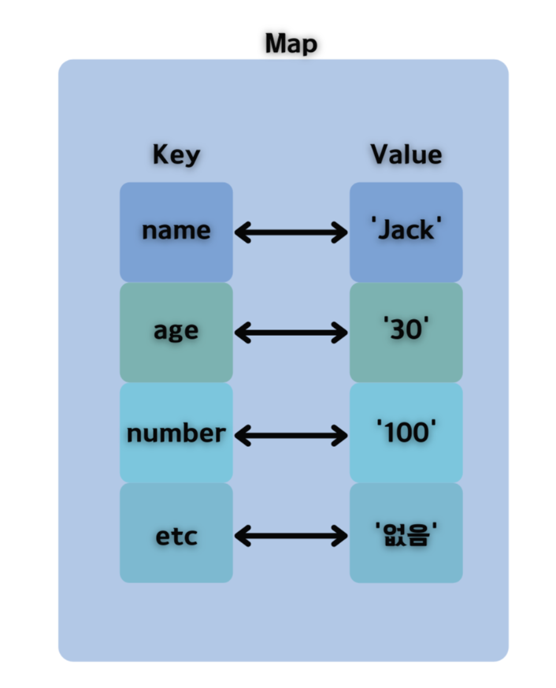
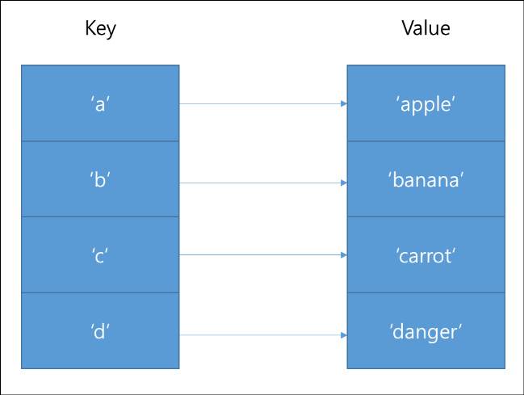

# Key-Value

---

# 1. 개념

- "Key-value" 자료구조는 데이터를 저장하고 관리하는데 사용되는 간단하면서도 유용한 방법 중 하나다.
- 각각의 데이터 항목은 고유한 식별자인 "키(Key)"와 그에 대응하는 "값(Value)"으로 구성된다. 키는 일반적으로 문자열이나 숫자 등으로 표현되며, 값은 키와 연관된 데이터 자체를 나타낸다.
    
    
    
- Key-Value 데이터베이스는 Key와 Value로 구성되어 있고, key를 사용하여 DB에 값을 저장한다.
- 그러므로 알아보기 쉽고, 접근시간이 빠르다.
    
    → 배열은 인덱스 주소값으로 찾기 때문에(직접참조) Full Range Scan보다 빠르다.
    
- Key-Value 구조는 요소들을 key로 한번에 접근이 가능한데, 이것이 사실상 **배열**이기 때문에 가능한 일이다.
- key-value는 딕셔너리(Dictionary), 해시(Hash) 등으로 알려져 있는 자료 구조인 연관 배열의 저장, 검색 관리를 위해 설계되었다.
- key와 value가 매칭되는 것을 매핑(mapping)이라고 한다.

<aside>
💡 **예시**

JSON과 XML은 key_value의 구조로 구성된 데이터이다.

- JSON

```json
{"key1" : "aaa", "key2" : "bbb"}
```

- XML

```xml
<key1>aaa</key1>
<key2>aaa</key2>
```

</aside>

# 2. 특징

1. **고속 검색**: 키를 사용하여 데이터를 빠르게 검색할 수 있다. 이는 내부적으로 해시 함수를 사용하여 키와 값의 매핑을 구성하기 때문에 발생한다.
2. **고유한 키**: 각 키는 고유해야 하며, 동일한 키를 사용하여 여러 값을 저장할 수 없다. 이로써 키-값 자료구조는 데이터 중복을 방지할 수 있다.
3. **간단한 구조**: 키-값 저장소는 보통 데이터를 단순하게 관리하므로 작은 규모의 데이터 관리에 적합하다.
4. **빠른 삽입 및 삭제**: 키-값 저장소는 일반적으로 삽입 및 삭제 작업도 빠르게 수행할 수 있다.
5. **자주 사용되는 용도**: 설정 값, 캐싱, 세션 관리, 데이터베이스 인덱스, 쿠키, 웹 애플리케이션의 클라이언트 상태 관리 등에서 많이 사용된다.

- 여러 프로그래밍 언어와 라이브러리에서는 이러한 키-값 자료구조를 구현한 데이터 구조를 제공하며, 각각의 특징과 동작 방식은 언어 및 라이브러리마다 다를 수 있다. 일반적인 예로는 Python의 **`dict`**, JavaScript의 객체(**`{}`**), Java의 **`HashMap`** 등이 있다.

# 3. 문제점

- 배열 크기의 문제
    
    key-value 구조는 사실상 배열로 되어있기 때문에 메모리 문제가 발생한다.
    
    - 1) key가 계속 추가가 될 때
        
        key가 계속 추가되어 배열 크기를 초과할 경우 재생성을 자주 해주어야만 하므로 성능이 저하된다.
        
        → NullPointerException 문제 때문. 
        
    - 2) key가 계속 추가가 되지 않을 경우
        
        사용되지 않는 배열 공간은 그대로 낭비된다.
        

# 4. Map

- 데이터를 모아서 관리할 수 있는 클래스를 컬렉션이라고 한다.
- 컬렉션은 그 타입에 따라 내부에 데이터를 저장하는 구조와 처리하는 방법이 다르다. 내부에서 처리하는 방법에 따라 데이터의 탐색이 빠른 경우가 있고, 추가/제거가 빠른 경우가 있다. 사용하는 컬렉션의 특성을 잘 알고 사용해야 불필요한 성능 저하를 피할 수 있다.
- 자바에서 제공하는 컬렉션의 대표적인 예로 List, Map, Set 등이 있다.

## 4-1. **Map 구조**

- **Map이란 Key와 Value로 이뤄진 데이터의 집합으로 KEY를 통해 데이터를 쉽게 접근할 수 있는 자료구조**



- 흔히 key와 value가 메칭 되는것을 맵핑(mapping)한다고 일컫는다.
- Key는 Map 자료구조에서 대응하는 값을 찾기 위한 요소로 중복을 허용하면 안된다. 만약 중복이 된다면 접근하는데 문제가 생길 수 있기 때문이다.

## 4-2. 사용하는 이유

- List형태의 자료구조들은 순서대로 값을 차곡차곡 집어넣는 일련의 하나의 줄과 같은 형태다.
- 반면 Map 형태의 자료구조는 각각의 Key와 매칭 되는 Value들이 존재한다. 즉 순서보다는 정의된 이름(Key)과 상응하는 데이터들을 묶기 위한 자료 구조로서 효과적이다.
- 특징
    - Key(키)랑 Value(값)으로 나눠서 데이터 관리, 순서는 없으며, 키에 대한 중복은 없음
    - **Key의 중복은 허용되지 않고**, **Value의 중복은 가능**하다.
    - 참고) 배열은 Index-value 쌍
- 장점 : 빠른 속도
- 단점 : Key의 검색 속도가 검색 속도를 좌우

## 4-3. **Map의 종류**

### 1. **HashMap**

```java
Map<String, String> map = new HashMap<String, String>();

map.put("key1", "value1");
map.put("key2", "value2");

System.out.println(map.get("key1"));
```

- "key1"이라는 Key 값과 "value1"이라는 Value 값을 갖는 Entry가 HashMap 내부에 put() 메소드를 통해 저장된다. 나중에 해당 값을 가져올 때에는 Key 값인 "key1"라는 문자열만 넘겨주면 Value 값을 얻어올 수 있는 형태의 컬렉션이다.

```java
Map<String, String> map = new HashMap<String, String>();

map.put("Google", "USA");
map.put("Naver", "Korea");
map.put("Facebook", "USA");

for(Map.Entry<String, String> entry : map.entrySet()) {
System.out.println(entry.getKey() + ":" + entry.getValue());

// 출력 값
// Naver:Korea
// Facebook:USA
// Google:USA
```

- 순서를 보장하지 않는 map, Key와 Value로 null이 허용된다.
- key와 value의 쌍으로만 구성이 될뿐 자료구조 안에 묶인 쌍들에 대한 순서는 보장할 수 없다.
- 즉, 사용자는 키와 값이 구성되는 위치를 결정 하거나 알 수 없다.
- 다른 Map에 비해 빠른 탐색시간을 갖는다.

### 2. **TreeMap**

```java
Map<String, String> map = new TreeMap<String, String>();

map.put("Google", "USA");
map.put("Naver", "Korea");
map.put("Facebook", "USA");

for(Map.Entry<String, String> entry : map.entrySet()) {
System.out.println(entry.getKey() + ":" + entry.getValue());

// 출력 값
// Facebook:USA
// Google:USA
// Naver:Korea

//문자열의 비교 연산에 따라 사전순으로 정렬된 결과를 확인할 수 있다.
```

- HashMap과 다르게 TreeMap은 입력된 Key - Value 쌍을 내부적으로 RedBlack Tree로 저장하여 관리한다. 따라서 Key 값을 기준으로 정렬된 상태를 유지할 수 있다.
- 이진 검색 Tree 구조의 Map, 저장시 Key기준으로 오름차순 저장된다.
- key의 값을 이용해 순서대로 정렬하여 데이터를 저장하는 자료구조
- key값을 통한 탐색 뿐 아니라 key값의 정렬을 통한 탐색 등을 하기에 용이하다.

### 3. **LinkedHashMap**

```java
Map<String, String> map = new LinkedHashMap<String, String>();

map.put("Google", "USA");
map.put("Naver", "Korea");
map.put("Facebook", "USA");

for(Map.Entry<String, String> entry : map.entrySet()) {
System.out.println(entry.getKey() + ":" + entry.getValue());

// 출력 값
// Google:USA
// Naver:Korea
// Facebook:USA
```

- LinkedHashMap으로 구현된 Map은 데이터의 '**입력된 순서**'를 기억한다. LinkedHashMap에 저장되는 각 항목은 Map.Entry 클래스를 구현한 Node 클래스로 내부에 before, after 멤버를 갖는 연결리스트 구조를 가지고 있다.
- 들어간 순서대로 저장되는 Map
- 데이터를 입력한 순서대로 쌓아지며 데이터를 저장하는 자료구조
- 배열, 리스트처럼 인덱싱 접근을 하기에 용이하다.

## 4-4. 요약

- HashMap은 순서를 보장하지 않는다
- TreeMap은 Key 값으로 사용된 클래스의 비교 연산을 활용하여 순서를 보장한다. ( 이 때, Key 값으로 사용한 클래스가 Comparator 인터페이스를 구현하게 한다면 원하는대로 순서를 조정할 수 있다)
- LinkedHashMap은 입력된 순서를 보장한다
- 참고) map의 길이를 가져오는 방법 : map.size