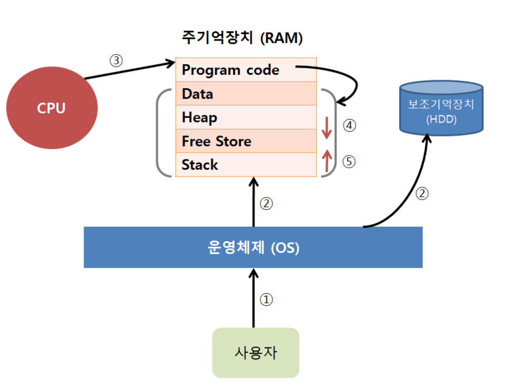
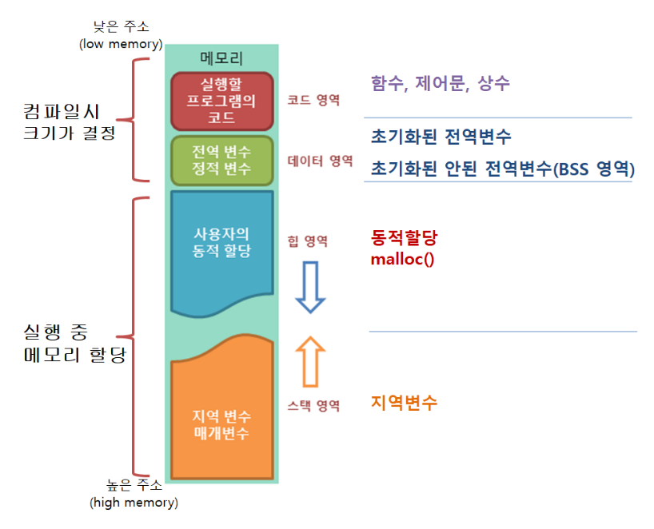
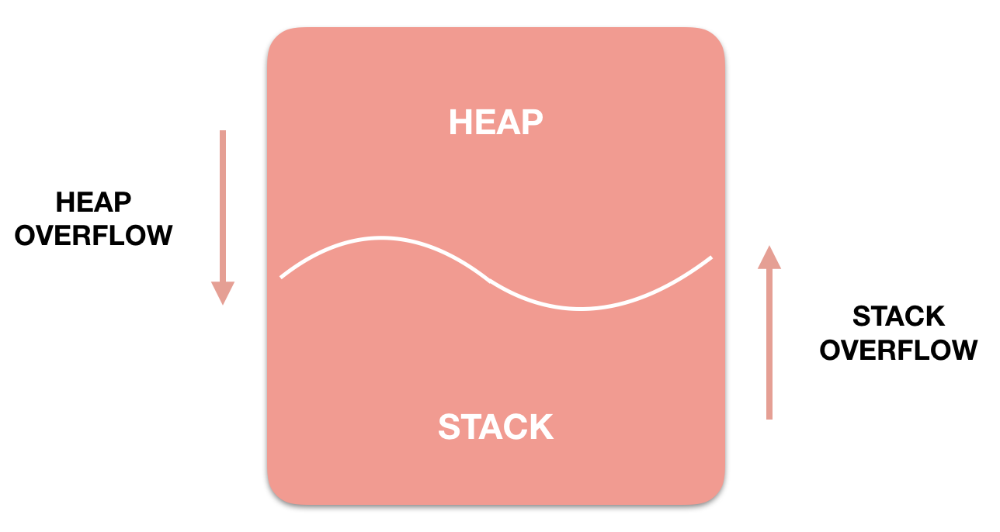
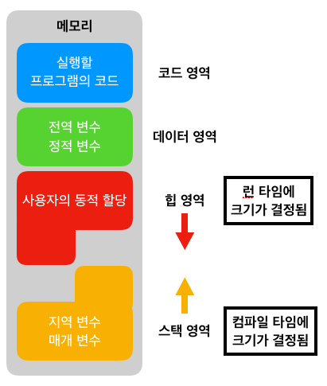

# Memory Structure

---

- 프로그램이 실행되기 위해서는(프로세스), 먼저 프로그램이 메모리에 적재되어야 한다.
- 또한, 프로그램에서 사용되는 변수들을 담을 메모리도 필요하다.
- 컴퓨터의 운영체제는 프로그램을 실행시키기 위해서 다양한 메모리 공간을 제공하고 있다.



프로그램이 실행되어 메모리에 적재되는 과정을 그림으로 표현한다.

> **메모리 구조**
> 
- 프로그램이 실행되기 위해서는 먼저 프로그램이 메모리에 로드(load)되어야 한다.
- 또한, 프로그램에서 사용되는 변수들을 저장할 메모리도 필요하다.
- 따라서 컴퓨터의 운영체제는 프로그램의 실행을 위해 다양한 메모리 공간을 제공하고 있다.
- 프로그램이 운영체제로부터 할당받는 대표적인 메모리 공간은 다음과 같다.
    1. **코드(Code)영역**
    2. **데이터(Data)영역**
    3. **스택(Stack)영역**
    4. **힙(Heap)영역**



# 1. 코드(code) 영역

- 우리가 작성한 **소스코드**가 들어 가는 부분. 즉, 실행할 프로그램의 코드가 저장되는 영역으로 **텍스트(code)영역**이라고도 부른다.
- CPU는 코드 영역에 저장된 명령어를 하나씩 가져가서 처리하게 된다.(윗 줄 읽고 처리, 아랫줄 읽고 처리)
- 실행 파일을 구성하는 명령어들이 올라가는 메모리 영역으로 함수, 제어문, 상수 등이 여기에 지정된다.
- 컴파일된 기계어가 들어간다.

# 2. 데이터(data) 영역

- 메모리의 데이터(data) 영역은 프로그램의 전역 변수와 정적(static) 변수가 저장되는 영역
- 프로그램의 시작과 동시에 할당되고, 프로그램이 종료되어야 메모리가 소멸되는 영역
    
    ```java
    import Foundation
    
    var a: Int = 10;	// 데이터 영역에 할당
    var b: Int = 20;	// 데이터 영역에 할당
    
    func dataFunc()  -> Bool {
        return true
    }
    ```
    
    <aside>
    💡 **정적(static)변수** : 지역 변수의 특성과 전역 변수의 특성을 합친 변수. 특정 함수에만 사용 가능하면서도(지역변수), 함수가 끝나더라도 프로그램 종료 때까지 값이 그대로 유지된다. (전역변수)
    모든 전역 변수들은 정적 변수라고 할 수 있다.
    
    </aside>
    

# 3. 스택(stack) 영역

- 메모리의 스택(stack) 영역은 함수의 호출과 관계되는 지역 변수와 매개변수가 저장되는 영역이다.
- 함수의 호출과 관련이 있는 지역변수와 매개변수가 저장되는 영역이다. 스택 영역은 함수의 호출과 함께 할당되며, 함수의 호출이 완료되면 소멸한다.
- 프로그램이 자동으로 사용하는 임시 메모리 영역이다.
- 스택 영역은 함수의 호출과 함께 할당되며, 함수의 호출이 완료되면 소멸한다.
- 이렇게 스택 영역에 저장되는 함수의 호출 정보를 스택 프레임(stack frame)이라고 한다.
    - 스택 프레임에 대한 더 자세한 사항은 C언어 스택 프레임 수업에서 확인 [C언어 스택 프레임 수업 확인 =>](http://www.tcpschool.com/c/c_memory_stackframe)
- 스택 영역은 푸시(push) 동작으로 데이터를 저장하고, 팝(pop) 동작으로 데이터를 인출한다.
- 이러한 스택은 후입선출(LIFO, Last-In First-Out) 방식에 따라 동작하므로, 가장 늦게 저장된 데이터가 가장 먼저 인출된다.
- 스택 영역은 메모리의 높은 주소에서 낮은 주소의 방향으로 할당된다.
    
    → 스택이 낮은 주소에서 높은 주소로 데이터가 저장 될 경우 큰 데이터들이 저장되어 스택이 커진다면 커널 영역을 침범할 수 있기 때문이다.(커널 영역 보호)
    
    ```java
    import Foundation
    
    var a: Int = 10;	// 데이터 영역에 할당
    var b: Int = 20;	// 데이터 영역에 할당
    
    func dataFunc() -> Bool {
    
      someFunc1(3)
      someFunc2(5)
    
      return true
    }
    
    func someFunc1(c: Int) {
      int d = 30;	
      // 매개변수 c와 지역변수 d가 스택영역에 할당
    }
    
    void someFunc2(e: Int) {
      int f = 40;	
      // 매개변수 e와 지역변수 f가 스택영역에 할당
    }
    ```
    
    <aside>
    💡 **커널**은 운영체제 중 항상 메모리에 올라가 있는 **운영체제의 핵심 부분**으로써 하드웨어와 응용 프로그램 사이에서 **인터페이스를 제공하는 역할**을 하며 **컴퓨터 자원들을 관리하는 역할**을 한다. 즉, 커널은 인터페이스로써 응용 프로그램 수행에 필요한 여러가지 서비스를 제공하고, 여러가지 하드웨어(CPU, 메모리) 등의 리소스를 관리하는 역할
    
    </aside>
    

# 4. 힙(heap) 영역

- 사용자가 직접 관리할 수 있는 영역이다. 사용자에 의해 메모리 공간이 동적으로 할당되고 해제된다.
- 객체의 참조값이 이 힙 영역에 저장되는 대표적인 데이터이다.  흔히 자바에서 사용하는 class와 그 객체들은 이곳에 저장된다.
- Java에서는 가비지 컬렉터가 자동으로 해제합니다.
- 이 공간에 메모리 할당하는 것을 동적 할당(Dynamic Memory Allocation)이라고도 부른다.
- 힙 영역은 메모리의 낮은 주소에서 높은 주소의 방향으로 할당된다.
    
    
    
    - 위의 **HEAP과 STACK영역은 사실 같은 공간**을 공유한다. **HEAP이 메모리 위쪽 주소부터 할당**되면 **STACK은 아래쪽부터 할당**되는 식이다. 그래서 각 영역이 상대 공간을 침범하는 일이 발생할 수 있는데 이를 각각 **HEAP OVERFLOW**, **STACK OVERFLOW**라고 칭한다.
    - **Stack 영역이 크면 클 수록 Heap 영역이 작아지고, Heap 영역이 크면 클수록 Stack 영역이 작아진다.**
- `런타임 시`에 크기가 결정된다.
- 힙 영역은 사용자에 의해 메모리 공간이 동적으로 할당되고 해제된다.
    
    
    
    <aside>
    💡 **메모리의 동적 할당(Dynamic Allocation)**
    
    데이터 영역과 스택 영역에 할당되는 메모리는 컴파일 타임에 미리 결정된다. 그러나 힙 영역의 크기는 프로그램이 실행되는 도중인 런타임(Runtime)에 사용자가 직접 결정하게 된다. 
    
    런타임에 메모리를 할당받는 것을 메모리의 동적 할당이라고 한다.
    
    </aside>