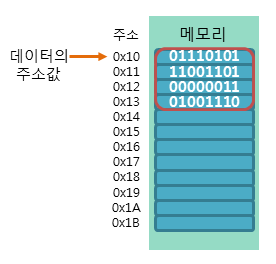
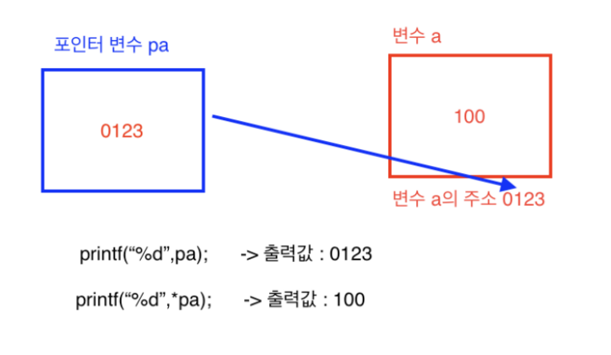

# Pointer

---

### 

> **주소값의 이해**
> 
- 데이터의 주소값이란 해당 데이터가 저장된 메모리의 시작 주소를 의미한다.
    
    
    
- C언어에서는 이러한 주소값을 1바이트 크기의 메모리 공간으로 나누어 표현한다.
- 예를 들어, int형 데이터는 4바이트의 크기를 가지지만, int형 데이터의 주소값은 시작 주소 1바이트만을 가리킨다.



> **포인터란?**
> 
- 포인터(pointer)는 프로그래밍 언어에서 변수의 메모리 공간의 주소를 가리키는 변수를 말한다. 포인터가 가리키는 값을 가져오는 것을 역참조라고 한다.
- char형 변수가 문자를 저장하고, int형 변수가 정수를 저장하는 것처럼 포인터는 주소값을 저장한다.
- 일반적으로 포인터는 메모리 주소로 바꿀 수 있다. 포인터는 다른 변수나 함수를 가리키도록 사용된다.
- 이미 했던 행동을 반복한다는 것은 상당히 비효율적인 일이다. 이것은 컴퓨터에서도 마찬가지인데, 수행한 함수를 반복 수행하기 위해서 함수를 선언하고, 돌릴 필요 없이 메모리 주소를 가리키면서 “이 함수를 수행해.” 라고 하면 된다.
    
    → 이것이 바로 포인터가 필요한 이유이다.
    

### 예제

```sql
int n = 100;   // 변수의 선언

int *ptr = &n; // 포인터의 선언
```

- 다음 그림은 위의 예제에서 사용된 변수와 포인터가 메모리에서 어떻게 저장되는지를 보여주는 예제이다.


> **포인터 타입**
> 
- int, char, double과 같이 변수의 선언 및 구분에 사용되는 키워드를 ‘자료형’ 이라고 하듯이 포인터 변수 선언 및 구분에 사용되는 int*, char*, double* 등을 가리켜 포인터 타입이라고 한다.
    
    → 포인터 타입의 크기는 4바이트로 모두 같다.
    

---

# 1. 포인터 연산자

C언어에서 포인터와 연관되어 사용되는 연산자는 다음과 같다.

### 1) 주소 연산자(&) = 번지연산자

- 주소 연산자는 변수의 이름 앞에 사용하여, 해당 변수의 주소값을 반환한다.
- '&'기호는 앰퍼샌드(ampersand)라고 읽으며, 번지 연산자라고도 불린다.

```c
#include<stdio.h>

void main() {
	int a = 1;

	printf("%p \n", &a); //a의 주소(&a)를 16진수(%p)로 출력

	printf("%d \n", a); //a의 변수값(1)을 정수값(%d)으로 출력
}

//결과
00AFF8CC
1
```

- 포인터 연산자는 변수명 앞에 붙을 경우 메모리 주소를 의미한다. 예를 들어, 변수 a의 메모리 주소는 &a이다.
- ex) num이라는 변수에는 5의 **값**이 저장되어 있다. 그리고 *num이라는 포인터 변수에는 num의 **주소값** 123456이 저장된다.

### 2) 참조 연산자(*) = 포인터 연산자

- 참조 연산자는 포인터의 이름이나 주소 앞에 사용하여, 포인터에 가리키는 주소에 저장된 값을 반환한다.
- C언어에서 '*'기호는 사용하는 위치에 따라 다양한 용도로 사용된다.

```c

#include<stdio.h>

void main() {
	int a = 1;

	int *p; //변수 p를 포인터 변수로 선언
	p = &a; //포인터 변수 p에 변수 a의 주소(&a)를 대입

	printf("%p \n", &a); //변수 a의 주소(&a)를 16진수(%p)로 출력

	printf("%p \n", p); //포인터 변수 p에 들어있는 주소(&a)를 16진수(%p)로 출력
}

//결과
010FFB14
010FFB14
```

- 포인터 연산자 `*` 기호는 변수 앞에 붙을 경우 해당 변수를 포인터 변수로 선언한다.
    
    → 포인터 변수를 만들 때는 변수 이름 앞에 *를 붙여주면 그 변수는 포인터 변수가 된다.
    
- 그리고 ‘*’은 포인터 변수로 선언하는 역할이 아닌 **역참조 연산자** 역할도 하는데, 포인터 변수에 저장된 주소가 가리키는 곳의 데이터를 나타낸다.

```cpp
#include<stdio.h>
void main() {
	int a = 1;

	int *p; //변수 p를 포인터 변수로 선언합
	p = &a; //포인터 변수 p에 변수 a의 주소(&a)를 삽입

	printf("%d", *p); //p에 들어있는 주소를 클릭(*)했을 때의 나오는 결과를 출력
	}                 // p에는 a의 주소값이 저장되어 있으므로 *을 붙의면 a의 주소가 나타내는 곳의 데이터를 가리킨다.

//결과
1
```

# 2. 포인터의 선언

```sql
타입* 포인터이름;
```

- 타입이란 포인터가 가리키고자 하는 변수의 타입을 명시한다.
- 포인터 이름은 포인터가 선언된 후에 포인터에 접근하기 위해 사용된다.
- 포인터를 선언한 후 참조 연산자(*)를 사용하기 전에 포인터는 반드시 먼저 초기화되어야 한다. 그렇지 않으면, 의도하지 않은 메모리의 값을 변경하게 되기 때문이다.
- 따라서 C 컴파일러는 초기화하지 않은 포인터에 참조 연산자를 사용하면 오류를 발생시킨다.
- 따라서 다음과 같이 포인터의 선언과 동시에 초기화를 함께 하는 것이 좋다.

```sql
타입* 포인터이름 = &변수이름;

또는

타입* 포인터이름 = 주소값;
```

# 3. 포인터의 참조

- C언어에서 선언된 포인터는 참조 연산자(*)를 사용하여 참조할 수 있다.
- 포인터의 주소값과 함께 포인터가 가리키고 있는 주소값의 데이터를 참조하는 예제

```sql
int x = 7;        // 변수의 선언

int *ptr = &x;    // 포인터의 선언

int *pptr = &ptr; // 포인터의 참조
```


```sql
int num01 = 1234;
double num02 = 3.14;  
int* ptr_num01 = &num01;
double* ptr_num02 = &num02;  

① printf("포인터의 크기는 %d입니다.\n", sizeof(ptr_num01));
② printf("포인터 ptr_num01이 가리키고 있는 주소값은 %#x입니다.\n", ptr_num01);
③ printf("포인터 ptr_num02가 가리키고 있는 주소값은 %#x입니다.\n", ptr_num02);

printf("포인터 ptr_num01이 가리키고 있는 주소에 저장된 값은 %d입니다.\n", *ptr_num01);
printf("포인터 ptr_num02가 가리키고 있는 주소에 저장된 값은 %f입니다.\n", *ptr_num02);

**<실행 결과>**
포인터의 크기는 8입니다.
포인터 ptr_num01이 가리키고 있는 주소값은 0x7c255e4입니다.
포인터 ptr_num02가 가리키고 있는 주소값은 0x7c255e8입니다.
포인터 ptr_num01이 가리키고 있는 주소에 저장된 값은 1234입니다.
포인터 ptr_num02가 가리키고 있는 주소에 저장된 값은 3.140000입니다.
```

- 위 예제의 ①번 라인에서는 sizeof 연산자를 사용하여 포인터 변수의 크기를 구하고 있다. 포인터 변수는 메모리에서 변수의 위치를 나타내는 주소를 다루는 변수이므로, 그 크기는 일반적으로 CPU에 따라 결정된다. 따라서 32비트 CPU에서는 1워드(word)의 크기가 4바이트이므로, 포인터 변수의 크기 또한 4바이트가 된다.
- 하지만 이러한 포인터 변수의 크기는 컴파일러로 컴파일할 때 그 크기까지 직접 명시할 수 있다. 따라서 포인터 변수의 크기는 CPU의 종류와 컴파일할 때 사용된 컴파일러의 정책에 따라서 달라질 수 있다.
- 또한, ②번과 ③번 라인에서 처럼 포인터가 가리키는 변수의 타입에 따라 포인터의 타입도 같이 바꿔주고 있다. 포인터의 타입은 참조 연산자를 통해 값을 참조할 때, 참조할 메모리의 크기를 알려주는 역할을 하기 때문이다.
- 다음 그림은 char형 포인터와 int형 포인터가 각각 메모리 상에서 해당 타입의 변수를 가리키는 것을 보여준다.


# 4. 포인터 연산

- 포인터는 값을 증가시키거나 감소시키는 등의 제한된 연산만을 할 수 있다.
- C언어의 포인터 연산에는 다음과 같은 규칙이 있다.
    - 1. 포인터끼리의 덧셈, 곱셈, 나눗셈은 아무런 의미가 없다.
    - 2. 포인터끼리의 뺄셈은 두 포인터 사이의 상대적 거리를 나타낸다.
    - 3. 포인터에 정수를 더하거나 뺄 수는 있지만, 실수와의 연산은 허용하지 않는다.
    - 4. 포인터끼리 대입하거나 비교할 수 있다.

- 타입에 따른 포인터 연산의 증가값을 비교하는 예제

```sql
char* ptr_char = 0;
int* ptr_int = NULL;
double* ptr_double = 0x00;  

printf("포인터 ptr_char가 현재 가리키고 있는 주소값은 %#x입니다.\n", ptr_char);
printf("포인터 ptr_int가 현재 가리키고 있는 주소값은 %#x입니다.\n", ptr_int);
printf("포인터 ptr_double이 현재 가리키고 있는 주소값은 %#x입니다.\n", ptr_double);
printf("포인터 ptr_char가 1 증가 후에 가리키고 있는 주소값은 %#x입니다.\n", ++ptr_char);
printf("포인터 ptr_int가 1 증가 후에 가리키고 있는 주소값은 %#x입니다.\n", ++ptr_int);
printf("포인터 ptr_double이 1 증가 후에 가리키고 있는 주소값은 %#x입니다.\n", ++ptr_double);
```

```sql
**<실행 결과>**

포인터   ptr_char가 현재 가리키고 있는 주소값은 0입니다.
포인터    ptr_int가 현재 가리키고 있는 주소값은 0입니다.
포인터 ptr_double이 현재 가리키고 있는 주소값은 0입니다.
포인터   ptr_char가 1 증가 후에 가리키고 있는 주소값은 0x1입니다.
포인터    ptr_int가 1 증가 후에 가리키고 있는 주소값은 0x4입니다.
포인터 ptr_double이 1 증가 후에 가리키고 있는 주소값은 0x8입니다.
```

- 위의 예제에서 모든 포인터에 저장된 초기 주소값은 0x00 이다.
- 하지만 1을 증가시키는 포인터 연산 후 포인터가 가리키고 있는 주소는 각각의 포인터 타입에 따라 달라진다.
- 그 증가 폭은 포인터가 가리키는 변수의 타입의 크기와 같게 된다.


- 예를 들어, int형 포인터의 증가폭은 int형 타입의 크기인 4바이트만큼 증가하게 된다. 이 법칙은 포인터의 뺄셈에서도 똑같이 적용된다.
- 포인터끼리의 비교 연산과 대입 연산을 보여주는 예제

```sql
int num01 = 10;
int num02 = 20;
int *ptr_num01 = &num01;
int *ptr_num02 = &num02;  

if (ptr_num01 != ptr_num02) // 포인터끼리의 비교 연산{
    printf("포인터 ptr_num01이 가리키고 있는 주소에 저장된 값은 %d입니다.\n", *ptr_num01);
    printf("포인터 ptr_num02가 가리키고 있는 주소에 저장된 값은 %d입니다.\n", *ptr_num02);
		printf("포인터 ptr_num01과 ptr_num02는 현재 다른 주소를 가리키고 있습니다.\n\n");
    ptr_num02 = ptr_num01; // 포인터끼리의 대입 연산
}  

printf("포인터 ptr_num01이 가리키고 있는 주소에 저장된 값은 %d입니다.\n", *ptr_num01);
printf("포인터 ptr_num02가 가리키고 있는 주소에 저장된 값은 %d입니다.\n", *ptr_num02);  

if (ptr_num01 == ptr_num02) // 포인터끼리의 비교 연산{
    printf("포인터 ptr_num01과 ptr_num02는 현재 같은 주소를 가리키고 있습니다.\n");
}
```

**<실행결과>**

```
포인터 ptr_num01이 가리키고 있는 주소에 저장된 값은 10입니다.
포인터 ptr_num02가 가리키고 있는 주소에 저장된 값은 20입니다.
포인터 ptr_num01과 ptr_num02는 현재 다른 주소를 가리키고 있습니다.
포인터 ptr_num01이 가리키고 있는 주소에 저장된 값은 10입니다.
포인터 ptr_num02가 가리키고 있는 주소에 저장된 값은 10입니다.
포인터 ptr_num01과 ptr_num02는 현재 같은 주소를 가리키고 있습니다.
```