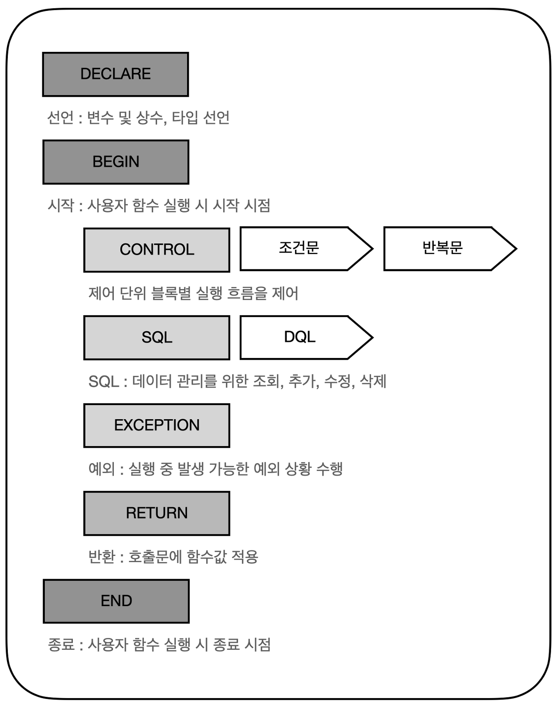

# Procedure

---

> **절차형 SQL**
> 
- 일반적인 언어형식과 같이 절차적으로 명령을 수행하는 SQL을 뜻한다.
- 절차형 SQL은 DBMS 엔진에서 실행되고 단일 SQL 문장으로 실행하기 어려운 연속적인 작업 처리가 가능하다.
- 또한 **로직(트랜잭션)을 캡슐화(접근제어 방식)할 수 있기 때문에** 반복적인 DB 작업을 효율적으로 수행하고 소프트웨어 개발 생산성을 높인다는 장점이 있다.
- **원자성을 보장받기 위해 트랜잭션 사용한다.** → 실행되려면 다 실행되고 실행 되지 않으면 다 실행하지 않음 → commit은 맨 마지막에.
- DB의 원자성을 준수하기 위해 프로시저를 사용한다.
- * 참고 > SOLID 원칙( 객체지향의 특징 )

# 1. 프로시저

- DB 에 대한 일련의 작업을 정리한 절차를 관계형 데이터베이스 관리 시스템에 저장한 것이다.
- 넓은 의미로 어떠한 업무를 수행하기 위한 절차를 뜻한다.
- 프로시저는 프로시저명을 호출해서 실행된다.
- 쿼리문을 하나의 메서드 형식으로 만들고 어떤 동작을 일괄적으로 처리하는 용도로 쓰인다.
    
    → 여러 개의 쿼리를 한 번에 수행한다.
    
- 만약 여러 개의 칼럼을 조회하거나, 여러 개의 테이블을 조회하려고 할 때, 이것을 하나의 쿼리문으로 만들려면 복잡하고 긴 쿼리문이 생성한다. 이렇게 여러 개의 쿼리를 사용할 때 일일이 긴 쿼리문을 사용하게 된다면 불편하기에 이를 프로시저에 저장하여 호출한다.
- 하나의 요청으로 여러 SQL문을 실행시킬 수 있기 때문에 네트워크 부하를 줄일 수 있다.
- 컴퓨터 작업중에서 제일 많은 메모리가 소요되는 작업이 IO과정이다 → 모든 정보가 메모리에 직접적으로 저장된다는 것은 메모리의 자원을 인풋, 아웃풋 자원을 많이 사용한다는 의미다.
    - 프로시저는 모든 절차형이 완료되는 한번의 IO만 발생한다.
- API처럼 여러 애플리케이션과 공유가 가능하다(주문서 → 요청하면 그에 대한 결과가 나온다.)
- 하나의 거대한 프로그램에서 API 사용해서 다른 어플리케이션과 공유가 가능하다  → 지도, 메세지, 다른 프로그램에서도 같은 프로시저 사용 가능
- 특정한 기능을 변경 시 프로시저만 변경하면 되기에 기능 변경이 편리하다.(isolation → 다른 연산 결과에 영향을 받지 않아야 함)
    - ex) p_login_check
- 프로시저가 앱의 어디에 사용되는 지 확인이 어렵기에 유지보수가 어렵다.
- 문자나 숫자 연산에 프로시저를 사용하면 오히려 C나 JAVA ( jdbc-oracle 통신 과정이 없어져서 빠름)보다 처리 성능이 느리다. 프로시저는 DB작업을 하기 위함임.
- 프로시저는 I/O가 발생한다.
- 함수와 비슷하다. 함수와의 차이점도 알아두자

## 가. **프로시저 구조**


| 구성요소 | 설명 |
| --- | --- |
| 선언부(DECLARE) | 프로시저의 명칭, 변수와 인수 그리고 그에 대한 데이터 타입을 정의하는 부분 |
| 시작/종료부(BEGIN/END) | 프로시저의 시작과 종료를 표현하며, BEGIN/END가 쌍을 이룸. 다수 실행을 제어하는 기본적 단위가 되며 논리적 프로세스를 구성 |
| 제어부(CONTROL) | 기본적으로는 순차적으로 처리조건문과 반복문을 이용하여 문장을 처리 |
| SQL | DML을 주로 사용자주 사용되지 않지만 DDL 중 TRUNCATE 사용 |
| 예외부(EXCEPTION) | BEGIN~END절에서 실행되는 SQL문이 실행될 때 예외 발생 시 예외 처리 방법을 정의하는 처리부 |
| 실행부(TRANSACTION) | 트리거에서 수행된 DML 수행 내역의 DBMS의 적용 또는 취소 여부를 결정하는 처리부 |

### 1) **선언부(DECLARE)**

```jsx
-- 생성문 시작
CREATE OR REPLACE PROCEDURE 프로시저_명
(
    -- 프로시저 실행 시 받을 매개변수는 CREATE 안에 작성
    param1 IN NUMBER
  , param2 IN VARCHAR2
)

-- 프로시저에서 선언할 변수는 IS 뒤에 작성
IS
param3 IN VARCHAR2(20) := "CodingStudy";

-- 실행 내용은 BEGIN 뒤에 작성
BEGIN

-- 단순 INSERT 문
INSERT INTO TEST_TABLE
(NO, NAME, SITE)
VALUE
(param1, param2, param3)
;

END 프로시저_명;
```

| 구성 | 설명 |
| --- | --- |
| CREATE | DBMS 내에 객체(트리거, 함수, 프로시저)를 생성OR REPLACE 는 기존 프로시저 존재 시 현재 컴파일 하는 내용으로 덮어씀(같은 이름의 프로시저가 존재할 경우 OR REPLACE 가 없으면 에러 발생) |
| PROCEDURE | 프로시저(PROCEDURE)를 사용한다는 의미 |
| 프로시저_명 | 해당 프로시저를 지칭하는 이름 |
| 파라미터_명 | 프로시저와 운영체제 간 필요한 값을 전송하기 위한 인자 |
| MODE | 변수의 입출력을 구분1. IN(프로시저로 값 전달)2. OUT(프로시저에서 처리된 결과)3. INOUT(IN과 OUT의 두 가지 기능을 모두 수행)3가지로 구성 |
| 데이터_타입 | 파라미터에 대한 데이터 타입 |
| IS/AS | PL/SQL 의 블록을 시작IS 또는 AS 를 작성 |
| 변수 선언 | 프로시저 내에서 사용할 변수와 변수에 대한 초깃값을 설정 |

<aside>
💡 **프로시저 문법**

- OR REPLACE : 기존 프로시저 존재 시 내용을 대체 한다는 명령어이다.
- !!!! 작성안하고 중복되는 프로시저명을 작성하면, 이미 정의된 프로시저라고 실행안됨.
- !!!! 위험 : 이전의 로직 다 날아가버림. 이미 사용되어 있는 프로시저가 대체 됨. 신중하게 사용!!!!
- IN : 변수값을 입력받고 프로시저로 전달한다.
- OUT: 프로시저로 처리된 결과를 리턴한다.
- INOUT: 변수값을 받고 프로시저 처리 후 리턴한다.
- COMMIT: 하나의 트랜잭션이 성공적으로 끝나고 데이터베이스가 일관적인 상태로 끝났을 때 사용한다
- ROLLBACK: 하나의 트래잭션이 비정상적으로 끝나 처음부터 다시 시작하거나 부분적으로 연산을 취소할 때 사용한다.
</aside>

- 예시) 프로시저 선언

```
CREATE OR REPLACE PROCEDURE GET_TIER(in_name IN VARCHAR2,out_tier OUT VARCHAR2)

IS

BEGIN
	
    SELECT TIER INTO out_tier FROM SUMMONER_TB WHERE NAME = in_name;

EXCEPTION
  --소환사를 찾을 수 없을 때
  WEHN NO_DATA_FOUND THEN
  
    out_tier:='NO_SUMMONER_FOUND';

END GET_TIER;
```

- 예시) 프로시저 실행

```jsx
EXEC TEST_PROC(1000,'abc');
```

- 예시) 프로시저 조회

```java
DECLARE
출력될 변수 선언
실행할 프로시저
출력문(Optional)
END

DECLARE
out_tier VARCHAR2(10);
BEGIN get_tier('faker',out_tier);
DBMS_OUTPUT.PUT_LINE(out_tier);
END;
```

- 예시) 프로시저 삭제

```sql
DROP PROCEDURE 프로시저명;

DROP PROCEDURE GET_TIER;
```

### 2) 시작/종료부(BEGIN/END)

- 프로시저의 실행 시작과 종료를 알려주는 부분으로 BEGIN, END는 프로시저에 반드시 포함되어야 한다.

| 구성 | 설명 |
| --- | --- |
| BEGIN | 프로시저의 시작 |
| END | 프로시저의 종료 |

### 3) 제어부(CONTROL)

- 실행흐름을 제어하는 부분으로 조건문과 반복문으로 나뉜다.

- **조건문**
    
    ```java
    -- IF
    IF 조건 THEN
      문장;
    ELSIF 조건 THEN
      문장;
    ELSE
      문장;
    END IF;
    
    -- CASE 변수
    CASE 변수
      WHEN 값1 THEN
        SET 명령어;
      WHEN 값2 THEN
        SET 명령어;
      ELSE
        SET 명령어;
    END CASE;
    
    -- CASE
    CASE
      WHEN 조건1 THEN
        SET 명령어;
      WHEN 조건2 THEN
        SET 명령어;
      ELSE
        SET 명령어;
    END CASE;
    ```
    
- **반복문**
    
    ```java
    -- LOOP
    LOOP
      문장;
      EXIT WHEN 탈출조건;
    END LOOP;
    
    -- WHILE
    WHILE 반복 조건 LOOP
      문장;
      EXIT WHEN 탈출조건;
    END LOOP;
    
    -- FOR LOOP
    FOR 인덱스 IN 시작 값 .. 종료 값
      LOOP
      문장;
    END LOOP;
    ```
    

### 4) 예외부(EXCEPTION)

- 실행 중 발생 가능한 예외상황을 수행하는 부분이다.

```java
EXCEPTION
  WHEN 조건 THEN
    SET 명령어;
```

- **실행부(TRANCSTION)**
    
    해당 프로시저에서 수행한 DML을 DBMS에 반영할지 복구할지를 결정하는 부분이다.
    
    | 구성 | 설명 |
    | --- | --- |
    | COMMIT | 하나의 트랜잭션이 성공적으로 끝나고, 데이터베이스가 일관성이 있는 상태에 있을 때 하나의 트랜잭션이 끝났을 때 사용 |
    | ROLLBACK | 하나의 트랜잭션이 비정상적으로 종료되어 트랜잭션 원자성이 깨질 경우 처음부터 다시 시작하거나, 부분적으로 연산을 취소할 때 사용 |

## 나. 정리

- **프로시저 호출문**

```java
EXECUTE 프로시저_명(파라미터_명1, 파라미터_명2, ...);
```

- 1) 프로시저 생성

```java
CREATE OR REPLACE PROCEDURE TEST_PROCEDURE -- TEST_PROCEDURE 프로시저 생성
(
V_DATE IN CHAR(8) -- 파라미터 !!!! 밖에서 받거나, 리턴하기 위해
)
IS
V_TOT_CNT NUMBER := 0; -- 내부에서 사용할 변수 !!!! 안에서만 사용함.

BEGIN -- 프로시저 시작

-- 제어부
IF V_DATE < "20210215" THEN
SET
  V_DATE = "20210201";
END IF;

-- SQL
SELECT SUM(C_CNT)
INTO V_TOT_CNT 
FROM TEST_TABLE
WHERE C_DATE = V_DATE;
-- SELECT 문에서 나온 결과는 INTO 문에 선언된 변수에 값이 전달
-- (SELECT에서 조회된 결과가 없을 경우에는 NO_DATA_FOUND 라는 결과가 발생합니다.)

-- 예외부
EXCEPTION
WHEN NO_DATA_FOUND THEN
SET V_TOT_CNT = 0;

INSERT INTO TEST_TABLE(
C_DATE,
C_CNT
)
VALUES(
V_DATE,
V_TOT_CNT
);

COMMIT; -- 트랜잭션 완료
END; -- 프로시저 종료
```

- 2) 프로시저 **실행방법**

```java
EXECUTE TEST_PROCEDURE('20210205');
```

# 2. **사용자 정의함수(User-Defined Function)**

- 절차형 SQL을 사용하여 일련의 SQL 처리를 수행한다. 프로시저와 사용법이 동일하다. 하지만 수행 결과를 단일 값으로 반환 한다는 특징이 있다.
- 하나의 특별한 목적의 작업을 수행하기 위해 독립적으로 설계된 코드의 집합이다.
- 즉, 함수가 여러 작업을 위한 기능이라면 프로시저는 작업을 정리한 절차다.
- 보통 로직을 도와주는 역할이며, 간단한 계산, 수치 등을 나타낼 때 사용한다.
- 프로시저에는 OUT 변수가 없어도 된다. 결과값을 굳이 반환하지 않아도 된다. ex) CRUD 실행 후 끝나도 됨.
- 함수는 반드시 OUT값이 있어야 한다. ex) 부서코드로 부서를 가져온다.  결과값을 가져오기 위해 필요한 로직. 결과값은 단일값이다.(ROW가 1개다) ex) 스칼라 서브쿼리(select절)
- SQL부에서 INSERT, UPDATE, DELETE를 통한 데이터 조작은 할 수 없다. SELECT를 통한 조회만 가능하다.
    
    → AUTOCOMMIT : DCL / DDL ,  SQL*PLUS가 정상 종료된 경우
    
    원자성 보장을 제대로 보장 받을 수 없기 때문에 SELECT만 가능하다.
    

## 가. 사용자 정의함수 구성

- 기본적인 개념 및 사용법, 문법 등은 프로시저와 동일하다.
- 종료 시 단일 값을 반환한다는 것이 프로시저와 가장 큰 차이점이다.
- 사용자 정의함수의 호출을 통해 실행되며, 반환되는 단일 값을 조회 또는 삽입, 수정 작업에 이용하는 것이 일반적이다.



| 구성요소 | 설명 |
| --- | --- |
| 선언부(DECLARE) | 사용자 정의함수의 명칭, 변수와 인수 그리고 그에 대한 데이터 타입을 정의하는 부분 |
| 시작/종료부(BEGIN/END) | 사용자 정의함수의 시작과 종료를 표현하는데 필수적이며 BEGIN/END가 쌍을 이루어 추가되므로 블록으로 구성. 다수 실행을 제어하는 기본적 단위가 되며 논리적 프로세스를 구성 |
| 제어부(CONTROL) | 기본적으로는 순차적으로 처리비교 조건에 따라 블록 또는 문장을 실행조건에 따라 반복 실행 |
| SQL | 조회 용도로 SELECT 문을 사용데이터를 조작하는 INSERT, UPDATE, DELETE 는 사용할 수 없음 |
| 예외부(EXCEPTION) | BEGIN~END 절에서 실행되는 SQL문이 실행될 때 예외 발생 시 예외 처리 방법을 정의하는 처리부 |
| 반환부(RETURN) | 호출문에 대한 함수 값을 반환 |

### 1) **선언부(DECLARE)**

```java
CREATE FUNCTION 함수명
(
파라미터_명 MODE 데이터_타입
)
IS
RETURN 데이터_타입
변수 선언

CREATE OR REPLACE FUNCTION 함수명
(
파라미터_명 MODE 데이터_타입
)
AS
RETURN 데이터_타입
변수 선언
```

| 구성 | 설명 |
| --- | --- |
| CREATE | DBMS 내에 객체(트리거, 함수, 프로시저)를 생성OR REPLACE 는 기존 사용자 정의함수가 존재 시 현재 컴파일 하는 내용으로 덮어씀(같은 이름의 사용자 정의함수가 존재할 경우 OR REPLACE 가 없으면 에러 발생) |
| FUNCTION | 사용자 정의함수(FUNCTION)를 사용한다는 의미 |
| 함수명 | 해당 사용자 정의함수를 지칭하는 이름 |
| 파라미터_명 | 사용자 정의함수와 운영체제 간 필요한 값을 전송하기 위한 인자 |
| MODE | 변수의 입출력을 구분1. IN(사용자 정의함수로 값 전달)2. OUT(사용자 정의함수에서 처리된 결과)3. INOUT(IN과 OUT의 두 가지 기능을 모두 수행)3가지로 구성 |
| 데이터_타입 | 파라미터에 대한 데이터 타입 |
| IS/AS | PL/SQL 의 블록을 시작IS 또는 AS 를 작성 |
| 변수 선언 | 사용자 정의함수 내에서 사용할 변수와 변수에 대한 초깃값을 설정 |

### 2) 시작/종료부(BEGIN/END)

- 사용자 정의함수의 실행 시작과 종료를 알려주는 부분으로 사용자 정의함수에 BEGIN, END 는 반드시 포함되어야 한다.

### 3) 제어부(CONTROL)

- 단위 블록별 실행흐름을 제어하는 부분으로 크게 IF문과 CASE문으로 나뉜다.

### 4) SQL

- 데이터 관리를 위한 조회, 추가, 수정, 삭제를 수행하는 부분이다.
- INSERT, UPDATE, DELETE 를 통한 데이터 조작은 할 수 없다. **SELECT 를 통한 조회만 가능하다.**
- !!!!!! 현 RDBMS → autoCommit ;
- !!!autocommit 정리하기 DCL, DDL의 경우 자동커밋. . 함수가 하나가 실행되고 완료되면 트랜잭션 하나가 끝나서 오토커밋. >> 원자성 보장 안될 수도 있음. ; 그다음 로직에서 에러 생기면 롤백할때 원자성 보장 안됨. so, 함수는 dml 안쓰고 select만 해라.

### 5) 예외부(EXCEPTION)

- 실행 중 발생 가능한 예외상황을 수행하는 부분이다.

### 6) 반환부(RETURN)

RETURN 명령을 통해 사용자 정의함수 종료 시 사용자 정의함수를 호출한 쿼리에 반환하는 단일값을 정의한다.

### 7) 사용자 정의함수 호출문

```sql
함수명(파라미터1, 파라미터2, ...)
```

## 나. 사용자 정의함수(User-Defined Function) 예시

### 1) 작성

```sql
-- 선언부
CREATE FUNCTION TEST_FUNC
(
V_DATE IN CHAR(8)
)
IS

-- 시작/종료부
BEGIN
  V_CURR_YEAR CHAR(4);
  V_BIRTH_YEAR CHAR(4);
  V_AGE NUMBER;

-- 제어부
IF V_DATE > "21210216" THEN
SET
  V_DATE = "20191231";
END IF;

-- SQL
SELECT TO_CHAR(SYSDATE, 'YYYY'), SUBSTR(V_DATE, 1, 4)
INTO V_CURR_YEAR, V_BIRTH_YEAR
FROM DUAL;

SET V_AGE = TO_NUMBER(V_CURR_YEAR) - TO_NUMBER(V_BIRTH_YEAR) + 1;

-- 반환부
RETURN V_AGE;

END;
```

### 2) 실행방법

```sql
SELECT TEST_FUNC('19900101') FROM DUAL;
```

```sql
UPDATE TABLE_NAME
SET COL_1 = TEST_FUNC(COL_2)
WHERE COL_2 = '20201031';
```

# 3. **프로시저와 함수 차이점**

| 프로시저 | 함수 |
| --- | --- |
| 특정한 작업을 수행한다 | 특정한 계산을 수행한다 |
| 리턴값을 가질 수 도 있고 안가질 수도 있다 | 리턴값은 반드시 가져야 한다. |
| 리턴값을 여러개 가질 수 있다 | 오직 하나의 리턴 값을 가질 수 있다 |
| 서버(DB)에서 기술 | 화면(Client)에서 기술 |
|  |  |
| 단독으로 문장 구성이 가능하다 | 단독으로 문장 구성이 불가능하다 |
- **함수는 프로시저를 포함하고 있는 개념**이다.
- 이러한 프로시저를 포함한 함수들이 여러개 모여 하나의 프로그램을 구성하는 것을
    
    **절차지향적 프로그래밍**이라고 한다.
    

- DB에 직적적인 작업을 위해 프로시저 사용함. 함수같은 경우는, 반환값을 직접 화면에서 보기위해 사용.
- 함수같은 경우는, 수식 내에서 사용하는 것.

참고> 절차형SQL -  트리거 학습