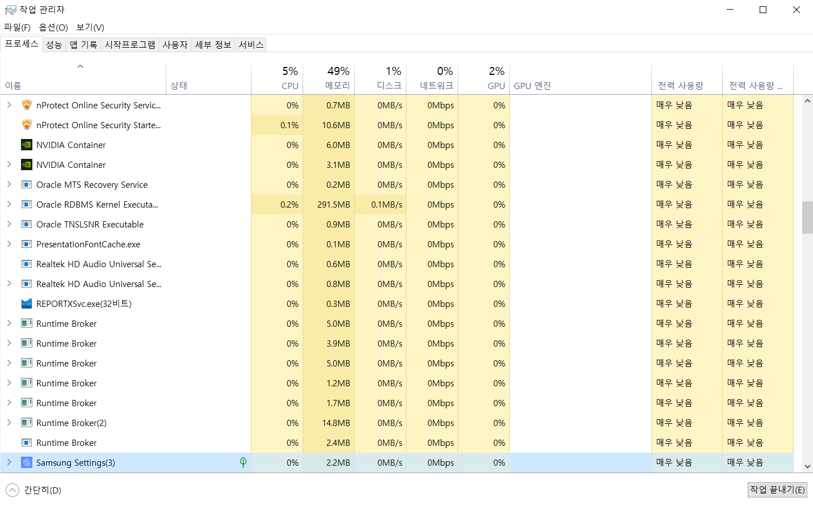
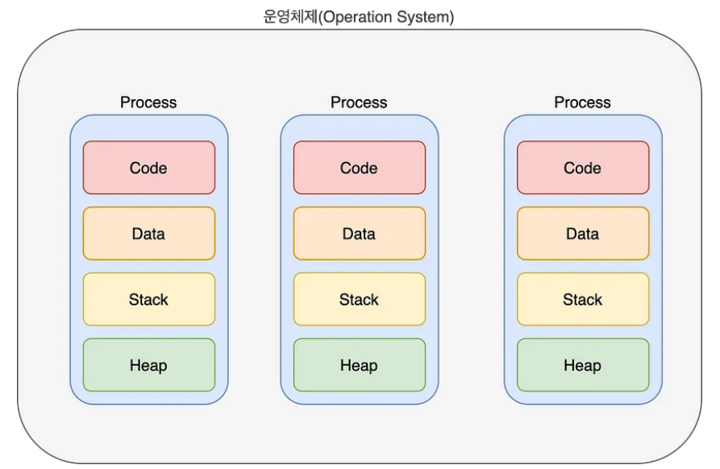
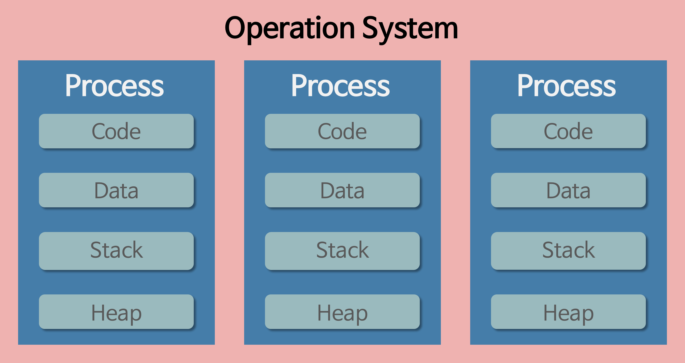
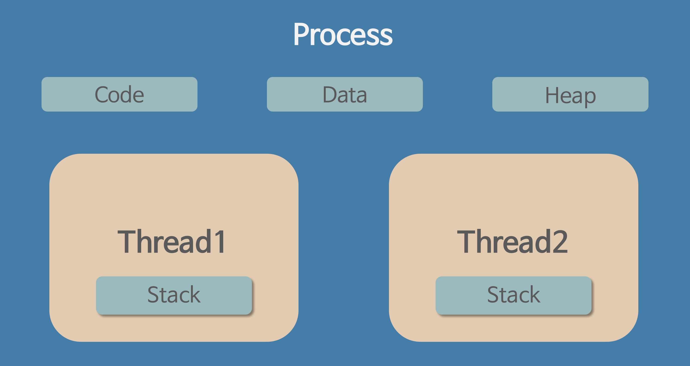
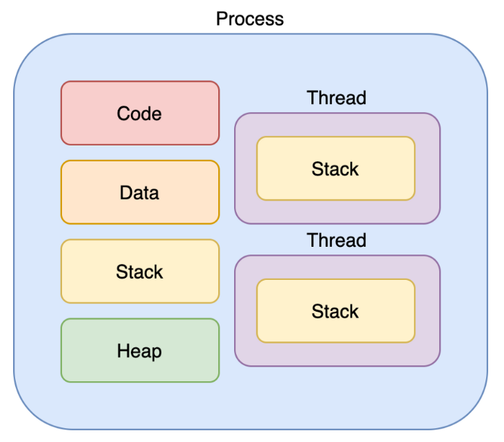

# Process/Thread

---

# 1. 프로그램(Program) 이란

“어떤 작업을 위해 실행할 수 있는 파일”

# 2. 프로세스(Process) 란

- 프로그램은 하드디스크 등의 저장공간에 저장되어 있는 코드와 리소스 등이 집합된 파일을 말하고, 이 프로그램이 실행되면 메모리에 올라가서 프로세스로 동작한다. 즉, 실행되는 프로그램들은 프로세스라고 한다.
- “컴퓨터에서 연속적으로 실행되고 있는 컴퓨터 프로그램”
- 메모리에 적재되고 CPU 자원을 할당받아 프로그램이 실행되고 있는 상태
- **운영체제로부터 시스템 자원을 할당받는 작업의 단위**
- 즉, 동적인 개념으로는 실행된 프로그램을 의미
- 예) CPU 시간, 운영되기 위해 필요한 주소 공간, Code, Data, Stack, Heap의 구조로 되어 있는 독립된 메모리 영역
    
    
    
    
    작업관리자에서 볼 수 있는 프로세스 목록. 운영체제(OS)를 통해 여러 프로세스를 처리할 수 있다. 이를 멀티태스킹이라고 한다.
    
    
    
- 그림에서는 여러 프로세스가 실행되고 있는 것처럼 보이지만, CPU는 한 번에 한 가지 명령어밖에 실행하지 못한다. CPU의 속도는 엄청나게 빠르지만, 프로세스들을 번갈아가며 실행시키는 것이 사실은 동시에 처리하는 것처럼 보이는 것 뿐이다. 이를 **문맥교환(Context Swiching)**이라고 한다.
    
    

<aside>
💡 **멀티태스킹**

OS를 통해 CPU가 작업하는데 필요한 자원(시간)을 프로세스 또는 스레드 간에 나누는 행위를 말한다. 이를 통해서 여러 프로그램을 동시에 열고 작업할 수 있다.

</aside>

<aside>
💡 **CPU Scheduler**

스케쥴러는 레디 큐(queue)에 존재하는 프로세스들을 특정한 우선순위를 기반으로 CPU를 할당 받게 해주는 역할이다.

</aside>

## 2-1. **특징**

- 프로세스는 각각 독립된 메모리 영역(Code, Data, Stack, Heap의 구조)을 할당받는다.
- 기본적으로 프로세스당 최소 1개의 스레드(메인 스레드)를 가지고 있다.
- 각 프로세스는 별도의 주소 공간에서 실행되며, 한 프로세스는 다른 프로세스의 변수나 자료구조에 접근할 수 없다. → 데드락 발생 방지 위해, 해킹, 폐쇄적 → 외부침입으로부터 안전
- 한 프로세스가 다른 프로세스의 자원에 접근하려면 프로세스 간의 통신(IPC, inter-process communication)을 사용해야 한다.
- 예) 파이프, 파일, 소켓 등을 이용한 통신 방법 이용
    
    🍏 파이프를 통해 직렬화해서 데이터 보냄, 데이터를 묶는 것 → 직렬화
    
    🍏프로세스 안에 stack 선형, heap 비선형 자료들이 있다.
    
- 참고
    - data : 카톡 안에서 대화 내역들
    - code : 동작하기 위한 코드
    - stack : 프로세스 처리
    - heap : 트리 구조 → 탐색 ex) 카톡 대화찾기 기능

# 3. 스레드(Thread) 란

- 프로세스보다도 작은 실행 흐름의 최소 단위. 프로세스 내에서 실제로 작업을 수행하는 주체.
- 프로세스가 할당받은 자원을 이용하는 실행의 단위
- 일반적으로 하나의 프로그램은 하나 이상의 프로세스를 가지고 있고, 반드시 하나 이상의 스레드를 갖는다. 즉, 프로세스를 생성하면 기본적으로 하나의 (메인) 스레드가 생성되는 셈이다.

<aside>
💡 **멀티스레드와 싱글스레드**

- **멀티스레드**
    
    하나의 프로세스 내에서 둘 이상의 스레드가 동시에 작업을 수행하는 것을 의미한다.
    
- **싱글스레드**
    
    하나의 스레드가 작업을 수행하는 것을 의미한다.
    
</aside>

<aside>
💡 **멀티 프로세싱과 멀티 스레드 차이**

- **멀티 프로세싱(Multi-Processing)**
    
    문맥교환이 발생하면 캐시에 존재하는 모든 데이터를 리셋하고 다시 정보를 불러와야 한다. 과부하(Overhead)가 커서 비용이 크다.
    
    각 프로세스들 간에 복잡한 IPC를 사용하여 통신해야 한다.
    
    여러 프로세스들 중 하나에 문제가 발생하면 문제가 발생한 프로세스에만 이상이 생기고 다른 프로세스에는 영향을 주지 않는다.
    
    한 프로세스는 다른 프로세스의 변수나 자료구조에 접근할 수 없다. →데드락 발생 방지 위해. 폐쇄적으로써 외부 침입을 방지할 수 있다.
    
- **멀티 스레딩(Multi-Threading)**
    
    멀티 프로세싱에 비해 자원 소모가 덜 하기 때문에 자원을 보다 더 효율적으로 관리할 수 있다.
    
    프로세스 내에 data, code, heap 영역을 공유하기 때문에 통신이 간단하다.
    
    하나의 스레드에 문제가 발생하면 전체 프로세스에 영향을 준다.
    
</aside>

## 3-1. **특징**

- 스레드는 프로세스 내에서 각각 Stack만 따로 할당받고 Code, Data, Heap 영역은 공유한다.
    
    🍏ex) 카톡대화방 - 개인마다 다름.
    
- 스레드는 한 프로세스 내에서 동작되는 여러 실행의 흐름으로, 프로세스 내의 주소 공간이나 자원들(힙 공간 등)을 같은 프로세스 내에 스레드끼리 공유하면서 실행된다.
- 같은 프로세스 안에 있는 여러 스레드들은 같은 힙 공간을 공유한다. 반면에 프로세스는 다른 프로세스의 메모리에 직접 접근할 수 없다.
- 각각의 스레드는 별도의 레지스터와 스택을 갖고 있지만, 힙 메모리는 서로 읽고 쓸 수 있다.
- 한 스레드가 프로세스 자원을 변경하면, 다른 이웃 스레드(sibling thread)도 그 변경 결과를 즉시 볼 수 있다.

🍏알기 쉽게 이해하자.

- 컴퓨터 OS :  국가
프로그램 : 농장
프로세스 : 농부
스레드 : 농부의 손(노동력)
- 멀티프로세싱 : 목화밭의 노예가 여러명이다. 노예중 하나를 새로 들였다. -> 새로운 노예 일을 바로 잘할 수 없으니, 리셋하여 숙련도를 불러온다. ex) 신입이 들어오면 다른 노예들이 일을 많이 해야하니까 과부하가 크다.
- 멀티 스레싱 : 노예 팔을 부품처럼 생각한다. 노예 하나만 아프면 전염병이 아니다. 
노예 하나 들이는것보다 팔만 바꾸는게 자원소모가 적다.
농장주의 돈을 효율적으로 관리 가능하다.
몸은 하나, 잘 돌아간다.

# 4. Thread와 Process의 차이점

위 그림과 비교.

- 프로세스는 독립적이기 때문에 메모리 영역을 다른 프로세스와 공유하지 않는 반면에, 스레드는 stack만 독립적이고 나머지 메모리 영역(code, data, heap)은 다른 스레드와 공유한다.
- 프로세스는 생성과 문맥 교환에 많은 비용이 들어가지만, 쓰레드는 생성과 문맥 교환에 적은 비용이 들어간다.
- 프로세스는 각자의 프로세스간의 통신에 IPC가 필요하지만, 쓰레드는 IPC가 필요하지 않다.
- heap - 트리의 일종. 탐색기능.

<aside>
💡 IPC(Inter-Process Communicaion) : 프로세스들 사이에 서로 데이터를 주고받는 행위 또는 그에 대한 방법이나 경로

</aside>