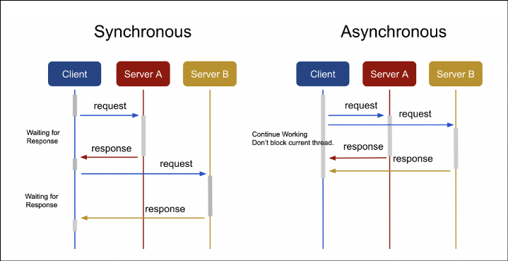
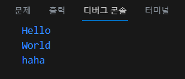

# Synchronous/Asynchronous

---

- 데이터 처리 모델을 쉽게 표현하자면 데이터를 받는 방식이라고 할 수 있다.
- 이 방식에는 동기식 처리와 비동기식 처리 모델이 존재한다.




# 1. **동기(synchronous) 방식**

요청과 결과가 동시에 일어나는 방식으로 요청을 보낸 후 응답을 받아야 다음 동작이 진행된다.

- 요청과 결과가 한 자리에 동시에 나타나는 것으로 사용자가 서버로 요청을 보냈을 경우 요청에 대한 응답을 리턴받기 전까지는 다른 것을 하지 못하고 기다려야 한다.
- 특정 프로그램을 구동시키는 데 시간이 5분 소요된다고 하면, 이 프로그램이 구동되는 5분동안 컴퓨터는 다른 프로그램을 동작시키지 못하고, 구동되기를 기다려야 한다.
- 장점 : 설계가 간단하고, 직관적이다.
- 단점 : 요청에 대한 결과가 반환되기 전까지 대기해야 한다. (Blocking)

# 2. **비동기(Asynchronous) 방식**

요청과 결과가 동시에 일어나지 않는 방식으로 요청과 결과가 동시에 일어나지 않는다.

- 요청한 곳에 결과가 나타나지 않으며, 사용자가 서버로 요청을 보냈을 경우 요청에 대한 응답을 기다리지 않고, 다른 것을 수행할 수 있으며 서버로 다른 요청을 보낼 수도 있다.
- 특정 프로그램을 구동시키는 데 시간이 5분 소요되어도 그 시간동안 다른 프로그램을 수행할 수 있다.
- 완료 순서가 보장되지 않는다.
- 장점 : 요청에 대한 결과가 반환되기 전에 다른 작업을 수행할 수 있어서 자원을 효율적으로 사용할 수있다.
- 단점 : 동기 방식보다 설계가 복잡하고, 논증적이다.

# 3. 자바스크립트의 동기와 비동기

- 자바스크립트는 동기 방식으로 코드를 해석한다. 기본적으로는 순서대로 코드를 처리하는 방식이다.
- 그러나 효율적인 자원 사용이 중요하기 때문에 동기적으로 코드를 처리한다면 많은 자원이 낭비될 수 있다.
- 그렇다면 자바스크립트는 어떤 방식으로 비동기 작업을 수행할까?

- **이벤트 루프(Event Loop)**
    - 코드를 실행하면서 자바스크립트 엔진은 어떠한 작업을 이벤트 루프에 위임하고, 바로 다음 작업을 수행한다. 이 이벤트 루프 덕분에 비동기 작업을 수행할 수 있다.
    - 비동기 작업을 만들 때 콜백 함수를 함께 지정하고, 그 후속 작업을 진행한다.
        
        <aside>
        💡 **CallBack 함수** : 다른 함수가 실행을 끝낸 뒤 실행되는 callback되는 함수
        
        </aside>
        
        ```jsx
        console.log("Hello");
        
        setTimeout(() => {
          console.log("haha");
        }, 1000);
        
        console.log("World");
        ```
        
        
        
        <aside>
        💡 **<실행 순서>**
        
        1. console.log(”Hello”); 출력문을 실행한다.
        2. setTimeout 함수를 실행한다.
        3. setTimeout은 비동기 함수이다. 실행 후 즉시 종료시키며 함수 내용이 이벤트 루프로 던져지고, 다음 작업을 수행하게 한다.
        4. 자바스크립트 엔진이 console.log(”World”) 출력문을 실행한다.
        5. 이벤트 루프에서는 1초 뒤에 콜백 함수 (() ⇒ {console.log(”haha”);} )를 실행한다.
        </aside>
        

# 4. **블록 과 논블럭의 차이**

블록 과 논블럭은 동기, 비동기와 연결되는 개념이다.

### 1) 블록이란?

- 블록이란 동기의 개념에서 만들어진 상태로 브라우저가(크롬) 실행되는 시간이 10분(요청)이라고 가정했을시에 브라우저가(크롬) 이 오픈(결과) 되기전까지 다른 브라우저(사파리 등등)은 계속 대기해야 하는 상태를 **블록 상태**라고 부른다.

### 2) 논블록이란?

- 논블록이란 비동기 개념에서 만들어진 상태로 브라우저가(크롬) 실행되는 시간이 10분(요청)이라고 가정했을시에 브라우저가(크롬) 이 오픈(결과) 되기전까지 다른 브라우저(사파리 등등)은 시간을 대기 하지 않고 제약없이 자유롭게 사용할수 있는 상황을 **논블록 상태** 라고 부른다.