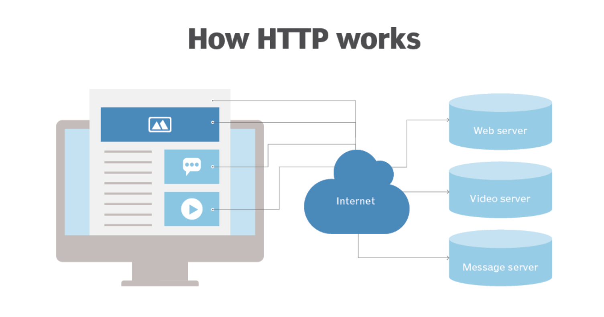

# HTTP/HTTPS

---

# HTTP(Hyper Text Transfer Protocol)

## 정의

- HTTP는 웹을 통해 텍스트, 이미지, 사운드, 비디오 및 기타 멀티미디어 파일과 같은 파일을 전송하기 위한 일련의 규칙이다.
- 두 컴퓨터 간의 하이퍼텍스트를 전송하는 데 사용되는 프로토콜을 하이퍼 텍스트 전송 프로토콜(HyperText Markup Language)이라고 한다.
- 사용자가 웹 브라우저를 열자마자 간접적으로 HTTP를 사용한다.
- 인터넷의 기초를 형성하는 TCP/IP 프로토콜 위에서 실행되는 애플리케이션 프로토콜이다.
- HTTP는 서버에서 클라이언트로, 또는 그 반대로 데이터를 전달할 때 사용되는 IP기반 통신 프로토콜이다.
- 서버는 클라이언트가 말한 요청을 처리하며, 서버와 클라이언트는 요청과 응답 기간 동안에만 서로를 알고 있다.
- 서버와 클라이언트가 호환되면 모든 유형의 콘텐츠를 교환 가능하다.
- 데이터가 교환된 후, 서버와 클라이언트 연결은 끊긴다.
- 연결이 끊긴 후, 서버는 클라이언트에 대해서 아무 정보도 저장하지 않고, 반대로 클라이언트도 마찬가지이므로 연결성이 없는 프로토콜이다. (1회성)
- 80번 포트를 사용한다.
- World Wide Web을 위한 데이터 통신의 기초이며,  Hyper Text 문서에는 다른 리소스에 대한 하이퍼 링크가 포함되어 있다.
- 애플리케이션 레벨의 프로토콜로 TCP/IP 위에서 작동하는 암호화 되지 않은 평문 데이터를 전송하는 프로토콜이다.
- 상태를 가지고 있지 않은 Stateless 프로토콜이며 Method, Path, Version, Headers, Body 등으로 구성된다.
    - HTML, TEXT, IMAGE, 음성, 영상, 파일, JSON, XML(API) 등 거의 모든 형태의 데이터를 전송 가능하다.
    - 서버 간 데이터 전송에도 대부분 HTTP가 사용된다.
- 기반 프로토콜은 다음과 같다.
    - TCP : HTTP/1.1, HTTP2
    - UDP : HTTP/3
    - 현재는 HTTP/1.1을 주로 사용하며, HTTP/2, 3도 점점 증가 추세에 있다.
- 클라이언트-서버 구조이며 Stateless, Connection-less의 상태를 가진다.
    
    
    
- 단순하며 확장 가능하다.
- HTTP(HyperText Transfer Protocol)는 웹 서버와 클라이언트 간에 데이터를 주고받는 데 사용되는 프로토콜이다.
    - 일반적으로 인터넷 상에서 웹 페이지, 이미지, 비디오 등을 전송하는 데 사용된다.
    - HTTP는 기본적으로 텍스트 기반의 프로토콜이며, 요청(request)과 응답(response)으로 구성된다.
- 웹 페이지를 방문할 때마다 컴퓨터는 HTTP(Hypertext Transfer Protocol)를 사용하여 인터넷 어딘가에 있는 다른 컴퓨터에서 해당 페이지를 다운로드한다.
- HTTP는 월드 와이드 웹(WWW)에 내재된 프로토콜이다.

<aside>
💡 **프로토콜(Protocol)이란?**

- 프로토콜은 규칙(약속)이란 의미이다.
- 컴퓨터 네트워크(관계망)에서 데이터를 주고받을 때, 이러한 규칙에 맞춰 개발함으로써 서로 정보를 교환할 수 있게 된 것이다.
- 컴퓨터 네트워크에서 데이터를 보내고 받는 성격에 따라 프로토콜이 만들어졌다.
- 웹 문서를 주고 받을 때는 HTTP를 사용해야 하고 파일을 주고 받을 때는 FTP, 메일은 SMTP, POP 등 전송 계층과 유형에 따라 다양하게 만들어져 있다.
</aside>

## 특징

### Stateless, 무상태성

- 말 그대로 서버가 클라이언트의 상태를 저장하지 않는 것을 말한다.
    - 이 말은, 이전 정보를 처리하지 않으므로 계속해서 추가 요청을 보내야 한다.
    - 그러나 이러한 Request 방식은 항상 같은 서버에 연결될 필요가 없다.
    - 무상태는 응답 서버를 쉽게 바꿀 수 있다. 즉 무한한 서버 증설이 가능해진다.
    - 그러나, stateful하게 처리되어야 하는 경우에는 보조 수단으로서 쿠키나 세션 등의 메커니즘을 이용한다.
- 아무 서버나 호출해도 되며, 상태를 보관하지 않는다.
    - 예시) 클라이언트가 서버에게 “저녁에 치킨먹자”고 말했고 서버가 “그래”라고 답했다. 저녁이 되어 클라는 서버에게 “먹으러 가자”고 말했고 서버는 대답했다. “뭘?” → 상태 유지성 X
- 중간에 서버에 장애가 발생해도 같은 기능을 하는 서버군의 다른 서버에서 응답을 수행할 수 있다.
- Server가 Client의 상태를 보존하지 않으며, 서버 확장성(Scale Out)이 높지만 Client가 추가 데이터를 전송한다.
- 모든 것을 무상태로 설계할 수 있는 경우도 있지만, 없는 경우도 있다.
- **장점** : 서버 확장성 높음 (스케일 아웃)
- **단점** : 클라이언트가 추가 데이터 전송
    
    ### **c.f) 상태 유지(Stateful)**
    
    - 상태가 유지되는 때에는 점원 A가 고객의 주문 상태에 대해 기억하고 있다.
        - 만약 중간에 점원A가 아닌 점원B가 그대로 고객을 응대한다고 가정해보자.
        - 점원A가 고객의 상태를 기억하고 있는 것을 상태 유지라고 한다.
    - **항상 같은 서버가 유지 되야한다.**
        - 상태 유지가 되어야 하는 프로토콜이라면 클라이언트A의 요청을 서버1이 기억하고 있기 때문에 항상 서버1이 응답해야 한다.
    - **만약 서버에 장애가 생긴다면?**
        - 만약 서버1이 장애가 난다면 유지되던 상태정보가 다 날아가버리므로 처음부터 다시 서버에 요청해야 한다.
    - 예를 들어, 무상태에서는 고객이 자신의 주문을 기억하고 있다면 중간에 다른 점원으로 바뀌어도 주문을 할 수 있다.
        - 만약 갑자기 고객이 증가하더라도 무상태에서는 점원을 대거 투입할 수 있다.
            - **아무 서버나 호출해도 된다.**
                - 무상태 프로토콜이라면 클라이언트A가 요청할 때 이미 필요한 데이터를 다 담아서 보내기 때문에 아무 서버나 호출해도 된다.
            - 만**약 서버에 장애가 생긴다면?**
                - 만약 서버1에 장애가 생기더라도 다른 서버에서 응답을 전달하면 되기 때문에 클라이언트는 다시 요청할 필요가 없다.
            - **스케일 아웃 – 수평 확장 유리**
                - 무상태는 응답 서버를 쉽게 바꿀 수 있기 때문에 무한한 서버 증설이 가능하다.
            - **실무에서의 한계**
                - 모든 것을 무상태로 설계할 수 있는 경우도 있고 없는 경우도 있다.
                - 무상태 : 로그인이 필요 없는 단순한 서비스 소개 화면
                - 상태 유지 : 로그인
                - 로그인한 사용자의 경우 로그인했다는 상태를 서버에 유지(브라우저 쿠키, 서버 세션, 토큰 등)
                - 상태 유지는 최소한만 사용

### Connection-less, 비연결성

- HTTP는 기본적으로 연결을 유지하지 않는 모델이다.
    - HTTP 1.0 기준으로 HTTP는 연결을 유지하지 않는 모델이다.
- 비 연결성을 가지는 HTTP에서는 실제로 요청을 주고 받을 때만 연결을 유지하고 응답을 주고나면 TCP/IP 연결을 끊는다.
- 클라이언트의 요청이 있은 후, 응답을 받으면 바로 연결을 종료한다.
    - 불필요한 연결을 하지 않기 때문에 서버의 유지 자원을 더욱 효율적으로 사용할 수 있다.
- 일반적으로 초 단위 이하의 빠른 속도로 응답하며, 1시간 동안 수천 명이 서비스를 사용해도 실제 서버에서 동시에 처리하는 요청은 수십 개 이하로 매우 적다.
    - 트래픽이 많지 않고, 빠른 응답을 제공할 수 있는 경우에 비 연결성의 특징은 효율적으로 작동한다.
    - 예) 웹 브라우저에서 계속 연속해서 검색 버튼을 누르지는 않는다.
- 서버 자원을 매우 효율적으로 사용할 수 있다.
    - 최소한의 자원으로 서버 유지가 가능하다.
- 단, TCP/IP 연결을 매 요청마다 새로 맺어야 하며(3 way handshake 시간 추가) 웹 브라우저로 사이트 요청 시 HTML 뿐만 아니라 자바스크립트, css, 추가 이미지 등 수 많은 자원이 함께 다운로드 된다.
- 현재는 HTTP 지속 연결(Persistent Connections(Keep-Alive)로 문제를 해결한다.
- HTTP/2, HTTP/3에서 더 많은 최적화가 이루어진다.
    
    ### **c.f) 연결성(Connection Oriented)**
    
    - TCP/IP의 경우 기본적으로 연결을 유지한다.
    - 연결을 유지하는 모델에서는 클라이언트가 요청을 보내지 않더라도 계속 연결을 유지해야 한다.
    - 이러한 경우 연결을 유지하는 서버의 자원이 계속 소모된다.
    
    ### 극복 - HTTP 지속 연결(Persistent Connections)
    
    - HTTP 초기 – 연결, 종료 낭비
        - HTTP 초기에는 각각의 자원을 다운로드하기 위해 연결과 종료를 반복해야 했다.
    - HTTP 지속 연결 (Persistent Connections)
        - HTTP 지속 연결에서는 연결이 이루어지고 난 뒤 각각의 자원들을 요청하고 모든 자원에 대한 응답이 돌아온 후에 연결을 종료한다.
    - HTTP는 실제로 요청을 주고 받을 때만 연결을 유지하고 응답을 주고나면 서버와의 연결을 끊는다.
    
    ### 정리
    
    - 상태 유지 : 중간에 다른 점원으로 바뀌면 안됨
        - 중간에 다른 점원으로 바뀔 때 상태 정보를 다른 점원에게 미리 알려줘야 한다.
        - 매 요청마다 클라이언트 상태를 서버가 알고 있으므로, 무엇을 구매할지, 몇 개를 구매할지 알려줄 필요가 없다.
    - 무상태 : 중간에 다른 점원으로 바뀌어도 된다.
        - 갑자기 고객이 증가해도 점원을 대거 투입할 수 있다.
        - 갑자기 클라이언트 요청이 증가해도 서버를 대거 투입할 수 있다.
        - 무상태는 응답 서버를 쉽게 바꿀 수 있다. → 무한한 서버 증설 가능
        - 매 요청마다 무엇을 구매할지, 몇 개를 구매할지 알려줘야 한다.

### **Client-Server Structure, 클라이언트-서버 구조**

- 각각의 Server와 Client는 독립되어 있다.
    - 마치 Request Response 구조와 같다.
- Client는 Server에 요청을 보내고 응답이 올 때까지 대기하고, Server는 Client에서 받은 요청에 대한 결과를 보내는 것이다.
- Server에서 비즈니스 로직과 데이터를 Client에 독립적으로 처리할 수 있도록 만든 구조이다.

<aside>
💡 **요약 정리**

### **Client(클라이언트)란?**

- 클라이언트는 인터넷에 연결된 사용자의 디바이스, 또는 웹에 접근할 수 있는 소프트웨어를 뜻한다.
- 대표적인 예로 브라우저가 있다.
- 브라우저는 HTML, CSS, JavaScript 등으로 작성된 코드를 내부 엔진으로 해독하여 사용자가 쉽게 이해할 수 있는 형태의 컨텐츠로 보여주는 역할을 한다.

### **Server(서버)란?**

- 서버는 클라이언트가 어떤 자원을 요청하면 해당 요청을 적절하게 처리하는 역할을 한다.

### **API란?**

- 클라이언트는 서버의 자원을 어떻게 사용할 수 있는지 명시해 둔 인터페이스 API에 따라 요청을 전송한다.

### **HTTP란?**

- 이렇게 클라이언트와 서버가 서로 요청과 응답을 주고받을 수 있는 것은 HTTP라는 통신 규약 덕분이다.
</aside>

- 클라이언트와 서버는 웹에서 HTTP 프로토콜을 사용해서 통신한다.
- 클라이언트는 서버로 요청을 보내고, 서버는 요청에 따라 적절한 응답을 클라이언트로 회신한다.
- 필요에 따라 서버는 데이터베이스에 요청을 보내고, 회신 받은 응답을 활용한다.
- 서버는 클라이언트에게 제공하는 API를 적절하게 디자인 해야한다.
- 클라이언트는 서버가 제공하는 API를 통해 적절하게 요청한다.

## HTTP 장점 / 단점

### 장점

- **간단함**: HTTP는 매우 간단한 프로토콜이므로 구현이 쉽다.
- **유니버설**: 거의 모든 웹 서버와 브라우저가 HTTP를 지원한다. 따라서 거의 모든 플랫폼과 장치에서 작동한다.
- **서버 확장 가능성**: HTTP는 확장 가능한 프로토콜로, 새로운 기능과 요구 사항이 발생할 때 쉽게 확장할 수 있다.
    1. Stateless라서 응답서버를 쉽게 바꿀수도 있고 무한한 서버 증설이 가능하다.
- **프록시와 캐싱**: HTTP는 프록시 서버와 캐싱을 지원하여 네트워크 트래픽을 줄이고 성능을 향상시킬 수 있다.
- **텍스트 기반**: HTTP 헤더 및 데이터는 텍스트로 이루어져 있어 읽기 및 디버그가 상대적으로 쉽다.
- 트래픽이 많지 않고, 빠른 응답을 제공할 수 있는 경우 효율적이다.
- 최소한의 자원으로 서버를 유지할 수 있다.
- 동시 연결 수가 적기 때문에 메모리 사용량과 CPU 사용량이 낮다.
- TCP 연결이 적기 때문에 네트워크 정체가 적다.
- 초기 연결 단계에서 핸드셰이크가 이루어지기 때문에 후속 요청에 대해 더 이상 핸드셰이크가 필요하지 않으므로 대기 시간이 줄어든다.
- 연결을 닫지 않고도 오류를 보고할 수 있다.
- HTTP는 요청이나 응답의 HTTP 파이프라인을 허용한다.

### 단점

- **보안 문제**: HTTP는 데이터를 암호화하지 않기 때문에 민감한 정보를 전송할 때 보안에 취약하다. 이러한 이유로 HTTPS(암호화된 HTTP)가 더 안전한 선택이다.
- **속도**: HTTP는 TCP/IP 프로토콜을 기반으로 하며, 이는 신뢰성 있는 전송을 제공하지만 추가적인 오버헤드를 초래할 수 있다.
- **단일 요청-응답 메커니즘**: HTTP는 기본적으로 단일 요청-응답 메커니즘을 사용하므로 실시간 상호 작용에는 적합하지 않을 수 있다.
- **상태 정보의 부족**: HTTP는 상태를 유지하지 않는 stateless 프로토콜이다. 따라서 세션 관리와 같은 작업에 추가적인 노력이 필요하다.
- **대역폭 사용**: HTTP는 각 요청마다 새로운 연결을 생성하므로 많은 요청을 처리할 때 대역폭을 많이 사용할 수 있다. 이를 해결하기 위해 지속적인 연결을 사용하는 HTTP/1.1의 Keep-Alive 기능이나 HTTP/2의 다중 요청 및 응답 메커니즘 등이 도입되었다.
- 이전 통신의 정보를 모르기 때문에 매번 인증을 해줘야 한다.
- 이것을 해결하기 위해 쿠키나 세션을 사용해서 데이터를 처리해줘야 한다.
- 매번 새로 연결해야 하므로 3way handshake시간이 추가된다.
- HTTP는 통신을 설정하고 데이터를 전송하려면 높은 전력이 필요하다.
- HTTP는 HTTPS와 같은 암호화 방법을 사용하지 않고 TLS(Transport Layer Security)를 사용하여 일반 HTTP 요청 및 응답을 암호화하므로 보안 수준이 낮다.
- HTTP는 휴대폰에 최적화되어 있지 않다.
- HTTP는 보안 수준이 낮기 때문에 진정한 데이터 교환을 제공하지 않는다.
- 클라이언트는 서버로부터 완전한 데이터를 수신할 때까지 연결을 닫지 않습니다.
    - 따라서 서버는 데이터 완료를 기다려야 하며 이 시간 동안 다른 클라이언트가 사용할 수 없다.

## 작동 방식

### **HTTP**

- HTTP는 OSI(Open Systems Interconnection) 네트워크 통신 모델의 애플리케이션 계층 프로토콜이다.
- HTTP는 여러 유형의 요청과 응답을 정의한다.
    - 예를 들어, 웹 사이트의 일부 데이터를 보려는 경우 *HTTP GET* 요청을 전송한다.
    - 연락처 양식 작성과 같은 일부 정보를 전송하려는 경우 *HTTP PUT* 요청을 전송한다.
    - 마찬가지로, 서버는 숫자 코드 및 데이터 양식으로 다양한 유형의 HTTP 응답을 전송한다.
        - 200 - OK (정상)
        - 400 - Bad request (잘못된 요청)
        - 404 - Resource not found (리소스를 찾을 수 없음)
- 이러한 요청 및 응답 통신은 일반적으로 사용자에게 보이지 않는다.
- 브라우저와 웹 서버가 사용하는 통신 방식이므로 World Wide Web은 모든 사용자에게 일관되게 작동한다.

### **HTTPS**

- HTTP는 암호화되지 않은 데이터를 전송한다.
    - 즉, 브라우저에서 전송된 정보를 제3자가 가로채고 읽을 수 있다.
    - 이는 이상적인 프로세스가 아니었기 때문에, 통신에 또 다른 보안 계층을 추가하기 위해 HTTPS로 확장되었다.
    - HTTPS는 HTTP 요청 및 응답을 SSL 및 TLS 기술에 결합한다.
- HTTPS 웹 사이트는 독립된 인증 기관(CA)에서 SSL/TLS 인증서를 획득해야 한다.
    
    <aside>
    💡 **SSL(Secure Scokets Layer) / TLS(Transport Layer Security) 인증서**
    
    - SSL/TLS(보안 소켓 계층/전송 계층 보안) 인증서는 웹사이트와 사용자 간의 통신을 안전하게 보호하기 위해 사용되는 디지털 인증 도구이다.
    - 이러한 인증서는 웹사이트의 신원을 확인하고 데이터를 안전하게 전송하기 위해 사용된다.
        1. 웹사이트의 공개 키(public key)
        2. 웹사이트의 도메인 이름
        3. 발급 기관의 정보(인증 기관)
        4. 인증서의 유효 기간
    - 이러한 정보들은 웹 브라우저와 서버 간의 안전한 연결을 설정하고 데이터를 암호화하여 중간자 공격 등으로부터 보호하는 데 사용된다.
    - SSL/TLS 인증서는 사용자가 웹사이트를 방문할 때 웹 브라우저에 의해 확인되며, 사용자는 안전한 연결을 보장하기 위해 이러한 인증서를 신뢰할 수 있다.
    </aside>
    
    - 이러한 웹 사이트는 신뢰를 구축하기 위해 데이터를 교환하기 전에 브라우저와 인증서를 공유한다.
    - SSL 인증서는 암호화 정보도 포함하므로 서버와 웹 브라우저는 암호화된 데이터나 스크램블된 데이터를 교환할 수 있다.
        
        <aside>
        💡 **스크램블된 데이터**
        - 일반적으로 원래의 데이터를 임의로 섞거나 변형하여 보호 또는 보안 목적으로 사용되는 데이터를 의미한다. 
        - 이러한 처리는 데이터의 기밀성을 유지하고 무단 접근을 방지하기 위해 사용될 수 있다. 
        - 주로 암호화나 다양한 알고리즘을 사용하여 데이터를 스크램블하며, 오직 정확한 복원 키나 알고리즘을 알고 있는 사람만이 원래의 데이터를 해독할 수 있다.
        
        </aside>
        

### 동작 순서

1. 클라이언트(브라우저)가 서버로 최초 연결 시도를 함.
2. 서버는 공개키(엄밀히는 인증서)를 브라우저에게 넘겨줌.
3. 브라우저는 인증서의 유효성을 검사하고 세션키를 발급함.
4. 브라우저는 세션키를 보관하며 추가로 서버의 공개키로 세션키를 암호화하여 서버로 전송함.
5. 서버는 개인키로 암호화된 세션키를 복호화하여 세션키를 얻음.
6. 클라이언트와 서버는 동일한 세션키를 공유하므로 데이터를 전달할 때 세션키로 암호화/복호화를 진행함.

## HTTP Message Structure

- HTTP messages는 클라이언트와 서버 사이에서 데이터가 교환되는 방식이다.
- HTTP 요청 메시지와 응답 메시지는 구조가 다르다.
- HTTP messages는 몇 줄의 텍스트 정보로 구성된다.
- 그러나 개발자는 이런 메시지를 직접 작성할 필요가 거의 없다.
- 구성 파일, API, 기타 인터페이스에서 HTTP messages를 자동으로 완성한다.
- HTTP Message의 공식 스펙은 다음과 같다.

## **요청(Requests)과 응답(Responses)의 구조**

## 요청(Requests)

### **<start line>**

---

- start line에는 요청이나 응답의 상태를 나타낸다.
- 항상 첫 번째 줄에 위치한다.
- 응답에서는 status line이라고 부른다.
- HTTP Method - 요청시 보내는 HTTP 메소드 형태이다. (GET, POST, PUT, PATCH, DELETE, 기타)
- Request Target - 요청이 전송되는 목표 주소이다.
- HTTP Version - HTTP 버전. 현재까지는 대부분이 HTTP/1.1이고 HTTP/2, HTTP/3 까지도 있다.
- Start-Line = Request-Line / Status-Line
    - Request-Line = Method SP(공백) request-target SP HTTP-version CRLF(엔터)
        - HTTP 메서드(GET)
            - 종류 : GET, POST, PUT, DELETE…
            - 서버가 수행해야 할 동작을 지정한다.
        - 요청 대상(/search?q=hello&hl=ko)
            - absolute-path[?query](절대경로[?쿼리])
            - 절대경로 = “/” 로 시작하는 경로
        - HTTP version (HTTP/1.1)
            - HTTP Version (1.1, 1.2, 3.0 등)
- Start line에는 세 가지 요소가 있다.
    - **첫 번째 요소**
        - HTTP method를 나타낸다.
        - HTTP method는 수행할 작업(GET, PUT, POST 등)이나 방식(HEAD or OPTIONS)을 설명한다.
        - 예를 들어 GET method는 리소스를 받아야 하고, POST method는 데이터를 서버로 전송한다.
    - **두 번째 요소**
        - 요청 대상(일반적으로 URL이나 URI) 또는 프로토콜, 포트, 도메인의 절대 경로는 요청 컨텍스트에 작성된다.
            
            > 이 요청 형식은 HTTP method 마다 다르다.
            > 
        - **origin 형식**
            - `?`와 쿼리 문자열이 붙는 절대 경로이다.POST, GET, HEAD, OPTIONS 등의 method와 함께 사용한다.
            - `POST / HTTP 1.1GET /background.png HTTP/1.0HEAD /test.html?query=alibaba HTTP/1.1OPTIONS /anypage.html HTTP/1.0`
        - **absolute 형식**
            - 완전한 URL 형식으로, 프록시에 연결하는 경우 대부분 GET method와 함께 사용한다.
            - `GET <http://developer.mozilla.org/en-US/docs/Web/HTTP/Messages> HTTP/1.1`
        - **authority 형식**
            - 도메인 이름과 포트 번호로 이루어진 URL의 authority component 이다.HTTP 터널을 구축하는 경우, `CONNECT`와 함께 사용할 수 있다.
            - `CONNECT developer.mozilla.org:80 HTTP/1.1`
        - **asterisk 형식**
            - `OPTIONS` 와 함께 별표(`*`) 하나로 서버 전체를 표현한다.
            
            `OPTIONS * HTTP/1.1`
            
    - **마지막 요소**
        - HTTP 버전은 메시지의 다른 구조를 결정한다.
        - 이를 위해 HTTP 버전을 함께 입력한다.

### **<HTTP headers>**

---

- 요청을 지정하거나, 메시지에 포함된 본문을 설명하는 헤더의 집합이다.
- HTTP Request 그 자체에 대한 정보를 담고 있으며, key:value 형태로 이루어져 있다.
- 요청의 Headers는 기본 구조를 따른다.
- 대소문자 구분 없는 문자열과 콜론(`:`), 값을 입력한다.
- 여러 종류의 헤더가 있고, 값은 헤더에 따라 다르다.

- 헤더를 다음과 같이 그룹으로 나눌 수 있다.
    - **Request headers**
        - User-Agent, Accept-Type, Accept-Language과 같은 헤더는 요청을 보다 구체화한다.
        - Referer처럼 컨텍스트를 제공하거나 If-None과 같이 조건에 따라 제약을 추가할 수 있다.
    - **General headers**
        - **메시지 전체에 적용된다.**
    - **Entity headers**
        - Content-Length와 같은 헤더는 body에 적용된다.
    - body가 비어있는 경우, entity headers는 전송되지 않는다.
- header-field = field-name “:” OWS field-value OWS (OWS: 띄어쓰기 허용)
- field-name은 대소문자를 구분하지 않는다.
- HTTP 전송에 필요한 모든 부가정보
    - ⇒ 메시지 바디의 내용, 메시지 바디의 크기, 압축, 인증, 요청 클라이언트 정보, 서버 애플리케이션 정보, 캐시 관리 정보 등
- 표준 헤더가 너무 많다
- 필요시 임의의 헤더 추가도 가능
    - [https://en.wikipedia.org/wiki/List_of_HTTP_header_fields](https://en.wikipedia.org/wiki/List_of_HTTP_header_fields)
- Host -요청하려는 서버 호스트 이름과 포트번호이다.
- User-Agent - 클라이언트 정보이다. 이 정보를 통해 서버는 클라이언트 프로그램(브라우저, 기기 등)에 맞는 최적의 데이터를 전송할 수 있다.
- Accept - 클라이언트가 처리 가능한 미디어 타입 종류를 나열한 것이다.
- Authorization - JWT 같은 인증 토큰을 서버로 보낼 때 사용하는 항목이다.
- Origin - 서버로 POST 요청을 보낼 때 요청이 어느 주소에서 시작되었는지 나타내는 값으로, 요청을 보낸 주소와 받는 주소가 다르면 CORS(Cross-Origin Resource Sharing) 에러가 발생한다.

### **<empty line>**

---

- 헤더와 본문을 구분하는 빈 줄이 있다. 그 줄을 말한다.

### **<body>**

---

- 요청과 관련된 데이터나 응답과 관련된 데이터 또는 문서를 포함한다.
    - 실제 전송할 데이터들이다.
- 요청과 응답의 유형에 따라 선택적으로 사용한다.
- 전송하는 데이터가 없으면 비어있을 수 있다.
- 보통 POST 요청일 경우, HTML 폼 데이터가 포함되어 있다.
- HTML 문서, 이미지, 영상, JSON 등등 byte로 표현할 수 있는 모든 데이터 전송 가능하다.
- 요청의 본문은 HTTP messages 구조의 마지막에 위치한다.
- 모든 요청에 body가 필요한 것은 아니다.
- GET, HEAD, DELETE, OPTIONS처럼 서버에 리소스를 요청하는 경우에는 본문이 필요하지 않다.
- POST나 PUT과 같은 일부 요청은 데이터를 업데이트하기 위해 사용한다.
- body는 다음과 같이 두 종류로 나눌 수 있다.
    - **Single-resource bodies(단일-리소스 본문)**
        - 헤더 두 개(Content-Type과 Content-Length)로 정의된 단일 파일로 구성된다.
    - **Multiple-resource bodies(다중-리소스 본문)**
        - 여러 파트로 구성된 본문에서는 각 파트마다 다른 정보를 지닌다.보통 HTML form과 관련이 있다.

## 응답(Responses)

- HTTP Response는 단순히 요청이 발생할 때 서버가 얻는 것에 대한 응답이다.
- HTTP Response는 다양한 내용이 포함되어 있다.
- 기본적으로 구조는 같으나, 담겨오는 내용은 다르다.

### <Status Line>

---

- 응답의 첫 줄은 Status line이라고 부르며, 다음의 정보를 포함한다.
- Status line은 `HTTP/1.1 404 Not Found.` 처럼 생겼다
- HTTP Version - 응답 온 메세지의 HTTP 버전 정보이다.
- Status Code- 응답 코드이다. (ex-403, 200 OK 등)
- Status text- 응답 상태이다. (ex-Forbidden)

### <Headers>

---

- 응답에 들어가는 HTTP headers는 요청 헤더와 동일한 구조를 가지고 있다.
- 중요한 파일과 데이터를 HTTP 응답 본문으로 보내는 작업을 수행한다.
- 대소문자 구분 없는 문자열과 콜론(`:`), 값을 입력한다.
- 값은 헤더에 따라 다르다.
- 요청의 헤더와 마찬가지로 몇 그룹으로 나눌 수 있다.
    - **General headers**
        - 메시지 전체에 적용된다.
    - **Response headers**
        - Vary, Accept-Ranges와 같이 상태 줄에 넣기에는 공간이 부족했던 추가 정보를 제공한다.
    - **Entity headers**
        - Content-Length와 같은 헤더는 body에 적용된다.body가 비어있는 경우, entity headers는 전송되지 않는다.
- Status Code  : 응답 상태 코드 (200, 404, 500 등)
- Content-Type : 응답 바디의 MIME 타입
- Content-Length : 응답 바디의 길이
- Set-Cookie : 쿠키 정보 등
- reasion-phrase : 사람이 이해할 수 있는 짧은 코드 설명 글

### <Body>

---

- 응답의 본문은 HTTP messages 구조의 마지막에 위치한다.
- 모든 응답에 body가 필요한 것은 아니다.
- 201, 204와 같은 상태 코드를 가지는 응답에는 본문이 필요하지 않다.
- 서버로 전달되는 실제 데이터를 담고 있다. (POST 요청의 경우 HTML 폼 데이터 등)
- 응답의 body는 다음과 같이 두 종류로 나눌 수 있다.
    - **Single-resource bodies(단일-리소스 본문)**
        - 길이가 알려진 단일-리소스 본문은 두 개의 헤더(Content-Type, Content-Length)로 정의한다.
        - 길이를 모르는 단일 파일로 구성된 단일-리소스 본문은 Transfer-Encoding이 `chunked` 로 설정되어 있으며, 파일은 chunk로 나뉘어 인코딩되어 있다.
    - **Multiple-resource bodies(다중-리소스 본문)**

## HTTP Method

- HTTP 메서드란 클라이언트와 서버 사이에 이뤄지는 요청과 응답 데이터를 전송하는 방식이다.
- HTTP 메서드는 총 9가지가 있으며 주로 GET, POST, PUT, PATCH, DELETE를 사용한다.

### GET

- **리소스를 조회하는 메서드(Read)**
- 서버에 전달하고 싶은 데이터는 query(쿼리 파라미터, 쿼리 스트링)을 통해서 전달한다.
    - 예시 ) GET /members/100?username=inpa&height=200
- 메시지 바디를 사용해 데이터를 전달할 수도 있지만, 지원하지 않는 곳이 많아 권장하지 않는다.

### POST

- **전달한 데이터 처리/생성 요청 메서드 (Create)**
- 요청 데이터를 처리하는 메서드로, 메시지 바디를 통해 서버로 요청 데이터를 전달하고 서버는 메시지 바디를 통해 들어온 데이터를 처리하여 응답(업데이트)한다.
- 전달된 데이터로 주로 신규 리소스를 등록하고, 프로세스 처리에 사용한다.
- 만약 GET 메서드를 사용하는데, JSON으로 조회 데이터를 넘겨야 하는 경우에는 POST를 사용한다.
- **프로세스 처리**
    - 단순히 데이터를 생성하거나, 값을 변경하는 것을 넘어 프로세스의 상태가 변경되는 경우에 사용한다. ( 시스템에 큰 변화가 생길 때)
    - 이 때 POST의 결과로 새로운 리소스가 생성되지 않을 수도 있다.

### PUT

- **리소스를 대체(수정)하는 메서드 (Update)**
- 요청 메세지에 리소스가 있다면 요청을 보낸 데이터로 완전히 덮어 씌우고, 리소스가 없다면 새로 생성한다.
    - /members/100 데이터가 존재하면 기존 것을 완전 대체 한다.
    - /members/100 데이터가 없으면 대체할 게 없으므로 새로 생성한다.
- POST와의 차이점으로는 클라이언트가 리소스의 위치를 알고 URI를 지정한다는 점이다.
    - 데이터를 대체해야 하니, 클라이언트가 리소스의 구체적인 전체 경로를 지정해 보내주어야 한다.
        - POST /members : 멤버 새로 추가
        - PUT /members/100 : 100번째 멤버 수정
- PUT 사용 시 주의할 점
    - PUT은 기존 리소스를 완전히 대체하기 때문에 아래처럼 "country" 필드만을 변경하려고 요청을 보내면 기존 데이터를 날리고 요청한 데이터를 새로 덮어쓰기 때문에 "name"필드가 제거된 채로 요청받은 "country"필드만 존재하게 된다.
    
    
    

### PATCH

- **리소스 일부 부분을 변경하는 메소드** **(Update)**
- PUT과 다르게 PATCH는 리소스의 부분을 변경한다.
- PATCH를 지원하지 않는 서버가 있을 수도 있는데 이 때는 POST를 사용한다.

### DELETE

- **리소스 제거하는 메소드 (Delete)**
- 요청받은 리소스를 제거한다.

## Property of HTTP Method

- HTTP 메서드는 다음과 같이 3가지 속성이 있으며 속성별로 메서드를 구분할 수 있다.

### Safe(안전)

- Safe한 메서드는 "호출해도 리소스를 변경하지 않는다"는 특징을 갖는다.
- GET, HEAD, OPTIONS, TRACE 메서드는 호출하더라도 리소스를 변경하지 않기 때문에 안전한 리소스가 된다.
- 서버에 데이터를 변경하지 않는 요청 메서드(Safe Methods)
    - GET
    - HEAD
    - OPTION
    - TRACE
- 서버에 데이터를 변경하는 요청 메서드
    - POST
    - PUT
    - DELETE
    - PATCH

### Idempotent(멱등)

- 한 번 호출하든 여러 번을 호출하든 결과는 똑같은 메서드가 멱등성을 갖는다.
- 연산을 여러 번 적용하더라도 결과가 달라지지 않는 성질을 말한다.
- 호출 횟수에 상관 없이 결과가 동일하다
- 멱등한 메소드는 서버의 상태를 변경시킬 수도 있고, 그렇지 않을 수도 있다.
- 다만 클라이언트가 요청한 사항은 에러가 나거나, 지연이 발생하지 않는 한 요청에 대한 서버의 상태는 항상 같다.

- 멱등성의 판별법
    - ‘요청의 효과’를 보고 판단한다.
    - 서버의 상태는 멱등성이 유지되어야 하는 경우 같은 행위를 여러 번 반복하더라도 같은 효과를 가져야 한다.
    - 멱등성이 성립하지 않으면 같은 행위를 여러 번 반복하는 경우 요청마다 다른 효과가 발생된다.
    - 멱등 메서드
        - GET : 몇 번을 조회해도 조회 결과가 같다.
        - PUT : 결과를 대체한다. 같은 요청을 여러 번 해도 최종 결과는 같다
        - DELETE : 결과를 삭제한다. 같은 요청을 여러 번 해도 삭제된 결과는 동일
        - POST : 멱등이 아니다. 두 번 호출하면 같은 결제가 중복 해서 발생 가능
            - 단, 외부 요인으로 중간에 리소스가 변경되는 것 까지는 고려하지 않는다.
- 예시)
    - GET - 요청을 여러 번 수행한다고, 서버의 상태가 변하지 않고 같은 효과를 기대할 수 있다.
        - 동일한 GET 요청을 여러 번 보내면 항상 동일한 데이터를 가져 올 것이다.
        - GET 요청이 서버에서 데이터를 가져오는 용도이기 때문이다.
    - POST - 요청을 반복하게 된다면 데이터들은 계속 추가가 될 것이고, 그때마다 서버의 응답은 다른 응답을 나타내며, 다른 효과를 지닐 것이다. (같은 내용이더라도 서로 다른 데이터이다.)
        - 이 말은, 여러 번 POST 요청을 보내면 각각의 요청은 새로운 응답이 발생한다. 따라서 요청을 반복하면 서버의 DB에는 여러 개의 데이터가 추가된다. 또한 각각의 요청에 대한 서버의 응답은 새로운 정보를 담고 있으므로 다를 수 있다.
    - PUT - PUT 요청으로 3번째 데이터를 수정한다고 가정하자. 3번째 데이터가 존재하지 않는 경우 데이터가 생성될 것이다. 그러나 이미 존재한다면, 데이터는 수정된다. 그러면 PUT 요청이 여러 번 실행되더라도 세 번째 데이터는 클라이언트가 요청한 그 값으로 수정된 항상 같은 상태일 것이다.
    - DELETE - 마찬가지이다. 존재하든, 존재하지 않든 간에 여러 번 요청을 보내도 삭제되어 있는 것과 같은 효과의 결과를 응답 받는다.

<aside>
💡 HEAD 요청 : GET과 유사하나, 서버는 실제 응답 본문을 반환하지 않고 요청한 리소스에 대한 메타데이터만을 반환한다. 즉, 응답에는 상태 라인과 헤더만 포함된다.

</aside>

- 활용
    - 자동 복구 매커니즘
    - 서버가 TIMEOUT 등으로 정상 응답을 못 주었을 때, 클라이언트가 같은 요청을 다시 해도 되는지의 판단 근거이다.
- 재요청 중간에 다른 곳에서 리소스 변경 시

### Cacheable(캐시가능)

- 응답 결과를 서버에 캐싱해서 사용해도 되는 메소드를 의미한다.
- 캐싱을 해서 데이터를 효율적으로 가져올 수 있다는 것을 말한다.
- GET, HEAD, POST, PATCH가 캐시 가능하지만 POST, PATCH는 본문 내용까지 캐시 키로 고려해야 하기 때문에 구현이 쉽지 않다.
- 그래서 실제로는 GET, HEAD 정도만 캐시하여 사용한다.

# HTTPS(Hyper Text Transfer Protocol Secure)

- Hyper Text Protocol over Secure Socket Layer, HTTP over TLS, HTTP over SSL, HTTP Secure 등으로 불린다.
- HTTPS(HyperText Transfer Protocol Secure)는 HTTP의 보안 버전이다.
    - 또는 HTTP over TLS, HTTP over SSL, HTTP Secure 라고 함
    - HTTP에 데이터 암호화가 추가된 프로토콜이다.
    - HTTPS는 데이터를 암호화하여 전송함으로써 보안성을 높인다.
    - HTTPS는 SSL(Secure Sockets Layer) 또는 TLS(Transport Layer Security) 프로토콜을 사용하여 통신을 보호한다.
- SSL(Secure Socket Layer) 및 TLS(Transport Layer Security) 프로토콜을 사용하여 통신을 설정한다.
    - SSL의 새 버전은 TLS(Transport Layer Security)이다.
- 웹 브라우저와 웹 사이트 간에 데이터를 전송하는 가장 일반적인 프로토콜이다.
- 기밀성(사생활 보호), 데이터 무결성, ID 및 디지털 사용한 인증을 제공하는 방식이다.
- 보호의 수준은 웹 브라우저의 구현 정확도와 서버 소프트웨어, 지원하는 암호화 알고리즘에 따라 달라진다.
- HTTPS는 대칭키 암호화와 비대칭키 암호화를 모두 사용하여 빠른 연산 속도와 안전성을 모두 얻고 있다.
- HTTPS 연결 과정(Hand-Shaking)에서는 먼저 서버와 클라이언트 간에 세션키를 교환한다.
    - 세션키는 주고 받는 데이터를 암호화하기 위해 사용되는 대칭키이며, 데이터 간의 교환에는 빠른 연산 속도가 필요하므로 세션키는 대칭키로 만들어진다.
    - 세션키를 클라이언트와 서버가 교환하는 과정에는 비대칭키가 사용된다.
- 즉, 처음 연결을 성립하여 안전하게 세션키를 공유하는 과정에서 비대칭키가 사용되는 것이고, 이후에 데이터를 교환하는 과정에서 빠른 연산 속도를 위해 대칭키가 사용된다.
- HTTP는 브라우저와 웹 서버 간에 하이퍼텍스트 형식으로 데이터를 전송하는 반면에, HTTPS는 암호화된 형식으로 데이터를 전송한다.
    - 결과적으로 HTTPS는 네트워크를 도청하는 사람이 쉽게 볼 수 없는 방식으로 웹사이트의 정보가 브로드캐스트되는 것을 방지한다.
        - **도청 방지**: HTTPS는 통신을 암호화하여 도청을 방지한다.
        - 일반 HTTP 통신의 경우에는 데이터가 평문으로 전송되기 때문에, 네트워크 상의 도청자가 해당 데이터를 쉽게 엿볼 수 있다.
        - 하지만 HTTPS의 경우에는 데이터가 암호화되어 전송되므로, 도청자가 해당 데이터를 이해하기 어렵다.
        - **브로드캐스트 방지**: HTTPS를 사용하면 통신이 암호화되어 있기 때문에, 브로드캐스트 네트워크에서도 정보를 쉽게 볼 수 없다.
        - 브로드캐스트는 네트워크 상의 모든 장치에게 동일한 메시지를 전송하는 방식인데, HTTPS를 사용하면 해당 메시지가 암호화되어 있기 때문에 브로드캐스트로 인해 정보가 노출되지 않는다.
        
        즉, HTTPS는 통신 내용을 암호화하여 도청을 방지하고, 암호화된 상태로 정보를 전송함으로써 브로드캐스트로 인한 노출을 방지한다. 이를 통해 웹사이트의 보안을 강화하고 사용자의 개인정보를 안전하게 보호할 수 있다.
        
- 실제 HTTPS 연결 과정이 성립되는 흐름은 다음과 같다.
    - 클라이언트(브라우저)가 서버로 최초 연결 시도
    - 서버는 공개키(엄밀히는 인증서)를 브라우저에게 넘겨줌
    - 브라우저는 인증서의 유효성을 검사하고 세션키를 발급함
    - 브라우저는 세션키를 보관하며 추가로 서버의 공개키로 세션키를 암호화하여 서버로 전송
    - 서버는 개인키로 암호화된 세션키를 복호화하여 세션키를 얻음
    - 클라이언트와 서버는 동일한 세션키를 공유하므로 데이터를 전달할 때 세션키로 암호화/복호화를 진행
        
        <aside>
        💡 **SSL(Secure Socket Layer)**
        - SSL은 통신 시스템 간의 데이터 전송이 안전하고 신뢰할 수 있도록 보장하는 것이다.
        - 요청 전송 시 데이터를 암호화하고 복호화하는 데 사용되는 표준 보안 기술이다.
        - HTTPS는 기본적으로 이전 HTTP와 동일하지만 SSL을 사용한다.
        - 통신 장치 간에 보안 통신 링크를 설정하기 위해 SSL은 SSL 인증서라는 디지털 인증서를 사용한다.
        
        **<역할>**
        - 브라우저가 필요한 서버와 직접 통신하는지 확인한다.
        _ 통신 시스템만이 교환하는 메세지에 액세스할 수 있도록 보장한다.
        
        </aside>
        

### HTTPS 발급 과정

- 서버는 클라이언트와 세션키를 공유하기 위한 공개키를 생성해야 하는데, 일반적으로는 인증된 기관(CA; Certificate Authority)에 공개키를 전송하여 인증서를 발급받는다.
- 그 과정은 다음과 같다.
    - A 기업이 HTTP 기반의 애플리케이션에 HTTPS를 적용하기 위해 공개키/개인키를 발급
    - CA 기업에 돈을 지불하고, 공개키를 저장하는 인증서의 발급을 요청
    - CA 기업은 CA 기업의 이름, 서버의 공개키, 서버의 정보 등을 기반으로 인증서를 생성하고, CA 기업의 개인키로 암호화하여 A기업에게 이를 제공
    - A 기업은 클라이언트에게 암호화된 인증서를 제공
    - 브라우저는 CA 기업의 공개키를 미리 다운 받아 가지고 있어, 암호화된 인증서를 복호화
    - 암호화된 인증서를 복호화하여 얻은 A기업의 공개키로 세션키를 공유

## HTTPS 장점 / 단점

## 장점

### **보안**

- HTTP 메시지는 일반 텍스트이므로, 권한이 없는 당사자가 인터넷을 통해 쉽게 액세스하고 읽을 수 있다.
- 반면, HTTPS는 모든 데이터를 암호화된 형태로 전송한다.
    - 사용자가 민감한 데이터를 제출할 때 제3자가 네트워크를 통해 해당 데이터를 가로챌 수 없음을 확신할 수 있다.
    - 신용카드 세부 정보 또는 고객 개인 정보와 같은 잠재적으로 민감한 정보를 보호하려면 HTTPS를 선택하는 것이 좋다.
    - HTTPS는 데이터를 암호화하여 데이터 무결성을 보장한다.
        - 이는 데이터가 어느 시점에서든 손상되더라도 해커가 교환되는 데이터를 읽거나 수정할 수 없음을 의미한다.

### **권위**

- 검색 엔진은 HTTP의 신뢰성이 더 낮기 때문에 보통 HTTP 웹 사이트 콘텐츠의 순위를 HTTPS 웹 페이지보다 낮게 지정한다.
- 고객도 HTTP보다 HTTPS 웹 사이트를 더 선호한다.
- 브라우저는 브라우저 주소 표시줄에서 웹 사이트 URL 옆에 있는 자물쇠 아이콘을 배치하여 사용자에게 HTTPS 연결을 표시한다.
- 사용자는 이러한 추가 보안 및 신뢰 요소 때문에 HTTPS 웹 사이트 및 애플리케이션을 선호한다.

### **성능 및 분석**

- HTTPS 웹 애플리케이션은 HTTP 애플리케이션보다 로드 속도가 더 빠르다.
- 마찬가지로, HTTPS는 참조 링크도 더 잘 추적한다.
- 추천 트래픽은 광고 또는 소셜 미디어 백링크와 같은 서드 파티 소스에서 생성되는 웹 사이트 트래픽이다.
- 분석 소프트웨어가 신뢰할 수 있는 트래픽 소스를 정확하게 식별하도록 하려면 HTTPS를 활성화해야 한다.
- HTTPS는 데이터를 암호화하고 크기를 줄인다.
- HTTPS의 경우 크기가 작을수록 데이터 전송 속도가 빨라진다.

## 단점

- HTTPS는 설치 및 인증서를 유지하는 데 추가 비용이 발생
- 암호화하는 과정이 웹 서버에 부하를 줌
- HTTP에 비해 속도가 느림
- 인터넷의 연결이 끊긴 경우 재인증 시간이 소요
    - HTTP는 비연결형으로 웹페이지를 보는 중 인터넷 연결이 끊겼다가 다시 연결되어도 페이지를 계속 볼 수 있음.
    - HTTPS는 소켓(데이터를 주고 받는 경로) 자체에서 인증을 하기 때문에 인터넷의 연결이 끊기면 소켓도 끊어져서 다시 HTTPS 재인증이 필요.

# HTTP VS HTTPS

- HTTP(Hypertext Transfer Protocol)는 클라이언트와 서버 간 통신을 위한 통신 규칙 세트 또는 프로토콜이다.
    - 사용자가 웹 사이트를 방문하면 사용자 브라우저가 웹 서버에 HTTP 요청을 전송하고 웹 서버는 HTTP 응답으로 응답한다.
    - 웹 서버와 사용자 브라우저는 데이터를 일반 텍스트로 교환한다.
    - 간단히 말해 HTTP 프로토콜은 네트워크 통신을 작동하게 하는 기본 기술이다.
- 이름에서 알 수 있듯이 HTTPS(Hypertext Transfer Protocol Secure)는 HTTP의 확장 버전 또는 더 안전한 버전이다.
    - HTTPS에서는 브라우저와 서버가 데이터를 전송하기 전에 안전하고 암호화된 연결을 설정한다.

|  | HTTP | HTTPS |
| --- | --- | --- |
| 의미 | Hypertext Transfer Protocol | Hypertext Transfer Protocol Secure |
| 기본 프로토콜 | HTTP/1과 HTTP/2는 TCP/IP 사용
HTTP/3은 QUIC 프로토콜을 사용 | HTTP 요청 및 응답을 추가로 암호화하기 위해 SSL/TLS와 함께 HTTP/2 사용 |
| 포트 | 기본 포트 80 | 기본 포트 443 |
| 용도 | 이전 텍스트 기반 웹 사이트 | 모든 최신 웹 사이트 |
| 보안 | 추가 보안 기능 없음 | 퍼블릭 키 암호화에 SSL 인증서 사용 |
| 이점 | 인터넷을 통한 통신 지원 | 웹 사이트에 대한 권위, 신뢰성 및 검색 엔진 순위 개선 |