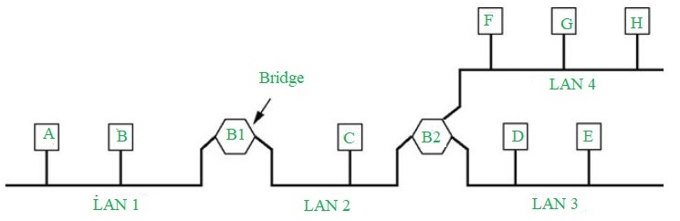

# 브리지

# 정의

- 브리지는 여러 LAN을 더 큰 LAN에 연결하는 데 사용되는 컴퓨터 네트워크의 네트워킹 장치다.
- 특히, 대규모 LAN 네트워크를 소규모 LAN 네트워크 그룹과 연결하는 네트워크 장치로 작동한다.
- 브리지는 물리적 또는 하드웨어 장치이지만, OSI 모델의 데이터 링크 계층에서 작동하며 레이어 2 스위치 계층이라고도 한다.
    - 스위치의 주요 역할은 트래픽을 검사하고 이를 필터링 할지 아니면 전달할지 결정하는 것이다.
- 대상 MAC 주소에 따라 데이터를 차단하거나 전달한다.
    - 주소는 각 데이터 프레임에 기록된다.
    - 브리지는 모든 패킷을 받아들이고 이를 다른 쪽으로 증폭시킨다.
        - 그러나 네트워크의 한 노드에서 다른 네트워크의 노드로 주소가 지정되는 선택된 패킷만 통과할 수 있다.
    - LAN 세그먼트로부터 모든 패킷을 수신한다.
        - 브리지는 어떤 패킷이 어떤 LAN에서 어떤 LAN으로 전송되는지 식별할 수 있는 주소 테이블을 만든다.
- 기본적으로 컴퓨터 네트워크의 브리지는 네트워크 연결을 섹션으로 나누는 데 사용되며 이제 각 섹션에는 별도의 대역폭과 별도의 충돌 도메인이 있다.
    - 여기서 브리지는 네트워크 성능을 향상 시키는 데 사용된다.
- 브리지에는 투명 브리지(Transparent bridge), 소스 루트 브리지(Source route bridge), 변환 브리지(Translational bridge)의 세 가지 유형이 있다.
    
    ### Transparent Bridge
    
    - 투명 브리지는 네트워크의 다른 장치에 표시되지 않는다.
    - 여러 네트워크 세그먼트를 다른 브리지와 연결하여 라우팅 결정을 내리는 데 사용된다.
        - 모든 노드 및 관련 포트의 MAC 주소를 가져온다.
        - 그 뒤 투명 브리지는 동일한 포트의 대상 MAC 주소로 들어오는 프레임을 필터링한다.
        - 그 뒤 들어오는 프레임을 연결 포트를 통해 대상 MAC으로 전달한다.
    - 스테이션을 추가하거나 삭제할 때 네트워크를 재구성하지 않는다.
    - 주요 기능은 MAC 주소에 따라 데이터를 차단하거나 전달하는 것이다.
    - 전송되는 새로운 노드 주소에 따라 이전에 겪은 대로 해당 노드의 경로를 찾아가는 방식이며, 보내는 쪽이 네트워크 브리지가 있는지를 알고 있지 않아도 가능하다.
    
    ### Source Routing Bridge
    
    - 소스 라우팅 브리지는 토큰링 네트워크용으로 IBM에서 개발하고 설계했다.
    - 두 호스트 간의 경로를 결정한다.
        - 프레임의 대상 MAC 주소를 사용하여 소스 라우팅 알고리즘을 통해 이를 전달한다.
        - 확장 LAN의 모든 스테이션은 프레임이 전송되는 경로를 알고 있다.
        - 이는 IBM 토큰 링 네트워크에서 사용된다.
        - 토큰 링 네트워크는 패킷 구조에 포함된 정보로부터 브리징 정보를 학습한다.
        - 위 방법을 통해 두 개의 유사한 네트워크 세그먼트가 데이터 링크 계층에 연결된다.
    - 프레임의 전체 경로는 라우팅 작업을 수행하기 위해 소스 스테이션에 의해 데이터 프레임과 함께 내장되므로 프레임이 전달되면 특정 정의된 경로/라우트를 따라야 한다.
    - 도착 네트워크 세그먼트로 향하는 루트를 찾기 위해 두 개의 프레임 형태가 쓰인다.
    - 개별 노선(Single-Router; SR) 프레임은 대부분의 네트워크 트래픽을 구성하고 도착지를 설정하는 반면, 전체 노선(All-Route; AR) 프레임은 루트를 찾는 데 사용된다.
    
    ### Translational Bridge
    
    - 변환 브리지는 수신된 데이터를 한 네트워킹 시스템에서 다른 네트워킹 시스템으로 변환한다.
        - 이더넷 및 토큰 링 네트워크와 같은 다양한 유형의 네트워크를 연결할 수 있다.
        - 변환 브리지는 이러한 프레임 형식을 변환하는 동안 소스 및 대상 주소 비트의 순서를 변경한다.
        - 브리지는 전송 방향에 따라 데이터를 추가하고 제거할 수 있다.
        - 다양한 유형의 네트워크 프로토콜을 사용하여 LAN 간에 데이터 링크 계층의 프레임을 전달한다.
    - 또는 서로 다른 두 가지 유형의 네트워킹 시스템 간에 데이터를 통신하거나 전송하는 데 사용된다.
    - 토큰 링에서 이더넷 케이블로 데이터를 보내는 것처럼 변환 케이블은 네트워킹 시스템을 연결하고 데이터를 전송하는 데 사용된다.

# 장점

- 브리지는 두 개의 네트워크 토폴리지를 함께 연결할 수 있는 것처럼 네트워크 확장으로 사용할 수 있다.
- 별도의 충돌 도메인이 있어 대역폭이 증가한다
- 서로 다른 세그먼트에 대해 서로 다른 MAC 프로토콜이 있는 경우 버퍼를 생성할 수 있다.
- 신뢰성이 높고 유지 관리가 용이하다. 네트워크는 여러 LAN 세그먼트로 나눌 수 있다.
- 간단한 설치로 브리지 자체를 제외하고 추가 하드웨어나 소프트웨어가 필요하지 않다.
- 프로토콜 투명성이 다른 프로토콜에 비해 높다.

# 단점

- 허브나 리피터에 비해 가격이 비싸다
- 속도가 느리다
- 네트워크에서 장치의 MAC 주소를 보려면 추가 처리가 필요하므로 성능이 저하된다.
- 수신되는 트래픽은 대량이거나 브로드캐스트되는 트래픽이므로 데이터의 개별 필터링이 불가능하다.
    - 데이터를 브로드캐스팅하는 동안 네트워크에는 브로드캐스트 트래픽이 많아 브로드캐스트 폭풍이 발생할 수 있다.

# 주요 기능

- 네트워크 트래픽을 줄이기 위해 네트워크에서 사용되는 MAC 주소를 PC에 저장한다.
- 근거리 통신망을 여러 세그먼트로 나눈다.
- 여러 네트워크를 연결하여 네트워크 간의 통신을 보장한다.
- LAN 세그먼트를 단일 네트워크에 연결한다.
- 데이터가 전송될 영역과 전송될 장치를 인식한다.
- 새로운 세그먼트를 발견하기 위해 MAC 주소 테이블을 유지한다.
- 네트워크 트래픽을 세그먼트나 패킷으로 분리하여 부하 필터링에 사용된다.
- 유사한 프로토콜을 사용하여 두 개의 LAN을 상호 연결할 수 있다.
- 목적지/MAC 주소를 기준으로  데이터를 필터링할 수 있다.