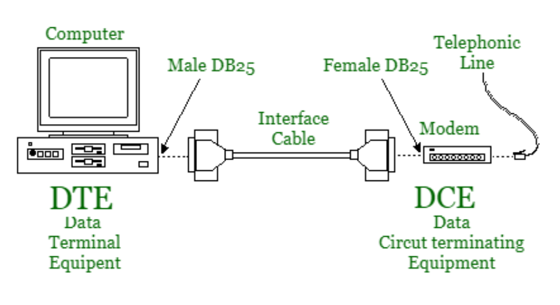

# DCE/DTE/RAS

---

# DCE

- Data Circuit-Terminal Equipment의 약자이다.
    - 데이터 회선 종단 장비라고 한다.
- DTE와 DTC(데이터 전송 회선) 사이에 위치한 장치이다.
- DCE는 DTE를 네트워크와 연결해 주기 위한 통신 장치로서 네트워크를 통해 아날로그나 디지털 신호의 형태로 데이터를 전송하거나 수신하는 모든 장치를 의미한다.
- 데이터 통신 회선을 종료하고 다양한 통신 프로토콜을 처리하는 장비이다.
    - 이는 주로 모뎀이나 CSU / DSU와 같은 장치를 가리킬 수 있다.
- 사용자-네트워크 인터페이스의 사용자 측에서 데이터 발신 장치나 수신 장치, 또는 두 가지 겸용으로 사용되는 장치이다.
- 간단히 말해, DCE는 데이터 통신 회선에 연결되어 통신을 관리하고 종료하는 장비를 가리킨다.

# DTE

- Data Terminal Equipment라고 하며, 데이터 단말 장비를 나타낸다.
- 데이터를 생성하고 처리하며, 최종 사용자와 상호 작용하는 장치를 포함한다.
    - 개인 컴퓨터, 프린터, 라우터, 스위치 서버 등이 DTE에 해당한다.
- DTE는 데이터를 생성하고 처리한 후, 이 데이터를 통신 회선에 보내거나 통신 회선에서 받은 데이터를 해석하고 최종 사용자에게 제공하는 역할을 한다.
- 통신 시스템에서 DTE와 DCE는 주로 모뎀, CSU/DSU, 라우터, 스위치 등을 포함하여 함께 작동한다.
- 간단히 말해, DTE는 데이터를 생성하고 처리하는 장치로, 일반적으로 사용자가 직접 다루는 컴퓨터 및 주변 장치들을 포함한다.

# RAS

- Remote Access Server이다.
- 사용자가 외부에서 네트워크에 접속할 수 있도록 해주는 서버이다.
- 이는 주로 인터넷을 통해 접속하여 로그인하고, 회사의 내부 네트워크나 서비스에 안전하게 접근하는 데 사용된다.
- 원격 접속 서버는 업무 유연성을 높이고 지리적으로 떨어진 팀이나 원격 근무자들이 조직의 서버에 접속할 수 있도록 하는 데 중요한 역할을 한다.
- 보안, 효율성, 사용자 경험을 향상시키기 위해 다양한 기술과 프로토콜을 사용한다.

- **원격 접속**
    - Remote Access Server를 사용하면 사용자는 지리적으로 떨어진 위치에서 네트워크에 접속할 수 있다.
    - 이는 출장 중이거나 원격 위치에 있는 직원들이 회사의 내부 자원에 접근하는 데 효과적이다.
- **VPN 연결 관리**
    - Remote Access Server는 가상 사설 네트워크(VPN) 연결을 통해 원격 사용자들을 보호하고 관리하는 데 사용된다.
    - VPN을 통해 암호화된 터널을 만들어 기업의 데이터를 안전하게 전송할 수 있다.
- **인증 및 권한 부여**
    - 사용자는 Remote Access Server를 통해 인증되고 권한이 부여되어야 한다.
    - 이를 통해 무단 접근을 방지하고, 사용자에게 필요한 권한만 부여하여 보안을 강화할 수 있다.
- **보안**
    - RAS는 방화벽과 같은 다양한 보안 기능을 포함할 수 있다.
    - 이를 통해 외부에서 내부로의 무단 접근을 막고, 네트워크의 안전성을 유지한다.
- **로그 및 모니터링**
    - Remote Access Server는 접속 로그 및 모니터링을 통해 사용자 활동을 기록하고 추적할 수 있다.
    - 이를 통해 보안 사고 발생 시 조치를 취하거나 감지할 수 있다.