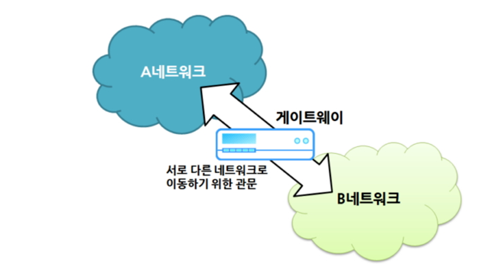
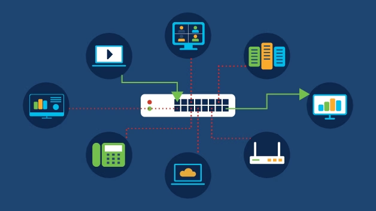
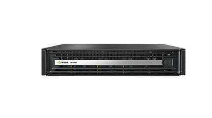

# Gateway

---

# 정의

- 게이트웨이는 ‘관문’ 이나 ‘출입구’ 라는 의미로 다양한 분야에서 일반적으로 사용되는 용어이다.
- 컴퓨터 네트워크에서의 게이트웨이는 현재 사용자가 위치한 네트워크에서 다른 네트워크로 이동하기 위해 반드시 거쳐야 하는 거점을 의미한다.
- 두 컴퓨터가 네트워크 상에서 서로 연결되려면 동일한 통신 프로토콜을 사용해야 한다.
    - 따라서 프로토콜이 다른 네트워크 상의 컴퓨터와 통신하려면 두 프로토콜을 적절히 변환해 주는 변환기가 필요한데, 게이트웨이가 바로 이러한 변환기 역할을 한다.
    - 예를 들어, 한국인과 미국인 사이에 원활한 의사소통을 위해 통역사를 두는 것과 동일하다.
- 서로 다른 전송 프로토콜을 사용하는 두 네트워크를 함께 연결하는 통신에 사용되는 네트워크 노드이다.
- 다른 네트워크 영역으로 가기 위해 필수적으로 가기 위해 거쳐야 하는 곳이다.

# 특징

- 일반적으로 하드웨어 형태로 제공된다.
- 내부적으로는 복잡한 원리로 작동하나, 외형은 간단하게 생겼다.
    - 네트워크 허브나 스위치 등과 비슷하게 생겼다.
- 기능, 용도, 적용 범위 등에 따라 크기도 다양하다.
- 설치와 설정 작업은 네트워크 전문가가 아닌 이상 처리하기가 매우 어렵다.
- 게이트웨이는 라우터와 동일한 개념으로 이해할 수 있다.
- 라우터는 네트워크 장비의 일종으로 패킷을 다른 내트워크로 보내주는 역할을 한다.
- 이와 함께 최적의 네트워크 경로를 찾아주는 역할도 함께 수행한다.
- 라우터도 이기종(heterogeneous) 네트워크를 연결한다는 부분에서 게이트웨이와 상통한다.
    - 다만 게이트웨이는 라우터보다 포괄적인 개념이다.
    - 게이트웨이와 라우터의 차이점
        - 게이트웨이와 라우터는 두 개 이상의 개별 네트워크 간의 트래픽을 조절하는 데 사용할 수 있다는 점에서 유사하다.
        - 그러나 라우터는 두 개의 유사한 유형의 네트워크를 연결하는 데 사용되고 게이트웨이는 두 개의 서로 다른 네트워크를 연결하는 데 사용됩니다
        - 이 논리로 인해 라우터는 게이트웨이로 간주될 수 있지만 게이트웨이가 항상 라우터로 간주되는 것은 아니다. 라우터는 가정이나 기업 네트워크를 인터넷에 연결하는 데 사용되는 가장 일반적인 게이트웨이이다.
        - 게이트웨이는 주로 프로토콜 변환 등의 기능에 중점을 두며, 라우터는 주로 데이터의 경로 선택과 전송에 중점을 둔다.
- 인터넷 유무선 공유기(공유기)가 우리가 볼 수 있는 첫 번째 게이트웨이다.
    - 사용자 컴퓨터의 네트워크와 인터넷을 연결하여 사용자가 웹 사이트에 접근할 수 있도록 관문을 열어준다.
- 사용자가 속해 있는 (로컬) 네트워크의 통신 프로토콜(예, netbios)과 인터넷의 통신 프로토콜(예, http)이 다르기 때문이다.
    - 참고로 공유기는 게이트웨이의 역할과 라우터의 역할, 방화벽 역할 등을 동시에 제공하는 종합 네트워크 장비이다.
- 한편 자신의 컴퓨터에서 목적지 네트워크까지 도달하기까지 여러 개의 게이트웨이를 거칠 수 있다.
    - 고속도로를 갈아탈 때마다 톨게이트를 지나야 하는 것과 다름 없다.
    - 또한 톨게이트를 지날 때마다 통행료가 부가되듯, 게이트웨이를 거칠 때마다 네트워크 부하(트래픽, traffic)도 증가하여 전송 속도가 느려질 수 있다(이때 거치는 게이트웨이의 수를 ‘홉 카운트’-hop count-라고도 한다).

# 역할

- **프로토콜 변환**
    - 게이트웨이는 서로 다른 네트워크 간에 사용되는 프로토콜을 변환한다.
    - 예를 들어, 인터넷과 로컬 네트워크 간에 TCP/IP와 IPX/SPX와 같은 다른 프로토콜을 변환하는 역할을 한다.
- **주소 변환**
    - 게이트웨이는 각 네트워크에서 사용되는 주소 체계를 변환하는 데 도움이 된다.
    - 내부 네트워크의 주소를 외부 네트워크에서 사용 가능한 주소로 변환하거나 그 반대의 역할을 수행할 수 있다.
- **보안**
    - 게이트웨이는 네트워크 간의 통신을 관리하고 보안을 제어할 수 있다.
    - 외부 네트워크로부터의 접근을 제어하거나 내부 네트워크에서 외부로 나가는 데이터를 필터링하여 보안을 강화할 수 있다.
- **로컬 네트워크와 인터넷 연결**
    - 인터넷 게이트웨이는 로컬 네트워크와 인터넷 간의 연결을 제공하여 내부 사용자가 외부로 통신할 수 있도록 한다.
    - 주로 라우터가 이 역할을 수행한다.
- **통신 흐름 제어**
    - 게이트웨이는 통신 흐름을 제어하고 다양한 네트워크 간의 데이터 전송을 조절하여 성능을 최적화한다.
- **프록시 기능**
    - 웹 게이트웨이와 같은 특수한 종류의 게이트웨이는 프록시 서버로 동작하여 클라이언트와 서버 간의 통신을 중계하고 필터링하는 데 사용된다.
    
    <aside>
    💡 프록시(Proxy) 
    프록시(Proxy)는 네트워크에서 클라이언트와 서버 간의 중계자 역할을 하는 장치나 서비스를 가리킨다.
    이는 클라이언트와 실제 서버 사이에 위치하여 클라이언트의 요청을 받아들이고 서버로 전달하는 역할을 수행한다.
    프록시는 다양한 목적으로 사용되며, 주로 보안, 익명성, 성능 최적화, 콘텐츠 필터링 등에 활용된다.
    
    </aside>
    

# 유형

- [웹 애플리케이션 방화벽](https://www.techtarget.com/searchsecurity/definition/Web-application-firewall-WAF)
    - 이 유형은 웹 서버와의 트래픽을 필터링하고 애플리케이션 계층 데이터를 확인한다.
- 클라우드 스토리지 게이트웨이
    - 이 유형은 다양한 클라우드 스토리지 서비스 API 호출을 통해 스토리지 요청을 변환한다. 이를 통해 조직은 퍼블릭 클라우드로 마이그레이션하지 않고도 프라이빗 클라우드의 스토리지를 애플리케이션에 통합할 수 있다.
- [API](https://www.techtarget.com/searchapparchitecture/definition/application-program-interface-API)[SOA](https://www.techtarget.com/searchapparchitecture/definition/service-oriented-architecture-SOA) 또는 XML 게이트웨이
    - 이 유형은 서비스, 마이크로서비스 지향 아키텍처 또는 XML 기반 웹 서비스로 들어오고 나가는 트래픽을 관리한다.
- IoT 게이트웨이
    - 이 유형은 IoT 환경의 장치에서 센서 데이터를 집계하고 센서 프로토콜 간에 변환하며 센서 데이터를 전송하기 전에 처리한다.
- 미디어 게이트웨이
    - 이 유형은 한 유형의 네트워크에 필요한 형식의 데이터를 다른 유형의 네트워크에 필요한 형식으로 변환한다.
- 이메일 보안 게이트웨이
    - 이 유형은 회사 정책을 위반하거나 악의적인 의도로 정보를 전송하는 이메일의 전송을 방지한다.
- VoIP 트렁크 게이트웨이
    - 이 유형은 VoIP(Voice over IP) 네트워크를 통해 유선 전화 및 팩스기와 같은 일반 전화 서비스 장비의 사용을 용이하게 한다.