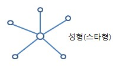

# Hub(허브)

---

# 1. 정의

- 네트워크의 여러 장치를 연결하기 위해 물리적 계층에서 사용되는 하드웨어 장치다.
    - 허브는 LAN을 연결하는 데 널리 사용된다.
- 대역폭을 연결된 PC의 대수만큼 나눠져서 제공한다는 것이 단점이다.
    - 예를 들어, 10Mbps의 대역폭(속도)를 가진 인터넷에 8포트 허브로 PC를 연결시켰다면, 연결된 PC는 1.25Mbps만큼의 속도로 인터넷을 사용할 수 있다.
- 따라서, 매우 비효율적이므로 요즘은 스위치라는 장비가 대체하고 있다.

- 허브에는 여러 포트가 있으며 비지능형 장치이다.
- 스위치와 달리 허브는 데이터를 필터링할 수 없다.
- 즉, 패킷의 대상을 식별할 수 없으므로 각 포트에 메시지를 브로드캐스트하거나 보낸다.
    
    <aside>
    💡 **브로드캐스트(Broadcast)**
    자신의 호스트가 속해 있는 네트워크 전체를 대상으로 패킷을 전송하는 일대다 통신방식이다. 브로드캐스트는 로컬 랜 상에 붙어있는 모든 네트워크 장비들에게 보내는 통신이다.
    
    </aside>
    
    - 이것이 비지능적이거나 멍청한 장치로 알려진 이유이다.
- 허브에는 포트의 데이터를 저장하고 대상 주소를 매핑하는 라우팅 테이블이 없다.
    - 라우팅 테이블은 모든 포트에 정보를 전송/브로드캐스트하는 데 사용된다.
        
        <aside>
        💡 **라우팅 테이블(Routing Table)** 
        컴퓨터 네트워크에서 목적지 주소를 목적지에 도달하기 위한 네트워크 노선으로 변환시키는 목적으로 사용된다.
        
        </aside>
        

# 2. 작동

- 허브는 장치에 여러 포트가 있고 여러 포트에 데이터를 함께 공유하는 다중 포트 장치이다.
- 허브는 어떤 데이터를 어디로 전달해야 하는지 알지 못하는 멍청한 스위치 역할을 하여 데이터를 각 포트에 브로드캐스트하거나 보낸다.
- 허브 A, B, C, D, E에 5개의 포트가 있다고 가정힌다.
- A가 데이터 프레임을 전송하려고 한다고 가정하거나 A가 전송자 역할을 하므로 허브는 A가 전송한 데이터를 B로 전달한다.
- 이제 B도 동시에 데이터를 전송하려는 경우 A와 B에서 수신된 데이터가 충돌하여 데이터 손실이 발생할 수 있다.
- 이러한 상황에서는 데이터가 파괴되고, 호스트는 모든 호스트에 충돌을 알리는 jam 신호(정체신호)를 보내며, 각 보낸 사람은 일정 시간 동안 기다려야 한다.
    - **참고:** 허브에서는 데이터가 모든 포트로 전송되지만 각 포트는 대상 주소가 MAC 주소와 일치하는 데이터만 허용합니다.

# 3. 유형

### 3-1. **액티브 허브**

- 신호를 재생하고 증폭하기 위한 전원 공급 장치가 있다.
- 포트가 신호가 약한 데이터를 전송하면 허브는 신호를 재생성하고 강화한 다음 이를 다른 모든 포트로 보낸다.
- 액티브 허브는 패시브 허브에 비해 비용이 많이 든다.

### 3-2. **패시브 허브**

- 패시브 허브는 컴퓨터화된 요소가 없기 때문에 단순히 다른 네트워크 케이블의 신호를 연결하는 데 사용된다.
- 그들은 단순히 스타 토폴로지에서 다양한 장치의 와이어를 연결한다.
    
    <aside>
    💡 **성형 구조 (StarTopology)
    - 스타 네트워크**(star network)는 이더넷 LAN에서 가장 널리 사용되는 물리적 토폴로지. - 주된 네트워크 장비에 기타 네트워크 장비를 추가로 연결하기 위해 스타 네트워크가
    
      확장될 수 있으며, 이러한 토폴로지를 확장 스타 토폴로지라고 한다.
    - 모든노드(node)가 중앙노드에 직접연결되는토폴로지 구성형태
    
    
    
    </aside>
    
- 패시브 허브는 처리나 신호 재생성을 수행하지 않으므로 전기가 필요하지 않으며 신호를 복사하거나 반복할 수 있다는 것이 가장 큰 장점이다.
- 메시지를 정리할 수 없고 신호를 증폭하거나 강화할 수도 없다.

### 3-3. **지능형 허브**

- 이름에서 알 수 있듯이 지능형 허브는 능동 및 수동 허브보다 더 똑똑하다.
- 지능형 허브는 MIB(Management Information Base)라는 특수 모니터링 장치로 구성된다.
    - 네트워크 문제를 분석하고 해결하는 데 도움이 되는 소프트웨어이다.
- 지능형 허브는 활성 허브와 유사하게 작동하지만 일부 관리 기능이 있다.
- 마찬가지로 네트워크 트래픽과 포트 구성을 모니터링할 수 있다.

# 4. 특징

- 반이중 전송을 지원한다.
    
    <aside>
    💡 **반이중 전송**
    - 통신 채널에 접속된 두 대의 단말기 중 어느 한쪽이 데이터를 송신하면 상대편은 수신만 가능한 통신
    - 송신측과 수신측이 정해져 있지 않으며 양 단말기의 상호 협력에 의해 송수신 방향 전환
    - 하나의 통신 채널을 이용하여 교대로 데이터 송수신
    
    </aside>
    
- 공유 대역폭 및 브로드캐스팅과 함께 작동한다.
- 허브는 다양한 장치에 높은 데이터 전송 속도를 제공할 수 있다.
- 네트워크의 충돌을 감지하고 각 포트에 재밍 신호를 보낼 수 있다.
- 허브는 VLAN 및 스패닝 트리 프로토콜을 지원하지 않는다.
    
    <aside>
    💡 **VLAN(Virtual LAN)
    가상 근거리 통신망이**다. VLAN은 가상 작업 그룹을 구현하기 위해 LAN 장치를 논리적으로(물리적으로 아님) 세그먼트로 나누는 새로운 데이터 교환 기술이다.
    
    </aside>
    
    <aside>
    💡 **스패닝 트리 프로토콜(Spanning-Tree Protocol)**
    물리적으로 Switch 간의 연결된 경로가 2개 이상 일 때 "논리적으로 하나의 포트를 차단" 함으로써, 루프 구간을 없애는 프로토콜
    
    </aside>
    
- 데이터를 필터링할 수 없으므로 이를 각 포트로 전송하거나 브로드캐스트할 수 없다.
- 데이터를 전송하기 위한 최적의 경로/최단 경로를 찾을 수 없기 때문에 비효율적인 장치이다.

# 5. 장단점

### 5-1. 장점

- 저렴하다
- 네트워크 성능에 영향을 주지 않는다.
- 다양한 네트워크 미디어를 지원한다.
- 다양한 미디어와 쉽게 연결된다.

### 5-2. 단점

- 네트워크의 최적/최단 경로를 찾을 수 없다.
- 트래픽 감지 메커니즘이 없다.
- 데이터 필터링을 위한 메커니즘이 없다.
- 토큰, 링, 이더넷 등과 같은 다른 네트워크 토폴로지에 연결할 수 없다.

참고> 

[What is Network Hub and How it Works? - GeeksforGeeks](https://www.geeksforgeeks.org/what-is-network-hub-and-how-it-works/)