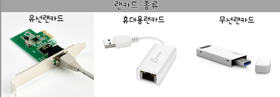

# LAN card(랜 카드)

---

# 1. 정의

- 1계층인 물리계층에 속하며, 정식 명칭으로는 네트워크 인터페이스 카드(NIC)이다.
- 근거리 통신망을 의미하는 랜(LAN)과 PC의 확장 슬롯에 꽂아서 사용하는 장치를 표현하는 카드(Card)의 합성어이다.
- 컴퓨터를 LAN(Local Area Network)에 연결해주는 장비
    - 외부와 데이터를 주고 받을 수 있는 PC컴퓨터의 통신 장치이다.
    - 즉, 외부 네트워크와 빠른 속도로 접속할 수 있고 데이터를 통신할 수 있게 컴퓨터 안에 설치하는 확장카드이다.
    - 보통은 PC 내부에 장착되고, 외부케이블인 LAN 선 등으로 LAN에 연결시킬 수 있다.
- LAN 카드는 네트워크가 작동하기 위해 MAC 주소를 사용하여 컴퓨터 네트워크를 연결하는 내부에 연결되는 하드웨어이다.
- 랜 카드는 사용자의 데이터를 케이블에 실어서 허브, 스위치, 라우터로 전달하고 다시 받은 데이터를 CPU에 전달하는 역할을 하는 장치이다.
- 랜 카드는 랜에 접속하는 카드이다. 랜 카드의 경우 PC 데스크톱, 노트북, 프린터와 같이 네트워크 연결이 필요한 컴퓨터 내부에 들어간다.
- 랜 카드는 네트워크 카드, 이더넷 카드(Ethernet Card), 이더넷 어댑터(Ethernet Adapter), 네트워크 어댑터(Network Adapter), 네트워크 인터페이스 컨트롤러 NIC(Network Interface Card)와 동일한 개념이다. 이더넷(Ethernet)은 가장 많이 사용되는 방식이다.
    
    <aside>
    💡 **이더넷(Ethernet)**
    LAN(근거리 통신망) 구축을 위해 장치를 연결하는 데 널리 사용되는 네트워킹 프로토콜로, 장치가 네트워크를 통해 데이터 패킷을 다른 장치와 교환하여 통신하도록 지원한다.
    
    </aside>
    

# 2. 동작 원리

- OSI 7계층의 1계층(물리계층), 2계층(데이터링크계층)의 기능을 제공
- 컴퓨터 내부에서 병렬 데이터를 직렬 데이터로 바꾸어 네트워크로 전송
    - 컴퓨터 내부에서 묶여있는 데이터를 끊겨있는 데이터로 바꾸어 네트워크로 전송
- 네트워크에서 직렬 데이터를 병렬데이터로 바꾸어 컴퓨터 내부로 보냄
    - 네트워크에서 끊겨있는 데이터를 묶여있는 데이터로 바꾸어 컴퓨터 내부로 전송
- 컴퓨터 내부에서 처리되는 데이터를 전기신호로 변환
- 정보의 최소단위인 비트를 모아 패킷이라는 형태로 변환 후 한꺼번에 전송