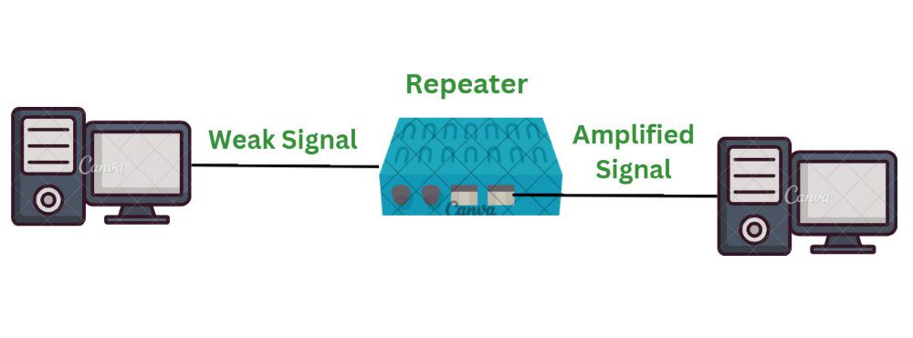
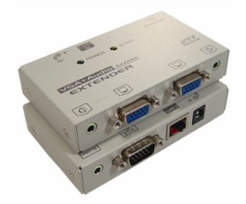

# Repeater(리피터)

---

# 1. 정의

- 1계층인 물리계층에 속한다.
- 케이블이 가지고 있는 물리적인 한계 때문에 데이터가 멀리 전송되지 않는 약점을 보완해주는 장비
- 리피터로 수신된 신호를 받아 증폭시켜 재전송시킴으로써 전송거리를 확장시키는 장치다.
- 하지만. UTP 케이블과 광케이블 등 성능이 뛰어난 케이블이 등장함으로써 거의 사라짐.
- 리피터를 사용하면 오류와 데이터 손실을 줄이는 데 도움이 되며 지정된 위치에만 데이터를 전달할 수 있다.
- 중계기를 사용하는 가장 큰 장점은 더 안전하고 장거리에서 데이터를 전송할 수 있다는 것이다.

# 2. 특징

- 신호를 수정하지 않고 신호를 재생성할 수 있다.
- 아날로그 신호와 디지털 신호에 사용할 수 있다.
- 네트워크 범위를 확장할 수 있다.
- 동적 네트워킹을 지원한다.
- 오류와 데이터 손실이 줄어든다.
- 중계기 작동에는 전원이 필요하다.
- 리피터를 사용하면 네트워크가 복잡해질 수 있다.

# 3. 작업

- 처음에는 소스 시스템이 신호를 전송한다. 이 소스 시스템은 휴대폰, 노트북 또는 라디오일 수 있다.
- 소스 시스템에서 전송된 신호는 무선 네트워크인 경우 공기 중으로 이동하고, 유선 네트워크인 경우 케이블을 통해 이동한다. 신호가 소스에서 멀어질수록 강도가 약해진다.
- 중계기로 수신된 신호는 소스 시스템에서 보낸 실제 신호가 아니라 약한 신호이다. 따라서 중계기는 약한 신호를 증폭하여 강화힌다.
- 이제 강화 신호가 중계기에서 목적지로 전송된다. 이 신호는 더욱 강력하며 더 먼 거리까지 이동할 수 있다. 즉, 신호 품질을 잃지 않고 네트워크를 확장한다.
- 따라서 리피터는 Wi-Fi 와 같은 다양한 무선 기술과 이더넷 과 같은 유선 기술에 사용된다.

# 4. 종류

- 기능과 특징에 따라 리피터는 세 가지 유형으로 구분된다.

### 4-1. 신호의 종류(중계기에 의해 생성되는 신호 유형에 따라)

- **아날로그 중계기**
    - 아날로그 신호만 증폭하는 데 사용된다.
    - 아날로그 신호를 수신하여 증폭한 다음 출력으로 재생성한다.
    - 아날로그 신호가 사용되는 기존 네트워크 기술에서 주로 사용되었다.
- **디지털 중계기**
    - 디지털 신호를 증폭하지 않고 직접 재생하는 중계기 유형이다.
    - 디지털 신호가 사용되는 현대 기술에 주로 사용된다.
    - 왜곡된 신호를 재구성할 수도 있다.

### 4-2. **연결된 네트워크의 종류**

- **유선 중계기**
    - 유선 근거리 통신망(LAN)에 사용된다.
    - 신호를 수신하여 반복한다. 이는 네트워크의 강도와 데이터를 잃지 않고 네트워크 이동 데이터를 확장하는 데 도움이 된다.
- **무선 중계기**
    - 무선 중계기는 무선 근거리 통신망(LAN) 및 셀룰러 네트워크에 사용된다.
    - 네트워크에 연결된 라우터는 중계기에 무선 신호를 보낸다. 일단 수신되면 중계기는 신호를 방송하여 네트워크 범위를 늘린다.

### 4-3. **LAN 네트워크 영역에 따라**

중계기는 연결된 네트워크상의 위치에 따라 다음과 같이 분류된다.

- **로컬 리피터**
    - 네트워크가 매우 작은 근거리 통신망에서 사용된다.
    - 네트워크에 연결된 장치 간의 거리는 매우 작다.
- **원격 중계기**
    - 네트워크 규모가 매우 큰 근거리 통신망에서 사용된다.
    - 네트워크에 연결된 장치 간의 거리가 더 길다.

### 4-4. **기술 기반**

- **마이크로파 중계기(Microwave Repeater)**
    - 마이크로파 중계기는 송신 스테이션과 수신 스테이션인 소스와 대상 사이에 내장된 중계기 유형이다.
    - 마이크로파 중계기의 사용은 두 장치 사이의 거리에 따라 달라진다.
    - 마이크로파 중계기에는 고전력 송신기와 민감한 수신기가 사용된다.
- **광 중계기**
    - 광 중계기는 광섬유 통신 시스템의 통신에 사용되는 중계기 유형이다.
    - 광 중계기는 작업이 전송되기 전에 작업을 증폭하고 재구성할 수 있다.
    - 광 중계기는 광섬유 케이블의 모든 신호를 전자 형태로 포착한다.
- **라디오 중계기(Radio Repeater)**
    - 라디오 중계기는 수신된 모든 데이터를 무선 신호로 전송하는 중계기의 일종이다.
    - 라디오 중계기에는 라디오 수신기와 라디오 송신기라는 두 가지 포트가 있다.
    - 무선 송신기는 중계기로부터 수신된 데이터를 재전송하는 데 사용되며, 무선 수신기는 수신되는 모든 데이터를 신호 형태로 수집한다.
- **전화 중계기**
    - 전화 중계기는 장거리 네트워크에 사용되는 중계기 유형이다.
    - 트랜지스터를 갖춘 증폭기는 전화 중계기에 사용된다.
    - 전화 중계기는 양방향 통신 시스템이다. 전화 중계기는 주로 잠수함 통신에 사용된다.

# 5. 장점

- **더 나은 네트워크 성능**
    
    리피터는 항상 처리 오버헤드에 의존하지 않기 때문에 더 나은 네트워크 성능을 제공한다.
    
- **효율적인 비용**
    
    중계기는 다른 네트워크 장치에 비해 비용 효율적이다.
    
- **네트워크 확장**
    
    중계기는 데이터 전송에 사용 가능한 네트워크를 확장하는 이점을 제공한다.
    
- **물리적 장벽 없음**
    
    물리적 장치를 사용하면 신호를 전송하는 동안 일부 장벽이 발생할 수 있다. 무선 중계기를 사용하면 이러한 문제가 해결된다.
    
- **향상된 신호**
    
    컴퓨터 장치와 라우터가 장거리 네트워크에 연결되면 신호 강도가 약해진다. 중계기를 사용하면 장거리에서도 신호 강도가 향상된다.
    

# 6. 단점

- **네트워크 트래픽**
    
    리피터에는 네트워크 트래픽을 분할하는 기능이 없다. 따라서 중계기는 혼잡에 대한 특성이 부족하다.
    
- **네트워크 분할**
    
    리피터에는 네트워크 트래픽을 분할하는 기능이 없으므로 리피터는 한 케이블에서 다른 케이블로 별도의 트래픽을 생성할 수 없다.
    
- **제한된 수의 중계기**
    
    제한된 수의 중계기 사용이 네트워크에서 지원된다. 지정된 것보다 더 많은 수의 중계기를 사용하면 패킷 충돌이 발생하고 소음이 증가할 수도 있다.
    
- **충돌 도메인**
    
    다양한 도메인에서 정보가 전달되어 리피터가 장치를 분리할 수 없다.
    

참고>

[Repeaters in Computer Network - GeeksforGeeks](https://www.geeksforgeeks.org/repeaters-in-computer-network/)