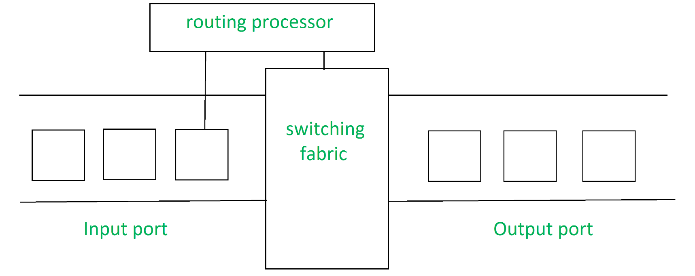

# 라우터

# 정의

- 라우터는 컴퓨터 네트워크 간에 데이터 패킷을 전달하는 OSI 모델의 네트워크 계층에서 작동하는 네트워킹 장치다.
    - 라우터를 사용하여 하나 이상의 패킷 교환 네트워크 또는 하위 네트워크를 연결할 수 있다.
        - 패킷은 일반적으로 목적지 노드에 도달할 때까지 인터네트워크를 구성하는 네트워크를 통해 한 라우터에서 다른 라우터로 전달된다.
    - 의도한 IP 주소로 데이터 패킷을 전송함으로써 서로 다른 네트워크 간의 트래픽을 관리하고 여러 장치가 인터넷 연결을 공유할 수 있도록 허용한다.
- 연결된 컴퓨터 네트워크 사이에서 데이터 패킷을 수신, 분석 및 전달하는 일을 담당한다.
- 라우터에는 여러 호스트 시스템에 연결할 수 있는 여러 인터페이스가 있다.
    - 라우터는 OSI 모델의 네트워크 계층에서 작동하는 장치이며 네트워킹에 사용되는 가장 일반적인 장치다.
- 라우터는 네트워크 간 및 글로벌 인터넷에서 트래픽 지시 기능을 수행한다.
- 라우터는 서로 다른 IP 네트워크의 두 개 이상의 데이터 라인에 연결된다.
    - 데이터 패킷이 라인 중 하나에 들어오면 라우터는 패킷 헤더의 네트워크 주소 정보를 읽어 패킷의 가장 좋은 다음 홉, 최종 목적지를 결정한다.
    - 그 뒤 라우팅 테이블이나 라우팅 정책의 정보를 사용하여 패킷을 이동 중인 다음 네트워크로 보낸다.
- 상호 연결된 네트워크에서 여러 라우터를 사용하는 경우 라우터는 라우팅 프로토콜을 사용하여 대상 주소에 대한 정보를 교환할 수 있다.
    
    
    
    - 라우팅 프로토콜은 라우터가 컴퓨터 네트워크의 노드 간 경로를 선택할 수 있도록 하는 정보를 배포하기 위해 서로 통신하는 방법을 지정한다.
- 각 라우터는 상호 연결된 네트워크의 두 컴퓨터 시스템 간에 경로 목록인 라우팅 테이블을 구축한다.
- 라우터를 실행하는 소프트웨어는 동시에 작동하는 두 개의 기능 처리 장치(Planes)으로 구성된다.
    1. 제어 평면
        - 라우터는 데이터 패킷을 전달하는 데 사용해야 하는 경로와 물리적 인터페이스 연결을 통해 나열되는 라우팅 테이블을 유지 관리한다.
        - 이는 정적 경로라고 하는 내부 사전 구성된 지시문을 사용하거나 라우팅 프로토콜을 사용하여 동적으로 경로를 학습함으로써 수행된다.
        - 정적 및 동적 경로는 라우팅 테이블에 저장된다.
        - 그 뒤 제어 평면 논리는 테이블에서 중요하지 않은 지시문을 제거하고 전달 평면에서 사용할 FIB(전달 정보 베이스)를 구축한다.
    2. 전달 평면
        - 들어오고 나가는 인터페이스 연결 간에 데이터 패킷을 전달한다.
        - 들어오는 각 패킷의 헤더를 읽고 대상을 제어 플레인에서 제공하는 FIB의 항목과 일치시킨 다음 패킷을 FIB에 지정된 나가는 네트워크로 보낸다.
    
    ### 라우팅 테이블
    
    - 라우팅 테이블(또는 라우팅 정보 베이스, RIB)는 특정 네트워크 대상에 대한 경로와 경우에 따라 해당 경로와 관련된 메트릭(거리)을 나열하는 라우터 또는 네트워크 호스트에 저장된 데이터 테이블이다.
    - 라우팅 테이블에는 바로 주변의 네트워크 토폴로지에 대한 정보가 포함되어 있다.
    - 라우터의 기능은 라우터에 저장된 라우팅 테이블에 따라 크게 달라진다.
    - 라우팅 테이블은 모든 목적지에 대해 사용 가능한 경로를 저장한다.
    - 라우터는 라우팅 테이블을 참조하여 데이터 패킷이 전송될 수 있는 최적의 경로를 결정한다.
    - 라우팅 테이블에는 일반적으로 다음 엔터티가 포함된다.
        - 네트워크 노드의 IP 주소 및 서브넷 마스크
        - 네트워크에 있는 라우터의 IP 주소
        - 네트워크 장치 및 채널 간의 인터페이스 정보
    - 라우팅 테이블의 두 가지 유형은 다음과 같다.
        - 정적 라우팅 테이블
            - 경로는 수동으로 공급되며 자동으로 새로 고쳐지지 않는다.
            - 2 ~ 3개의 라우터를 포함하는 소규모 네트워크에 적합하다
        - 동적 라우팅 테이블
            - 라우터는 라우팅 프로토콜을 사용하여 다른 라우터와 통신하여 사용 가능한 경로를 결정한다.
            - 라우터 수가 많은 대규모 네트워크에 적합하다.

# 유형

1. 광대역 라우터
    - 컴퓨터를 연결하거나 인터넷에 연결하는 데 사용된다.
    - 전화를 통해 인터넷에 연결하고 고속 인터넷 액세스를 제공하기 위해 VoIP(Voice over Internet Protocol) 기술을 사용하는 데 사용된다.
    - ISP(Internet Service Provider)가 구성하고 제공한다.
2. 무선 라우터
    - 노트북, 스마트폰 등과 같은 WiFI 연결 WiFi 장치를 제공한다.
    - 또한 표준 이더넷 라우팅도 제공할 수 있다.
    - 유선 광대역을 통해 데이터 패킷을 수신하고 이진 코드로 작성된 패킷을 전자 장치가 수신하는 무선 신호로 변환한 다음 다시 이전 패킷으로 변환한다.
3. 유선 라우터
    - 이더넷 케이블을 사용하여 여러 유선 장치를 연결하는 데 사용된다.
    - 모뎀에서 전송 데이터를 가져와 추가 네트워크에 배포하여 학교와 소규모 사무실에서 널리 사용된다.
4. 에지 라우터
    - 네트워크 주변에 배치되는 저용량 라우터다.
    - 일반적으로ISP에 연결된 에지(Edge)에 위치하며 여러 패킷에 걸쳐 패킷을 배포한다.
    - 내부 네트워크를 외부 네트워크에 연결하여 네트워크를 통해 데이터 패킷을 전송하는 데 적합하다.
    - 연결을 위해 BGP(Border Gateway Protocol)을 사용한다.
    - 에지 라우터에는 가입자 에지 라우터와 레이블 에지 라우터의 두 가지 유형이 있다.
5. 코어 라우터
    - 동일한 네트워크 내에서 패킷을 배포한다.
    - 주요 임무는 대용량 데이터 전송을 수행하는 것이다.
6. 가상 라우터
    - 가상 머신의 소프트웨어를 사용하여 구현되며 더 유연하고 확장 가능하다.
7. 휴대용 라우터
    - 개인 Wi-Fi를 생성하는 데 사용되므로 쉽게 휴대할 수 있도록 설계되었다.
8. 브라우터(Brouters)
    - 브리지 기능도 제공할 수 있는 전문 라우터다.
    - 브릿지처럼 브라우터는 네트워크 간에 데이터를 전송하는 데 도움이 된다.
    - 라우터처럼 네트워크 장치 내에서 데이터를 라우팅한다.

# 주요 기능

1. 전달
    - 라우터는 입력 포트에서 패킷을 수신하고, 헤더를 확인하고, 체크섬 확인과 같은 몇 가지 기본 기능을 수행 한다.
    - 그 뒤 라우팅 테이블을 조회하여 패킷을 덤프할 적절한 출력 포트를 찾은 뒤 해당 출력 포트로 패킷을 전달한다.
2. 라우팅(Routing)
    - 패킷이 목적지에 도달하는 가장 좋은 경로가 무엇인지 라우터가 확인하는 프로세스다.
    - 라우터에서만 다른 알고리즘을 사용하여 만들어진 라우팅 테이블을 유지한다.
3. NAT(네트워크 주소 변환)
    - 라우팅은 NAT를 사용하여 다양한 IP 주소 범위 간을 변환한다.
    - 이를 통해 개인 네트워크의 장치는 단일 공용 IP 주소를 사용하여 인터넷에 액세스할 수 있다.
4. 보안
    - 방화벽 및 기타 보안 기능으로 구성되어 무단 액세스, 맬웨어 및 기타 위협으로부터 네트워크를 보호할 수 있다.
5. 서비스 품질(QoS)
    - 라우터는 전송되는 데이터 유형에 따라 네트워크 트래픽의 우선 순위를 지정할 수 있다.
    - 이를 통해 중요한 애플리케이션과 서비스가 적절한 대역폭을 수신하고 우선순위가 낮은 트래픽의 영향을 받지 않도록 한다.
6. VPN(가상 사설망) 연결
    - 원격 사용자가 VPN을 사용하여 네트워크에 안전하게 연결할 수 있도록 라우터를 구성할 수 있다.
7. 대역폭 관리
    - 라우터를 사용하면 네트워크에 흐르는 데이터의 양을 제어하여 네트워크 대역폭을 관리할 수 있다.
    - 이를 통해 네트워크 정체를 방지하고 중요한 애플리케이션과 서비스가 적절한 대역폭을 수신하도록 할 수 있다.
8. 모니터링 및 진단
    - 라우터는 네트워크 트래픽을 모니터링하고 네트워크 장애 또는 기타 문제가 발생할 경우 진단 정보를 제공하도록 구성할 수 있다.

# 아키텍처

- 입력 포트
    - 패킷이 라우터로 승인되는 인터페이스로 라우터에서 물리적 링크를 종료하는 등 여러 주요 기능을 수행한다.
    - 캡슐화 해제와 같이 링크 계층과 상호 운용되는 경우 입력 포트의 마지막 부분에서 전달 테이블을 조회하고 대상 주소를 기반으로 적절한 출력 포트를 결정하는 데 사용된다.
- 스위칭 패브릭(Switching Fabric)
    - 라우터의 핵심으로, 입력 포트와 출력 포트를 연결한다.
    - 이는 네트워킹 장치 내부의 일종의 네트워크다.
    - 스위칭 패브릭은 다음과 같은 몇 가지 주요 방법으로 구현될 수 있다.
        - 메모리를 통한 전환
            - 입력 포트에서 패킷을 복사하여 적절한 출력 포트로 보내는 프로세서가 있다.
            - 이는 입력 및 출력 장치 역할을 하는 입력 및 출력 포트를 갖춘 전통적인 CPU로 작동한다.
        - 버스를 통한 전환
            - 이 구현에는 모든 입력 포트를 모든 출력 포트에 연결하는 버스가 있다.
            - 패킷을 수신하고 이를 어떤 출력 포트로 전달해야 하는지 결정하면 입력 포트는 특정 토큰을 패킷에 넣고 이를 버스로 전송한다.
            - 모든 출력 포트는 패킷을 볼 수 있지만 토큰이 삽입된 출력 포트로 전달되고 해당 출력 포트에서 토큰을 긁어낸 후 패킷이 전달된다.
        - 상호 연결 네트워크를 통한 스위칭
            - 더 정교한 네트워크다.
            - 단일 버스 대신 2N 버스를 사용하여 n개의 입력 포트를 n개의 출력 포트에 연결한다.
- 출력 포트
    - 라우터에서 패킷이 전송되는 세그먼트
    - 출력 포트는 자신의 큐 버퍼를 살펴 보고(동일한 출력 포트를 통해 두 개 이상의 패킷을 전송해야 하는 경우 큐 버퍼가 형성된다.) 패킷을 가져와서 링크 계층 기능을 수행한다.
    - 마지막으로 패킷을 나가는 링크로 전송한다.
- 라우팅 프로세서
    - 라우팅 프로토콜을 실행하여 기존 CPU처럼 작동한다.
    - 링크 상태 알고리즘, 거리 벡터 알고리즘 등과 같은 다양한 알고리즘을 사용하여 경로 및 출력 포트를 결정하기 위해 조회되는 전달 테이블을 준비한다.

# 프로토콜

- OSPF(Open Shortest Path First)
    - 최단 경로를 우선 연다.
    - 패킷이 연결된 네트워크 모음을 통해 이동할 때 목적지에 도달하기 위해 선택할 최적의 경로를 결정하는 데 활용된다.
    - IEFT(Internet Engineering Task Force)는 이를 내부 게이트웨이 프로토콜로 지정했다.
- BGP(Border Gateway Protocol)
    - 인터넷 패킷 라우팅을 제어하기 위해 에지 라우터 간의 정보 공유를 용이하게 한다.
    - 라우터의 경우 네트워크 안정성을 제공한다.
    - 패킷이 전달되는 동안 하나의 인터넷 연결이 실패할 경우 패킷을 전송하기 위해 신속하게 다른 네트워크 연결로 전환할 수 있다.
- IGRP(Interior Gateway Routing Protocol)
    - 자율 네트워크가 게이트웨이 간에 라우팅 정보를 교환하는 방법을 결정한다.
    - 그 뒤 다른 네트워크 프로토콜은 라우팅 정보를 사용하여 전송 라우팅 방법을 지정한다.
- EIGRP(Enhanced Interior Gateway Routing Protocol)
    - 테이블에서 대상에 대한 경로를 찾을 수 없는 경우 라우터에게 이웃으로 라우팅하도록 요청한다.
    - 이웃은 라우터가 경로를 찾을 때까지 추가 이웃에게 요청을 전달한다.
    - 라우터의 라우팅 테이블 항목이 변경되면 이웃에게 수정 사항만 알릴 뿐 전체 테이블이 전송되지는 않는다.
- EGP(Exterior Gateway Protocol)
    - 각각 자체 라우터가 있는 두 개의 인접 게이트웨이 호스트가 라우팅 정보를 공유할 수 있는 프로토콜을 결정한다.
    - 또한 인터넷 호스트 간의 라우팅 테이블 데이터 통신에도 자주 사용된다.
- RIP(Routing Information Protocol)
    - RIP는 상호 연결된 LAN 그룹 간에 트래픽이 이동할 때 라우터가 정보를 공유하는 방법을 정의하는 원래 프로토콜이다.
    - RIP에 허용되는 최대 홉 수는 15이며, 이는 RIP가 지원할 수 있는 네트워크 크기를 제한한다.

# 라우터와 스위치의 주요 차이점

| 라우터 | 스위치 |
| --- | --- |
| 라우터는 여러 네트워크를 연결하는 데 사용된다. | 스위치는 네트워크의 여러 장치를 연결하는 데 사용된다. |
| 라우터는 라우팅 테이블을 유지한다 | 스위치는 의사 결정을 위해 MAC 주소 테이블을 유지한다. |
| NAT(Network Address Translation)를 지원한다. | NAT를 지원하지 않는다 |
| 라우터는 네트워크 계층에서 작동한다. | 스위치는 데이터 링크 계층에서 작동한다. |
| 라우터는 스위치보다 더 비싸다. | 스위치는 라우터보다 저렴하다. |