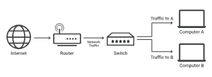

# 스위치

# 정의

- 네트워크 스위치는 네트워크의 장치를 서로 연결하여 데이터 패킷을 교환, 통신할 수 있도록 한다.
- MAC 주소를 기반으로 LAN 세그먼트 간의 패킷을 필터링하고 전달하는 역할을 한다.
- 스위치는 물리적 네트워크를 관리하는 하드웨어 장치일 수도 있고 소프트웨어 기반 가상 장치일 수도 있다.
- 네트워크 스위치는 OSI 모델의 데이터 링크 계층 또는 계층 2에서 작동한다.
- 이더넷을 사용하는 LAN에서 네트워크 스위치는 MAC 주소를 확인하여 들어오는 각 메시지 프레임을 어디로 보낼지 결정한다.
    - 데이터가 어떤 포트에 도착하면 대상 주소를 먼저 검사하고 일부 검사도 수행한 다음 장치로 처리된다.
    - 유니캐스트, 멀티캐스트, 브로드캐스트 통신과 같은 다양한 유형의 통신이 여기서 지원된다.
- 스위치는 각 MAC 주소를 MAC 주소를 수신하는 포트와 일치시키는 테이블을 유지한다.
- 네트워크 스위치가 제공하는 이점은 다음과 같다.
    - 서로 다른 엔드포인트 간에 정보를 전달하는 역할을 한다.
    - 현대 데이터 네트워크에서 네트워크 장치의 대부분을 구성하며 통신 공급자 네트워크에서 엄청난 양의 트래픽을 전달한다
    - 전이중 통신을 제공하고, 네트워크 세그먼트를 연결하고, 네트워크 성능을 향상시키며, 사용 가능한 대역폭을 효과적으로 활용한다.
    - 데스크톱 컴퓨터, 무선 액세스 포인트(AP), 프린터, 산업 기계 및 카드 입력 시스템과 같은 일부 사물 인터넷(IoT)장치에 대한 유선 연결을 제공한다.
    - 데이터 센터에서 가상 머신(VM)을 호스팅하는 컴퓨터는 물론 물리적 서버와 대부분의 스토리지 인프라를 연결한다
    - 대부분의 최신 스위치는 네트워크 장치의 연결을 지원하기 위해 최대 100와트의 전력을 공급할 수 있는 PoE(Power over Ethernet) 기술을 사용한다.
        - 이를 통해 기업에서는 별도의 전원이 필요하지 않은 장소에 실외 조명, 보안 카메라, IP 전화를 통한 음성 및 다양한 종류의 센서와 같은 장비를 설치하여 원격 지역을 모니터링할 수 있다.
    - IoT 장치의 데이터는 네트워크 스위치를 통해 수집되고 인공 지능 및 기계 학습 알고리즘에 사용되어 주변 환경을 최적화할 수 있다.
    
    ## 가상 스위치(Virtual Switches)
    
    - 가상 스위치는 가상 머신 호스팅 환경 내에서 인스턴스화되는 소프트웨어 전용 스위치다.
    
    ## 라우팅 스위치(Routing Switches)
    
    - LAN을 연결한다.
    - MAC 기반 레이어 2 스위칭을 수행하는 것 외에도 OSI 레이어 3에서 라우팅 기능을 수행하여 각 패킷의 IP 주소를 기반으로 트래픽을 전달한다.
    
    ## 비관리형 스위치(Unmanaged Switches)
    
    - 자동 데이터 전달을 돕는 이더넷 장치를 활성화하는 데 사용되는 장치
    - 일반적으로 홈 네트워크 및 소규모 기업에 사용된다.
    - 더 많은 스위치가 필요한 경우 PnP 방식으로 스위치를 더 추가할 수 있다.
    - 이더넷 장치가 데이터 속도와 같은 매개변수를 결정하는 자동 협상을 사용하여 자동으로 데이터를 전달할 수 있다.
    - 구성은 고정되어 있으며 편집할 수 없다.
    
    ## 관리형 스위치(Managed Switches)
    
    - 사용자가 스위치의 각 포트를 조정할 수 있다.
    - 이를 통해 모니터링 및 구성 변경이 가능해진다.
    - 관리되는 스위치를 구성하는 데 SNMP(Simple Network Management Protocol)를 사용할 수 있다.
    - 복잡한 아키텍처를 갖는 대규모 네트워크에서 주로 사용된다.
    - 더 나은 보안 수준과 정밀한 제어를 제공하지만 관리되지 않는 스위치보다 비용이 더 많이 든다.
    
    ## LAN 스위치(LAN Switches)
    
    - 이더넷 스위치 또는 데이터 스위치라고도 한다.
    - LAN 스위치는 항상 이러한 방식으로 대역폭을 할당함으로써 네트워크에서 데이터 패킷이 겹치는 것을 방지하려 한다.
    
    ## PoE 스위치(PoE Switches)
    
    - PoE(Power over Ethernet)는 기가비트 이더넷에 사용되는 스위치다.
    - PoE는 동일한 케이블을 통해 데이터와 전력 전송을 결합하여 동일한 라인을 통해 데이터와 전기를 수신하는 데 도움이 된다.
    
    ## 스마트 스위치(Smart Switches)
    
    - 데이터 전송에 대한 몇 가지 추가 제어 기능이 있지만 고나리형 스위치에 대한 추가 제한도 있는 스위치다.
    - 부분적으로 관리되는 스위치라고도 한다.
    
    ## 스택형 스위치(Stackable Switches)
    
    - 백플레인 케이블 인터페이스를 통해 서로 연결되어 두 개 이상의 물리적 스위치에서 단일 논리적 스위치를 형성할 수 있는 고정 스위치다.
    
    ## 모듈형 스위치(Modular Switches)
    
    - 섀시 기반 스위치용 스위치 카드라고도 한다.
    - 두 개 이상의 카드를 수용할 수 있는 고정 폼 팩터 섀시에 삽입할 수 있다.
    - 필요에 따라 변경될 수 있으므로 더 나은 유연성과 업그레이드 가능성을 제공하는 데 도움이 된다.

# 용도

- 수동적이고 시간이 많이 걸리는 설정을 제거하는 링크 연결을 자동화함으로써 네트워크 스위치는 네트워크 장치 간에 효과적인 연결, 속도 및 사용 편의성을 제공한다.
- 스위치는 데이터 전송 방식을 일정 수준 제어할 수 있으므로 보다 안정적이고 안전한 네트워크를 구축하는 데 도움이 된다.
- 네트워크 스위치는 전면에 여러 개의 포트가 있어 별도의 네트워크 장치를 물리적인 연결로 연결해야 하는 경우에 필요하다.
    - 일반적으로 해당 포트는 이더넷 케이블용 RJ-45 포트다.
    - 단, 포트 수는 다를 수 있다.
- 스위치는 전이중 모드에서도 작동할 수 있어 네트워크 전체에서 동시 데이터 전송 및 수신이 가능하다.
    - 반이중 모드만 활성화하는 허브에 비해 스위치는 네트워크 속도를 실질적으로 4배 향상시킨다.
- 네트워크 스위치는 고성능 스트리밍 서비스가 정기적으로 사용되는 홈 네트워크 및 시나리오에 유용하다.
- 네트워크 스위치는 연결된 모든 장치의 고유한 MAC 주소 목록을 유지 관리하므로 대부분의 네트워크 통신은 의도한 대상으로만 라우팅되고 연결된 모든 장치에 브로드캐스트되지는 않는다.
    - 이는 충돌을 줄이고 네트워크의 브로드캐스트 도메인을 제거한다.

# 네트워크 스위치와 허브의 차이점

| 네트워크 스위치 | 허브 |
| --- | --- |
| 네트워크 스위치는 OSI 모델의 계층 2에 속하는 장치다. | 허브는 OSI 모델의 계층 1에 있는 물리적 장치다. |
| 네트워크 스위치는 허브보다 조금 더 복잡하다다. | 허브는 네트워크 스위치에 비해 단순한 장치다. |
| 네트워크 스위치는 데이터 입출력을 쉽게 관리하므로 통신 충돌이 줄어든다. | 통신 충돌은 일반적으로 허브에서 발생한다. |
| 네트워크 스위치는 장치를 연결하여 데이터를 함께 전송한다. | 허브의 주요 임무는 네트워크의 모든 노드를 연결한다. |
| 스위치는 이더넷 프레임 의 도움으로 충돌을 방지한다 . | 허브는 충돌 방지에 도움을 줄 수 없다. |