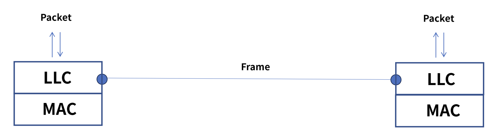
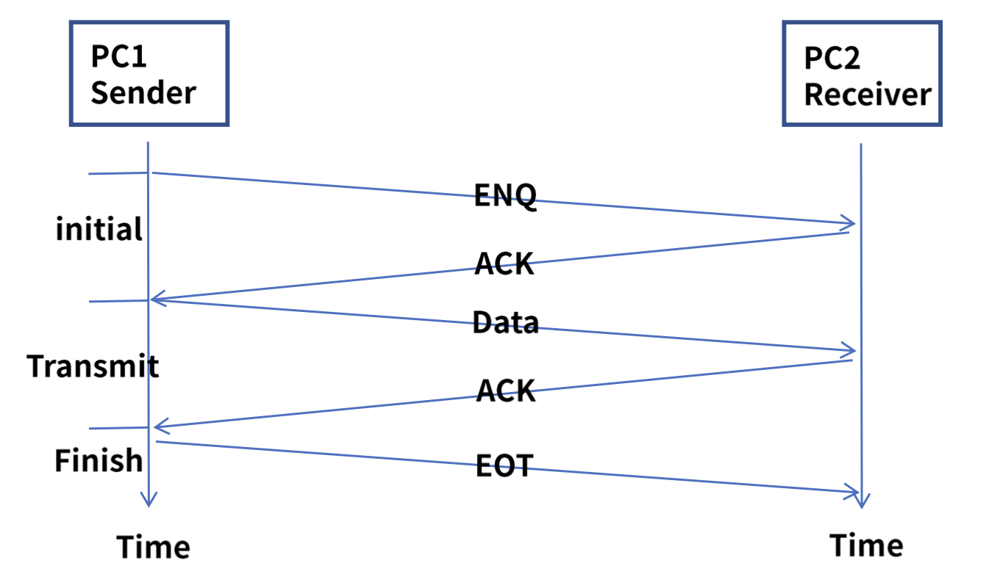
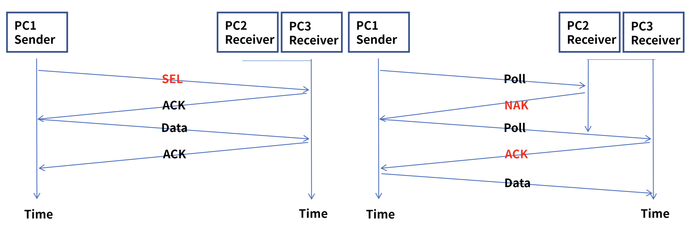
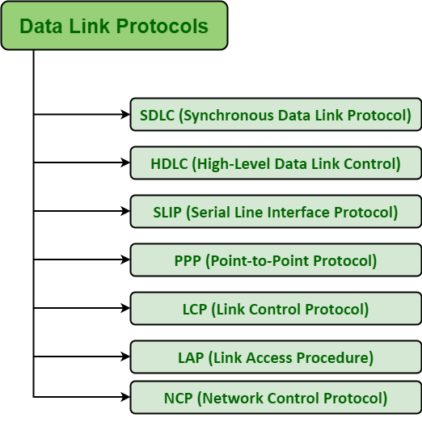

# DataLink Layer

# 정의

- 데이터 링크 계층은 OSI 모델의 두 번째 계층으로, 물리적 계층을 거쳐 네트워크 segement의 노드 간에 데이터를 전송하는 프로토콜 계층이다.
- 네트워크 개체들 간에 데이터를 전송하기 위한 기능적, 절차적 수단을 제공하며 물리 계층에서 발생할 수 있는 오류를 감지하고 수정하는 수단도 제공할 수 있다.
- 주요 역할은 오류 없는 정보 전송을 보장하는 것이다.
- LLC와 MAC이라는 두 가지 하위 계층으로 구분되는 경우가 많다.
    
    ### LLC
    
    - 데이터 링크 계층의 하위 계층으로, 최상위에서 실행되는 프로토콜을 다중화 하고 선택적으로 흐름 제어, 승인 및 오류 알림을 제공한다.
    - 전송 매체를 통해 스테이션의 주소를 지정하고 발신자와 수신자 시스템 간에 교환되는 데이터를 제어하는 데 사용할 메커니즘을 지정한다.
    - 데이터 링크의 데이터 프레임인 Protocol Data Unit, PDU를 만들고 이를 3계층인 네트워크 계층과 연결한다.
        
        
        
    
    ### MAC
    
    - 언제든지 미디어(Ex; CSMA/CD)에 액세스할 수 있는 사람을 결정하는 하위 계층을 나타낼 수 있다.
    - 다른 경우에는 내부의 MAC 주소를 기반으로 전달되는 프레임 구조를 나타낸다.
    - 분산형과 중앙 집중형의 두 가지 형태가 있다.
    - 전송 비트스트림에서 각 데이터 프레임의 시작과 끝을 결정하는 프레임 동기화도 수행한다. 여기에는 타이밍 기반 감지, 문자 계산, 바이트 스터핑, 비트 스터핑 등 여러 방법 중 하나가 포함된다.
    - 48 bit(6 byte)로 구성되어 있고, 각 바이트마다 16진수로 표현된다.
        - 앞 3자리는 OUI로 제조사 식별 코드가, 나머지 3자리는 제조사의 일련번호가 있다.

# 주요 기능

### Framing

- 네트워크 계층에서 수신된 패킷을 데이터 링크 계층에서는 프레임이라고 한다.
- 송신자 측에서 DLL은 네트워크 계층으로부터 패킷을 수신하여 작은 프레임으로 나눈 뒤 각 프레임을 비트별로 물리 계층으로 보낸다.
- 또한 헤더와 끝에 일부 특수 비트(오류 제어 및 주소 지정용)를 첨부한다.
- 수신자 측에서 DDL은 물리 계층에서 비트를 가져와 프레임으로 구성하고 네트워크 계층으로 보낸다.

### Addressing

- DDL은 노드 간 전달을 보장하기 위해 각 프레임의 헤더에 소스와 대상의 MAC 주소 / 물리적 주소를 캡슐화한다.
- MAC 주소는 제조 과정에서 장치에 할당되는 고유한 하드웨어 주소다.

### 회선 제어

- 신호 간에 충돌이 발생하지 않도록 제어할 수 있다.
- ENQ/ACK 방법을 사용하며, 1 : 1 방식과 Polling 기법을 활용 한 1 : 다 방식이 있다.
    
    
    
    
    

### 흐름 제어

- 송수신자 간 데이터를 처리하는 속도 차이를 해결하기 위한 제어도 담당한다.
    - 수신자의 수신 속도가 발신자의 전송 속도보다 낮으면 수신자의 버퍼에 오버플로가 발생하여 일부 프레임이 손실될 수 있다.
    - 따라서 송신자와 수신자의 속도를 동기화하고 둘 사이의 흐름 제어를 설정하는 것은 DDL의 책임이다.
- Feedback 방식의 흐름을 제어하며 Stop & Wait 방식이라고도 부른다.
- 상위 계층은 Rate 기반이다.

### 오류 제어

- 전송 중에 오류나 손실이 발생하면 수신 측은 에러를 탐지하고 이를 재전송한다.
    - Automatic Repeat Request, ARQ : 프레임이 손상 시 재전송이 수행되는 과정
- 데이터는 잡음, 감쇠 등 다양한 원인으로 인해 손상될 수 있다. 따라서 전송된 데이터의 오류를 감지하고 각각 오류 감지 및 정정 기술을 사용하여 이를 수정하는 것은 데이터 링크 계층의 책임이다.
- DDL은 수신자가 수신된 데이터가 올바른지 확인할 수 있도록 프레임 헤더에 오류 감지 비트를 추가한다.
- 손상되거나 손실된 프레임을 감지하고 재전송하는 메커니즘을 추가하여 물리 계층에 안정성을 추가한다.

# 프로토콜

- 일반적으로 수신된 비트 및 바이트가 전송되는 비트 및 바이트와 동일한지 확인하는 역할을 담당한다.
- 기본적으로 OSI 모델의 물리 계층 바로 위에 데이터 링크 계층을 구현하는 데 사용되는 사양 집합이다.
- 일부 공통 데이터 링크 프로토콜 WAN(Wide Area Network) 및 모뎀 연결에 필요한 다양한 데이터 링크 프로토콜이 있다.
- LLC는 LAN의 데이터 링크 프로토콜이다.
    
    ### SDLC
    
    - 동기식 데이터 링크 프로토콜은 기본적으로 컴퓨터의 통신 프로토콜이다.
    - 일반적으로 오류 복구 또는 오류 수정도 다중 지점 링크를 지원한다.
    - 이는 일반적으로 SNA(System Network Architecture) 트래픽을 전달하는 데 사용되며 HDLC의 전신이다.
    - 모든 원격 장치를 중앙 위치의 메인프레임 컴퓨터에 연결하는 데 사용된다. (일 대 일 또는 일 대 다 연결)
    - 데이터 단위가 한 네트워크 지점에서 다음 네트워크 지점으로 올바른 흐름으로 올바르게 도착하는지 확인하는 데에도 사용된다.
    
    ### HDLC
    
    - 고수준 데이터 링크 프로토콜은 기본적으로 현재 많은 광역 프로토콜이 있는 우산으로 간주되는 프로토콜이다.
    - 일반적으로 SDLC를 기반으로 하며, 최선을 다해 신뢰할 수 없는 서비스와 신뢰할 수 있는 서비스를 제공한다.
    - HDLC는 일 대 일 통신과 일 대 다 통신 모두에 적용할 수 있는 비트 지향 프로토콜이다.
    
    ### SLIP
    
    - 직렬 회선 인터페이스 프로토콜은 IP 패킷 끝에 프레이밍 바이트를 추가하는 데 사용되는 오래된 프로토콜이다.
    - 기본적으로 전화 접속 링크를 통해 인터넷 서비스 제공업체(ISP)와 일반 사용자 간에 IP 패킷을 전송하는 데 필요한 데이터 링크 제어 기능이다.
    - 이는 단순히 통신을 위해 직렬 포트 및 여러 라우터 연결과 함께 작동하도록 특별히 설계된 TCP/IP의 캡슐화다.
    - 오류 수정이나 오류 감지와 같은 메커니즘을 제공하지 않는 것과 같은 몇 가지 제한 사항이 있다.
    
    ### PPP
    
    - PPP는 SLIP과 동일한 기능을 제공하기 위해 기본적으로 사용되는 프로토콜이다.
    - IP 패킷과 함께 다른 유형의 패킷을 전송하는 데 사용되는 가장 강력한 프로토콜이다.
    - 전화 접속 및 임대 라우터 - 라우터 회선에도 필요할 수 있다.
    - 프레임을 기술하기 위한 프레이밍 방법을 제공한다.
    - 오류 감지에도 사용되는 문자 중심의 프로토콜이며 NCP와 LCP라는 두 가지 프로토콜을 제공하는 데에도 사용된다.
    
    ### LCP
    
    - 링크 제어 프로토콜은 원래 IEEE 802.2에서 개발 및 제작되었다.
    - 또한 LAN에서 HDLC 스타일 서비스를 제공하는 데에도 사용된다.
    - LCP는 기본적으로 데이터 프레임 전송을 위한 링크 설정, 구성, 테스트, 유지 관리 및 종료 또는 종료에 사용되는 PPP 프로토콜이다.
    
    ### LAP
    
    - 링크 액세스 절차 프로토콜은 기본적으로 지점 간 링크를 통해 데이터를 프레이밍하고 전송하는 데 필요한 데이터 링크 계층 프로토콜이다.
    - 일부 신뢰성 서비스 기능도 포함되어 있다.
    - 기본적으로 LAPB(Link Access Procedure Balanced), LAPD(Link Access Procedure D-Channel), LAPF(Link Access Procedure FrameMode Bearer Services)의 3가지 유형이 있다.
    
    ### NCP
    
    - 네트워크 제어 프로토콜은 ARPANET에서 구현된 이전 프로토콜이기도 하다.
    - 기본적으로 사용자는 원격 위치에 있는 컴퓨터와 일부 장치에 접근하고 두 대 이상의 컴퓨터 간에 파일을 전송할 수 있다.
    - 이는 일반적으로 PPP의 일부를 구성하는 프로토콜 세트다.
    - NCP는 PPP에서 지원하는 모든 상위 계층 프로토콜에 대해 항상 사용할 수 있다.
    - NCP는 1980년대에 TCP/IP로 대체되었다.