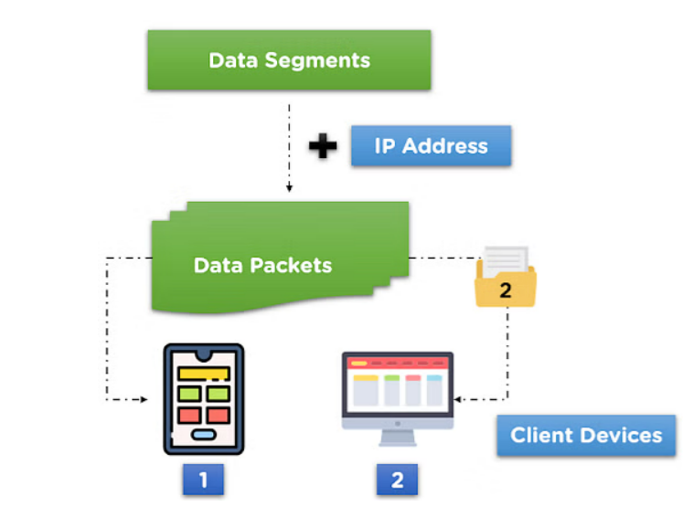
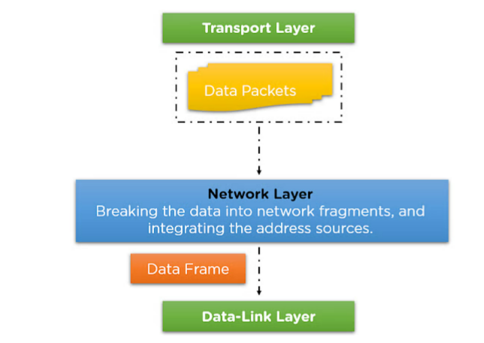
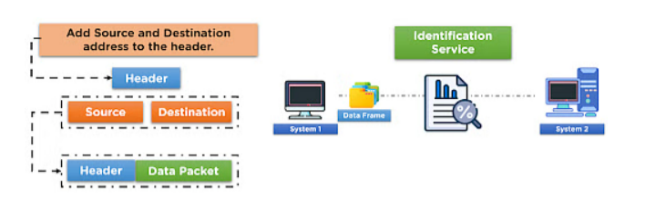
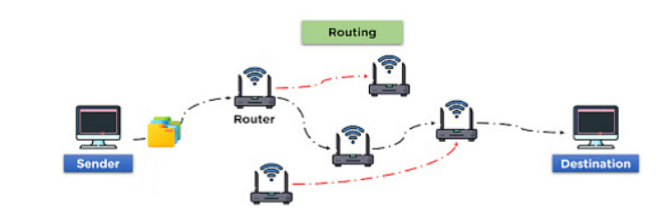

# Network Layer

---

# 정의

- 네트워크 계층은 OSI 모델에서 계층 3이다.
- 인터넷 프로토콜(IP)은 이 계층에서 이용되는 주요 프로토콜 중 하나이며, 라우팅, 검사, 암호화를 위해 다수의 다른 프로토콜도 사용된다.
- 또한 이 계층은 인터넷 프로토콜(IP)에 따라 패킷이 가능한 최상의 경로를 통해 대상 시스템으로 전송되도록 보장한다.

<aside>
💡 **라우팅(Routing)** : 네트워크에서 데이터 패킷을 출발지에서 목적지까지 안전하게 전송하기 위해 최적의 경로를 설정하는 과정이다.

</aside>

# 작동

- 우선, 네트워크 계층은 OSI 모델의 전송 계층에서 데이터를 수신한다.
- 네트워크 계층은 이러한 데이터 패킷을 소스 및 대상 주소와 통합하여 처리한다.
- 또한 네트워크 채널을 통해 데이터 링크 계층으로의 적절한 전송을 위해 네트워크 프로토콜을 통합한다.

# 기능

- **네트워크 주소 지정(Addressing)**
    
    
    
    - 네트워크 채널의 헤더에 소스 및 대상 주소를 추가하는 작업을 수행한다.
    - 채널에서 데이터가 공유되는 장치를 식별하기 위해 네트워크 주소 지정이 수행된다.
    - 이를 통해 데이터가 출발지에서 목적지로 정확하게 전송되고 목적지 디바이스를 식별할 수 있다.
- **상호 네트워킹**
    - 채널에 있는 여러 장치 간의 네트워크 연결을 처리하는 것은 네트워크 게층의 주요 작업 중하나이다.
    - 이 작업은 안정적인 네트워크 연결을 위해 OSI 모델의 네트워크 계층에서 사용 가능한 여러 프로토콜을 적용한다.
- **패킷 라우팅**
    
    
    
    - 데이터 패킷의 라우팅 경로를 설정하는 것은 네트워크 계층의 주요 기능 중 하나이다.
    - 사용 가능한 모든 네트워크 채널 중에서 가장 적합한 라우팅 경로를 선택하는 역할을 담당한다.
    - 이를 위해 라우터와 같은 장비가 사용되며, 라우터는 패킷의 목적지 주소를 확인하고 그에 맞는 경로를 선택하여 전송한다.