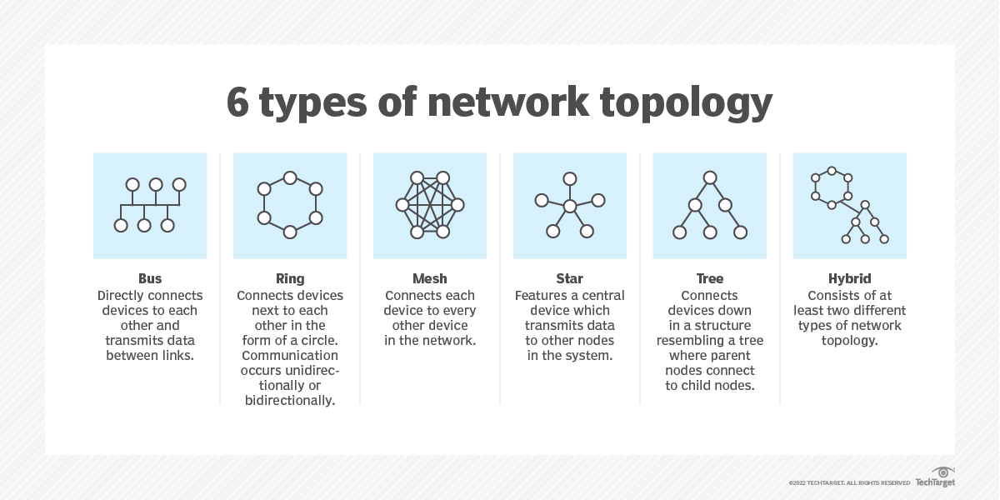

# Physical Layer

# 정의

- OSI 7 Layer의 첫 번째이자 가장 낮은 계층이다. 즉, 장치 간의 물리적 연결과 가장 밀접하게 연관된 계층이다.
- 물리 계층은 전송 매체에 전기적, 기계적, 절차적 인터페이스를 사용하여 데이터를 전송한다.
    - 활성화 또는 비활성화에 사용할 수 있는 기계적, 전기적 및 기타 기능 지원을 제공하며 물리적 연결에 대한 비트를 유지하고 전송한다.
- 네트워크 노드를 연결하는 물리적 데이터 링크를 통해 원시 비트 스트림을 전송하는 수단을 정의한다. 비트 스트림은 코드워드나 심볼로 그룹화되어 전송매체를 통해 전송되는 물리적인 신호로 변환될 수 있다.
- 디지털 비트 전송은 유선 또는 케이블이 없는 전송 경로에서 수행된다.
- 전송 매체의 공유는 정적 다중화와 동적 다중화를 통해 계층에서 수행될 수 있다.
- 케이블링, 커넥터, 수신기, 트랜시버 및 리피터 등 다양한 장치와 매체가 포함된다.
- 전기를 사용하여 데이터 링크 계층의 원시 비트 스트림을 연선 케이블의 핀과 와이어에 배치하는 방법을 결정한다.
    
    ### Protocol
    
    - 1000Base-T Ethernet
    - 1000Base-SX Ethernet
    - 1000BaseTX Ethernet
    - 동기식 광 네트워킹/동기식 디지털 계층 구조
    - 802.11 물리 계층 변형
    - 블루투스
    - 컨트롤러 영역 네트워크
    - 범용 직렬 버스

# 기능

- 비트를 정의한다
    - 비트가 0과 1에서 신호로 변환되는 방식을 결정한다
- 데이터 속도
    - 데이터가 초당 비트 수로 흐르는 속도를 결정한다
- (비트) 동기화
    - 전송 및 수신 장치가 동기화 되었는지 확인한다
- 전송 모드
    - 데이터 전송 방향을 결정하고 단방향, 반이중 또는 전이중인지 여부를 결정한다
- 상호 작용
    - 장치가 이더넷이나 전파와 같은 전송 매체에 연결되는 방법을 결정한다
- 구성
    - 지점 간 구성과 다중 지점 구성을 제공한다
- 조정
    - 데이터를 전파로 변환한다
- 스위칭 메커니즘
    - 한 포트에서 다른 포트로 데이터 패킷을 보낸다
- 신호 균등화
    - 보다 안정적인 연결을 생성하고 멀티플렉싱을 더 쉽게 만든다.

# Topology

- Mesh Topology
    - 네트워크의 다른 모든 노드에 연결되는 노드라고도 하는 장치로 구성된다.
    - 이러한 네트워크는 장치와 클라이언트 간에 데이터를 효율적으로 라우팅하도록 설정된다.
- Star Topology
    - 모든 노드가 공통 중앙 컴퓨터에 직접 연결되는 근거리 통신망 토폴로지다.
- Bus Topology
    - 백본 케이블이라는 하나의 케이블을 통해 연결된 여러 장치로 구성된다.
    - 버스 토폴로지에 연결된 장치들은 서로 직접 연결되어 데이터를 전송한다
- Ring Topology
    - 모든 노드가 네트워크의 다른 두 노드에 직접 연결되어 원을 만드는 구성
    - 노드로 전송된 데이터는 목적지에 도달할 때까지 링을 중심으로 한 노드에서 다른 노드로 전송된다.
- Tree Topology
    - 네트워크 다이어그램 형식으로 그릴 때 노드가 트리처럼 서로 연결되는 계층 구조로 구성된다.
- Hybrid Topology
    - 두 개 이상의 다른 토폴로지를 조합한 것으로 성능, 안정성 또는 비용과 관련된 요소에 따라 사용된다.