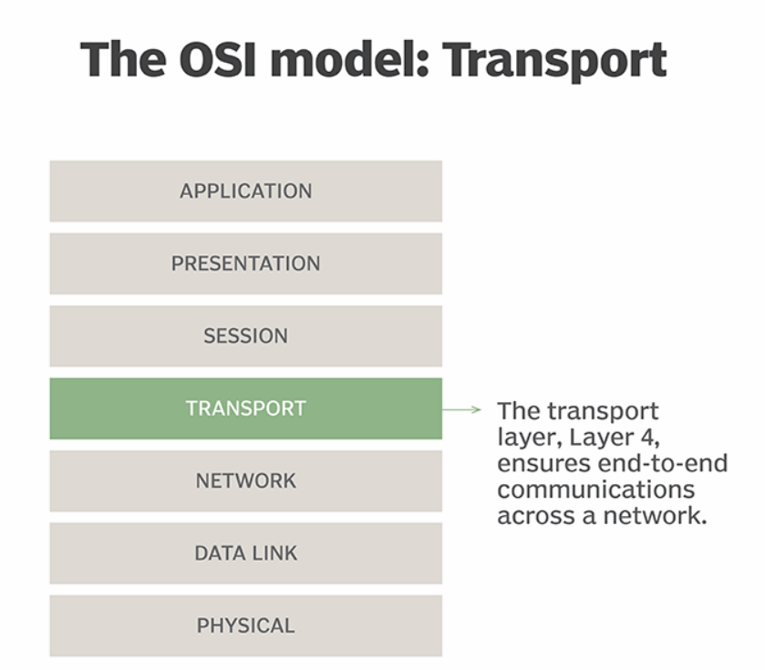
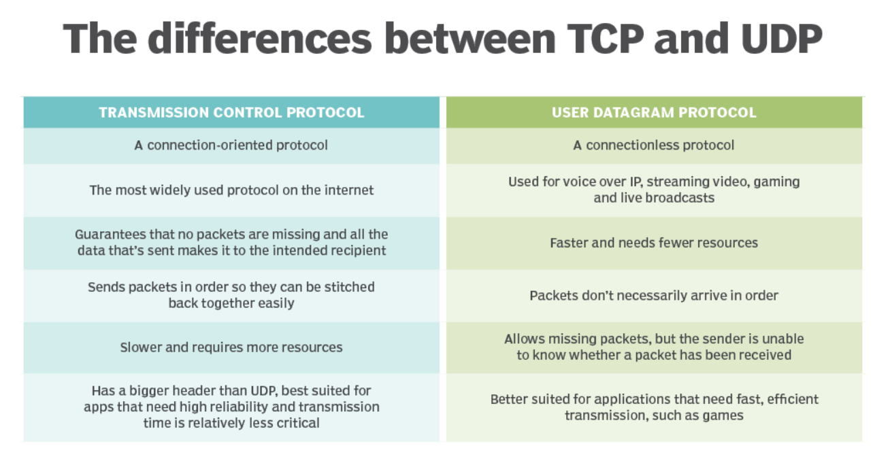

# Transport Layer

---

# 정의

- OSI(Open Systems Interconnection) 통신 모델의 계층 4이다.
- 데이터 패킷이 송신자와 수신자 사이에 정확하고 안정적으로 도착하는지 확인하는 역할을 담당한다.
    - 즉, 네트워크 프로토콜 스택에서 데이터의 신뢰성을 담당하는 계층이다.
- 전송 계층은 TCP 또는 UDP를 가장 자주 사용한다.
- TCP/IP 네트워크 모델에서 전송 계층은 애플리케이션 계층과 네트워크 계층 사이에 있다.
- 전송 계층(Transport Layer)은 네트워크 계층과 세션 계층 사이에 위치한다.
    - 두 모델은 네트워크 아키텍쳐를 설명하고 구조화하기 위한 모델들이다.
    - TCP/IP 계층은 4개이고, OSI 계층은 7개이다.
    - 계층의 이름과 역할이 서로 다르다.
- 데이터 패킷을 가져와 올바른 컴퓨터로 보내는 역할을 담당한다.
- 그런 다음, 수신된 패킷을 가져와서 오류가 있는지 확인하고 정렬한다.
- 그리고, 이를 컴퓨터에서 실행 중인 올바른 프로그램의 세션 계층으로 보낸다.
- 이제 세션 계층은 올바른 형식의 패킷을 가져와 애플리케이션 데이터에 사용한다.

<aside>
💡 **프로토콜(Protocol)** : 컴퓨터 네트워크에서 통신하는 데 사용되는 규칙과 규약의 집합.
데이터의 교환 및 통신 프로세스를 조정하여 서로 다른 시스템 간에 효과적인 데이터 전송을 가능하게 한다.

ex)  HTTP(HyperText Transfer Protocol), TCP/IP(Transmission Control Protocol/Internet Protocol), SMTP(Simple Mail Transfer Protocol)

</aside>

# 기능

- 전반적인 기능은 애플리케이션 계층이 핵심적인 세부 사항에 대해 걱정할 필요가 없도록 하는 것이다.
- End to End 통신, 신뢰성, 흐름 제어, 주소 지정 및 다중화를 제공하여 수행된다.
    - **End-to-end communication(종단 간 통신)**
        - 애플리케이션에 데이터 스트림을 보내고 받는 방법을 제공하는 전송 계층의 기능이다.
        - 네트워크 계층은 데이터 스트림을 네트워크를 통해 전송되는 패킷으로 분할하고 다른 쪽 끝에서 데이터를 재구성한다.
        - 데이터 패킷이 순서 없이 도착하면 세그먼트 번호를 매겨 순서를 바꾸고 데이터를 올바른 순서로 표시할 수 있다.
    - **Reliability(신뢰성)**
        - 네트워크를 통한 데이터 전송 중에 발생할 수 있는 오류를 수정하는 능력이다.
        - 데이터가 전송 중에 실수로 변경된 경우 오류 수정 및 체크섬을 통해 이를 포착할 수 있다.
        - 패킷이 손실되면 포착되어 재전송된다.
        - 단일 패킷이 복제되면 이를 감지하여 삭제할 수 있다.
        - 또한 보장된 전달을 위해 수신된 패킷에 대한 승인을 보낼 수도 있다.
        - 일부 프로토콜은 패킷이 수신되지 않거나 손상된 경우 메시지를 보낸다.
    - **Flow control(흐름 제어)**
        - 송신자와 수신자 간의 데이터 전송 속도를 조절하여 네트워크의 혼잡을 방지하고 수신자가 처리할 수 있는 속도로 데이터를 전송한다.
        - 전송 계층이 안정적으로 전송할 수 있는 것보다 더 많은 데이터를 전송하지 않도록 하는기능이다.
        - 네트워크 용량이 충분할 때까지 데이터 송수신을 버퍼링할 수 있다.
        - 수신자 버퍼가 가득 차면 전송 속도가 느려질 수 있다.
        - 혼잡 제어도 구현한다.
        - 네트워크가 너무 많은 재전송 메시지로 가득 차면 네트워크가 압도되어 복구할 수 없게 된다.
        - 혼잡 제어는 동적 재전송 타이머와 느린 시작(slow start)을 사용하여 이를 방지한다.
    - **Addressing(주소 지정)**
        - 컴퓨터의 올바른 응용 프로그램과 통신하는 기능이다.
        - 주소 지정은 일반적으로 네트워크 포트를 사용하여 각 전송 및 수신 응용 프로그램에 시스템의 특정 포트 번호를 할당한다.
        - 네트워크 계층에서 사용되는 IP 주소와 전송 계층의 포트를 결합하여 각 애플리케이션은 고유한 주소를 가질 수 있다.
    - **오류 복구 (Error Recovery)**
        - 전송 중에 발생한 오류를 감지하고 복구하기 위한 기능을 제공한다.
        - 이를 통해 손상된 데이터나 손실된 패킷을 복구하고 신뢰성을 확보한다.
    - **순서 제어 (Sequencing)**
        - 데이터가 전송되고 수신되는 순서를 조절하여 송신자가 전송한 순서대로 데이터를 수신하게 함으로써 데이터의 일관성을 유지한다.
    - **Multiplexing(멀티플렉싱)**
        - 여러 응용 프로그램이 원하는 수의 네트워크 연결을 사용할 수 있는 기능이다.
        - 즉, 다양한 어플리케이션에서 오는 데이터를 구분하고 식별하기 위해 포트번호 등을 사용하는 것이다.
        - 예를 들어, 일반적인 데스크탑 컴퓨터에는 이더넷 네트워크 연결이 하나만 있을 수 있지만, 웹 브라우저, 비디오 스트리밍 및 메일 클라이언트와 같이 동시에 실행되는 인터넷에 대한 여러 연결이 있을 수 있다.
        - 반대로 대규모 서버에는 SQL 서버와 같은 하나의 애플리케이션만 있을 수 있지만 가능한 한 많은 대역폭을 제공하기 위해 두 개의 물리적 이더넷 연결이 있을 수 있다.
        - 전송 계층은 각 애플리케이션이 상당한 양의 공유 네트워크 연결을 얻도록 보장한다.
        

# **TCP/IP 모델의 전송 계층**

- OSI 모델은 시스템 간의 통신을 이해하는 방법에 대한 이론적 구성이다. 특정 구현과 직접적인 관련이 없다.
- 반면에 TCP/IP는 현대 컴퓨터 네트워크와 인터넷에서 사용되는 실질적으로 구현된 프로토콜이다.
- TCP/IP는 OSI 모델에서 언급된 모든 기능을 구현할 수도 있고 구현하지 않을 수도 있다.
- 지원되는 기능은 사용되는 프로토콜에 따라 다르다.
- TCP/IP는 또한 더 적은 계층을 사용한다.
- OSI 모델에서 전송 계층은 네트워크와 세션 계층 사이에 있다.
- TCP/IP에서는 네트워크 계층과 응용 프로그램 계층 사이에 있다.

# **전송 계층 프로토콜**

- UDP와 TCP는 가장 일반적인 전송 계층 프로토콜이다.
- UDP는 간단하고 빠른 전송 프로토콜이다.
    - ex) 스트리밍 서비스 ,음성 통화, 온라인 게임. → 데이터의 일부 손실 허용, 전송 속도 중요
- 비연결 전송용이다.
- 승인이나 재전송을 사용하지 않기 때문에 신뢰할 수 없는 것으로 간주되어 패킷이 손실될 수 있다.
- UDP는 화상 회의와 같이 안정성보다 전달 속도가 더 중요한 실시간 데이터에 가장 적합하다.
- TCP는 기능이 더 풍부한 전송 프로토콜이다.
    - ex) 웹 브라우징(웹 페이지를 요청하고 수신하기 위해 사용한다.), 이메일 전송, 파일 전송
- 연결 지향적이다.
- 동기화 및 확인 메세지를 사용하여 전송을 보장한다.
- 필요한 경우 패킷을 재전송하고 재정렬한다.
- 전송 및 수신 요금을 협상할 수 있다.
- TCP는 UDP보다 느리다.
- TCP는 인터넷에서 가장 일반적인 프로토콜이다.