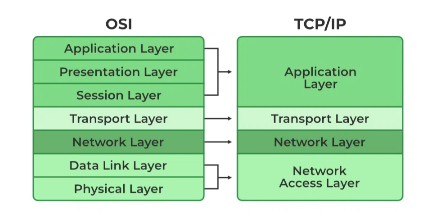
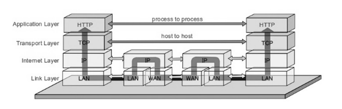

# Application Layer

---

# TCP/IP Model

## 정의

- 1960년대 국방부에서 설계 및 개발되었으며 표준 프로토콜을 기반으로 한다.
- 전송 제어 프로토콜/인터넷 프로토콜을 의미한다.
- TCP/IP 모델은 OSI 모델의 간결한 버전이다.
- OSI 모델의 7개 계층과 달리 4개 계층이 포함되어 있다.
- 층의 수는 때때로 5개 또는 4개로 지칭된다.

## 작동 방법

- TCP/IP 모델을 사용하여 인터넷을 통해 무언가를 보내려고 할 때마다 TCP/IP 모델은 송신자 측에서 데이터를 패킷으로 나누고 수신자 측에서는 동일한 패킷을 다시 결합하여 동일한 데이터를 구성해야 한다.
- 데이터는 먼저 한 순서로 이 계층에 들어가고 다시 역순으로 수신자 측에서 동일한 방식으로 구성된다.

# Application Layer(4계층)

## 정의

- TCP/IP 네트워크 프로토콜 스택에서 가장 상위 레이어를 담당하고 있다.
- 대부분의 Application Layer에서는 클라이언트-서버 구조로 이루어져 있다.
    - 클라이언트 : 서비스를 제공 받는 호스트
    - 서버 : 서비스를 제공해주는 호스트
- End to End 통신(데이터가 송신자에서 수신자로 직접 전달되는 방식)과 오류 없는 데이터 전달을 담당한다.
- 네트워크에서 가장 상위에 위치하고, 사용자와 가장 가까운 계층으로, 사용자-소프트웨어 간 소통을 담당하는 계층이다.
    - 직접 상호작용하기 때문에 가장 많은 다양성을 가지고 있다.
- 웹 프로그래밍을 하면서 흔히 접하는 여러 서버나 클라이언트 관련 응용 프로그램들이 동작하는 계층이다.
- 주로 응용 프로그램(Application)들끼리 데이터를 교환하기 위한 계층이다.
    - 데이터 단위 : Data(데이터) / Message(메세지)
- 데이터의 복잡성으로부터 상위 계층 애플리케이션을 보호한다.
    
    → 네트워크에서 데이터를 전송하고 처리하는 과정에서 발생할 수 있는 복잡성에 대응하여 상위 계층 애플리케이션을 보호하는 개념을 나타낸다.
    
    - **HTTP 및 HTTPS**
        - **[HTTP는](https://www.geeksforgeeks.org/difference-between-http-and-https-2/)** 하이퍼텍스트 전송 프로토콜이다.
        - 이는 World Wide Web에서 웹 브라우저와 서버 간의 통신을 관리하는 데 사용된다.
        - HTTPS는 HTTP-보안(Secure)을 의미한다. HTTP와 SSL(Secure Socket Layer)을 결합한 것이다.
        - 브라우저가 양식을 작성하고, 로그인하고, 인증하고, 은행 거래를 수행해야 하는 경우에 효율적이다.
    - **FTP (File Transfer Protocol)**
        - FTP는 파일을 서버와 클라이언트 간에 전송하기 위한 프로토콜이다.
        - 주로 원격 서버에 있는 파일을 로컬 머신으로 가져오거나 로컬 머신의 파일을 원격 서버로 업로드하는 데 사용된다.
        - FTP는 클라이언트와 서버 간의 명령(command) 및 데이터(data) 연결을 사용하여 파일을 전송한다.
        - 일반적으로 FTP는 파일을 전송하는 데 사용되지만, 보안을 강화한 FTPS(FTP Secure)나 암호화된 SFTP(SSH File Transfer Protocol)와 같은 변형도 있다.
    - **SMTP (Simple Mail Transfer Protocol)**
        - SMTP는 전자 메일을 전송하는 데 사용되는 프로토콜이다.
        - 이는 이메일 클라이언트가 이메일 서버에 이메일을 보낼 때 사용되며, 또한 서버 간에 이메일을 전송하는 데에도 쓰인다.
        - 그러나 SMTP는 이메일을 수신하는 데만 사용되는 것이 아니라, 이메일을 읽거나 삭제하는 데는 사용되지 않는다.
        - 이러한 기능은 POP (Post Office Protocol) 또는 IMAP (Internet Message Access Protocol)과 같은 다른 프로토콜에 의해 수행된다.
- Application Layer는 사용자와 직접적으로 상호 작용하며, 하위 계층인 Transport Layer, Network Layer, Link Layer를 통해 데이터를 전송하고 수신한다.

# **TCP/IP와 OSI 모델의 차이점**

| TCP/IP | OSI |
| --- | --- |
| TCP는 전송 제어 프로토콜을 나타낸다. | OSI는 개방형 시스템 상호 연결을 나타낸다. |
| TCP/IP는 애플리케이션 계층 자체에서 세션과 프리젠테이션 계층을 모두 사용한다. | OSI는 다양한 세션 및 프레젠테이션 계층을 사용한다. |
| TCP/IP는 연결 없는 수평적 접근 방식을 따른다. | OSI는 수직적 접근 방식을 따른다. |
| TCP/IP의 전송 계층은 패킷 전달을 보장하지 않는다. | OSI 모델에서 전송 계층은 패킷 전달을 보장한다. |
| TCP/IP 모델에서는 프로토콜을 쉽게 교체할 수 없다. | OSI 모델에서는 프로토콜이 더 잘 다루어지며 기술 변화로 쉽게 교체할 수 있다. |
| TCP/IP 모델 네트워크 계층은 비연결(IP) 서비스만 제공한다.
전송 계층(TCP)은 연결을 제공한다. | 비연결 및 연결 지향 서비스는 OSI 모델의 네트워크 계층에서 제공된다. |

참고)

[[Network] TCP/IP 4계층에 대하여](https://velog.io/@dyunge_100/Network-TCPIP-4계층에-대하여)

[[Network] TCP/IP 와 TCP/IP 4계층이란?](https://wooono.tistory.com/507)

[Application Layer 개요](https://ddongwon.tistory.com/71)