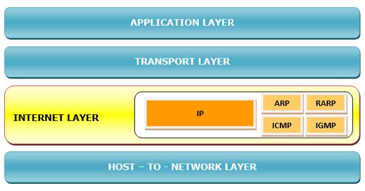

# Internet Layer

---

- 인터넷을 통한 데이터 패킷의 논리적 전송을 담당한다.
- OSI 모델의 Network Layer와 유사하다.
- 주요 기능은 다음과 같다.
    - 링크 계층으로 데이터 패킷을 전송
    - 최적의 경로를 사용하여 각 데이터 패킷을 소스에서 대상으로 독립적으로 라우팅한다.
        - 이는 각 장치에 고유한 IP 주소를 할당함으로써 수행된다.
    - 목적지에 도달하면 순서가 잘못된 패킷을 재조립한다.
    - 데이터 패킷 전송 오류 및 데이터 패킷 조각화를 처리한다.
- 주요 프로토콜은 다음과 같다.
    - 인터넷 프로토콜(IP)
        - 최선의 전달 서비스를 제공하는, 연결이 없고 신뢰할 수 없는 프로토콜
        - 여러 노드에 걸쳐 서로 다른 경로를 통해 이동하는 데이터그램이라는 데이터 패킷을 전송한다
    - 주소 확인 프로토콜(ARP)
        - 네트워크 인터페이스 카드에 인쇄된 대로 호스트의 논리적 주소 또는 인터넷 주소를 물리적 주소에 매핑한다.
    - 역방향 주소 확인 프로토콜(RARP)
        - 호스트의 물리적 주소가 알려졌을 때 호스트의 인터넷 주소를 찾는 프로토콜
    - 인터넷 제어 메시지 프로토콜(ICMP)
        - 쿼리 전송과 오류 메시지를 모니터링한다.
    - 인터넷 그룹 메시지 프로토콜(IGMP)
        - 수신자 그룹에게 동시에 메시지를 전송할 수 있다.