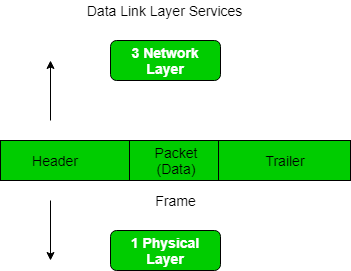

# Network Access Layer

---

# **1 계층 네트워크 액세스 계층 (Network Access Layer)**

- OSI 7 Layer에서 물리계층과 데이터링크 계층에 해당한다.
- 컴퓨터를 물리적으로 네트워크에 연결해서 기기 간에 전송이 가능하게 한다.
- TCP/IP 패킷을 네트워크로 전달, 또는 반대로 네트워크에서 TCP/IP를 받아오는 역할을 한다.
- 논리적 주소인 IP가 아니라 물리적 주소인 MAC 주소를 사용하고, 패킷을 프레임으로 변환시켜 최종적으로 데이터 전송을 한다.
- 수신 측 컴퓨터의 경우 네트워크 액세스 계층 속 데이터 링크 계층에서 추가된 헤더를 제거하여 상위 계층인 네트워크 계층으로 전달합니다.
- 사용하는 대표적인 장비로는 LAN 관련 장비, 프로토콜에는 Ehternet(이더넷), Token Ring, PPP 등이 있다.
- 전선, 광섬유, 무선 등으로 실질적으로 데이터를 전달하며 장치간에 신호를 주고받는 규칙을 정하는 계층이다. 네트워크 접근 계층이라고도 한다.
- 이를 물리 계층과 데이터 링크 계층으로 나누기도 한다.
    - 물리 계층은 무선 LAN과 유선 LAN을 통해 0과 1로 이루어진 데이터를 보내는 계층을 말한다.
    - 데이터 링크 계층은 이더넷 프레임을 통해 에러 확인, 흐름 제어, 접근 제어를 담당하는 계층을 말한다.
- 에러 검출 기능(Detecting Errors), 패킷의 프레임화(Framing Packets)

## **1. 물리계층**

- 네트워크 통신이 필요한 애플리케이션 그룹이다.
- 이 계층은 데이터를 생성하고 연결을 요청하는 역할을 담당한다.
- 이는 발신자를 대신하여 작동하고 네트워크 액세스 계층은 수신자를 대신하여 작동한다.

## 2. 데이터링크 계층

- 패킷의 네트워크 프로토콜 유형(이 경우 TCP/IP)은 데이터 링크 계층에 의해 식별된다.
- 오류 방지 및 "프레이밍"도 데이터 링크 계층에서 제공된다.
- **PPP(Point-to-Point Protocol)** 프레이밍 및 이더넷 IEEE 802.2 프레이밍은 데이터 링크 계층 프로토콜의 두 가지 예이다.
    
    <aside>
    💡 **PPP(Point-to-Point Protocol)**
    포인트 투 포인트로(1대1)로 컴퓨터를 연결하기 위해 사용되는 프로토콜이다. PPP는 OSI 참조 모델의 제 2층에 해당하는 데이터 링크 프토토콜이라고 할 수 있다. 혼자만으로는 통신할 수 없고 물리층이 반드시 필요하다.
    
    </aside>
    

## 2-1. 프레이밍

- **프레임**은 특히 컴퓨터 네트워크 및 통신에서 디지털 전송 단위이다.
- 프레임은 빛 에너지의 경우 광자라고 불리는 에너지 패킷과 유사하다.
- 프레임은 시분할 다중화 과정에서 지속적으로 사용된다.
- **프레이밍**은 데이터가 비트 스트림으로 전송되는 와이어로 구성된 두 컴퓨터 또는 장치 간의 지점 간 연결이다.
- 그러나 이러한 비트는 식별 가능한 정보 블록으로 구성되어야 한다.
- 프레이밍은 데이터 링크 계층의 기능이다.
- 이는 송신자가 수신자에게 의미 있는 비트 세트를 전송하는 방법을 제공한다.
- 이더넷, 토큰링, 프레임 릴레이 및 기타 데이터 링크 계층 기술에는 고유한 프레임 구조가 있다.
- 프레임에는 오류 검사 코드와 같은 정보가 포함된 헤더가 있다.
- 데이터링크 계층에서는 송신자로부터 메시지를 추출하고 송신자와 수신자의 주소를 제공하여 수신자에게 제공한다.
- 프레임을 사용하면 데이터가 손상 여부를 쉽게 확인할 수 있는 복구 가능한 덩어리로 분할된다는 장점이 있다.
- 데이터를 프레임으로 나누고 재조립하는 과정은 사용자에게 투명하며 데이터 링크 계층에서 처리된다.
- 프레이밍은 데이터 전송을 구성하고 제어하여 데이터가 정확하고 효율적으로 전달되도록 하기 때문에 데이터 링크 계층 프로토콜 설계의 중요한 측면이다.
    
    

참고>

[🗼 TCP / IP 4계층 모델 - 핵심 총정리](https://inpa.tistory.com/entry/WEB-🌐-TCP-IP-정리-👫🏽-TCP-IP-4계층#1._network_layer_osi_7계층에서_물리+데이터링크_계층)