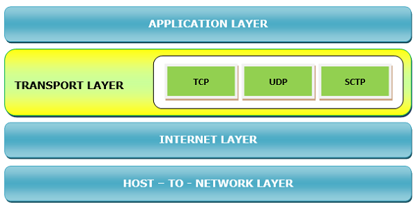

# Transport Layer

---

- 소스 호스트에서 대상 호스트까지 오류 없이 종단 간 데이터 전달을 담당하는 계층이다.
- 실질적으로 구현된 프로토콜이다.
- OSI 모델의 전송 계층에 해당한다
- 대표적인 기능은 다음과 같다.
    - 통신 호스트가 대화를 계속하는 것을 용이하게 한다
    - 사용자에게 기본 네트워크에 대한 인터페이스를 제공한다
    - 안정적인 연결을 제공할 수 있다. 또한 오류 검사, 흐름 제어 및 검증을 수행할 수도 있다.
- 사용되는 주요 프로토콜은 다음과 같다.
    - 전송 제어 프로토콜(TCP)
        - 소스에서 대상 시스템으로 오류 없이 데이터를 전송하는 안정적인 연결 지향 프로토콜
        - 전송에 앞서 Peer-Entitiy 간에 연결이 설정된다.
        - 보내는 호스트에서 TCP는 들어오는 바이트 스트림을 세그먼트로 나누고 각 세그먼트에 별도의 시퀀스 번호를 할당한다.
        - 수신 호스트에서 TCP는 세그먼트를 다시 정렬하고 올바른 세그먼트 수신을 위해 보낸 사람에게 승인을 보낸다.
        - 또한 TCP는 빠른 송신자가 느린 수신자를 압도하지 않도록 흐름 제어를 관리한다.
    - 사용자 데이터그램 프로토콜(UDP)
        - 신뢰할 수 없고 연결이 없으며 승인되지 않은 단순한 서비스를 제공하는 메시지 지향 프로토콜
        - TCP의 시퀀싱, 오류 제어 또는 흐름 제어가 필요하지 않은 애플리케이션에 적합하다
        - 전달의 정확성보다 전달 속도가 더 중요한 소량의 데이터를 전송하는 데 사용된다.
    - 스트림 제어 전송 프로토콜(SCTP)
        - TCP와 UDP의 기능을 결합한다.
        - UDP와 같은 메시지 지향적이며 TCP와 같은 안정적인 연결 지향 서비스를 제공한다.
        - 인터넷을 통한 전화 통신 등에 사용된다.
    
    # 참조
    
    [네트워크: Transport layer 정리 (TCP/UDP, 다중화/역다중화, 신뢰적 데이터 전송의 원리(RDT))](https://seungjuitmemo.tistory.com/83)