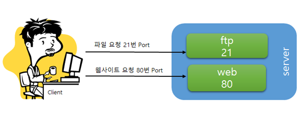

# Well Known Port

---

# **1. 포트(Port)**

- 특정한 쓰임새를 위하여 IANA에서 할당한 TCP 및 UDP 포트 번호의 일부이다.
    - 일종의 논리적인 접속 장소라고 할 수 있다.
- 컴퓨터에서의 포트란 외부의 다른 장비와 접속하기 위한 플러그와 같은 것을 의미한다.
    - 포트번호는 어떤 프로그램에 접속 할 것인지 컴퓨터에게 알려준다.
- IP는 고유한 번호, PORT는 어떤 목적을 위한 고유번호이다.

  → 이럴 경우 클라이언트가 서버에 요청을 보냈을 때, 웹사이트 요청인지 파일 요청인지 구분할 수 있는 방법이 필요하게 된다. 이 때 바로 Port를 사용하게 된다.

- 컴퓨터는 동시에 하나 이상의 프로그램을 실행하기 때문에 IP 주소 만으로는 특정 서비스에 접근할 수 없다.
- 예를 들어 하나의 서버가 있을 때 이 서버는 다양한 역할을 하게 되는 경우가 있다.
    - 웹사이트를 전달해주는 역할, 파일을 요청하는 역할, 이럴 경우 클라이언트가 서버에 요청을 보냈을 때, 웹사이트 요청인지 파일 요청인지 구분할 수 있는 방법이 필요하게 된다. 이때 바로 Port를 사용하게 된다.
- 즉, 포트는 "논리적인 접속 장소를 나타내는 이정표"라고 말할 수 있다.

# **2. 잘 알려진 포트 (Well-known port)**

- 잘 알려진 포트는 특정한 쓰임새를 위해서 IANA에서 할당한 TCP및 UDP 포트 번호의 일부이다.

    <aside>
    💡 **IANA(Internet Assigned Numbers Authority)**
    인터넷 할당 번호 관리 기관의 약자로 IP 주소, 최상위 도메인 등을 관리하는 단체이다.

    </aside>

- 일반적으로 포트 번호는 다음과 같이 세 가지로 나눌 수 있다.

    | 이름 | 포트 범위 | 특징 |
    | --- | --- | --- |
    | 잘 알려진 포트 (well-known port) | 1~1023 | 이미 잘 알려진 포트들을 말하며, 서버 측에 각 용도 별로 예약되어 동작된다. 루트 권한으로만 포트를 열 수 있다. |
    | 등록된 포트 (registered port) | 1024~49151 | 서버 소켓으로 사용 |
    | 동적 포트 
    (dynamic port) | 49151~65535 | 접속할 때마다 포트번호가 동적으로 부여되며, 서버 소켓으로 사용이 불가능하다. |
- 대부분의 유닉스 계열 운영 체제의 경우, 잘 알려진 포트를 열려면 루트 권한이 있어야 한다.
- 이 번호는 강제적으로 지정된 것은 아니며, IANA의 권고안일 뿐이다. 가끔 각 포트 번호를 그대로 사용하지 않고 다른 용도로 사용하기도 한다.
    - 이 경우, 트로이 목마와 같은 프로그램들이 악의적인 목적으로 포트를 변경하여 사용하는 경우도 있다.
- 잘 알려진 포트(well-known port)는 0번부터 1023번까지의 포트 번호이다.
- 잘 알려진 포트라고도 부르며, 할당된 포트는 가능한 포트 번호의 작은 부분을 사용한다.
- IP 내에서 프로세스를 구분하기 위해 사용된다.
- 대부분의 시스템에서 시스템 프로세서나 권한이 있는 사용자가 실행한 프로그램만 사용할 수 있다.
- 잘 알려진 특정한 애플리케이션의 사용을 위해 IANA에서 할당한 TCP/UDP 번호로, 강제적으로 지정된 것이 아니기 때문에 다른 용도로 사용할 수도 있다.
- 수년 동안 할당된 포트의 범위는 0번에서 255번 내에 있었으나, 최근에 할당 포트의 범위가 0번에서 1023번으로 확장되었다.
- 포트는 장기간 대화를 수행하는 논리 연결의 끝을 나타내기 위해 TCP에서 사용되며, 알 수 없는 호출자에게 서비스를 제공할 목적으로 서비스 연결 포트가 정의된다.
- 여기서 TCP는 신뢰성이 요구되는 애플리케이션에서 사용하는 프로토콜을 가리키며, UDP는 간단한 데이터를 빠른 속도로 전송하는 애플리케이션에서 사용하는 프로토콜을 의미한다.
- 대표적인 잘 알려진 포트 번호는 21번 포트, 23번 포트, 25번 포트, 80번 포트가 있다.
    - 21번 : FTP(File Transfer Protocol) : FTP 연결 시 인증과 컨트롤을 위한 포트
    - 23번 : Telnet(Telecommunication Network) : 인터넷을 통하여 원격지의 호스트 컴퓨터에 접속할 때 사용하는 포트
    - 25번 : SMTP(Simple Mail Transfer Protocol) : 메일을 보낼 때 사용하는 포트
    - 80번 : HTTP(Hyper Text Transfer Protocol): 웹 서비스를 사용하기 위한 포트

| 포트 | TCP | UDP | 설명 | 상태 |
| --- | --- | --- | --- | --- |
| 0 |  | UDP | 예약됨; 사용하지 않음 | 공식 |
| 1 | TCP |  | TCPMUX (TCP 포트 서비스 멀티플렉서) | 공식 |
| 7 | TCP | UDP | ECHO 프로토콜 | 공식 |
| 9 | TCP | UDP | DISCARD 프로토콜 | 공식 |
| 13 | TCP | UDP | DAYTIME 프로토콜 | 공식 |
| 17 | TCP |  | QOTD (Quote of the Day) 프로토콜 | 공식 |
| 19 | TCP | UDP | CHARGEN (Character Generator) 프로토콜 - 원격 오류 수정 | 공식 |
| 20 | TCP |  | FTP (파일 전송 프로토콜) - 데이터 포트 | 공식 |
| 21 | TCP |  | FTP - 제어 포트(연결 시 인증과 컨트롤을 위한 포트) | 공식 |
| 22 | TCP |  | SSH (Secure Shell) - ssh scp, sftp같은 프로토콜 및 포트 포워딩 | 공식 |
| 23 | TCP |  | 텔넷 - 인터넷을 통하여 원격지의 호스트 컴퓨터에 접속할 때 사용 | 공식 |
| 24 | TCP |  | 개인메일 시스템 | 공식 |
| 25 | TCP |  | SMTP (Simple Mail Transfer Protocol) - 이메일 전송에 사용 | 공식 |
| 37 | TCP | UDP | TIME 프로토콜 | 공식 |
| 49 | UDP |  | TACACS 프로토콜 | 공식 |
| 53 | TCP | UDP | DNS | 공식 |
| 67 |  | UDP | BOOTP (부트스트랩 프로토콜) 서버. DHCP로도 사용 | 공식 |
| 68 |  | UDP | BOOTP (부트스트랩 프로토콜) 클라이언트. DHCP로도 사용 | 공식 |
| 69 |  | UDP | TFTP | 공식 |
| 70 | TCP |  | 고퍼 프로토콜 | 공식 |
| 79 | TCP |  | Finger 프로토콜 | 공식 |
| 80 | TCP | UDP | HTTP - 웹 페이지 전송 | 공식 |
| 88 | TCP |  | 커베로스 - 인증 에이전트 | 공식 |
| 109 | TCP |  | POP2 (Post Office Protocol version 2) - 전자우편 가져오기에 사용 | 공식 |
| 110 | TCP |  | POP3 (Post Office Protocol version 3) - 전자우편 가져오기에 사용 | 공식 |
| 111 | TCP | UDP | RPC (Remote Procedure Call) | 공식 |
| 113 | TCP |  | ident - 예전 서버 인증 시스템, 현재는 IRC 서버에서 사용자 인증에 사용 | 공식 |
| 119 | TCP |  | NNTP (Network News Transfer Protocol) - 뉴스 그룹 메시지 가져오기에 사용 | 공식 |
| 123 |  | UDP | NTP (Network Time Protocol) - 시간 동기화 | 공식 |
| 139 | TCP |  | 넷바이오스 | 공식 |
| 143 | TCP |  | IMAP4 (인터넷 메시지 접근 프로토콜 4) - 이메일 가져오기에 사용 | 공식 |
| 161 |  | UDP | SNMP (Simple Network Management Protocol) - Agent 포트 | 공식 |
| 162 |  | UDP | SNMP - Manager 포트 | 공식 |
| 179 | TCP |  | BGP (Border Gateway Protocol) | 공식 |
| 194 | TCP |  | IRC (Internet Relay Chat) | 공식 |
| 389 | TCP |  | LDAP (Lightweight Directory Access Protocol) | 공식 |
| 443 | TCP |  | HTTPS - SSL 위의 HTTP (암호화 전송) | 공식 |
| 445 | TCP |  | Microsoft-DS (액티브 디렉터리, 윈도 공유, Sasser-worm, Agobot, Zobotworm) | 공식 |
| 445 |  | UDP | Microsoft-DS SMB 파일 공유 | 공식 |
| 465 | TCP |  | SSL 위의 SMTP - Cisco 프로토콜과 충돌 | 비공식, 충돌 |
| 514 |  | UDP | syslog 프로토콜 - 시스템 로그 작성 | 공식 |
| 515 | TCP |  | LPD 프로토콜 - 라인 프린터 데몬 서비스 | 공식 |
| 540 | TCP |  | UUCP (Unix-to-Unix Copy Protocol) | 공식 |
| 542 | TCP | UDP | 상용 (Commerce Applications) (RFC maintained by: Randy Epstein [repstein at host.net]) | 공식 |
| 587 | TCP |  | email message submission (SMTP) (RFC 2476) | 공식 |
| 591 | TCP |  | 파일메이커 6.0 Web Sharing (HTTP Alternate, see port 80) | 공식 |
| 631 | TCP |  | 인터넷 프린팅 프로토콜 | 공식 |
| 636 | TCP |  | SSL 위의 LDAP (암호화된 전송) | 공식 |
| 666 | TCP |  | id 소프트웨어의 둠 멀티플레이어 게임 | 공식 |
| 873 | TCP |  | rsync 파일 동기화 프로토콜 | 공식 |
| 981 | TCP |  | SofaWare Technologies Checkpoint Firewall-1 소프트웨어 내장 방화벽의 원격 HTTPS 관리 | 비공식 |
| 990 | TCP |  | SSL 위의 FTP (암호화 전송) | 공식 |
| 992 | TCP |  | SSL 위의 Telnet (암호화 전송) | 공식 |
| 993 | TCP |  | SSL 위의 IMAP4 (암호화 전송) | 공식 |
| 995 | TCP |  | SSL 위의 POP3 (암호화 전송) | 공식 |

# 3. 주요 Port 번호

### 1 : TCPMUX (TCPPort service multiplexer)

- 이 프로토콜을 서비스하는 서버에 호스트가 접속을 하고, 자신이 필요한 서비스의 이름을 보내면 ([CRLF](https://ko.wikipedia.org/wiki/%EC%83%88%EC%A4%84_%EB%AC%B8%EC%9E%90)에 따라), 서버는 이에 대해 + 또는 -로 응답하는데, (이때에도 [CRLF](https://en.wikipedia.org/wiki/Newline)에 따라 응답한다.)
- +라면 해당 서비스가 열려있다는 것이고, -라면 해당 서비스가 닫혀있다는 것이다.
- 이 서비스는 'HELP'라는 미리 예약된 문자열이 있는데 만약 호스트가 이 문자열을 보내게 될 시 서버는 자신이 가능한 서비스를 각 줄마다 적어서 보내준다.

### 7 : ECHO (echo)

- 클라이언트 송신 문자열을 그대로 돌려주는, 메아리 같은, 단순 서비스
- 두 장비의 연결을 확인햐는 목적으로 사용한다.
- 에코 프로토콜은 RFC 862에 정의된 인터넷 프로토콜 제품군의 서비스이다.
- 원래 IP 네트워크에서 왕복 시간을 테스트하고 측정하기 위해 제안되었다.
- 호스트는 잘 알려진 포트 번호 7에서 TCP(전송 제어 프로토콜) 또는 UDP(사용자 데이터그램 프로토콜)를 사용하여 에코 프로토콜을 지원하는 서버에 연결할 수 있다.
- 서버는 수신한 데이터의 동일한 복사본을 다시 보낸다.
- TCP, UDP에서 작동한다.
- 소스로부터 수신된 모든 데이터를 다시 전송하여 작동하는 디버깅 및 측정 프로토콜이다.

### 13 : DAYTIME (daytime)

- **1983년 RFC 867에 정의된** Internet Protocol Suite 의 서비스이다 .

    <aside>
    💡 **Internet Protocol Suite**
    인터넷 프로토콜 스위트(Internet Protocol Suite) 또는 TCP/IP 프로토콜 스위트(TCP/IP Protocol Suite)라고도 불리는 네트워크 프로토콜의 모음이다. 이는 인터넷에서 데이터 통신을 위해 사용되는 프로토콜의 표준화된 집합이며, IP, TCP, UDP, ICMP, IGMP, ARP, DHCP, NAT 등을 포함한다.

    </aside>

- 이는 컴퓨터 네트워크에서 테스트 및 측정 목적으로 만들어졌다.
- 호스트는 TCP( 전송 제어 프로토콜 ) 또는 UDP( 사용자 데이터그램 프로토콜 ) 포트 13에서 주간 프로토콜을 지원하는 서버에 연결할 수 있다.
- 서버는 현재 날짜와 시간의 ASCII 문자열을 지정되지 않은 형식으로 반환한다.

### 20 : File Transfer Protocol (FTP) - Data Transfer

- 연결을 위한 기본 데이터 포트
- 파일 전송 프로토콜(File Transfer Protocol). 인터넷 상에서 파일을 주고 받기 위한 클라이언트와 서버 사이에 이루어지는 요청/응답 프로토콜.
- 데이터 채널 및 데이터 전송에 사용된다.

### 21 : File Transfer Protocol (FTP) - Command Control

- 클라이언트에서 서버로 명령과 서버의 응답을 위한 연결을 의미한다.
- 제어 정보를 전달하고 두 컴퓨터 또는 호스트 간의 연결을 설정하는 데 사용된다.
- 20번 포트와 21번 포트가 모두 열려 있어야 성공적인 파일 전송이 가능하다.

### 22 : Secure Shell (SSH)

- 네트워크로 연결된 장치 간에 보안 통신을 제공하는 암호화 네트워크 프로토콜이다.
- 암호화된 연결을 설정하여 사용자가 원격으로 시스템에 안전하게 액세스하고 관리할 수 있도록 한다.
- SSH는 Unix, Linux, MacOS를 포함한 다양한 OS에서 널리 사용된다.
- 주로 시스템의 보안 원격 관리에 사용된다.

### 23 : TELNET (터미널 에뮬레이션)

- Telnet 프로토콜에서 원격 컴퓨터와의 연결을 설정하는 데 사용된다.
    - Telnet : 다양한 통신 시스템과 네트워킹 장치에 대한 원격 액세스를 제공하는 플랫폼 독립적인 도구
    - 사용자가 파일과 폴더를 보고, 생성하고, 편집하고, 삭제할 수 있는 명령줄 액세스를 제공한다.
- 인터넷을 통하여 원격지의 호스트 컴퓨터에 접속할 때에 지원되는 인터넷 표준 프로토콜이다.
    - 양방형 대화형 통신기능을 제공한다.
    - 네트워크의 다른 컴퓨터에 로그인할 수 있다.
- 인터넷이나 로컬 영역 네트워크 연결에 쓰이는 네트워크 프로토콜이다.
- TCP/IP 기반의 프로토콜
- 원격 터미널 접속서비스
- 보안성을 위해 사용자가 포트변경 가능하다.

### 25 : SMTP (메일메세지전송프로토콜) : Simple Mail Transfer Protocol

- 단순 전자우편 전송 프로토콜(SMTP)은 네트워크를 통해 전자우편(이메일)을 전송하는 기술 표준이다.
- 전자 메일 메시지를 수신자에게 전달할 때 송신 서버와 수신 서버 간의 통신을 활성화하는 데 사용되는 기본 SMTP 포트. OG로 현재는 거의 사용되지 않는다.
- 다른 네트워킹 프로토콜과 마찬가지로 컴퓨터와 서버는 SMTP를 이용하여 기반 하드웨어나 소프트웨어와 관계없이 데이터를 교환할 수 있다.
- 편지 봉투에 표준화된 주소 양식을 사용해서 우편 서비스가 이루어지는 것처럼, SMTP 덕분에 이메일이 발신자에게서 수신자에게로 이동하는 방식이 표준화되므로 광범위하게 이메일을 전송할 수 있다.

### 53 : DNS(Domain Name System)

- DNS란 도메인을 IP로 변환하거나 IP를 도메인으로 다시 변경해주는 것을 말한다.
    - 사람이 읽을 수 있는 호스트 이름을 숫자 IP 주소로 해석한다.
    - DNS가 없다면 우리가 외우고 있는 naver.com 등은 소용이 없고 naver.com IP를 외우고 다녔어야 한다.
- DNS 메시지를 전달하기 위해 하위 트랜스포트 계층의 프로토콜을 이용하므로 어플리케이션 계층 프로토콜이다.
- Malware를 포함한 대부분의 네트워크 소프트웨어는 연결을 설정하기 전에 DNS를 사용하여 도메인을 IP 주소로 확인한다.
- 영역 전송에 Port 53을 사용하여 DNS 데이터베이스와 서버 간의 일관성을 유지한다.
- UDP 프로토콜은 클라이언트가 DNS 서버에 쿼리를 보낼 때 사용된다.

### 67(68) : DHCP(Dynamic Host Configuration Protocol

- DHCP 서버에서 사용하는 UDP 포트
- 67 포트를 사용하여 장치가 네트워크에 참여할 때 장치에 구성 정보를 제공한다.
    - 정보에는 IP 주소, 게이트웨이 설정 및 DNS 서버가 포함된다.
    - DHCP 서버는 네트워크의 클라이언트와 서버 간의 통신을 시작한다.
- DHCP 클라이언트는 UDP 포트 68을 사용하여 해당 포트 번호로 전송된 메시지에만 응답한다.
- DHCP는 조직 네트워크의 각 호스트에 IP 주소를 동적으로 할당하는 데 사용된다.

### 69 : TFTP(Trivial File Transfer Protocol) - 간단한화일전송프로토콜

- Trivial File Transfer Protocol의 약자로, 인터넷 프로토콜 스위트(IP Suite)*의 일부로서 파일 전송 프로토콜이다.
    - 파일 전송을 위한 간단하고 연결이 없는 프로토콜
    - 작고 구현하기 쉽도록 설계되었으며 보다 강력한 파일 전송 프로토콜의 고급 기능이 대부분 부족하다.
- TFTP는 TCP/IP 프로토콜 스택을 기반으로 하며, 그 중 UDP(User Datagram Protocol)를 이용하여 작동한다.
- 기본적으로 UDP 포트 69번을 사용하며, 전송할 파일의 이름과 위치를 포함하는 요청 메시지를 TFTP 서버에 보낸다.
    - 이후 TFTP 서버는 파일을 찾아서 클라이언트에게 전송하는데, 전송 과정에서는 오류 검사와 재전송을 처리하는 기능이 내장되어 있다.
- TFTP는 파일 전송 속도가 느리고 오류 처리 기능이 FTP와 비교해 상대적으로 취약하다는 단점이 있지만, 작은 파일을 빠르고 쉽게 전송할 수 있다는 장점이 있어 임베디드 시스템이나 네트워크 장비 등에서 파일을 전송하고나 펌웨어를 업데이트하기 위한 방법으로 사용될 수 있다.
- 클라이언트는 RFC 1350에 설명된 데이터그램 형식을 사용하여 서버에서 읽고 쓴다.
- 전송 자체는 임시 포트에서 완전히 이루어진다.
- FTP와의 차이

  TFTP와 FTP는 모두 파일 전송 프로토콜이지만, 다음과 같은 차이점이 있다.

    1. 포트 번호: TFTP는 포트 번호 69를 사용하고, FTP는 포트 번호 21을 사용한다.
    2. 전송 방식: TFTP는 비교적 간단한 데이터 전송 프로토콜로, UDP 프로토콜을 사용하여 전송한다. 반면, FTP는 TCP 프로토콜을 사용하여 데이터 전송을 보장한다. 그리고 둘 다 오류검사와 재전송 기능이 제공되지만 TFTP는 데이터 블록에 블록 번호를 사용하여 중복과 누락을 방지하고, UDP에 내장된 체크섬 오류 검사를 사용하는 반면, FTP에서는 TCP 흐름 제어 기술 등을 이용한다.
    3. 보안: TFTP는 인증 기능이 제공되지 않으며, 패스워드 등 중요한 정보를 암호화하지 않기 때문에 보안성이 낮다. 반면, FTP는 인증 기능이 제공되며, SSL/TLS 등의 암호화 기능을 사용하여 보안성을 높일 수 있다.
    4. 파일 전송 용량: TFTP는 32MB를 초과하는 파일은 전송할 수 없다는 제한이 있다. 반면, FTP는 기본적으로 파일크기에 대한 제한이 없다.
    5. 구현 난이도: TFTP는 간단한 구조를 가지고 있어 비교적 구현이 쉽기 때문에 임베디드 시스템에서 많이 쓰이며, FTP는 보다 복잡한 구조를 가지고 있어 구현하기 어려울 수 있다.

### 80 : HTTP(Hypertext Transfer Protocol) - 웹전송

- 기본적으로 열려 있으며 대부분의 컴퓨터, 서버 및 라우터 제조업체에서는 기본적으로 포트 80을 통해 웹 서버와 브라우저 간의 HTTP 통신을 활성화한다.
- 평문 통신: HTTP는 데이터를 평문으로 전송한다.
- 예를 들어, "http://www.example.com"은 기본적으로 80번 포트에 연결된다.
- 보안: HTTP는 데이터를 암호화하지 않기 때문에, 중간에서 데이터를 가로채거나 조작하는 공격이 발생할 수 있다.
    - 정보가 암호화되지 않고 텍스트 형식으로 전송되어 보안이 취약하다.

### 88 : Kerberos (Network Authenitcaion Systrem)

- Kerberos는 비밀 키 암호화를 사용하여 사용자를 인증하고, 서비스 액세스를 위한 티켓을 발행하고, 통신의 개인정보 보호를 보장하는 컴퓨터 네트워크 인증 프로토콜이다.
- 주로 UDP 프로토콜이지만 대규모 Kerberos 티켓의 경우 TCP로 대체된다.
- KDC1에 대해 Kerberos가 사용하는 기본 포트.
- Kerberos 클라이언트는 포트 88에서 UDP 및 TCP 패킷을 보내고 Kerberos 서버로부터 응답을 받아야 한다.
- Kerneros는 여러 비밀 키, 제 3자 인증 및 암호화를 사용하여 보안 확인 프로토콜을 만든다.
- 비밀번호는 네트워크를 통해 전송되지 않으며, 비밀 키는 암호화되므로 공격자가 사용자나 서비스를 가장하는 것이 어렵다.

### 102 : ISO-TSAP (ISO Transport Service Access Point (TSAP) Class 0 Protocol

- ISO-TSAP 클래스 0 프로토콜. 두 호스트 컴퓨터 사이에 사용된다.
- TSAP 서버는 TCP 포트 102에서 수신 대기한다. TSAP 클라이언트가 포트에 성공적으로 연결되면 프로토콜이 시작된다.

### 110 : POP3(Post Office Protocol, version 3)

- POP3용 기본 포트로, 이메일 클라이언트는 POP3 서버에 연결하여 이메일을 검색할 수 있다.
- 현재 통용되고 있는 Post Office 프로토콜의 버전이 세 번째이기 때문에 프로토콜명에 숫자 3을 붙여 POP3라고 부른다.
- POP3의 경우 서버의 사서함으로부터 클라이언트 PC로 메일을 직접 다운로드 하는 형식이다.
    - 원래 한 대의 컴퓨터에서만 사용하도록 설계된 오래된 프로토콜로, 단방향 이메일 동기화만 지원하므로 사용자는 서버에서 클라이언트로 이메일을 다운로드할 수 있다.
- POP3로 서버로부터 메일을 다운로드 할 때는 헤더 부분(발신자의 정보, 수신 서버의 호스트 주소, 해당 메일의 고유한 식별자와 메일이 수신된 날짜 시간 등의 정보를 담은 메일의 앞머리 부분)과 본문(메일 본 문 및 첨부파일을 포함한 실제 메일 내용)을 모두 다운로드한다.
- 또한 다운로드와 동시에 사서함에 있는 이메일이 삭제되는 것이 기본적 특징이다. (다운로드 후에도 서버에서 메일이 삭제되지 않도록 별도로 설정하는 것은 가능)
- 따라서 POP3 방식을 이메일을 수신한 경우 메일을 다운로드 받은 로컬 PC에만 해당 메일이 남아있게 되어 추가적인 설정을 하지 않는 이상 다른 PC나 모바일 등의 기기로 동일한 이 메일을 확인할 수 없고, 별도 설정 없이 로컬 PC에서 메일을 삭제한 경우 서버에서 해당 메일을 확인 할 수 없다는 단점이 있다.

### 119 : NNTP (Network News Transfer Protocol)

- 뉴스 서버 간에 뉴스 기사를 전송하고 사용자가 기사를 읽고 게시할 수 있도록 하는 애플리케이션 프로토콜
- NNTP 서버는 포트 119를 사용하여 다른 NNTP 서버와 뉴스 기사를 푸시하고 가져온다.
- 뉴스 읽기 및 쓰기 클라이언트도 포트 119를 사용하여 뉴스 서버와 통신한다.

### 123 : NTP (Network Time Protocol)

- NTP는 교차 알고리즘을 사용하여 정확한 시간 서버를 찾고 네트워크 대기 시간의 영향을 최소화한다.
- 이를 통해 시스템의 시계를 1~50ms 이내로 설정할 수 있다.
- NTP에서 컴퓨터를 동일한 UTC 시간으로 동기화하는 데 사용된다.
- NTP는 UDP 기반 서비스이며 NTP 서버는 포트 123을 사용하여 서로 및 NTP 클라이언트와 통신한다.
- NTP 클라이언트는 1023 이상의 임의 포트를 사용한다.
- 네트워크로 이루어진 컴퓨터 간에, 시간 동기화를 위한 네트워킹 프로토콜
- 인터넷을 통해 컴퓨터 시간을 최상위 동기 클럭원에 동기시키는 프로토콜
- 네트워크 상에 분산된 시간 서버들로부터 클라이언트(호스트, 라우터)의 동기화
- 에시) Local 시간이 아닌 Online을 통해서 시간을 받아오는 것.

### 135 : Microsoft EPMAP (End Point Mapper)

- 포트 135는 RPC(Remote Procedure Call) Endpoint 매퍼 서비스이다.
    - DNS, DHCP, WINS와 같은 서비스를 원격으로 관리하기 위한 포트.
    - DCE/RPC 로케이터 서비스라고도 한다.
- 이를 통해 다른 시스템은 시스템에서 어떤 서비스를 사용할 수 있는지, 그리고 해당 서비스를 찾을 수 있는 포트를 식별할 수 있다.
- RPC 클라이언트-서버 통신에 사용된다.
- WIndows DCE-RPC 스택의 취약점으로 인해 원격 사용자가 RPC 서비스를 비활성화할 수 있다.

### 137(138, 139) : NBNS(Net BIOS Name Service)

- 로컬 호스트 파일이나 DNS를 요구하지 않고 네트워크에서 이름을 확인하는 프로토콜
- LAN(Local Area Network) 내에서 컴퓨터와 장치 간의 통신을 가능하게 하는 레거시 네트워크 프로토콜이다.
    - 모든 최신 버전의 Windows에서 파일 및 인쇄 공유에 사용된다.
- NetBIOS 서비스를 활성화하면 인터넷상의 모든 사람이 파일 및 프린터와 같은 공유 리소스에 액세스할 수 있다.

### 143 : IMAP4 (Internet Message Access Protocol)

- IMAP : 사용자의 이메일 프로그램이 메일 서버에 액세스할 수 있도록 하는 API이다.
- IMAP의 기본 포트. 암호화 기능을 제공하지 않으므로 안전하지 않다.
    - 암호화는 TSL/SSL 암호화를 사용하는 993 포트에서 이루어진다.
- 암호화되지 않은 연결이나 기회적 TLS(STARTTLS) 암호화 연결에 사용된다.

### 161(162) : SNMP (Simple Network Management Protocol)

- SNMP : 라우터 및 방화벽과 같은 장치 및 응용 프로그램에서 원격 모니터링 응용 프로그램과 관리 및 로깅 정보를 전달하는 데 사용된다.
- 네트워크 장치의 SNMP 쿼리를 위한 기본 포트
- 161과 162 포트를 모두 사용하여 메시지와 명령을 보낸다.
- SNMP 관리자는 지정된 SNMP 포트를 통해 SNMP 에이전트와 통신한다.
- SNMP 메시지 전송은 UDP를 통해 수행된다.

### 179 : BGP (BGP 라우팅 프로토콜)

- Border Gateway Protocol(BGP)은 인터넷에서 데이터를 전송하는 데 가장 적합한 네트워크 경로를 결정하는 일련의 규칙이다.
    - 인터넷은 표준화된 프로토콜, 디바이스 및 통신 기술을 통해 서로 연결된 수천 개의 프라이빗, 퍼블릭, 기업 및 정부 네트워크로 구성된다.
    - 인터넷을 검색하면 데이터는 목적지에 도달하기 전에 여러 네트워크를 통해 이동한다.
- BGP의 역할은 데이터가 이동할 수 있는 모든 경로를 살펴보고 최적의 경로를 선택하는 것이다.
    - 예를 들어 미국의 사용자가 유럽의 오리진 서버로 애플리케이션을 로드하면 BGP가 해당 통신을 빠르고 효율적으로 만든다.

### **194, IRC (Internet Relay Chat)**

- 개인이 실시간 온라인 대화를 할 수 있도록 특정 프로토콜을 사용하는 인터넷 서버 네트워크.
- 네트워크를 통해 채팅방 스타일 서비스를 제공하기 위해 IRC 프로토콜에서 사용된다.

### 220 : IMAP(Internet Message Access Protocol)

- IMAP은 위에서 설명한 POP3와 마찬가지로 이메일을 수신할 때 사용하는 또 다른 프로토콜의 종류이다.
- IMAP의 경우 이메일 서버와 동기화되는 방식이기에 스마트폰, 태블릿, PC 등 다양한 클라이언트 장치에 서 동일하게 미리 설정한 ‘받은 편지함', '보낸 편지함' 등을 확인할 수 있다.
- 이는 서버에 직접 접속하여 직접 메일을 확인하는 방식이기 때문에 메일 열람 후에도 서버에 이메일이 그대로 남아있어 여러 클라이언트를 통해서도 반복적으로 이메일을 확인할 수 있는 것이다.
- 또한 수신자에게 메일을 보여줄 때 메일의 헤더 부분만 보여주고 수신자가 해당 메일을 클릭해야만 메일 내용과 첨부파일 등의 본문을 다운로드하기 때문에 POP보다 빠른 방법으로 메일을 확인할 수 있다.
- 하지만 메일을 확인할 때마다 클라이언트와 서버가 통신해야만 하므로 메일 서버의 통신 트래픽을 높이며, 오프라인 상태에서는 메일을 확인할 수 없다는 점과 개인 메일함의 용량이 곧 서버의 용량이기 때문에 주기적인 용량 관리가 필요하다는 게 단점이다.
- 용량이 큰 메일을 자주 주고받아 주기적인 용량 관리가 필요하고 오프라인 상태에서도 메일 확인이 필요 한 경우라면 POP3가 적합하고, 다양한 단말기에서 메일 확인이 필요하거나 불필요한 메일 다운로드 없이 빠르게 필요한 메일만 확인하고자 하는 경우 IMAP를 사용하는 것이 바람직하다.

### 389 : LDAP(Lightweight Directory Access Protocol)

- TCP 또는 UDP를 통해 포트 389를 사용하는 애플리케이션 계층 프로토콜. MS Active Directory 및 일부 이메일 프로그램에서 연락처 정보를 조회하는 데 사용된다.
- 암호화되지 않은 LDAP 통신을 위한 기본 포트. 디렉터리 관련 데이터 교환에 사용된다.

### 443 : HTTPS (Hypertext Transfer Protocol Secure)

- 암호화된 통신: HTTPS는 HTTP의 보안 강화 버전으로, 데이터를 암호화하여 전송한다. 중간에서 데이터를 가로채기 어렵게 만들어준다.
    - 웹 브라우저와 웹사이트 간에 전송되는 민감한 정보를 보호한다.
- SSL/TLS 프로토콜: SSL (Secure Sockets Layer) 또는 TLS (Transport Layer Security) 프로토콜을 사용하여 데이터를 암호화한다.
- 포트번호: 기본적으로 443번 포트를 사용한다. 예를 들어, "https://www.example.com"은 기본적으로 443번 포트에 연결된다.
- 인증서: HTTPS를 사용하는 웹사이트는 SSL 인증서를 사용하여 자신의 신뢰성을 증명한다.
- 보안 강화: 데이터의 무결성을 보장하고 중간에서의 데이터 변조를 방지하여 보안을 강화한다.
- HTTPS는 주로 온라인 상거래, 인터넷 뱅킹, 로그인 페이지와 같이 보안이 중요한 웹 페이지에서 사용된다.
- 브라우저들은 HTTPS를 사용하는 웹사이트를 사용자에게 안전한 것으로 표시하며, 검색 엔진에서도 보안이 강화된 사이트를 선호한다.
- 트래픽을 올바른 경로로 전달하고 장치가 요청 중인 서비스 유형을 식별하는 데 도움이 된다.

### 464 : Kerberos (Kerberos Change/Set password)

- Kerberos 비밀번호 변경에 사용되는 포트
- 이전 비밀번호 변경 프로토콜인 Kerberos 5 비밀번호 변경 서비스에 사용된다.

### 465 : SMTP over TLS/SSL, SSM

- 더 이상 사용되지 않는 포트.
- IETP(Internet Engineering Task Force)는 포트 465를 사용하지 않으며 권장되지 않는다.
- 이전에는 보안 SMTP(SMTPS)에 사용되었다. 암시적 TLS 및 SSL과 같은 프로토콜에 할당되었다.
- 현재 SMTP는 SMTP Secure(SMTPS)를 사용하여 587을 사용한다.
- 대부분의 SMTP 서버는 포트 465를 사용한 연결을 차단한다.

### 587 : SMTP (Email message submission)

- 최신 웹에서 SMTP 전송을 위한 기본 포트.
- SMTP Secure(SMTPS)를 사용하여 암호화된 이메일 전송에 사용된다.
- STARTTLS를 사용하여 SMTP 메시지를 암호화하는 데 자주 사용된다.
- 이를 통해 이메일 클라이언트는 메일 서버에 TLS 연결을 통해 연결을 업그레이드하도록 요청하여 보안 연결을 설정할 수 있다.
- 일반적으로 이메일 전송을 위한 보안 연결을 제공하는 인증 및 암호화가 필요하다.
- 일반적으로 보내는 메일을 제출하는 데 사용된다.

### 593 : Microsoft DCOM

- Microsoft Exchange Server 및 DCOM(Distributed Component Object Model) 서비스에서 자주 사용되는 HTTP(Hypertext Transfer Protocol)를 통한 RPC(Remote Procedure Call)

### 636 : LDAP(Lightweight Directory Access Protocol) over TLS/SSL

- 보안 LDAP 연결을 위해 사용된다.
- 이 연결을 통해 사용자는 네트워크 장치 및 조직 데이터에 액세스할 수 있다.

### 691 : MS Exchange (MS Exchange Routing)

- Microsoft Exchange Routing Engine(RESvc)에서 라우팅 링크 상태 정보를 수신하는 데 사용된다.
- Exchange는 이 정보를 사용하여 메시지를 라우팅하고 라우팅 테이블을 업데이트한다.

### 902 : VMware Server (VMware ESXi)

- 호스트와 가상 센터 간의 통신을 위해 VMware에서 사용하는 포트.
- 기본 암호화 포트이기도 하다.
- 다음의 용도로도 사용된다.
    - 내부 하이퍼바이저 통신
    - ESXi - vCenter 통신
    - 클라이언트 콘솔에 연결
    - vCenter Server에 연결하기 위한 Update Manager
    - ESXi 호스트에 연결하기 위한 Update Manager
    - HTTP를 통해 호스트 패치 다운로드에 액세스하는 ESXi 호스트
    - 호스트 업그레이드 파일을 푸시하는 업데이트 관리자.

### 989 : FTP over SSL (FTPS Protocol (data), TFP over TLS/SSL)

- FTPS의 데이터 연결에 사용된다.
- IANA(Internet Assigned Numbers Authority)는 공식적으로 990 포트를 FTPS 제어 채널 포트로 지정하고 989 포트를 FTPS 데이터 채널 포트로 지정한다.
- 일반적으로 제어 연결에 포트 990을 사용하고 암시적 보안 하에서 데이터 연결에 포트 989를 사용한다.

### 990 : FTP over SSL (FTPS Protocol (control), TFP over TLS/SSL)

- 암시적 보안 FTP 세션의 기본 포트 번호.
- 보호된 포트 또는 TLSPORT 라고도 한다.

### 993 : IMAP4 over SSL (Internet Message Access Protocol over TLS/SSL)

- IMAP의 보안 포트이며 SSL 암호화에 사용된다.
- 암호화된 IMAP 이메일 통신에 사용된다.

### 995 : POP3 over SSL (Post Office Protocol 3 over TLS/SSL

- POP3용 암호화된 포트.
- SSL/TLS 암호화를 사용한다.