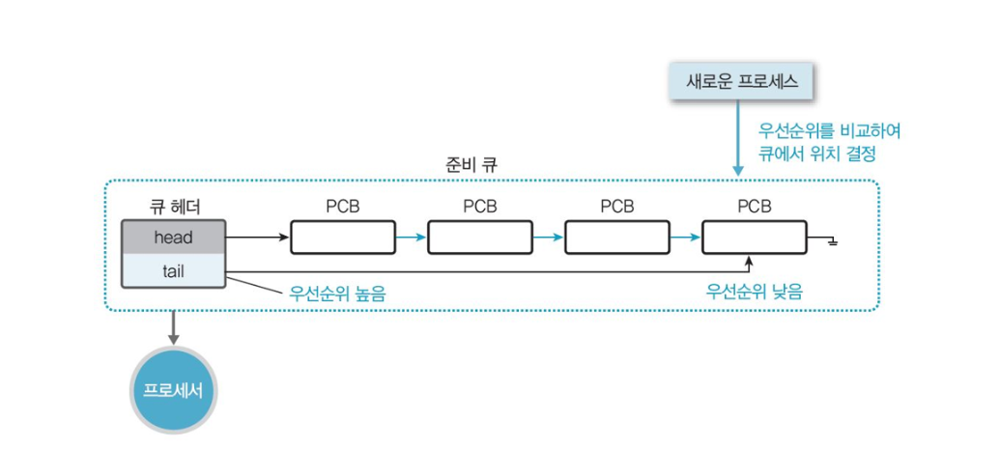
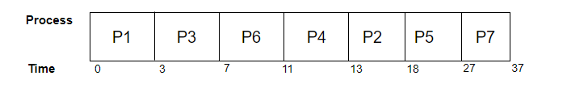
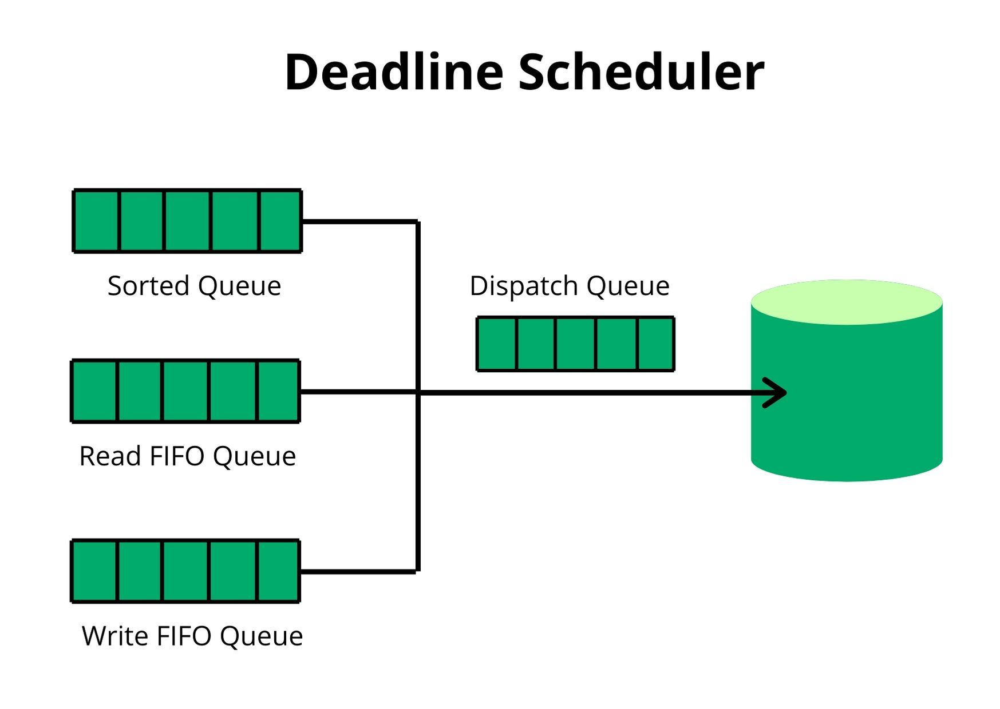
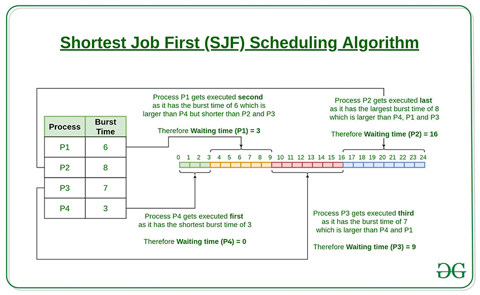
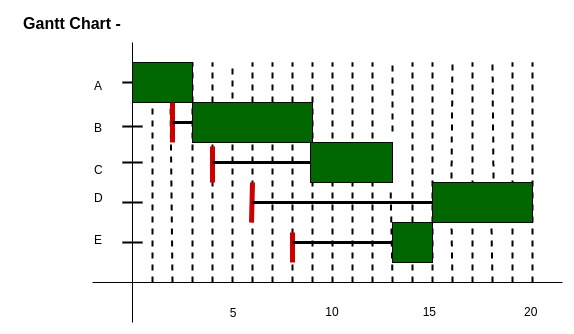

# Non-Preemptive

---

# 1. 우선순위(Priority)



- 할당된 우선순위 번호에 따라 CPU가 특정 프로세스에 할당된다.
- 우선순위 동일 시 FCFS기법을 이용한다.
- CPU 할당 후에는 문맥 전환이나 프로세스 종료를 통해서만 해제된다.
- 특별한 하드웨어(타이머 등)가 필요하지 않기 때문에 다양한 하드웨어 플랫폼에서 널리 사용된다.
- 동일한 우선순위를 갖는 두 개의 작업이 READY 상태인 경우 FCFS 방식으로 작동한다.
- 우선순위 스케줄링에서는 우선순위 수준을 나타내는 각 프로세스에 번호가 할당된다.
    - 숫자가 낮을수록 우선순위가 높다.
- 프로세스 우선순위 번호에는 Static과 Dynamic의 두 가지 유형이 있다.
    - 정적 우선순위 : 할당된 우선순위 번호가 프로세스 전체에서 자체적으로 변경되지 않는 경우 우선순위 번호는 정적이다
    - 동적 우선순위 : 할당된 우선순위 번호가 프로세스 전반에 걸쳐 자체적으로 변경되는 경우 우선순위 번호는 동적이다.

<aside>
💡 프로세스의 우선순위는 다음과 같은 몇 가지 요소에 따라 달라진다.
- 시간 제한
- 프로세스의 메모리 요구 사항
- 평균 CPU 버스트 시간에 대한 평균 I/O 비율

이러한 프로세스 우선 순위는 0~7 또는 0~4095와 같은 고정된 범위의 간단한 정수로 표시된다.

</aside>

- 장점
    - 비선점형 우선순위 스케줄링은 구현하고 사용하기 쉽다.
    - 우선순위에 따라 프로세스가 실행되므로 우선순위가 높은 프로세스는 오래 기다릴 필요가 없기 때문에 시간이 절약된다.
    - 시간과 자원의 요구 사항이 변동하는 응용 프로그램이 유용하다.
- 단점
    - 오버헤드가 있어 시스템 충돌 시 우선 순위가 낮은 거의 모든 프로세스가 손실된다.
    - 더 큰 프로세스는 많은 시간이 걸리며, 우선 순위가 낮은 프로세스는 중단되거나 지연될 수 있다.
    - 우선순위에 따라 우선순위가 낮은 일부 프로세스가 더 오랜 시간 동안 유지될 수 있다.
- 예시
    
    
    | Process | Arrival Time | Burst Time | Priority No |
    | --- | --- | --- | --- |
    | P1 | 0 | 3 | 2 |
    | P2 | 2 | 5 | 6 |
    | P3 | 1 | 4 | 3 |
    | P4 | 4 | 2 | 5 |
    | P5 | 6 | 9 | 7 |
    | P6 | 5 | 4 | 4 |
    | P7 | 7 | 10 | 10 |
    
    

    

# 2. 기한부(DeadLine)



- 프로세스에게 일정시간을 할당하여 그 시간 안에 작업을 완료하도록 하는 기법
    - 시간 내에 작업을 완료하지 못할 경우, 제거가 되거나 처음부터 다시 한다.
- Linux 커널용 I/O 스케줄러이며, 요청에 대한 서비스 시작 시간을 보장한다.
    - 시간, 주, 월 또는 연도별로 작업 일정을 설정할 수 있다.
- 원하는 요청 부족을 방지하기 위해 모든 I/O 작업에 마감일을 적용한다.
    - 작업 우선순위는 그대로 유지되지만 마감일이 다가올수록 우선순위를 높인다.
    - 우선순위 변경 시 작업이 재분류된다.
- 두 개의 최종 기한 I/O 대기열(기본적으로 마감일을 기준으로 정렬)이 유지된다.
    - 단, 정렬된 대기열은 섹터 번호를 기준으로 정렬
- 모든 새로운 요청에 대해 스케줄러는 해당 요청을 처리할 대기열을 선택한다.
- 일반적으로 읽기 작업 중에 프로세스가 차단되기 때문에 읽기 큐가 쓰기 큐보다 우선순위가 높다.
- 기본적으로 읽기 요청의 만료 시간은 500ms, 쓰기 요청은 5초 후 만료된다.
- 멀티 스레드 작업 부하에 대해 CFQ I/O 스케줄러보다 성능이 더 뛰어나다.
- 커널 매개변수가 런타임 중에 변경될 수 있는 경우를 조정 가능 매개변수라고 한다. 정적 및 조정 가능한 커널 매개변수는 다음과 같다.
    - fifo_batch (Integer)
        - 단일 배치로 발행할 읽기 또는 쓰기 요청 수를 섹터 번호 증가 기준으로 정렬하여 결정한다
    - read_expire(Integer)
        - 읽기 요청을 처리해야 하는 시간을 밀리초 단위로 결정한다.
        - I/O 스케줄러의 읽기 요청에는 기한이 할당된다.
    - write_expire(Integer)
        - 읽기 쓰기 요청이 처리되어야 하는 시간을 밀리초 단위로 결정한다
    - write_starved(Integer)
        - 단일 쓰기 일괄 처리를 처리하기 전에 처리할 읽기 일괄 처리 수를 제어한다.
        - 쓰기 부족 값이 높을수록 읽기 선호도가 높아진다
    - front_merges(boolean)
        - 요청을 대기열 앞에 맞추고 후면 병합이 전면 병합과 반대일 때 전면 병합이 수행된다.
        - 일반적으로 파일이 배치되는 방식으로 인해 후면 병합이 전면 병합보다 일반적이다.
        - I/O 스케줄러는 더 작은 요청을 이미 배치된 작업에 병합한다.
        - 전면 병합 조정 가능 항목이 0으로 설정되면 전면 병합 기능이 비활성화된다.

# 3. FCFS(First Come First Served)

- 대기열에 있는 요청과 프로세스를 도착 순서대로 자동으로 실행하는 운영 체제 스케줄링 알고리즘이다.
- CPU를 먼저 요청하는 프로세스가 CPU 할당을 먼저 가져온다. 이는 FIFO 대기열로 관리된다.
- FCFS의 전체 형태는 선착순이다.
- 프로세스가 준비 대기열에 들어가면 해당 PCB가 대기열의 끝과 연결되고, CPU가 사용 가능해지면 대기열 시작 부분에 있는 프로세스에 할당되어야 한다.
- 비선점형 및 선점형 스케줄링 알고리즘을 모두 지원한다.
    - 구현 및 사용이 쉽다.
    - 사용 시 어떠한 인과관계도 일으키지 않는다
    - 수신된 순서대로 각 프로시저를 실행한다
    - FCFS 상황의 선점형 스케줄링에서는 기아 가능성이 없다
- 비선점형 CPU 스케줄링 알고리즘이므로 프로세스가 CPU에 할당된 후 실행 완료될 때까지 CPU를 해제하지 않는다
    - 평균 대기 시간이 높다
    - 대기열 뒤쪽에 있는 짧은 프로세스는 앞쪽에 있는 긴 프로세스가 완료될 때까지 기다려야 한다
    - 시분할 시스템에 적합하지 않다
    - 단순성으로 인해 효율성이 떨어진다.
    - 호송 효과(Convoy Effect)가 발생할 가능성이 있다.
        - CPU 사용 시간이 긴 프로세스에 의해 사용 시간이 짧은 프로세스들이 오래 기다리는 현상. 이로 인해 평균 대기 시간이 길어진다.
- **장점**
    - 가장 간단한 형태의 스케줄링 알고리즘이다.
    - 프로그래밍하기 쉽다.
    - 선착순 방식이다.

- **단점**
    - 비선점형 스케줄링 알고리즘이므로 프로세스가 CPU에 할당된 후 실행이 완료될 때까지 CPU를 해제하지 않는다.
    - 평균 대기 시간이 높다.
    - 대기열 뒤 쪽에 있는 버스트 시간이 짧은 프로세스는 앞쪽에 있는 긴 시간의 프로세스가 완료될 때까지 기다려야 한다 **→ 효율성 하락**
    - 이 단순한 시스템으로 인해 FCFS는 다소 효율적이지 못하다.

- 예시
    
    
    | Process | Burst time | Arrival time |
    | --- | --- | --- |
    | P1 | 6 | 2 |
    | P2 | 2 | 5 |
    | P3 | 8 | 1 |
    | P4 | 3 | 0 |
    | P5 | 4 | 4 |
    - 평균 대기 시간 : (0 + 2 + 9 + 13 + 16) / 5 ⇒ 8
- 구현
    
    ```java
    // Java program for implementation of FCFS 
    // scheduling 
     
    import java.text.ParseException;
     
    class GFG {
     
        // Function to find the waiting time for all 
        // processes 
        static void findWaitingTime(int processes[], int n,
                int bt[], int wt[]) {
            // waiting time for first process is 0 
            wt[0] = 0;
     
            // calculating waiting time 
            for (int i = 1; i < n; i++) {
                wt[i] = bt[i - 1] + wt[i - 1];
            }
        }
     
        // Function to calculate turn around time 
        static void findTurnAroundTime(int processes[], int n,
                int bt[], int wt[], int tat[]) {
            // calculating turnaround time by adding 
            // bt[i] + wt[i] 
            for (int i = 0; i < n; i++) {
                tat[i] = bt[i] + wt[i];
            }
        }
     
        //Function to calculate average time 
        static void findavgTime(int processes[], int n, int bt[]) {
            int wt[] = new int[n], tat[] = new int[n];
            int total_wt = 0, total_tat = 0;
     
            //Function to find waiting time of all processes 
            findWaitingTime(processes, n, bt, wt);
     
            //Function to find turn around time for all processes 
            findTurnAroundTime(processes, n, bt, wt, tat);
     
            //Display processes along with all details 
            System.out.printf("Processes Burst time Waiting"
                           +" time Turn around time\n");
     
            // Calculate total waiting time and total turn 
            // around time 
            for (int i = 0; i < n; i++) {
                total_wt = total_wt + wt[i];
                total_tat = total_tat + tat[i];
                System.out.printf(" %d ", (i + 1));
                System.out.printf("     %d ", bt[i]);
                System.out.printf("     %d", wt[i]);
                System.out.printf("     %d\n", tat[i]);
            }
            float s = (float)total_wt /(float) n;
            int t = total_tat / n;
            System.out.printf("Average waiting time = %f", s);
            System.out.printf("\n");
            System.out.printf("Average turn around time = %d ", t);
        }
     
        // Driver code 
        public static void main(String[] args) throws ParseException {
            //process id's 
            int processes[] = {1, 2, 3};
            int n = processes.length;
     
            //Burst time of all processes 
            int burst_time[] = {10, 5, 8};
     
            findavgTime(processes, n, burst_time);
     
        }
    }
    // This code is contributed by 29ajaykumar
    ```
    

# 4. SJF(Shortest Job First)



- 실행 시간이 가장 짧은 프로세스를 선택하여 다음 실행을 수행하는 알고리즘이다.
- 선점형과 비 선점형의 두 가지를 지원한다. (선점형은 SRTF)
- 완료하는 데 걸리는 시간 단위로 각 작업과 연결된다.
    - 작업이 완료될 때까지 기다리는 것이 중요하지 않은 배치 유형 처리에 유용하다
    - 짧은 작업을 먼저 실행하여 처리 시간을 단축함으로써 프로세스 처리량을 향상시킬 수 있다
    - 먼저 실행해야 하는 더 짧은 작업을 제공하여 작업 출력을 향상시키며, 대부분 처리 시간이 더 짧다.
- 장점
    - 장기 스케줄링에 자주 사용된다.
    - FIFO 알고리즘을 통해 평균 대기 시간을 줄인다
    - 특정 프로세스 집합에 대해 가장 낮은 평균 대기 시간을 제공한다
    - 실행 시간이 미리 알려진 배치로 실행되는 작업에 적합하다
    - 장기 스케줄링 배치 시스템의 경우 작업 설명에서 버스트 시간 추정을 얻을 수 있다
    - 단기 스케줄링의 경우 다음 버스트 시간의 값을 예측해야 한다
- 단점
    - 작업 완료 시간을 더 일찍 알아야 하지만 예측하기는 어렵다
    - 단기적인 CPU 스케줄링에는 SJF를 구현할 수 없다. 이는 버스트의 길이를 예측할 수 있는 구체적인 방법이 없기 때문이다
    - 처리 시간이 매우 길어지거나 기아 상태가 발생할 수 있다
    - 프로세스나 작업이 실행되는 기간에 대한 지식이 필요하다
        - 평균 처리 시간을 줄이지 않는 기아 상태로 이어진다
        - 노화(Aging) 기법으로 해결 가능하다
    - 다가오는 CPU 요청의 길이를 아는 것이 어렵다
    - 경과 시간을 기록해야 하며, 이로 인해 프로세스에 더 많은 오버헤드가 발생한다.
- 예시
    
    
    | Process Queue | Burst time | Arrival time |
    | --- | --- | --- |
    | P1 | 6 | 2 |
    | P2 | 2 | 5 |
    | P3 | 8 | 1 |
    | P4 | 3 | 0 |
    | P5 | 4 | 4 |
    - 평균 대기 시간 : (0 + 7 + 0 + 2 + 14) / 5 ⇒ 4.6
- 구현
    
    ```java
    import java.io.*
    import java.util.*;
     
    public class Main {
        public static void main(String[] args)
        {
            Scanner input = new Scanner(System.in);
            int n;
            // Matrix for storing Process Id, Burst
            // Time, Average Waiting Time & Average
            // Turn Around Time.
            int[][] A = new int[100][4];
            int total = 0;
            float avg_wt, avg_tat;
            System.out.println("Enter number of process:");
            n = input.nextInt();
            System.out.println("Enter Burst Time:");
            for (int i = 0; i < n; i++) {
                // User Input Burst Time and alloting
                // Process Id.
                System.out.print("P" + (i + 1) + ": ");
                A[i][1] = input.nextInt();
                A[i][0] = i + 1;
            }
            for (int i = 0; i < n; i++) {
                // Sorting process according to their
                // Burst Time.
                int index = i;
                for (int j = i + 1; j < n; j++) {
                    if (A[j][1] < A[index][1]) {
                        index = j;
                    }
                }
                int temp = A[i][1];
                A[i][1] = A[index][1];
                A[index][1] = temp;
                temp = A[i][0];
                A[i][0] = A[index][0];
                A[index][0] = temp;
            }
            A[0][2] = 0;
            // Calculation of Waiting Times
            for (int i = 1; i < n; i++) {
                A[i][2] = 0;
                for (int j = 0; j < i; j++) {
                    A[i][2] += A[j][1];
                }
                total += A[i][2];
            }
            avg_wt = (float)total / n;
            total = 0;
            // Calculation of Turn Around Time and printing the
            // data.
            System.out.println("P\tBT\tWT\tTAT");
            for (int i = 0; i < n; i++) {
                A[i][3] = A[i][1] + A[i][2];
                total += A[i][3];
                System.out.println("P" + A[i][0] + "\t"
                                   + A[i][1] + "\t" + A[i][2]
                                   + "\t" + A[i][3]);
            }
            avg_tat = (float)total / n;
            System.out.println("Average Waiting Time= "
                               + avg_wt);
            System.out.println("Average Turnaround Time= "
                               + avg_tat);
        }
    }
    ```
    

# 5. HRRN(Highest Response Ratio Next)

- SJF 스케줄링 기법의 약점인 긴 작업과 짧은 작업의 지나친 불평등을 보완한 스케줄링 기법이다.
- HRRN 알고리즘은 비선점형 CPU 스케줄링 알고리즘으로 가장 최적의 스케줄링 알고리즘 중 하나로 꼽힌다.
- 실행을 위해 프로세스가 선택되면 완료될 때까지 실행된다.
- 수행시간의 길이와 대기 시간을 모두 고려해 우선순위를 정한다.
    - **실행시간이 짧거나 대기시간이 긴 프로세스일 경우 우선순위가 높아진다.**
- 기아 문제를 줄이기 위한 SJF 알고리즘의 변형으로 간주된다.
    - SJF와 달리 HRRN에서는 버스트 시간이 적은 프로세스가 아닌 응답 비율이 가장 높은 다음 프로세스에 CPU가 할당된다.
    - 응답 비율 : (대기 시간 + 버스트 시간) / 버스트 시간
- 장점
    - 일반적으로 SJF 스케줄링보다 더 나은 성능을 제공한다
    - 더 긴 작업에 대한 대기 시간이 줄어들고 더 짧은 작업을 장려한다
    - 처리량이 증가한다
- 단점
    - HRRN 스케줄링의 실제 구현은 모든 작업의 버스트 시간을 미리 알 수 없기에 불가능하다
    - CPU에 과부하가 발생할 수 있다.
    - 프로세서에 의해 오버헤드가 발생할 수 있다.
- 작동 방식
    1. 모든 프로세스의 대기 시간 계산
    2. 사용 가능한 각 프로세스에 대한 응답 비율을 찾기 위해 프로세스는 실행될 때마다 예약된다 
    3. 가장 높은 응답 비율을 갖는 프로세스가 프로세서에 의해 먼저 실행된다 
    4. 두 프로세스가 동일한 응답 비율을 갖는 경우 FCFS 스케줄링을 사용한다. 
- 예시
    
    
    | Processes | Arrival time | Burst Time |
    | --- | --- | --- |
    | P1 | 0ms | 3ms |
    | P2 | 2ms | 6ms |
    | P3 | 4ms | 4ms |
    | P4 | 6ms | 5ms |
    | P5 | 8ms | 2ms |
    
    

    
- 구현
    
    ```java
    // Java equivalent 
    import java.util.Arrays; 
       
    // Defining process details 
    class Process { 
        char name; 
        int at, bt, ct, wt, tt; 
        int completed; 
        float ntt; 
    } 
       
    public class HRRN { 
       
        // Sorting Processes by Arrival Time 
        static void sortByArrival(Process p[], int n) 
        { 
            Process temp; 
            int i, j; 
       
            // Selection Sort applied 
            for (i = 0; i < n - 1; i++) { 
                for (j = i + 1; j < n; j++) { 
       
                    // Check for lesser arrival time 
                    if (p[i].at > p[j].at) { 
       
                        // Swap earlier process to front 
                        temp = p[i]; 
                        p[i] = p[j]; 
                        p[j] = temp; 
                    } 
                } 
            } 
        } 
       
        public static void main(String[] args) 
        { 
            int i, j, sum_bt = 0; 
            char c; 
            float t, avgwt = 0, avgtt = 0; 
            int n = 5; 
       
            // predefined arrival times 
            int arriv[] = { 0, 2, 4, 6, 8 }; 
       
            // predefined burst times 
            int burst[] = { 3, 6, 4, 5, 2 }; 
       
            Process[] p = new Process[n]; 
       
            // Initializing the structure variables 
            for (i = 0, c = 'A'; i < n; i++, c++) { 
                p[i] = new Process(); 
                p[i].name = c; 
                p[i].at = arriv[i]; 
                p[i].bt = burst[i]; 
       
                // Variable for Completion status 
                // Pending = 0 
                // Completed = 1 
                p[i].completed = 0; 
       
                // Variable for sum of all Burst Times 
                sum_bt += p[i].bt; 
            } 
       
            // Sorting the structure by arrival times 
            sortByArrival(p, n); 
            System.out.println("PN\tAT\tBT\tWT\tTAT\tNTT"); 
            for (t = p[0].at; t < sum_bt;) { 
       
                // Set lower limit to response ratio 
                float hrr = -9999; 
       
                // Response Ratio Variable 
                float temp; 
       
                // Variable to store next process selected 
                int loc = -1; 
                for (i = 0; i < n; i++) { 
       
                    // Checking if process has arrived and is 
                    // Incomplete 
                    if (p[i].at <= t && p[i].completed != 1) { 
       
                        // Calculating Response Ratio 
                        temp = (p[i].bt + (t - p[i].at)) / p[i].bt; 
       
                        // Checking for Highest Response Ratio 
                        if (hrr < temp) { 
       
                            // Storing Response Ratio 
                            hrr = temp; 
       
                            // Storing Location 
                            loc = i; 
                        } 
                    } 
                } 
       
                // Updating time value 
                t += p[loc].bt; 
       
                // Calculation of waiting time 
                p[loc].wt = (int)(t - p[loc].at - p[loc].bt); 
       
                // Calculation of Turn Around Time 
                p[loc].tt = (int)(t - p[loc].at); 
       
                // Sum Turn Around Time for average 
                avgtt += p[loc].tt; 
       
                // Calculation of Normalized Turn Around Time 
                p[loc].ntt = ((float)p[loc].tt / p[loc].bt); 
       
                // Updating Completion Status 
                p[loc].completed = 1; 
       
                // Sum Waiting Time for average 
                avgwt += p[loc].wt; 
                System.out.println(p[loc].name + "\t" + p[loc].at + "\t" + p[loc].bt 
                                   + "\t" + p[loc].wt + "\t" + p[loc].tt 
                                   + "\t" + p[loc].ntt); 
            } 
            System.out.println("Average waiting time: " + (avgwt / n)); 
            System.out.println("Average Turn Around time:" + (avgtt / n)); 
        } 
    }
    ```