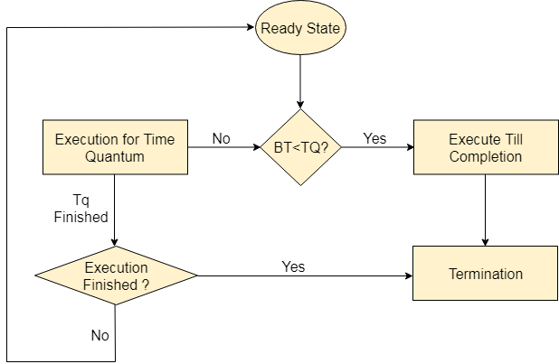
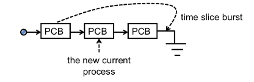
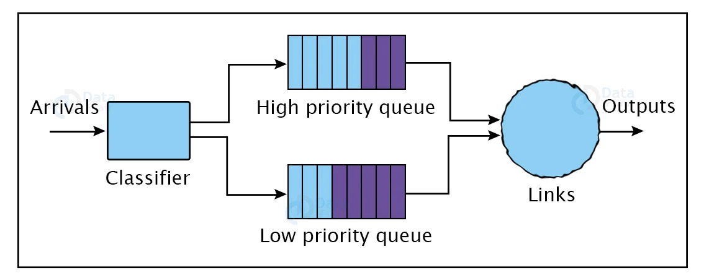
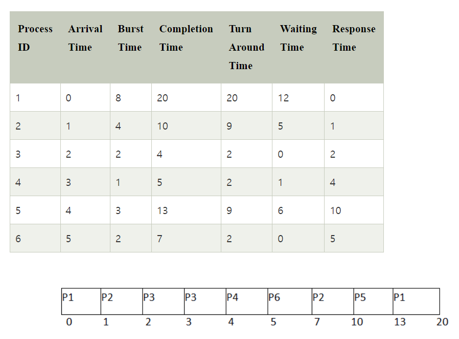
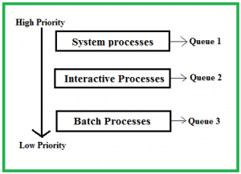
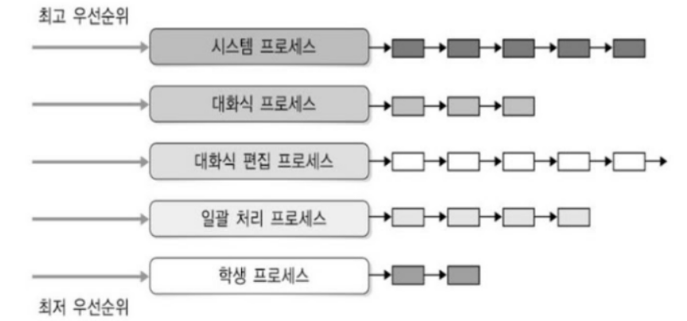
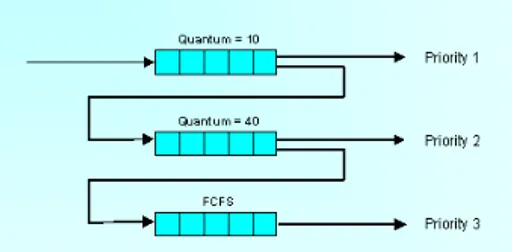

# Preemptive

# 1. RR(Round Robin)





- Time Sharing System(시분할 시스템)을 위해 설계된 스케줄링이다.

<aside>
💡 **시분할 시스템**

CPU 스케줄링과 다중 프로그래밍을 이용해서 각 사용자들에게 컴퓨터 자원을 시간적으로 분할하여 사용할 수 있게 해주는 대화식 시스템

</aside>

- 각 프로세스는 동일한 Time Slice 또는 시간 할당량을 받는다.
- 실행 중인 프로세스는 해당 Time Slice가 끝나기 전까지 CPU를 사용할 수 있다.
- Time slice burst가 일어나면 해당 프로세스는 스케줄링 큐의 끝으로 이동한다.
- 이러한 식으로 모든 프로세스가 순환하며 CPU시간을 공평하게 나누어 가진다.
- 여러 작업을 동시에 처리할 때 유용한 방법이다.
- 시간 단위(Time Quantum/Slice)는 각 프로세스에 동일한 부분과 순환 순서로 할당되어 프로세스를 우선 순위 없이 처리한다.
- 보통 시간 단위는 10ms ~ 100ms 정도이고 시간 단위 동안 수행한 프로세스는 준비 큐의 끝으로 밀려나게 된다. 이후 다른 프로세스가 실행된다.
- 문맥 전환의 오버헤드가 큰 반면, 응답 시간이 짧아지는 장점이 있어 실시간 시스템에 유리하며 할당되는 시간이 클 경우 비선점 FIFO 기법과 같아지게 된다.
- 버스트 시간에 의존하지 않기에 간단하고 구현하기 쉬우며 기아 현상이 없다.
- 시계 구동 방식의 하이브리드 모델이며 처리해야 하는 특정 작업에 할당되는 시간 단위는 최소여야 한다. (OS에 따라 다를 수는 있다.)
- 특정 시간 내에 이벤트에 반응하는 실시간 알고리즘이다.
- 실행 대기열의 총 프로세스 수를 알고 있으면 동일한 프로세스에 대해 최악의 응답 시간을 가정할 수 있다.
- OS의 시간 단위가 짧으면 프로세서 출력이 감소한다. 성능은 시간 단위에 크게 좌우된다.
- 더 특별한 작업에 특별한 우선순위를 부여하지 않는다. 즉, 정확한 시간 단위를 찾는 것이 매우 어렵다.
- 컴퓨터 네트워크의 데이터 패킷 스케줄링과 같은 다른 스케줄링 문제에 적용될 수 있다.
- 프로세스 스케줄링과 네트워크 패킷 스케줄링에 사용된다.
- 아래의 조건 하에서
    
    
    | Processes | AT | BT | CT | TAT | WT |
    | --- | --- | --- | --- | --- | --- |
    | P1 | 0 | 5 | 12 | 12-0 = 12 | 12-5 = 7 |
    | P2 | 1 | 4 | 11 | 11-1 = 10 | 10-4 = 6 |
    | P3 | 2 | 2 | 6 | 6-2 = 4 | 4-2 = 2 |
    | P4 | 4 | 1 | 9 | 9-4 = 5 | 5-1 = 4 |
    - 평균 대기 시간과 처리 시간은 다음과 같다.
        - 평균 대기 시간 : (7 + 6 + 2 + 4)/4 = 4.7
        - 평균 처리 시간 (12 + 10 + 4 + 5)/4 = 7.7
- 작동 순서는 다음과 같다.
    - 모든 프로세스가 준비 대기열에 추가
    - 모든 프로세스의 버스트 시간을 CPU의 시간 할당량과 비교
    - 프로세스의 버스트 시간이 라운드 로빈 스케줄링 알고리즘의 시간 할당량보다 작거나 같으면 프로세스는 버스트 시간까지 수행
    - 프로세스의 버스트 시간이 시간 할당랼보다 크면 프로세스는 시간 할당량까지 실행
    - 시간 할당랼이 만료되면 프로세스가 완전히 실행되었는지 확인
    - 완료되면 프로세스가 종료, 그렇지 않으면 다시 준비 상태로 복귀
- sudo code
    - 버스트 시간 배열 ⇒ rem_bt[]
    - 대기 시간 배열 ⇒ wt[]
    - 초기화 시간 ⇒ t
    
    ```java
    // Java program for implementation of RR scheduling
    
    public class GFG 
    {
    	// Method to find the waiting time for all
    	// processes
    	static void findWaitingTime(int processes[], int n,
    				int bt[], int wt[], int quantum)
    	{
    		// Make a copy of burst times bt[] to store remaining
    		// burst times.
    		int rem_bt[] = new int[n];
    		for (int i = 0 ; i < n ; i++)
    			rem_bt[i] = bt[i];
    	
    		int t = 0; // Current time
    	
    		// Keep traversing processes in round robin manner
    		// until all of them are not done.
    		while(true)
    		{
    			boolean done = true;
    	
    			// Traverse all processes one by one repeatedly
    			for (int i = 0 ; i < n; i++)
    			{
    				// If burst time of a process is greater than 0
    				// then only need to process further
    				if (rem_bt[i] > 0)
    				{
    					done = false; // There is a pending process
    	
    					if (rem_bt[i] > quantum)
    					{
    						// Increase the value of t i.e. shows
    						// how much time a process has been processed
    						t += quantum;
    	
    						// Decrease the burst_time of current process
    						// by quantum
    						rem_bt[i] -= quantum;
    					}
    	
    					// If burst time is smaller than or equal to
    					// quantum. Last cycle for this process
    					else
    					{
    						// Increase the value of t i.e. shows
    						// how much time a process has been processed
    						t = t + rem_bt[i];
    	
    						// Waiting time is current time minus time
    						// used by this process
    						wt[i] = t - bt[i];
    	
    						// As the process gets fully executed
    						// make its remaining burst time = 0
    						rem_bt[i] = 0;
    					}
    				}
    			}
    	
    			// If all processes are done
    			if (done == true)
    			break;
    		}
    	}
    	
    	// Method to calculate turn around time
    	static void findTurnAroundTime(int processes[], int n,
    							int bt[], int wt[], int tat[])
    	{
    		// calculating turnaround time by adding
    		// bt[i] + wt[i]
    		for (int i = 0; i < n ; i++)
    			tat[i] = bt[i] + wt[i];
    	}
    	
    	// Method to calculate average time
    	static void findavgTime(int processes[], int n, int bt[],
    										int quantum)
    	{
    		int wt[] = new int[n], tat[] = new int[n];
    		int total_wt = 0, total_tat = 0;
    	
    		// Function to find waiting time of all processes
    		findWaitingTime(processes, n, bt, wt, quantum);
    	
    		// Function to find turn around time for all processes
    		findTurnAroundTime(processes, n, bt, wt, tat);
    	
    		// Display processes along with all details
    		System.out.println("PN " + " B " +
    					" WT " + " TAT");
    	
    		// Calculate total waiting time and total turn
    		// around time
    		for (int i=0; i<n; i++)
    		{
    			total_wt = total_wt + wt[i];
    			total_tat = total_tat + tat[i];
    			System.out.println(" " + (i+1) + "\t\t" + bt[i] +"\t " +
    							wt[i] +"\t\t " + tat[i]);
    		}
    	
    		System.out.println("Average waiting time = " +
    						(float)total_wt / (float)n);
    		System.out.println("Average turn around time = " +
    						(float)total_tat / (float)n);
    	}
    	
    	// Driver Method
    	public static void main(String[] args)
    	{
    		// process id's
    		int processes[] = { 1, 2, 3};
    		int n = processes.length;
    	
    		// Burst time of all processes
    		int burst_time[] = {10, 5, 8};
    	
    		// Time quantum
    		int quantum = 2;
    		findavgTime(processes, n, burst_time, quantum);
    	}
    }
    ```
    

# 2. Priority(우선순위 )



- 우선순위 스케줄링은 선점형과 비선점형이 있다.
- aging(노화)기법 : 기다리는 시간이 길어지면 우선순위를 조금씩 높여서 언젠가 가장 높은 우선순위가 되어 CPU를 할당 받을 수 있게 해주는 방법이다.
    - aging기법은 매 분마다 대기 중인 프로세스의 우선순위를 1씩 증가시킨다.
- 사용 가능한 모든 프로세스 중에서 우선순위가 가장 높은 프로세스에 CPU가 할당된다. 동점일 경우에는 FCFS Scheduling 또는 Round Robin Scheduling에 의해 선택된다.
    - 우선순위는 프로세스의 메모리 요구 사항, 시간 요구 사항, CPU 버스트에 대한 I/O 버스트 비율 등에 따라 달라진다.
- 사용하기 쉬우며 각 프로세스의 중요성은 명확하게 정의되어 있다.
    - 프로세스의 우선순위를 고려하여 중요한 프로세스가 먼저 실행되도록 한다.
        - 우선 순위 수준을 나타내기 위해 각 프로세스에 숫자가 제공된다.
        - 할당된 번호가 낮을 수록, 프로세스의 우선 순위 수준이 높을수록 좋다.
- 시간과 리소스 요구 사항이 변동하는 애플리케이션에 적합한 알고리즘이다.
    - 선점형 모드의 우선순위 스케줄링은 실시간 운영 체제에 가장 적합하다.
- 일괄 처리를 수행하는 데 주로 사용된다.
- 시스템이 충돌하면 우선순위가 낮은 프로세스가 모두 손실될 수 있다.
- 기아 상태가 발생할 수 있다.
    - 기아 상태는 aging을 통해 해결할 수 있다. 이는 시스템에서 오랜 시간 동안 대기하는 프로세스의 우선순위를 점진적으로 높이는 데 사용되는 기술이다.
- 우선순위가 낮은 프로세스는 CPU가 부족할 수 있다.
- 응답 시간과 대기 시간에 대한 아이디어가 없다.
- 다른 프로세스 실행으로 프로세스가 준비되었음에도 실행되지 않을 가능성이 있다.
- 아래와 같은 상황에서
    
    
    | Process | Priority | Burst Time | Arrival Time |
    | --- | --- | --- | --- |
    | P1 | 1 | 4 | 0 |
    | P2 | 2 | 3 | 0 |
    | P3 | 1 | 7 | 6 |
    | P4 | 3 | 4 | 11 |
    | P5 | 2 | 2 | 12 |
    - 평균 대기 시간은 (0 + 11 + 0 + 5 + 2) / 5 ⇒ 3.6이 된다.
    
   
 ### 2-1. P**reemptive**
    
- 작업은 우선순위에 따라 실행된다. 우선 순위가 낮은 작업이 실행 중이고 우선 순위가 높은 작업이 대기 상태에 도달하면 우선 순위가 낮은 작업이 보류된다.
- 우선 순위가 높은 작업이 이를 대체하고 일단 실행이 완료되면 우선 순위가 낮은 작업이 일시 중지된 시점부터 실행을 다시 시작한다.
- 타이머와 같은 특수 하드웨어가 필요하다.
    
    
### 2-2. Non-P**reemptive**
    
- OS는 문맥 전환 혹은 종료 후에 CPU를 해제하는 특정 프로세스에 CPU를 할당한다.
- 선점형 스케줄링과 달리 특별한 하드웨어가 필요하지 않기에 다양한 하드웨어 플랫폼에서 사용할 수 있다.
- Sudo Code
    
    ```cpp
    #include<bits/stdc++.h> 
    using namespace std; 
      
    struct Process 
    { 
        int pid;  //process ID
        int bt;   //CPU burst time 
        int priority; //priority of the process
    }; 
      
    bool sortProcesses(Process a, Process b) 
    { 
        return (a.priority > b.priority); 
    } 
    
    void findWaitingTime(Process proc[], int n, 
                         int wt[]) 
    { 
        wt[0] = 0; 
      
        for (int  i = 1; i < n ; i++ ) 
            wt[i] =  proc[i-1].bt + wt[i-1] ; 
    } 
      
    void findTurnAroundTime( Process proc[], int n, 
                             int wt[], int tat[]) 
    {
        for (int  i = 0; i < n ; i++) 
            tat[i] = proc[i].bt + wt[i]; 
    } 
     
    void findavgTime(Process proc[], int n) 
    { 
        int wt[n], tat[n], total_wt = 0, total_tat = 0; 
        findWaitingTime(proc, n, wt); 
      
        findTurnAroundTime(proc, n, wt, tat); 
      
        cout << "\nProcesses  "<< " Burst time  "
             << " Waiting time  " << " Turnaround time\n"; //process details
      
        for (int  i=0; i<n; i++) 
        { 
            total_wt = total_wt + wt[i]; 
            total_tat = total_tat + tat[i]; 
            cout << "   " << proc[i].pid << "\t\t"
                 << proc[i].bt << "\t    " << wt[i] 
                 << "\t\t  " << tat[i] <<endl; 
        } 
      
        cout << "\nAverage waiting time = "
             << (float)total_wt / (float)n; 
        cout << "\nAverage turnaround time = "
             << (float)total_tat / (float)n; 
    } 
      
    void priorityScheduling(Process proc[], int n) 
    { 
        sort(proc, proc + n, sortProcesses); 
      
        cout<< "Order in which processes gets executed \n"; 
        for (int  i = 0 ; i <  n; i++) 
            cout << proc[i].pid <<" " ; 
      
        findavgTime(proc, n); 
    } 
      
    // Driver code 
    int main() 
    { 
        Process proc[] = {{1, 10, 2}, {2, 5, 0}, {3, 8, 1}}; 
        int n = sizeof proc / sizeof proc[0]; 
        priorityScheduling(proc, n); 
        return 0; 
    }
    ```
    

# 3. SRTF(Shortest Remaining Time First)



- SRTF(Shortest Remaining Time First)는 완료까지 남은 시간이 가장 적은 프로세스를 선택하여 실행한다.
    - SJF 스케줄링의 선점형 버전이다.
- 현재 실행 중인 프로세스는 정의상 남은 시간이 가장 짧은 프로세스이고 실행이 진행됨에 따라 그 시간만 줄어들기에 프로세스는 완료되거나 더 적은 시간이 필요한 새 프로세스가 추가될 때까지 항상 실행된다.
- SRTF는 동적 알고리즘이다. 즉, 프로세스 도착 시간과 버스트 시간의 변화에 적응할 수 있다. 각 프로세스의 남은 버스트 시간을 지속적으로 재평가하고 남은 시간이 가장 짧은 프로세스를 예약한다.
- SRTF는 대기 시간이 짧은 것으로 알려져 있다. 남은 버스트 시간이 가장 짧은 프로세스를 선택하면 버스트 시간이 가장 짧은 프로세스가 먼저 실행되어 프로세스의 평균 대기 시간이 줄어든다.
- SRTF는 빈번한 문맥 전환과 선점을 필요로 하기 때문에 FCFS 및 RR과 같은 다른 스케줄링 알고리즘보다 복잡도가 높다.
- 준비 대기열에서 모든 프로세스를 사용할 수 있게 되면 선점은 수행되지 않으며 알고리즘은 SJF 스케줄링으로 작동된다.
- 프로세스가 실행에서 제거되고 다음 프로세스가 예약될 때 프로세스의 문맥은 PCB에 저장된다. 이 PCB는 프로세스의 다음 실행 시에 액세스된다.
- 짧은 프로세스는 매우 빠르게 처리된다.
    - 시스템은 프로세스가 완료되거나 새 프로세스가 추가될 때만 결정을 내리기에 오버헤드가 거의 필요하지 않다
    - 프로그램을 다시 컴파일하지 않고도 라이브러리 업데이트 또는 교체를 더 쉽게 관리할 수 있다.
    - 프로그램의 여러 인스턴스 간에 라이브러리를 공유할 수 있으므로 효율적인 메모리 사용이 가능하다.
    - 런타임에 사용 가능한 호환 라이브러리를 사용하여 프로그램을 다른 시스템에서 실행할 수 있으므로 더 나은 이식성을 제공한다.
    - 새 프로세스가 추가되면 알고리즘은 현재 실행 대기 중인 다른 모든 프로세스를 무시하고 현재 실행 중인 프로세스와 새 프로세스를 비교하기만 하면 된다.
- SJF(SJN)보다 SRTF에서 문맥 교환이 훨씬 더 많이 수행되며 처리를 위해 CPU의 시간을 소비한다. 이로 인해 처리 시간이 늘어나고 빠른 처리의 이점이 줄어든다.
    - READY 큐에 있는 작업의 CPU 시간을 모니터링하고 문맥 교환을 수행하기 위해 SRTF OS가 자주 필요하기에 SJF보다 더 많은 오버헤드를 포함한다.
    - 짧은 프로세스가 계속 추가되면 긴 프로세스가 무기한 보류되는 기아 현상이 발생할 가능성이 있다.
    - 추가 연결 프로세스로 인해 프로그램 시작이 약간 느려진다
    - 올바른 실행을 보장하려면 라이브러리 종속성을 적절하게 처리해야 한다
    - 라이브러리는 런타임에 로드되는 별도의 엔터티이므로 디버깅은 약간 더 복잡할 수 있다.
- Sudo Code
    
    ```java
    // Java program to implement Shortest Remaining Time First 
    // Shortest Remaining Time First (SRTF) 
      
    class Process 
    { 
        int pid; // Process ID 
        int bt; // Burst Time 
        int art; // Arrival Time 
          
        public Process(int pid, int bt, int art) 
        { 
            this.pid = pid; 
            this.bt = bt; 
            this.art = art; 
        } 
    } 
      
    public class GFG  
    { 
        // Method to find the waiting time for all 
        // processes 
        static void findWaitingTime(Process proc[], int n, 
                                         int wt[]) 
        { 
            int rt[] = new int[n]; 
           
            // Copy the burst time into rt[] 
            for (int i = 0; i < n; i++) 
                rt[i] = proc[i].bt; 
           
            int complete = 0, t = 0, minm = Integer.MAX_VALUE; 
            int shortest = 0, finish_time; 
            boolean check = false; 
           
            // Process until all processes gets 
            // completed 
            while (complete != n) { 
           
                // Find process with minimum 
                // remaining time among the 
                // processes that arrives till the 
                // current time` 
                for (int j = 0; j < n; j++)  
                { 
                    if ((proc[j].art <= t) && 
                      (rt[j] < minm) && rt[j] > 0) { 
                        minm = rt[j]; 
                        shortest = j; 
                        check = true; 
                    } 
                } 
           
                if (check == false) { 
                    t++; 
                    continue; 
                } 
           
                // Reduce remaining time by one 
                rt[shortest]--; 
           
                // Update minimum 
                minm = rt[shortest]; 
                if (minm == 0) 
                    minm = Integer.MAX_VALUE; 
           
                // If a process gets completely 
                // executed 
                if (rt[shortest] == 0) { 
           
                    // Increment complete 
                    complete++; 
                    check = false; 
           
                    // Find finish time of current 
                    // process 
                    finish_time = t + 1; 
           
                    // Calculate waiting time 
                    wt[shortest] = finish_time - 
                                 proc[shortest].bt - 
                                 proc[shortest].art; 
           
                    if (wt[shortest] < 0) 
                        wt[shortest] = 0; 
                } 
                // Increment time 
                t++; 
            } 
        } 
           
        // Method to calculate turn around time 
        static void findTurnAroundTime(Process proc[], int n, 
                                int wt[], int tat[]) 
        { 
            // calculating turnaround time by adding 
            // bt[i] + wt[i] 
            for (int i = 0; i < n; i++) 
                tat[i] = proc[i].bt + wt[i]; 
        } 
           
        // Method to calculate average time 
        static void findavgTime(Process proc[], int n) 
        { 
            int wt[] = new int[n], tat[] = new int[n]; 
            int  total_wt = 0, total_tat = 0; 
           
            // Function to find waiting time of all 
            // processes 
            findWaitingTime(proc, n, wt); 
           
            // Function to find turn around time for 
            // all processes 
            findTurnAroundTime(proc, n, wt, tat); 
           
            // Display processes along with all 
            // details 
            System.out.println("Processes " + 
                               " Burst time " + 
                               " Waiting time " + 
                               " Turn around time"); 
           
            // Calculate total waiting time and 
            // total turnaround time 
            for (int i = 0; i < n; i++) { 
                total_wt = total_wt + wt[i]; 
                total_tat = total_tat + tat[i]; 
                System.out.println(" " + proc[i].pid + "\t\t"
                                 + proc[i].bt + "\t\t " + wt[i] 
                                 + "\t\t" + tat[i]); 
            } 
           
            System.out.println("Average waiting time = " + 
                              (float)total_wt / (float)n); 
            System.out.println("Average turn around time = " + 
                               (float)total_tat / (float)n); 
        } 
          
        // Driver Method 
        public static void main(String[] args) 
        { 
             Process proc[] = { new Process(1, 6, 1),  
                                new Process(2, 8, 1), 
                                new Process(3, 7, 2),  
                                new Process(4, 3, 3)}; 
              
             findavgTime(proc, proc.length); 
        } 
    }
    ```
    

# 4. MultiLevel Queue(다단계 큐)





- MLQ 알고리즘은 준비된 대기열을 각각 다른 우선 순위를 갖는 여러 레벨 또는 게층으로 나눈다.
- 그 뒤 우선 순위, 메모리 요구 사항 및 CPU 사용량과 같은 특성을 기반으로 프로세스에 적절한 수준이 할당된다.
- 반응 속도가 빨라야 하는 프로세스에게는 Time Quantum을 작게 하고, background 프로세스는 사용자의 상호작용이 없으므로 Time Quantum을 길게 함으로써 FCFS방식으로 처리한다.

<aside>
💡 **Time Quantum**(타임 퀀텀) : Time Quantum은 라운드 로빈(Round Robin) 스케줄링 알고리즘과 관련된 용어로, 각 프로세스가 CPU를 사용하는 데 할당되는 고정된 시간

</aside>

- 포그라운드(대화형) 프로세스와 백그라운드(배치) 프로세스에 대한 서로 다른 큐가 있다.
    
    ### 4-1. MLQ(Multi Level Queue)의 기능
    
    - 다중 대기열
        - MLQ 스케줄링에서 프로세스는 우선순위에 따라 여러 대기열로 나뉘며, 각 대기열은 서로 다른 우선순위 수준을 갖는다.
        - 우선순위가 높은 프로세스는 우선순위가 높은 큐에 배치되고, 우선순위가 낮은 프로세스는 우선순위가 낮은 큐에 배치된다.
    - 할당된 우선 순위
        - 유형, 특성 및 중요성을 기준으로 프로세스에 우선순위가 할당된다.
        - 예를 들어, 사용자 입력/출력과 같은 대화형 프로세스는 파일 백업과 같은 일괄 프로세스보다 우선 순위가 더 높을 수 있다.
    - 선점
        - MLQ 스케줄링에서는 선점이 허용된다.
        - 우선 순위가 높은 프로세스가 우선 순위가 낮은 프로세스를 선점할 수 있으며, 우선 순위가 높은 프로세스에 CPU가 할당된다.
        - 이는 우선 순위가 높은 프로세스가 적시에 실행되도록 보장하는 데 도움이 된다.
    - 스케줄링 알고리즘
        - 해당 큐에 있는 프로세스의 요구 사항에 따라 각 큐에 대해 서로 다른 스케줄링 알고리즘을 사용할 수 있다.
        - 대화식 프로세스에는 RR 스케줄링을, 배치 프로세스에는 선착순 스케줄링을 사용하는 식이다
    - 피드백 메커니즘
        - 피드백 메커니즘은 시간 경과에 따른 동작을 기반으로 프로세스의 우선순위를 조정하기 위해 구현될 수 있다.
        - 예를 들어, 대화형 프로세스가 낮은 우선순위 큐에서 오랫동안 대기하고 있는 경우 적시에 실행되도록 우선순위가 높아질 수 있다.
    - CPU 시간의 효율적인 할당
        - MLQ 스케줄링은 우선 순위가 높은 프로세스가 적시에 실행되도록 보장하는 동시에 CPU가 유휴 상태일 때 우선 순위가 낮은 프로세스가 실행되도록 허용한다
    - 공정성
        - MLQ 스케줄링은 우선순위와 요구 사항에 따라 다양한 유형의 프로세스에 CPU 시간을 공정하게 할당한다
    - 사용자 정의 가능
        - MLQ 일정은 다양한 프로세스 유형의 특정 요구 사항을 충족하도록 사용자 정의할 수 있다
    
    ### 4-2. MLQ 스케줄링의 장점
    
    - 낮은 스케줄링 오버헤드
        - 프로세스가 해당 큐에 영구적으로 할당되므로 스케줄러가 실행을 위해 적절한 큐만 선택하면 되므로 스케줄링 오버헤드가 낮다
    - CPU 시간의 효율적인 할당
        - 스케줄링 알고리즘은 우선 순위가 높은 프로세스가 적시에 실행되도록 보장하는 동시에 CPU가 유휴 상태일 때 우선 순위가 낮은 프로세스가 실행되도록 허용한다.
        - 이는 CPU 시간의 최적 활용을 보장한다
    - 공정성
        - 스케줄링 알고리즘은 우선순위와 요구 사항에 따라 다양한 유형의 프로세스에 CPU 시간을 공정하게 할당한다
    - 사용자 정의 가능
        - 스케줄링 알고리즘은 다양한 유형의 프로세스의 특정 요구 사항을 충족하도록 사용자 정의할 수 있다.
        - 해당 대기열에 있는 프로세스의 요구 사항에 따라 각 대기열에 대해 서로 다른 예약 알고리즘을 사용할 수 있다.
    - 우선순위
        - 프로세스의 유형, 특성, 중요도에 따라 프로세스에 우선순위를 부여하여 중요한 프로세스가 적시에 실행되도록 한다
    - 선점
        - MLQ 스케줄링에서는 선점이 허용된다.
        - 우선 순위가 높은 프로세스가 우선 순위가 낮은 프로세스를 선점할 수 있으며 우선 순위가 높은 프로세스에 CPU가 할당된다.
        - 이는 우선순위가 높은 프로세스가 적시에 실행되도록 보장하는 데 도움이 된다.
    
    ### 4-3. MLQ 스케줄링의 단점
    
    - 우선 순위가 더 높은 일부 대기열이 결코 비워지지 않을 경우 일부 프로세스에는 CPU가 부족할 수 있다
    - 유연성이 없다. MLQ 스케줄링의 고정된 우선 순위 수준은 모든 유형의 애플리케이션이나 작업 부하에 적합하지 않을 수 있다.
    - 여러 대기열과 예약 알고리즘을 구현하고 유지 관리하는 데 복잡성이 추가될 수 있다.
    - 준비된 대기열을 여러 대기열로 나누면 예약 알고리즘과 관련된 오버헤드가 증가하여 시스템 성능에 부정적인 영향을 미칠 수 있다.
    - 우선순위가 높은 상위 큐 프로세스가 계속 들어온다면, 하위 큐 프로세스의 작업이 불가능하게 된다.
        - 이러한 문제를 해결하기 위해 제안된 것이 Multilevel Feedback Queue Scheduling이다.

# 5. MultiLevel Feedback Queue(다단계 피드백 큐)



- MLFQ(Multi Level Feedback Queue)는 컴퓨터 시스템에서 작업이나 프로세스를 관리하는 방법이다.
- 작업이 우선 순위에 따라 서로 다른 대기열로 나뉘며 각 대기열에는 자체 예약 알고리즘이 있다.
- 작업이 특정 대기열에 고정되는 MLQ 스케줄링 방법과 달리 MLFQ 스케줄링에서는 작업이 동작에 따라 서로 다른 대기열 사이를 이동할 수 있다.
    - 예를 들어, 작업이 처리 시간을 너무 많이 사용하면 우선 순위가 낮은 대기열로 이동된다.
- MLFQ 스케줄링 방법에서는 입력과 출력이 필요한 대화형 작업에 더 높은 우선 순위가 부여된다. 이 방법에는 작업을 우선 순위가 낮은 대기열로 강등할 시기와 우선 순위가 높은 대기열로 업그레이드할 시기를 결정하는 프로세스도 포함된다.
    - 프로세스의 우선순위는 사용된 CPU 시간이나 차단된 빈도와 같은 동작에 따라 동적으로 조정될 수 있다.
- 각 대기열에는 시간 할당량 또는 시간 분할이 할당된다. 이는 해당 대기열의 프로세스가 선점되어 더 낮은 우선 순위 대기열로 이동하기 전에 사용할 수 있는 CPU 시간을 결정한다
- 시간 경과에 따른 프로세스의 동작을 기반으로 프로세스의 우선순위를 조정한다.
    - 이를 통해 기아 상태를 방지할 수 있다.
- MLFQ의 매개변수는 다음과 같다
    - 각 대기열에 대한 시스템의 예약 방법
    - 시스템의 대기열 번호
    - 대기열을 낮은 우선 순위 대기열로 강등할 시기를 결정하는 프로세스
    - 더 높은 우선 순위 대기열로 업그레이드 되는 시간
    - 대기열에 추가할 프로세스와 서비스가 필요할 시기를 선택하는 절차
- 스케줄링 알고리즘 중 가장 복잡한 알고리즘이다.

<aside>
💡 **Time Slice(시간 조각)** : 컴퓨터 스케줄링과 멀티태스킹에서 사용되는 용어로, CPU 시간을 프로세스에 할당하는 단위를 나타낸다.
각 프로세스가 CPU를 사용할 수 있는 시간 제한을 말하며, 일반적으로 매우 짧은 시간 동안 프로세스에 CPU 실행 시간을 부여한다.
이러한 작은 Time Slice는 다른 프로세스 간에 공정한 CPU 시간 분배를 가능하게 한다.

</aside>