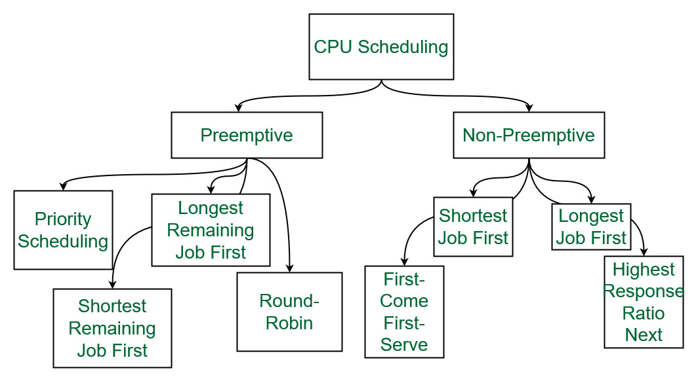

# Scheduling Algorithm

# 1. **CPU 스케줄링(CPU Scheduling)이란?**

- CPU 이용률을 극대화하기 위해서는 멀티프로그래밍(multiprogramming)이 필요하다. 하지만 만약 CPU core가 하나라면 한 번에 하나의 프로세스만 실행 가능할 것이다. 이때 필요한 것이 CPU 스케줄링이다.
- 즉, CPU 스케줄링은 언제 어떤 프로세스에 CPU를 할당할지 결정하는 작업이라고 할 수 있다.

<aside>
💡 **스케줄링의 장점**

1. CPU의 활용 극대화

2.프로세스 처리율(시간 당 작업량)을 늘릴 수 있다.

</aside>

- 프로세스는 필요한 자원을 할당받기 위해 큐에 대기합니다. 그래서 그 큐에 있는 프로세스를 어떻게 스케쥴링하는지가 프로세스 스케줄링 알고리즘이라고 한다.

| 용어 | 설명 |
| --- | --- |
| 대기시간 | 자원의 할당을 대기하는 시간 |
| 실행시간 | 실제로 프로세스가 자원을 할당받은 다음 작업을 수행하는 시간 |
| 반환시간 | 작업을 완료하는데 소요되는 전체 시간으로 대기시간과 실행시간을 모두 포함 |
- 목적

| 공정한 스케줄링 | 모든 프로세스에게 공정하게 할당을 해야함 |
| --- | --- |
| 응답시간 최소화 | 대화식 사용자에게는 최대한 응답시간(response time)을 빠르게 함 |
| 반환시간 최소화 | 프로세스를 제출한 시간부터 완료시까지 걸리는 반환시간(turn around time)을 최소화 한다. |
| 대기시간 최소화 | 프로세스 준비 상태 큐에서 대기하는 시간을 최소화 해야함앞에서 처리가 늦어지면 뒤에서 부하가 생기기 때문에 빠르게 처리해야함. |
| 우선 순위 제도 | 먼저 처리해야 하는 것에 우선 순위를 부여해서 먼저 처리 함. |
| 처리량 극대화 | 단위시간당 할 수 있는 처리량을 최대화 한다. |
| 균형 있는자원 사용 | 자원들이 유휴 상태에 놓이지 않도록 골고루 사용하게 함. |
| 무한 연기 회피 | 자원을 사용하기 위해 무한정 연기하는 경우를 회피 |
- **참고 > CPU 스케줄링 평가 기준 ( CPU Scheduling Criteria )**
    1. **CPU 이용률(CPU utilization)**
        - 시간당 CPU를 사용한 시간의 비율
        - 프로세서를 실행상태로 항상 유지하려고 해야 한다.
    2. **처리율(Throughput)**
        - 시간당 처리한 작업의 비율
        - 단위 시간당 완료되는 작업 수가 많도록 해야 한다.
    3. **반환시간(Turnaround Time)**
        - 프로세스가 생성된 후 종료되어 사용하던 자원을 모두 반환하는 데까지 걸리는 시간
        - 작업이 준비 큐(ready queue)에서 기다린 시간부터 CPU에서 실행된 시간, I/O 작업 시간의 합이다.
    4. **대기시간(Waiting Time)**
        - 대기열에 들어와 CPU를 할당받기 까지 기다린 시간
        - 준비 큐에서 기다린 시간의 총합
    5. **반응시간(Response Time)**
        - 대기열에서 **처음으로** CPU를 얻을 때까지 걸린 시간
        - 대기시간과 비슷하지만 다른 점은, 대기시간은 준비 큐에서 기다린 모든 시간을 합친 것이지만 반응 시간은 CPU를 할당받은 최초의 순간까지 기다린 시간 한번 만을 측정한다.
    - ⇒ **CPU 이용률과 처리율은 극대화하는 것이 좋고 반환시간, 대기시간, 반응시간은 줄이는 것이 일반적으로 좋다.**

## 1-1. 개요

- 운영 체제에서는 모든 것이 프로세스에 의해 수행된다. 주어진 시간에 CPU에서 실행되는 프로세스는 단 하나뿐이다.
- 프로세스 스케줄러는 CPU의 실행 상태에서 하나의 프로세스를 제거하고 OS의 일부 스케줄링 알고리즘을 기반으로 실행할 다른 프로세스를 선택한다. (CPU 효율성 증대)
- 캐시가 시간 최소화(예측) → 프로세서가 프로세스를 처리하고 남은 시간 동안 자원을 낭비할 수 없으므로 다른 프로세스를 처리하도록 한다.
- 대기 시간과 도착 시간을 계산하여 우선순위를 파악한다.

## 1-2. 필요성

- CPU스케줄링은 다른 프로세스가 일시 중지된 동안 CPU를 소유할 프로세스를 결정하는 프로세스이다.
- 다중 프로그래밍에서 장기 스케줄러가 여러 I/O 바인딩 프로세스를 선택하면, 대부분의 경우 CPU가 유휴 상태일 때마다 OS가 즉시 사용 가능한 라인에서 사용 가능한 프로세스 중 하나 이상을 선택했는지 확인하는 것이다.
- 대부분의 운영 체제가 성능 상태에서 대기 상태로 변경되면 시스템에 오류가 발생할 가능성이 있다.
    - 이를 최소화하려면 OS는 CPU를 최대한 활용하고 DeadLock 가능성을 피하기 위해 작업을 예약해야 한다.

# 2. Preemptive VS Non-Preemptive

## 1. **선점 스케줄링** 알고리즘

- 프로세스가 실행 상태에서 준비 상태로 전환되거나 대기 상태에서 준비 상태로 전환될 때 사용된다.
- 리소스는 제한된 시간 동안 프로세스에 할당된 다음 제거되며, 프로세스에 여전히 버스트 시간이 남아 있는 경우 프로세스는 다시 준비 대기열에 배치된다.
- 선점형 알고리즘에서는 프로세스에 우선순위가 할당된다.
- 우선순위가 높은 프로세스가 들어올 때마다 CPU를 점유하고 있던 우선순위가 낮은 프로세스가 선점된다.
- 즉, CPU를 해체하고 우선순위가 높은 프로세스가 실행을 위해 CPU를 사용한다.
- 문맥 교환이 자주 일어나기에 오버헤드가 발생한다.
- 프로세스가 한 번 실행될 때 제한된 시간을 할당한다. 그렇기에 프로세스가 작업을 수행하는 도중에 자원을 반납하고 대기 상태에 진입할 수 있다.
- 프로세스 실행 중 인터럽트를 허용한다.
- 우선순위에 따라 스케줄링을 하게 됨으로서 우선순위가 낮은 프로세스는 자원을 할당받지 못 하는 기아 현상(Starvation)이 발생할 수 있다.
- 공유 자원에 접근하고 있는 프로세스가 여러 개 존재할 경우 관리 비용이 많이 소요된다.
- 주요 알고리즘으로는 RR(Round Robin), Primitive, SRT, MLQ, MLFQ이 있다.

## 1-2. 장점

1. 프로세스가 프로세서를 독점할 수 없기 때문에 더 안정적인 방법이다.
2. 발생할 때마다 진행 중인 작업이 완료되지 않는다.
3. 평균 응답 시간이 향상된다.
4. 다중 프로그래밍 환경에서는 이 방법을 활용하는 것이 더 유리하다.
5. 운영 체제는 CPU를 사용하는 모든 프로세스가 동일한 양의 CPU 시간을 사용하는지 확인한다.

## 1-3. **단점**

1. 제한된 컴퓨터 리소스를 사용해야 한다.
2. 실행 중인 프로세스를 일시 중지하고, Context를 변경하고, 새로 들어오는 프로세스를 디스패치하는 데는 더 많은 시간이 걸린다.
3. 여러 개의 높은 우선순위 프로세스가 동시에 도착하면 낮은 우선순위 프로세스는 기다려야 한다.

<aside>
💡 *** 용어**

- **Arrival Time:** 프로세스가 준비 대기열에 도착하는 시간
- **Completion Time:** 프로세스가 실행을 완료하는 시간
- **Burst Time:** CPU 실행을 위해 프로세스에 필요한 시간
- **Turn Around Time:** 시간 완료 시간과 도착 시간의 차이
</aside>

## 2. **비선점 스케줄링** 알고리즘

- 프로세스가 종료되거나 프로세스가 실행 중 상태에서 대기 상태로 전환될 때 사용된다.
- 리소스가 프로세스에 할당되면 프로세스는 종료되거나 대기 상태에 도달할 때까지 CPU를 보유한다.
- 프로세스를 선점할 수 없다.
- 즉, 프로세스가 CPU에서 실행되면 문맥 교환이나 종료를 통해 해당 프로세스를 해제한다.
- 하드웨어의 한계로 인해 사용하는 알고리즘 유형인 경우가 많다.
- 필수적인 문맥 교환 외에 추가적인 오버헤드가 없다.
- 프로세스가 종료되거나 I/O를 수행하기 위해 자발적으로 대기상태에 들어가지 않는 한 자원을 반납하지 않는다.
- 인터럽트를 허용하지 않는다.
- 수행시간이 긴 프로세스가 자원을 점유하게 되면 그 이후 실행되어야 할 프로세스가 기아 상태에 빠지게 된다.
- 프로세스의 관리 비용에서 비교적 자유롭다.
- 주요 알고리즘으로는 우선순위(Priority), 기한부(DeadLine), FCFS, SJF, HRN이 있다.

## 2-2. 장점

1. 일정 부담이 최소화된다.
2. 절차가 매우 쉽다.
3. 더 적은 계산 리소스(computational resources)가 사용된다.
4. 처리율이 높다.

## 2-3. 단점

1. 프로세스에 대한 응답 시간은 매우 빠르다.
2. 버그로 인해 컴퓨터가 정지될 수 있다.

## 3. 주요 차이점

1. 선점형 스케줄링에서는 제한된 시간 동안 프로세스에 CPU를 할당하는 반면, 비선점 스케줄링에서는 프로세스가 종료되거나 대기 상태로 전환될 때까지 프로세스에 CPU를 할당한다.
2. 선점형 스케줄링의 실행 프로세스는 더 높은 우선순위가 오면 실행 중에 중단되는 반면, 비선점 스케줄링의 실행 프로세스는 실행 중에 중단되지 않고 실행될 때까지 기다린다.
3. 선점형 스케줄링에는 프로세스를 준비 상태에서 실행 상태로 전환하고, 반대 방향으로 전환하고, 준비 큐를 유지하는 오버헤드가 있다. 반면 비선점형 스케줄링의 경우 프로세스를 실행 상태에서 준비 상태로 전환하는 오버헤드가 없다.
4. 선점형 스케줄링에서 우선순위가 높은 프로세스가 아닌 비선점형의 낮은 우선순위 프로세스가 준비 큐에 자주 도착하면 우선순위가 낮은 프로세스는 오랫동안 기다려야 하고 굶어 죽게 될 수도 있다. 즉, 비선점형 스케줄링에서는 버스트 시간이 더 긴 프로세스에 CPU를 할당하면 버스트 시간이 작은 프로세스는 고갈될 수 있다.
5. 선점형 스케줄링은 현재 실행 중인 프로세스에 관계없이 중요한 프로세스가 준비 대기열에 도착할 때 CPU에 액세스할 수 있도록 하여 유연성을 확보한다. 비선점형 스케줄링은 중요한 프로세스가 준비 큐에 들어가더라도 CPU를 실행하는 프로세스가 방해받지 않기 때문에 엄격한 스케줄링이라고 한다.
6. 선점형 스케줄링은 공유 데이터의 무결성을 유지해야 하기 때문에 비선점형 스케줄링과는 달리 비용 연관성이 높다.

| 매개변수 | 선점형 스케줄링 | 비선점형 스케줄링 |
| --- | --- | --- |
| 기본 | 리소스(CPU 사이클)는 제한된 시간 동안 프로세스에 할당된다. | 리소스(CPU 주기)가 프로세스에 할당되면 프로세스는 버스트 시간이 완료되거나 대기 상태로 전환될 때까지 이를 보유한다. |
| 인터럽트 | 중간에 프로세스가 중단될 수 있다. | 프로세스가 자체적으로 종료되거나 시간이 다 될 때까지 프로세스를 중단할 수 없다. |
| 기아 | 우선순위가 높은 프로세스가 Ready Queue에 자주 도착하는 경우 우선순위가 낮은 프로세스는 기아 상태가 될 수 있다. | 버스트 시간이 긴 프로세스가 CPU를 실행하는 경우 CPU 버스트 시간이 더 적은, 나중에 오는 프로세스가 중단될 수 있다. |
| 오버헤드 | 프로세스를 예약하는 데 드는 오버헤드가 있다.

잦은 문맥 교환으로 인한 오버헤드가 증가한다. | 컨텍스트 전환 빈도가 낮기 때문에 오버헤드가 줄어든다. |
| 유연성 | 유연하다 | 엄격하다 |
| 비용 | 관련 비용이 있다. | 관련 비용 없음 |
| CPU 활용도 | 선점형 스케줄링에서는 CPU 사용률이 높다. | 비선점형 스케줄링에서는 낮다. |
| 대기 시간 | 선제적 스케줄링 대기 시간이 적다. | 비선점형 스케줄링 대기 시간이 높다. |
| 응답 시간 | 선제적 스케줄링 응답 시간이 더 짧다. | 비선점형 스케줄링 응답 시간이 높다. |
| 의사결정 | 결정은 스케줄러에 의해 이루어지며 우선순위 및 시간 분할 할당을 기반으로 한다. | 결정은 프로세스 자체에서 이루어지며 OS는 프로세스의 지시를 따른다. |
| 프로세스 제어 | OS는 프로세스 일정을 더 효과적으로 제어할 수 있다. | OS는 프로세스 스케줄링에 대한 통제력이 적다. |