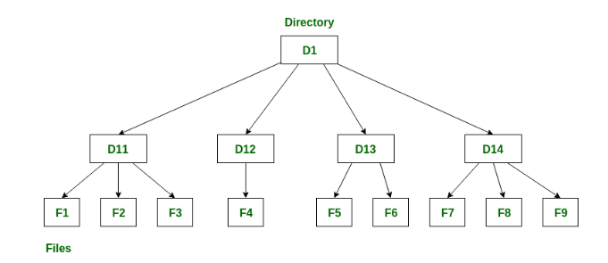
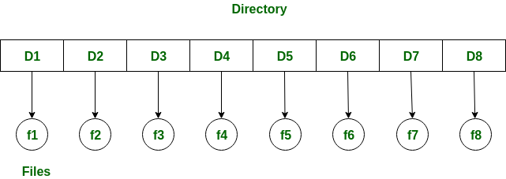
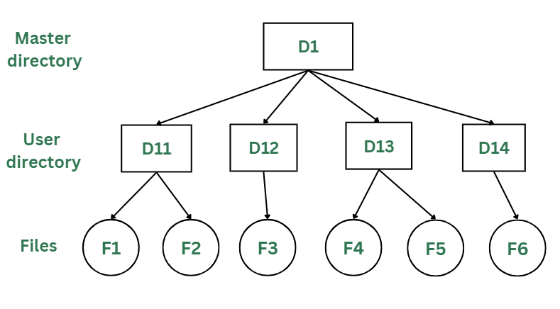
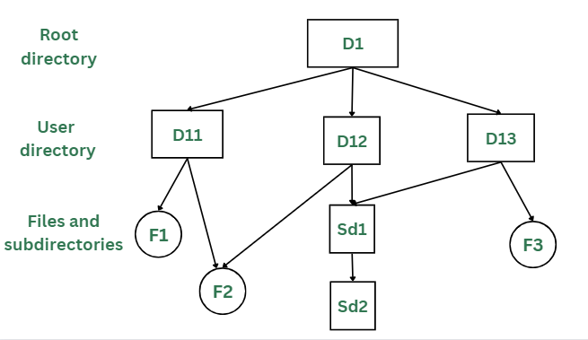
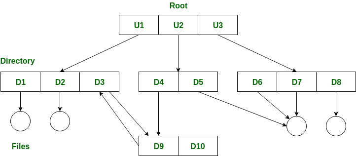

# Directory

---

# 개념

- 디렉터리는 폴더와 파일을 포함하는 데 사용되는 컨테이너이다.
- 파일과 폴더를 계층적 방식으로 구성한다.

# 목적

- 디렉토리 구조의 유일한 목적은 사용자가 가장 간단하고 생산적인 방식으로 모든 파일에 대한 액세스 및 관리를 수행할 수 있도록 파일 및 데이터를 효율적으로 저장하고 구성하는 방법을 제공하는 것이다.

# 시스템 호출

다음 시스템 호출이 주로 사용된다.

- mkdir() : GUI나 cmd을 통해 새 파일 생성할 때
- open() : 디렉터리 구조 내에서 파일 열 때
- close() : 디렉토리 구조에서 파일 닫을 때
- unlink() : 파일을 삭제하기 전에 다른 디렉터리의 파일과 구별할 때
- rmdir : 파일 시스템에서 디렉터리 제거할 때
- 폴더와 파일을  포함하는 데 사용되는 컨테이너이다.
- 파일과 폴더를 계층적 방식으로 구성한다.

# 1. **Single-level directory(단일 레벨 디렉토리)**

- 단일 레벨 디렉토리는 **가장 간단한 디렉토리 구조**이다. 여기에는 모든 파일이 동일한 디렉토리에 포함되어 있어 쉽게 지원하고 이해할 수 있다.
- 그러나 단일 수준 디렉터리에는 파일 수가 증가하거나 시스템에 두 명 이상의 사용자가 있는 경우 상당한 제한이 있다.
- 모든 파일은 동일한 디렉토리에 있으므로 **고유한 이름을** 가져야 한다.
    - 두 명의 사용자가 데이터 세트 테스트를 호출하면 고유 이름 규칙을 위반한 것이다.

## 1-1. 장점

- 단일 디렉토리이므로 구현이 매우 쉽다.
- 파일 크기가 작을수록 검색 속도가 빨라진다.
- 이러한 디렉토리 구조에서는 파일 생성, 검색, 삭제, 업데이트와 같은 작업이 매우 쉽다.

- **논리적 구성**
    - 파일과 디렉터리를 계층 구조로 논리적으로 구성하는 데 도움이 된다.
    - 이를 통해 파일을 쉽게 탐색하고 관리할 수 있어 사용자가 필요한 데이터에 더 쉽게 액세스할 수 있다.
- **효율성 향상**
    - 파일 검색에 필요한 시간을 줄여 파일 시스템의 효율성을 높일 수 있다.
    - 이는 디렉토리 구조가 빠른 파일 액세스에 최적화되어 있어 사용자가 필요한 파일을 빠르게 찾을 수 있기 때문이다.
- **향상된 보안**
    - 디렉터리 수준에서 액세스를 제한함으로써 파일에 대한 보안을 강화할 수 있다.
    - 이는 중요한 데이터에 대한 무단 액세스를 방지하고 중요한 파일을 보호하는 데 도움이 된다.
- **백업 및 복구 촉진**
    - 시스템 오류나 데이터 손실이 발생한 경우 파일을 더 쉽게 백업하고 복구할 수 있다.
    - 관련 파일을 동일한 디렉터리에 저장하면 보호해야 하는 모든 파일을 더 쉽게 찾고 백업할 수 있다.
- **확장성**
    - 확장 가능하므로 필요에 따라 새 디렉터리와 파일을 쉽게 추가할 수 있다.
    - 이는 시스템의 증가를 수용하는 데 도움이 되며 대량의 데이터를 더 쉽게 관리할 수 있게 해준다.

## 1-2. 단점

- 두 파일이 동일한 이름을 가질 수 있으므로 이름 충돌 가능성이 있다.
- 디렉토리가 크면 검색하는 데 시간이 걸린다.
- 동일한 유형의 파일을 그룹화할 수 없다.
    - 이 말은, 디렉터리 내에서 파일을 유형 또는 카테고리별로 그룹화하거나 분류할 수 없다는 것을 나타낸다.
    - 즉, 모든 파일이 하나의 폴더에 위치하며 파일 간에 유형별로 구분이나 계층적인 구조가 없다는 것을 의미한다.

# 2. **Two-level directory(2단계 디렉토리)**

- 앞서 살펴보았듯이 단일 수준 디렉터리로 인해 여러 사용자가 파일 이름을 혼동하는 경우가 많다. 이 문제에 대한 해결책은 **각 사용자에 대해 별도의 디렉토리를** 만드는 것이다 .
- 2단계 디렉터리 구조에서 각 사용자는 고유한 **UFD(사용자 파일 디렉터리)를 갖는다.**
    - UFD의 구조는 비슷하지만 각 UFD에는 단일 사용자의 파일만 나열된다.
    - 새로운 사용자 ID가 생성될 때마다 시스템의 **마스터 파일 디렉터리(MFD *)가 검색된다.***

## 2-1. 장점

- 동일한 이름을 가진 파일이 2개 이상 존재할 수 있다
    - 사용자가 여러 명일 경우 유용하다.
- 사용자가 다른 사용자의 파일에 액세스하는 것을 방지할 수 있다.
    - 이중 디렉터리에서 각 사용자는 자신만의 디렉터리를 가지는 형태이기 때문에 다른 사용자와 관련된 디렉터리에 대한 액세스 권한이 존재하지 않는다는 것이다.
    - 이것은 파일의 보안성과도 연관이 있다.
- 이 디렉터리 구조에서는 파일 검색이 쉽다.
    - 사용자는 자신만의 디렉터리 내에서 파일을 관리하므로 파일 검색 및 관리는 사용자의 관점에서 단순하고 직관적이다. 사용자는 자신의 파일을 다른 사용자의 파일과 혼동할 필요가 존재하지 않는다.

## 2-2. 단점

- 다른 사용자와 파일을 공유할 수 없다.
- 사용자는 하위 디렉터리를 만들 수 없다.
    - 디렉터리 구조가 평면적이고, 각 사용자의 디렉터리는 독립적이며 서브디렉터리를 만들 수 없는 구조이다. 모든 사용자의 디렉터리가 동일한 계층에 위치하고 독립적이다.
- 동일한 유형의 파일을 그룹화할 수 없으므로 확장이 불가능하다.
    - two-level directory 구조의 한계이다.

# 3. **Tree Structure/ Hierarchical Structure(트리 구조/계층 구조)**

- **운영 체제의 트리 디렉토리 구조는 개인용 컴퓨터**에서 가장 일반적으로 사용된다. 사용자는 파일과 하위 디렉터리도 만들 수 있는데, 이는 이전 디렉터리 구조의 단점이었다.
- **루트 디렉터리가** 정점에 있는 거꾸로 된 실제 트리와 유사하다. 이 루트에는 각 사용자의 모든 디렉터리가 포함되어 있다. 사용자는 하위 디렉터리를 만들고 심지어 자신의 디렉터리에 파일을 저장할 수도 있다.

<aside>
💡 **루트 디렉터리**
OS 디렉터리 구조의 기본 개념이다. 계층적 방식으로 구성된 최상위 디렉토리인 상위 디렉토리 시스템과 같은 유닉스에서는 슬래시 "/"로 표시되고 Windows에서는 "\"로 백슬래시로 표시된다.

</aside>

- 사용자는 루트 디렉터리 데이터에 대한 액세스 권한이 없으며 이를 수정할 수 없다. 그리고 이 디렉터리에서도 사용자는 다른 사용자의 디렉터리에 액세스할 수 없다.

## 3-1. 장점

- 이 디렉터리 구조는 디렉터리 내부의 하위 디렉터리를 허용한다.
- 검색이 더 쉬워졌다.
- 중요한 파일과 중요하지 않은 파일의 정렬이 쉬워진다.
- 이 디렉터리는 설명된 다른 두 디렉터리 구조보다 확장성이 뛰어난다.

## 3-2. 단점

- 사용자는 다른 사용자의 디렉토리에 접근할 수 없으므로 사용자 간의 파일 공유가 방지된다.
- 사용자는 하위 디렉터리를 만들 수 있으므로 하위 디렉터리 수가 늘어나면 검색이 복잡해질 수 있다.
- 사용자는 루트 디렉터리 데이터를 수정할 수 없다.
- 파일이 하나의 디렉터리에 맞지 않으면 다른 디렉터리에 맞춰야 할 수도 있다.
    - 어떤 파일이나 디렉터리가 현재 구조에서 올바르게 위치하지 않고 있다면, 그것을 다른 디렉터리로 옮길 필요가 있을 수 있다는 것을 의미한다.

# 4. **Acyclic Graph Structure(비순환 그래프 구조)**

- 위의 세 가지 디렉토리 구조를 살펴보았듯이 이들 중 어느 것도 여러 디렉토리에서 하나의 파일에 액세스할 수 없다.
- 파일이나 하위 디렉터리는 해당 디렉터리를 통해 액세스할 수 있지만 다른 디렉터리에서는 액세스할 수 없다.
- 이 문제는 한 디렉토리의 파일이 여러 디렉토리에서 액세스될 수 있는 비순환 그래프 디렉토리 구조에서 해결된다. 이러한 방식으로 사용자 간에 파일을 공유할 수 있다.
- 여러 디렉터리가 링크를 통해 특정 디렉터리나 파일을 가리키는 방식으로 설계되었다.
- 한 사용자가 변경하면 두 사용자 모두에게 반영된다.
- 일반적으로 현대 개인용 컴퓨터에 사용된다.

## 4-1. 장점

- 여러 사용자 간에 파일 및 디렉터리 공유가 허용된다.
- 검색이 너무 쉬워진다.
- 여러 사용자가 파일을 공유하고 편집할 수 있으므로 유연성이 향상된다.

## 4-2. 단점

- 구조가 복잡하기 때문에 이 디렉터리 구조를 구현하기가 어렵다.
- 파일은 여러 사용자가 접근하므로 사용자는 파일을 편집하거나 삭제할 때 매우 주의해야 한다.
- 파일을 삭제해야 하는 경우 파일을 영구적으로 삭제하려면 해당 파일의 모든 참조를 삭제해야 한다.

# 5. General Graph Structure

- 사용자는 OS에서 둘 이상의 상위 디렉토리의 도움을 받아 다양한 디렉토리를 파생할 수 있는 디렉토리 내에 디렉토리 순환을 생성할 수 있다
- 사용자는 동일한 구조 아래에 하위 디렉터리를 생성하는 동시에 루트 디렉터리 아래에 디렉터리를 자유롭게 생성할 수 있다.
- 파일 경로는 디렉터리 구조에서 파일을 찾기 위해 두 범주로 분류될 수 있다.
    - 절대 경로 : 루트 디렉터리를 기본 디렉터리로 간주하여 원하는 파일의 경로를 결정한다
    - 상대 경로 : 해당 디렉터리에서 검색해야 하는 파일이 기본 디렉터리로 간주되거나 사용자 디렉터리가 기본 디렉터리로 간주되는 두 가지 선택 사항에 의해 결정될 수 있다.

## 5-1. 장점

- 디렉터리 내에서 디렉터리를 순환하거나 생성할 수 있다
- 다른 디렉터리 구조에 비해 유연하다

## 5-2. 단점

- 디렉터리가 차지할 전체 크기 또는 공간을 계산하기 어렵다
- 여러 하위 디렉터리를 생성할 수 있으므로 많은 가비지 수집이 필요해질 수 있다
- 비용이 상대적으로 많이 소모된다.