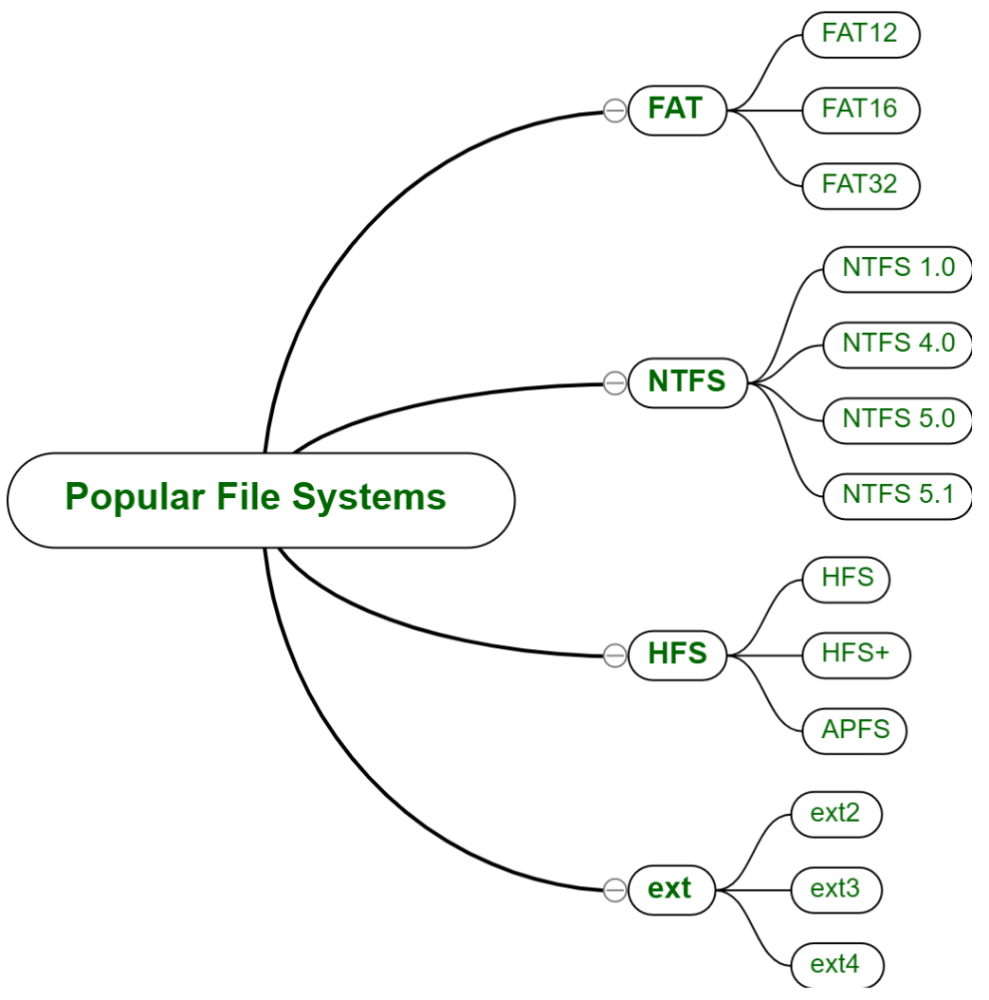
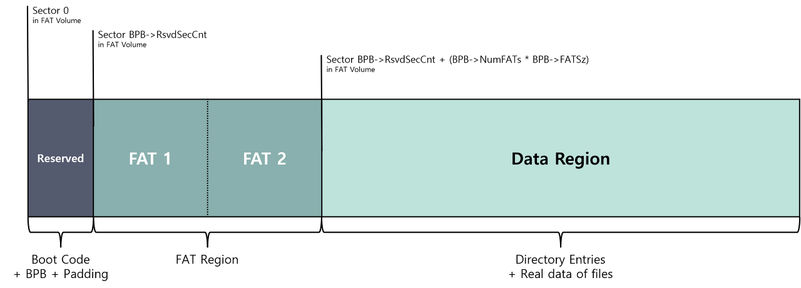
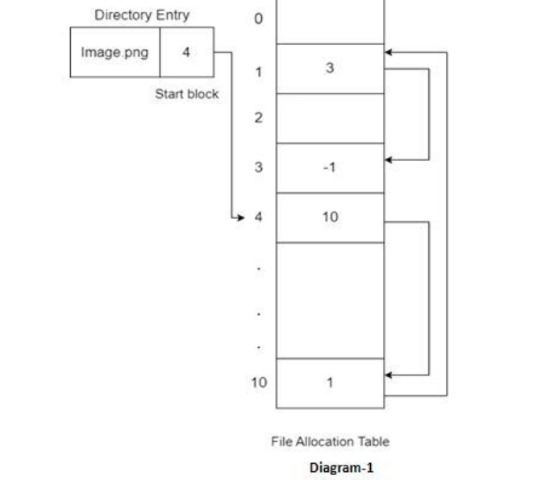
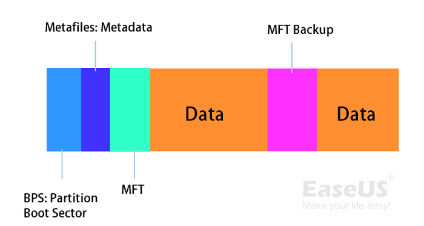
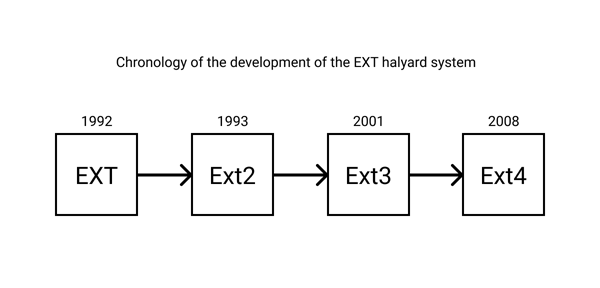
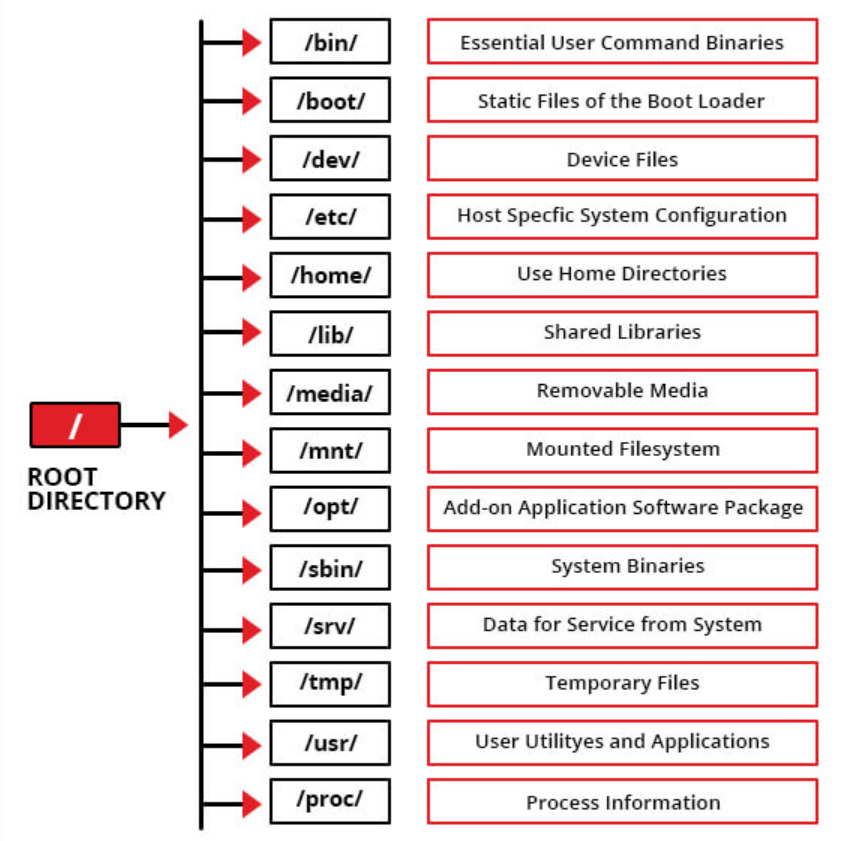
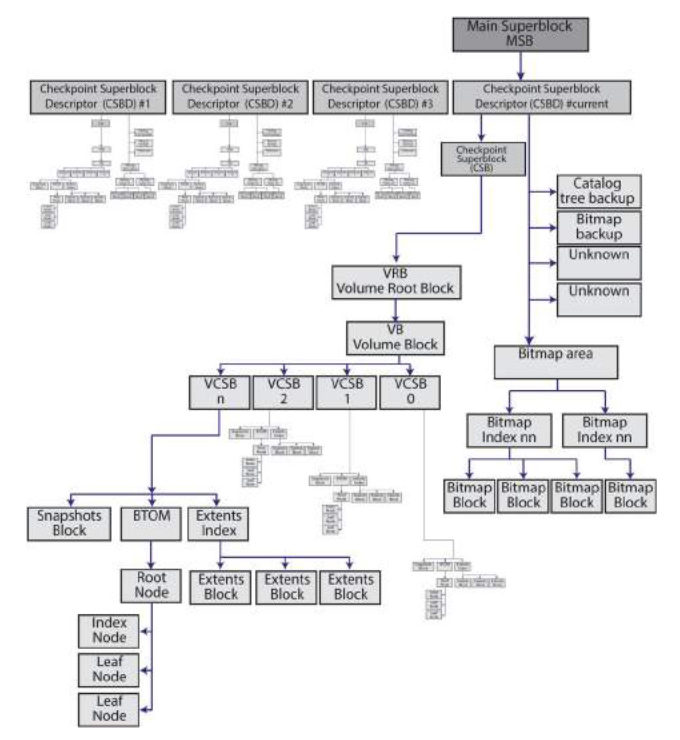

# File, File System

---

# 1. 개념

## 1-1. File

- 파일은 컴퓨터 프로그램과 함께 사용되는 데이터, 정보, 설정 또는 명령을 저장하는 컴퓨터 시스템의 컨테이너이다.
- Microsoft 운영 체제와 같은 그래픽 사용자 인터페이스(GUI)에서는 파일을 파일을 여는 프로그램과 연결된 아이콘으로 표시한다.
    - 예를 들어, 그림은 아이콘으로 표시된다. 이는 Microsoft Word와 관련이 있다 . 컴퓨터에 이 파일이 포함되어 있고 아이콘을 두 번 클릭하면 컴퓨터에 설치된 Microsoft Word에서 열린다.
- 디렉터리 파일, 데이터 파일, 텍스트 파일, 바이너리 및 그래픽 파일과 같은 여러 유형의 파일을 사용할 수 있으며 이러한 여러 유형의 파일에는 다양한 유형의 정보가 포함되어 있다. 컴퓨터 시스템에서 파일은 하드 드라이브, 광학 드라이브, 디스크 또는 기타 저장 장치에 저장된다.
- 대부분의 운영 체제에서 파일은 지정된 파일 디렉터리 내에 고유한 이름으로 저장되어야 한다. 그러나 특정 문자는 불법으로 간주되므로 파일 생성 중에 사용할 수 없다. 파일 이름은 접미사라고도 하는 파일 확장자로 구성된다. 파일 확장자는 전체 파일 이름 뒤에 2~4개의 문자가 포함되어 있으며 파일 형식, 파일 유형 및 파일과 관련된 속성을 인식하는 데 도움이 된다.
- 대부분의 최신 컴퓨터 시스템에는 파일 손상이나 손상으로부터 파일을 보호하는 기능이 있다. 파일에는 시스템 생성 정보부터 사용자가 지정한 정보까지 데이터가 포함될 수 있다. 파일 관리는 때때로 사용자의 도움을 받아 수동으로 수행되거나 타사 도구 및 운영 체제의 도움을 받아 수행된다.

## 1-2. File System

- 운영 체제가 저장 장치의 파일과 디렉터리를 저장, 구성 및 관리하는 데 사용하는 방법이다.
- 컴퓨터에서 파일 시스템(때때로 작성되는 파일 시스템)은 파일 이름을 지정하고 저장 및 검색을 위해 논리적으로 배치하는 방식이다.
- 파일 시스템이 없으면 저장된 정보가 개별 파일로 분리되지 않으며 식별하고 검색하기가 어렵다. 데이터 용량이 증가함에 따라 데이터 저장에서 개별 파일의 구성과 접근성이 더욱 중요해지고 있다.
- 디지털 파일 시스템과 파일은 문서를 저장하고 검색하는 동일한 논리 기반 방법을 사용하여 종이 기반 파일링 시스템의 이름을 따서 모델링되었다.
- 파일 시스템은 Microsoft Windows, macOS, Linux 기반 시스템 등 운영 체제(OS)마다 다를 수 있다. 일부 파일 시스템은 특정 응용 프로그램용으로 설계되었다. 파일 시스템의 주요 유형에는 분산 파일 시스템, 디스크 기반 파일 시스템 및 특수 목적 파일 시스템이 포함된다.
- 파일 시스템은 디렉터리(폴더라고도 함)와 파일로 구성된 계층 구조를 사용하여 데이터를 구성한다. 디렉터리에는 파일과 하위 디렉터리가 모두 포함될 수 있으며 트리와 같은 구조를 형성한다. 이를 통해 사용자는 파일을 의미 있는 그룹으로 구성하고 경로나 디렉터리 구조를 사용하여 파일 시스템을 탐색할 수 있다.

### 장점

1. **구성:**
    
    파일 시스템을 사용하면 파일을 디렉터리와 하위 디렉터리로 구성할 수 있으므로 파일을 더 쉽게 관리하고 찾을 수 있다.
    
2. **데이터 보호:**
    
    파일 시스템에는 파일 및 폴더 권한, 백업 및 복원, 오류 감지 및 수정과 같은 기능이 포함되어 데이터 손실이나 손상을 방지하는 경우가 많다.
    
3. **성능 향상:**
    
    잘 설계된 파일 시스템은 데이터를 디스크에 효율적으로 구성하여 데이터 읽기 및 쓰기 성능을 향상시킬 수 있다.
    

### 단점

1. **호환성 문제:**
    
    서로 다른 파일 시스템은 서로 호환되지 않아 서로 다른 운영 체제 간에 데이터를 전송하기 어려울 수 있다.
    
2. **디스크 공간 오버헤드:**
    
    파일 시스템은 일부 디스크 공간을 사용하여 메타데이터 및 기타 오버헤드 정보를 저장하므로 사용자 데이터에 사용 가능한 공간이 줄어들 수 있다.
    
3. **취약성:**
    
    파일 시스템은 시스템의 안정성과 보안을 손상시킬 수 있는 데이터 손상, 맬웨어 및 기타 보안 위협에 취약할 수 있다.
    

# 2. 유형

## 2-1. FAT (File Allocation Table)

- 컴퓨터 및 기타 디지털 장치에서 저장 장치에 저장된 데이터를 관리하고 구성하는 데 사용되는 파일 시스템이다.
- 디스크의 파일을 구성하고 관리할 수 있는 컴퓨터 시스템의 중요한 구성 요소이다.
- 파일이 디스크에 저장된 위치와 새 파일에 사용할 수 있는 공간을 추적하는 데 도움이 되는 파일 시스템의 필수 부분이다.
- MS에서 운영체제의 기본 파일 시스템으로 사용하기 위해 개발된 파일 시스템
    - 테이블을 사용하여 스토리지 볼륨의 클러스터를 추적하고 해당 클러스터가 관련 파일 및 디렉터리를 통해 서로 연결되는 방식을 추적하기 때문에 파일 할당 테이블이라는 이름이 붙여졌다.
    - 파일 이름을 디스크의 실제 위치에 매핑하는 테이블을 사용하여 장치에 있는 각 파일의 위치를 추적한다.
- 1993년 Windows NT 3.1 이후 NTFS로 기본 파일 시스템은 변경되었지만, USB 메모리 등에서 여전히 사용되고 있다.
- 비트의 개수에 따라 FAT12, FAT16, FAT32 등으로 나뉜다. 비트의 개수는 곧 표현 가능한 최대 클러스터 수이기도 하다.
- 시스템에 있는 파일의 인덱스를 제공하며 드라이브 포맷 시 정적으로 할당된다. 여기에는 각 클러스터(데이터 저장 영역)에 대한 항목이 포함된다.

### 구조

- 간단한 구조를 가지고 있다.
- 일련의 항목으로 구성되며 각 항목은 디스크의 클러스터를 나타낸다.
    - 클러스터 : 연속된 섹터 그룹으로 파일에 할당할 수 있는 디스크 공간의 가장 작은 단위
- FAT의 각 항목에는 해당 클러스터의 상태에 대한 정보가 포함되어 있다.
    - 항목에는 파일의 다음 클러스터에 대한 포인터도 포함되어 있어 FAT가 파일을 구성하는 클러스터의 순서를 추적할 수 있다.
- FAT의 크기와 형식은 파일 시스템 버전과 디스크 크기에 따라 달라질 수 있다.
    - FAT12, FAT16과 같은 이전 버전의 FAT는 최대 디스크 크기가 더 작고 항목 크기도 더 짧은 반면, FAT32오 같은 최신 버전은 더 큰 디스크를 지원하고 긴 항목 크기를 사용하여 더 많은 클러스터를 수용할 수 있다.
- 부트 섹터 :
    - 볼륨의 레이아웃 및 파일 시스템 구조를 포함하여 볼륨에 액세스하기 위해 파일 시스템에 필요한 정보를 저장한다.
- 파일 할당 테이블 :
    - 기본 할당 테이블과 기본 테이블에 액세스할 수 없는 경우 백업 역할을 하는 테이블의 복제본을 저장한다.
- 루트 디렉터리 :
    - 볼륨에 저장된 파일과 폴더를 설명하는 항목이 포함된 디렉터리 테이블을 저장한다.
    - FAT12/FAT16의 경우 루트 디렉터리는 저장 매체의 지정된 위치(할당 테이블 바로 뒤)에 존재하며 최대 항목 수가 고정되어 있다
    - FAT32의 루트 디렉터리는 데이터 영역에 유지되며 최대 항목 수가 고정되어 있지 않다.
- 파일 데이터 영역 :
    - 실제 저장된 파일 및 디렉터리 데이터를 저장한다
    - 볼륨의 대부분을 구성하는 클러스터로 나뉜다
    - 클러스터는 순차적으로 번호가 지정되며 할당 테이블의 목록에 해당한다.

### 관리방법

- 파일이 생성되거나 저장되면 OS는 하나 이상의 클러스터를 파일에 할당하고 FAT의 해당 항목을 업데이트하여 이러한 클러스터가 현재 사용 중임을 나타낸다.
    - FAT의 첫 번째 항목은 디스크의 모든 파일과 디렉터리 목록이 포함된 디스크의 루트 디렉터리용으로 예약되어 있다.
- 파일에 액세스하기 위해 OS는 FAT를 사용하여 파일의 첫 번째 클러스터를 찾은 뒤 FAT 항목의 포인터를 사용하여 파일을 구성하는 클러스터 체인을 따라 각 후속 클러스터를 찾는다.
    - 파일이 삭제되거나 이동되면 운영 체제는 FAT의 해당 클러스터를 사용 가능한 클러스터로 표시하여 새 파일에서 사용할 수 있도록 한다.
- FAT는 사용 가능한 클러스터를 추적하고 필요에 따라 새 파일에 할당하여 디스크의 사용 가능한 공간을 관리하는 데 도움이 된다.
    - 파일이 저장되거나 수정되면 OS는FAT를 확인하여 파일을 보관할 수 있을 만큼 큰 무료 클러스터 시퀀스를 찾아 파일에 할당한다.

### 장점

- **다양한 운영 체제와의 호환성**
    - FAT는 Windows, Mac OS 및 Linux를 포함한 다양한 운영 체제와 호환되는 널리 사용되는 파일 시스템이다. 이를 통해 서로 다른 컴퓨터와 장치 간에 파일을 쉽게 공유할 수 있다.
- **구현하기 쉬움**
    - FAT는 다양한 유형의 저장 장치에서 구현하기 쉬운 비교적 간단한 파일 시스템이다. 이로 인해 USB 드라이브 및 SD 카드와 같은 이동식 저장 장치에 널리 사용된다.
- **대형 디스크 크기 지원**
    - FAT는 대형 디스크 크기를 지원하며 FAT32 버전은 최대 2테라바이트 크기의 디스크를 지원할 수 있다. 따라서 대용량을 갖춘 최신 저장 장치에 적합한 파일 시스템이다.
- **데이터 손상 위험 감소**
    - FAT 파일 시스템은 저널링 메커니즘을 사용하여 정전이나 기타 시스템 충돌로 인한 데이터 손상 위험을 최소화한다. 이는 저장된 데이터의 무결성을 보장하고 데이터 손실을 방지하는 데 도움이 된다.

### 단점

- **조각화 문제**
    - 파일이 생성, 삭제 및 수정됨에 따라 해당 파일이 차지하는 클러스터가 디스크 전체에 분산되어 조각화가 발생할 수 있다. 이로 인해 디스크 효율성이 감소하고 파일 액세스 시간이 느려질 수 있다.
- **제한된 보안 기능**
    - FAT는 액세스 제어 및 파일 권한에 대한 지원이 제한되어 있어 무단 액세스 및 수정에 더 취약하다.
- **긴 파일 이름에 대한 제한적 지원**
    - FAT의 원래 버전(FAT12)은 최대 8자 및 3자 확장자를 가진 짧은 파일 이름만 지원한다. 최신 버전의 FAT(FAT16 및 FAT32)는 더 긴 파일 이름을 지원하지만 파일 이름의 최대 길이 및 문자 집합 측면에서 여전히 몇 가지 제한 사항이 있다.

## 2-2. **NTFS (New Technology File System )**

- NTFS는 1993년 7월 Microsoft에서 개발한 파일 시스템으로 여러 운영체제에서 널리 지원된다.
- 최대 파티션 크기는 약 2TB이며, 개별 파일에는 크기 제한이 없다.
- 특정 내용으로 구조체를 감싸는 포괄적인 데이터 구조체(Wrapper)를 사용하여 확장성을 제공한다.
- FAT 파일 형식과 비교할 때 NTFS 파일 시스템은 FAT를 능가하며, 더 나은 읽기 및 쓰기 지원을 받는다.
- 사용자는 일부 변환 명령을 적용하여 NTFS를 FAT32 또는 그의 반대의 형식으로 변환할 수 있다.
- 로그 파일 생성

### 특징

- USN Journal(Update Sequence Number Journal or Change Journal)
    - NTFS의 모든 파일 및 디렉터리의 변경 사항을 기록하는 로그 파일로 파일 이름, 변경 시간, 변경 타입 등 변경 사항에 대한 정보를 목록화하여 볼륨의 변경 여부를 확인할 때 사용한다.
- ADS(Alternate Data Stream)
    - NTFS는 파일명, 소유자, 시간 정보 등을 속성(Attribute)이라는 스트림을 통해 표현하며, 데이터 역시 하나의 스트림으로 표현된다.
    - 일반적으로 파일 당 하나의 데이터 스트림을 사용하나, ADS는 하나의 파일이 하나 이상의 데이터를 저장할 수 있도록 지원하는 것이다.
- Sparse 파일
    - 파일의 데이터가 대부분 0으로 채워져 있는 경우, 해당 파일의 내용을 그대로 저장하지 않고, 크기 정보만을 담는 파일을 말한다.
- 파일 압축
    - NTFS는 파일 시스템 수준의 압축을 지원하며, 압축 방식으로는 LZ77을 사용한다.
    - 파일 압축은 공간을 절약하는데 많은 도움을 주지만, 파일이나 디렉터리에 접근할 때마다 압축을 풀어야 하므로 성능이 저하된다.
- EFS(Encrypting File System)
    - EFS는 NTFS 상의 파일 및 디렉터리를 암호화하는 기능으로 CryptoAPI와 File System Run-Time Library(FSRTL)을 사용했으며, 빠른 암호화/복호화를 위해 FEK(File Encryption Key)를 통한 대칭키 방식으로 암호화한다.
- VSS(Volume Shadow Copy Service)
    - 새롭게 덮여 쓰인 파일 및 디렉터리에 대해 백업 본을 유지하는 기능이다
    - 시스템 재부팅 과정에서 시스템의 저널 정보와 함께 안전한 복구를 도와준다.
- Quotas
    - 다중 사용자를 지원하는 환경에서 각 사용자의 디스크 사용량을 제한하는 기능
    - 쿼터 기능이 설정된 시스템에서 자신에게 할당된 이상의 공간을 사용할 경우 경고메시지를 받는다
- 유니코드 지원
    - 모든 파일, 디렉터리, 볼륨 이름 등을 지정할 때 유니코드를 사용한다
- 동적 배드 클러스터 재할당
    - 배드 섹터가 발생한 클러스터는 사용할 수 없으므로, 새로운 클러스터를 할당해 정상 데이터를 자동으로 재할당한 클러스터에 복사하는 기법
    - 배드 섹터가 발생한 클러스터는 플래그를 통해 더 이상 사용하지 않도록 관리된다.

### 구조

- 파티션 부트 섹터
    - PBS라고도 하며 부트 정보를 보유한다.
- 마스터 파일 테이블
    - MFT의 약자로 파일 이름, 생성 날짜, 액세스 권한, 크기 등을 포함하는 메타데이터를 저장하는 디렉터리다
- 메타 파일
    - 파일 시스템을 정의 및 구성하고, 중요한 파일 시스템 데이터를 백업하고, 파일 시스템 변경 사항을 버퍼링하고, 여유 공간 할당을 관리하고, 메타데이터를 보다 효율적으로 구성하는 데 도움이 된다.
- 데이터 영역
    - 파티션 또는 외장 드라이브에 파일 및 데이터를 저장하는 단위

### **FAT와의 차이점**

- **내결함성**
    - NTFS는 항상 로그 파일을 업데이트한다. 정전이나 기타 오류가 발생하는 경우 사용자에게 손상에 대해 알리지 않고 폴더와 파일을 자동으로 복구한다.
    - FAT는 파일 할당 테이블의 서로 다른 두 복사본을 유지 관리하고 오류가 발생할 경우 백업 메커니즘을 사용한다.
        - VSS 기능
- **보안**
    - NTFS를 사용하면 로컬 파일과 폴더 모두에 대한 보안 권한을 설정할 수 있다.
    - FAT에서 공유 기능은 보안 기능으로 작동한다. 즉, 공유 파일은 로컬에서는 취약하지만 네트워크에서는 안전하다.
- **압축**
    - 파티션 압축에 따른 시스템 속도 저하에 대한 걱정 없이 NTFS에서 파일과 폴더를 개별적으로 압축할 수 있다.
- **변환**
    - FAT를 NTFS로 변환할 수 있지만 NTFS는 보안 프로토콜을 따르므로 그 반대는 불가능하다. NTFS를 FAT로 변환하려면 데이터를 백업하고 디스크를 적절하게 포맷해야 한다.
        - 섹터 구조가 다름.
- **호환성**
    - NTFS는 모든 Windows 운영 체제와 호환됩니다. Mac OS X에서 NT 파일 시스템에는 읽기 전용 기능이 있다. FAT는 Windows 및 Mac OS와 모두 호환된다.
- 제일 큰 차이점 : EFS 파일을 암호화 할 수 있다
    - 이력관리(로그)의 유무
- **대용량 파일 전송**
    - 대용량 파일 저장을 지원한다. 또한 이를 사용하여 초대형 비디오 파일을 NTFS 드라이브에 전송하고 저장할 수 있다.
        
        EX)
        
        - Windows 디스크 - NTFS에 새 파티션을 만든다.
        - USB, 마이크로 SD카드, HDD 및 SSD를 포맷한다.
        - 게임, 비디오, 영화 등과 같은 대용량 파일을 저장하고 전송한다.
        - [MBR 또는 GPT](https://www.easeus.co.kr/partition-manager-software/mbr-vs-gpt.html) 디스크 유형의 NTFS 파티션에 Windows 운영 체제, 프로그램 및 게임을 설치한다.
        - NTFS는 드라이브에서 추가, 수정 또는 삭제된 파일의 로그를 유지한다.

### 단점

- 이전 기술에서는 최신 기능에 액세스할 수 없다.
- NTFS는 Windows OS용으로 설계되었기 때문에 Mac과 Android 장치가 항상 호환되는 것은 아니며 이로 인해 문제가 발생할 수 있다.
- Mac OS를 실행하는 컴퓨터는 NTFS로 포맷된 드라이브를 읽을 수 있지만 NTFS에 기록하려면 타사 소프트웨어가 필요하다.
- 일부 구형 미디어 장치에는 NTFS의 저장 기능을 활용할 수 있는 장치가 없다. 여기에는 디지털 카메라, TV, DVD 플레이어 등이 포함된다.
- NTFS에는 파일 시스템 내에서 성능과 대역폭을 보장하는 기본 시스템이 없으며 일부 사용자는 이를 문제로 보고 있다.

## 2-3. EXT(EXTended File System)

- 확장 파일 시스템 또는 ext는 Linux 커널 용으로 특별히 만들어진 최초의 파일 시스템이다.
- 전통적인 Unix 파일 시스템 원리에서 영감을 받은 메타데이터 구조를 가지고 있으며 MINIX 파일 시스템의 특정 제한을 극복하기 위해 Remy Card에 의해 설계되었다.
- ext 파일 시스템은 크게 Boot Sector와 Block Group으로 구분된다. 블록은 기본적으로 데이터를 저장하는 단위를 나타내며, 저장 장치에서 한 번의 I/O 과정에서 수행하는 단위가 된다.
- ext 파일 시스템은 ext, ext2, ext3, ext4가 지원된다.
    - 최초 ext 파일 시스템에는 별도 액세스(Separate access), 아이노드 수정(inode modification), 데이터수정 타임스탬프(data modification time stamps)에 대한 지원이 없었으나, ext2 파일시스템 이후 해당 문제는 해결되었다.
    - ext2는 inode의 불변성 및 조각화와 같은 ext의 문제를 해결했다.
        
        <aside>
        💡 inode(인덱스 노드)
        파일이나 디렉토리와 같은 파일 시스템 개체를 설명하는 Unix 스타일 파일 시스템의 데이터 구조이다. 각 inode는 객체 데이터의 속성과 디스크 블록 위치를 저장한다.
        
        </aside>
        
    - ext3 이후, 저널링(journaling) 기능의 추가로 파일 시스템의 복구 가능성을 높였다.
        
        
        | 특징 | Ext2 | Ext3 | Ext4 |
        | --- | --- | --- | --- |
        | 도입일 | 1993년 1월 | 2001년 11월 | 불안정판 : 2006년 10월안정판 : 2008년 10월 |
        | 도입 운영체제 | 리눅스 | 리눅스 2.4.15 | 불안정판 : 리눅스 2.6.19안정판 : 2.6.28 |
        | 파티션 ID | MBR : 0x83GPT : EBD0A0A2-B9E5-4433-87C0-68B6B72699C7 | MBR : 0x83GPT : EBD0A0A2-B9E5-4433-87C0-68B6B72699C7 | MBR : 0x83GPT : EBD0A0A2-B9E5-4433-87C0-68B6B72699C7 |
        | 디렉터리 구조 | - | - | Linked List, Hashed B-tree |
        | 파일 구조 | Bitmap(여유 공간), Table(메타데이터) | Bitmap(여유 공간), Table(메타데이터) | extents, Bitmap |
        | 불량블록 구조 | Table | Table | Table |
        | 최대 파일 크기 | 16GB - 2TB | 16GB - 2TB | 16TB |
        | 최대 파일 수 | 1018 | 가변 | 40억 |
        | 최대 파일이름 길이 | 255 Byte | 255 Byte | 256Byte |
        | 최대 볼륨 크기 | 2TB - 32TB | 2TB - 16TB | 1EiB |
        | 날짜 사용권한 | 수정, 특성, 수정, 접근 | 수정, 특성, 수정, 접근 | 수정, 특성, 수정, 접근, 삭제, 작성 |
        | 날짜 범위 | 1901.12.14 - 2038.01.18 | 1901.12.14 - 2038.01.18 | 1901.12.14 - 2515.04.25 |
        | 날짜 정밀도 | 1초 | 1초 | 나노초 |
        | 파일 시스템 권한 | POSIX | 유닉스 허가, 접근제어 리스트, 임의 보안 특성 | POSIX |
        | 압축 지원여부 | 지원하지 않음 (패치를 통해 사용가능) | 지원하지 않음 (비공식 패치를 통해 사용가능) | 지원하지 않음 |
        | 암호화 지원여부 | 지원하지 않음 | 지원하지 않음 (블록 장치 수준에서 제공됨) | 지원하지 않음 |
        | 운영 체제 | 리눅스, BSD, Windows(IFS), OS X(IFS) | 리눅스, BSD, Windows(IFS) | 리눅스, Windows(Ext2fsd) |

## 2-4. **HFS(Hierarchical File System)**

- 일련의 폴더와 하위 폴더를 통해 컴퓨터의 디지털 정보를 정렬하고 구성하는 데 사용된다.
- 모든 데이터를 포함하는 가장 큰 단위를 일반적으로 “루트”라고 하며 메뉴 상단 또는 파일 경로의 가장 왼쪽 항목으로 시각화할 수 있다.
- 이 루트에는 추가 정보를 포함할 수 있는 하나 이상의 폴더가 포함된다.
    - 계층적 파일 시스템의 맨 아래에는 계층 구조 탐색을 통해 액세스하고 읽을 수 있는 개별 정보 단위가 있다.
- 데이터 포크와 리소스 포크라는 두 가지 구조를 지원한다.
    - 데이터 포크의 데이터는 파일에 대한 오프셋을 통해 액세스된다.
    - 리소스 포크는 실행 가능한 코드와 아이콘, 메뉴, 사운드 등의 프로그램 요소를 보관하는 미니 데이터베이스처럼 작동한다.

### 특징

- 512바이트의 블록을 사용한다.
- HFS는 16비트를 사용하므로 블록 수가 65,535개로 제한된다.
- 하드 디스크 0과 1의 처음 두 블록은 부팅 블록이다. 여기에는 시작 정보가 포함되어 있다.
- 블록 2는 마스터 디렉터리 블록을 호스팅한다. 이름에서 정의할 수 있듯이 이는 디스크에 있는 모든 파일의 기록이다.
- HFS는 계층적 파일 시스템이다. 즉, 폴더(디렉토리라고도 함)와 파일 및 기타 폴더가 포함된 하위 폴더로 구성된 트리 구조로 파일을 구성한다. 트리 구조의 세부 사항은 카탈로그 파일에 기록된다.

### **단점**

- 2GB 이하의 파일을 지원할 수 있다. 이로 인해 최신 컴퓨팅에서의 적용이 제한된다.
- HFS는 54,536개의 개별 파일을 지원할 수 있다. 이는 심각한 병목 현상이다.
- Mac OS 6 및 7은 2GB 하드 디스크에서 작동할 수 있다. Mac OS 7.5에서는 이를 4GB로 늘렸다.
- HFS는 최신 버전의 macOS에서는 사용되지 않는다. 1998년에 단계적으로 폐지되었다. 그러나 많은 구형 Mac에서는 여전히 HFS를 사용할 수 있으며 최신 Mac에서도 여전히 HFS 포맷 디스크에 액세스하여 사용할 수 있다.

## 2-5. **APFS(Apple File System)**

- **APFS(Apple File System)는** Mac 컴퓨터, Apple Watch, Apple TV, iPhone 및 iPad용으로 Apple Inc가 자체 설계한 파일 시스템이다.
- **APFS(Apple File System)는** 다른 파일 시스템과 마찬가지로 하드 드라이브와 같은 저장 장치에 데이터를 저장하고 검색하는 방법을 제어하는 프로세스이다.
- 스토리지 시스템의 데이터를 구성하고 구조화하기 위한 독점 시스템으로, Mac에서 사용되던 HFS+ 시스템을 대체하여 Apple에서 개발되었다.
- 암호화를 염두에 두고 설계한 전매 파일 시스템이다. 플래시/SSD 저장 장치에 최적화되어 있다
- 강력한 암호화, COW 메타데이터, 공간 공유, 파일 및 디렉토리 복제, 스냅샷, 빠른 디렉토리 크기 조절, 원자적 안전 저장 프리미티브 및 향상된 파일 시스템 구조를 제공한다.
- 플래시/SSD 저장 장치에 최적화되었으며, 강력한 암호화, 쓰기 시 복사(Copy-on-Write) 메타데이터, 공간 공유, 파일 및 디렉토리 복제, 스냅샷, 빠른 디렉토리 크기 조정, 원자적 안전 저장 프리미티브(Atomic safe-save primitives), 향상된 파일 시스템 기반, I/O 통합 기능을 사용하는 고유한 쓰기 시 복사(Copy-on-Write) 설계 등의 특징으로 최대의 성능을 이끌어내면서도 데이터 신뢰성을 확보한다.
- APFS는 저장 공간을 필요에 따라 할당한다. 단일 APFS 컨테이너에 다수의 볼륨이 포함된 경우, 컨테이너의 남은 공간을 필요에 따라 공유하거나 개별 볼륨에 할당할 수 있다.

### 주요 기능

- 클론
    - 추가 공간을 사용하지 않고도 거의 즉시 파일을 복사할 수 있다.
    - 한 위치에서 다른 위치로 파일을 비트 단위로 복사하는 대신 복제본은 원본 파일을 참조하여 두 파일 간에 동일한 데이터 블록을 공유한다
    - 하나의 파일을 변경하면 변경된 데이터 블록만 새 복제본에 기록되고, 원본과 복제본은 모두 변경되지 않은 데이터 블록을 계속 공유한다.
- 스냅샷
    - 특정 시점을 나타내는 볼륨 스냅샷을 생성할 수 있다.
    - 스냅샷을 사용하면 효율적인 백업이 가능하며, 특정 시점의 상태로 돌아갈 수 있다
    - 스냅샷은 원본 볼륨과 해당 데이터에 대한 읽기 전용 포인터다
    - 새 스냅샷은 원래 볼륨에 대한 포인터를 지정하는 데 필요한 공간 외에는 실제 공간을 차지하지 않는다.
- 암호화
    - APFS는 AEX-XTS 또는 AES-CBC 모드를 사용하여 강력한 전체 디스크 암호화를 지원한다
    - 파일과 메타데이터가 모두 암호화되며, 지원되는 암호화 방법은 일반(암호화 없음), 단일 키 방식, 다중 키 방식이 지원된다.
- 공간 공유
    - 공간 공유를 통해 파티션 크기를 미리 정의할 필요가 없다
    - 대신 모든 볼륨은 드라이브의 기본 여유 공간을 공유한다
    - 공간 공유를 통해 드라이브의 여러 볼륨을 다시 분할할 필요 없이 필요에 따라 동적으로 늘리거나 줄일 수 있다
- Copy-On-Write
    - 데이터 보호 체계로, 변경 사항이 없는 한 데이터 구조를 공유할 수 있게 해 준다.
    - 변경이 요청(쓰기)되면 원본이 그대로 유지되도록 새로운 고유 복사본이 만들어진다.
    - 쓰기가 완료된 후에야 파일 정보가 최신 데이터를 가리키도록 업데이트된다.
- Atomic Safe-Save
    - 기록 중 복사 개념과 유사하지만 파일이나 디렉터리 이름 바꾸기 또는 이동과 같은 모든 파일 작업에 적용된다.
    - 정전이나 CPU 문제 등 어떤 이유로든 쓰기가 완료되지 않더라도 원본 파일은 그대로 유지되게 할 수 있다
- Sparse 파일
    - 비스파스(non-sparse) 파일 시스템에서는 저장할 준비가 된 데이터가 없더라도 파일 공간을 미리 예약해야 하는 것과 달리, 스파스 파일 시스템에서는 필요할 때만 파일 공간을 늘릴 수 있다.

### 장점

- 보안 개선
    - APFS는 다중 키 암호화를 사용하여 더욱 안전한 데이터 암호화 기능이 있어 파일 공유 및 전송에 도움이 된다.
    - 사용자가 파일을 공유하는데 유리하다.
- 더 빠른 암호화
    - 처리 또는 포맷의 암호화 속도가 빨라지면 대용량 파일을 훨씬 더 쉽고 편리하게 복사하고 붙여넣을 수 있다.
- 충돌 방지
    - 충돌 방지 기능을 개선하여 포맷 후에도 Mac이 원활하게 실행될 수 있도록 도와준다.
- 파일 손상 위험 감소
    - 손상된 Mac 파일을 백업하거나 복구하는 동안 손상될 위험은 Apple 파일 시스템을 사용하면 0에 가깝다. 이 최적화된 파일 시스템은 정기적으로 업데이트된다.

### 단점

- **HDD에 비우호적**
    - APFS는 SSD 및 플래시 저장 장치용으로 개발되었다. 그래서 그것은 그들과 조화롭게 잘 작동한다. HDD에서 사용하는 경우 HDD에 더 많은 데이터가 저장될수록 데이터 전송 속도가 느려진다. 그리고 APFS의 일부 기능은 SSD처럼 HDD에서도 제대로 작동하지 않는다.
- **제한된 OS 호환성**
    - macOS High Sierra와 함께 출시된 APFS는 macOS High Sierra 이상과만 호환된다. Windows 및 Linux는 APFS 드라이브에 대한 전체 읽기-쓰기 액세스를 지원할 수 없다.
- **macOS 11 이전의 Time Machine과 호환되지 않는다**

### HPS+ 와 비교

|  | Mac OS 확장(HFS+) | Apple 파일 시스템(ApFS) |
| --- | --- | --- |
| 할당 블록 수 | 2 32 (40억) | 2 63(9경) |
| 파일 ID | 32비트 | 64비트 |
| 최대 파일 크기 | 2 63바이트 | 2 63 바이트 |
| 타임스탬프 세분성 | 1 초 | 1 나노초 |
| 기록 중 복사 |  | ✅ |
| 충돌 방지 | 저널링 | ✅ |
| 파일 및 디렉터리 복제 |  | ✅ |
| 스냅샷 |  | ✅ |
| 공간 공유 |  | ✅ |
| 기본 암호화 |  | ✅ |
| 스파스 파일 |  | ✅ |
| 빠른 디렉토리 크기 조정 |  | ✅ |